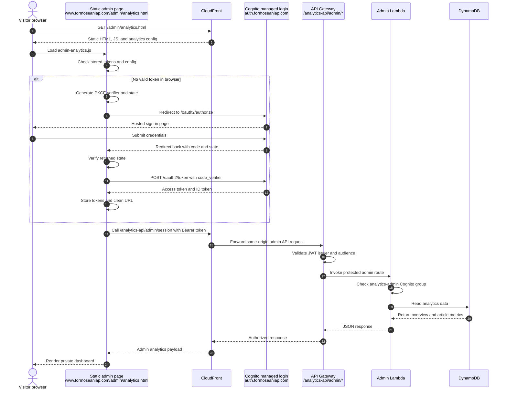
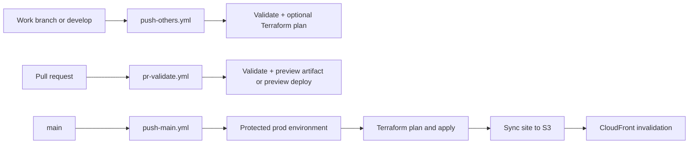
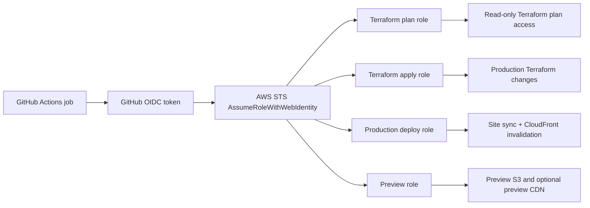

# Formoseaniap Platform

Static-first personal portfolio platform for writing, projects, podcasts, and a small private analytics surface.

Live site: [https://www.formoseaniap.com/](https://www.formoseaniap.com/)

## Website Preview

| Light mode | Dark mode |
| --- | --- |
|  |  |

## At a Glance

| Area | What it does |
| --- | --- |
| Site delivery | Static pages are served from a private S3 bucket through CloudFront. |
| Edge protection | AWS WAF sits at the CloudFront layer for rate limiting and edge filtering. |
| Writing pipeline | Markdown in `content/articles/**` is built into JSON and RSS artifacts under `site/data/`. |
| Podcast page | The browser reads podcast feeds through the same CloudFront domain so third-party CORS restrictions do not break the page. |
| Backend | A small analytics/admin backend uses CloudFront + API Gateway + Lambda + DynamoDB. |
| Auth | The private analytics page uses Cognito managed login with Authorization Code + PKCE. |
| DNS | Cloudflare is still the live DNS provider today; Route 53 is the planned future authoritative DNS home. |
| Deployments | GitHub Actions validates, plans, previews, and promotes production through AWS OIDC role assumption. |

## Architecture

### Web


Sources:
- [`docs/assets/readme/architecture.svg`](docs/assets/readme/architecture.svg)
- [`docs/assets/readme/architecture.png`](docs/assets/readme/architecture.png)
- [`docs/assets/readme/architecture.drawio`](docs/assets/readme/architecture.drawio)

Current DNS note: the diagram shows the target DNS design with Route 53, but the live domain is still using Cloudflare today. Route 53 is the planned destination once the DNS migration is finished.

### Monitoring and alerts


Sources:
- [`docs/assets/readme/monitoring.svg`](docs/assets/readme/monitoring.svg)
- [`docs/assets/readme/monitoring.png`](docs/assets/readme/monitoring.png)
- [`docs/assets/readme/monitoring.drawio`](docs/assets/readme/monitoring.drawio)

### Admin login flow



- [`docs/assets/readme/admin-login-flow.mmd`](docs/assets/readme/admin-login-flow.mmd)

### Why the podcast page uses CloudFront as a proxy

The podcast feeds are owned by a third party, so the browser cannot rely on upstream CORS headers being present or correct. Instead of trying to change the remote feed provider, the site routes `/podcasts/*` through the same CloudFront distribution. From the browser's point of view the request stays same-origin, which avoids the podcast-page CORS failure.

## Infrastructure Notes

| Component | Current design |
| --- | --- |
| Static frontend | CloudFront reads from a private S3 origin through Origin Access Control. |
| Edge security | AWS WAF sits in front of CloudFront for edge-side filtering and rate limiting. |
| DNS | Cloudflare remains the current authoritative DNS provider. Route 53 is provisioned/planned as the future DNS authority after migration. |
| Podcast feed path | CloudFront routes `/podcasts/*` to the upstream RSS host. |
| Analytics API | CloudFront routes `/analytics-api/*` to a regional API Gateway HTTP API. |
| Analytics storage | Lambda writes counters and uniqueness state to DynamoDB. |
| Monitoring | CloudWatch dashboard and SNS-backed Lambda alarms are provisioned by Terraform. |
| Custom domains | `www.formoseaniap.com` is the canonical host, with apex redirect support. |
| Cost control | The stack uses AWS-managed CloudFront cache policies and keeps flat-rate CloudFront plan handling as a deliberate console-managed step. |

## CI/CD Design

| Workflow | Trigger | Purpose |
| --- | --- | --- |
| [`push-others.yml`](.github/workflows/push-others.yml) | `develop` and work branches | Validate the site, rebuild generated artifacts, and run Terraform validation plus optional plan on infra changes. |
| [`pr-validate.yml`](.github/workflows/pr-validate.yml) | Pull requests into `develop` or `main` | Re-run validation, attach a preview artifact, and optionally deploy a hosted preview after Terraform checks pass. |
| [`push-main.yml`](.github/workflows/push-main.yml) | Push to `main` | Re-run validation, wait at the protected `prod` environment, run production Terraform plan/apply, write runtime config, deploy the site, and invalidate CloudFront. |



Source: [`docs/assets/readme/cicd-pipeline.mmd`](docs/assets/readme/cicd-pipeline.mmd)

## GitHub Actions OIDC

The pipelines do not store long-lived AWS keys in GitHub. Each job requests a GitHub OIDC token, exchanges it with AWS STS, and receives short-lived credentials for a narrowly scoped IAM role.



Source: [`docs/assets/readme/oidc-roles.mmd`](docs/assets/readme/oidc-roles.mmd)

| Role | Used by | Scope |
| --- | --- | --- |
| Terraform plan role | PR validation, branch validation, pre-promotion plan on `main` | Read-only access needed for live-state Terraform plans. |
| Terraform apply role | Protected production stage in `push-main.yml` | Applies Terraform against the production state. |
| Production deploy role | Protected production stage in `push-main.yml` | Syncs the built site to S3 and invalidates CloudFront. |
| Preview role | Optional preview stage in `pr-validate.yml` | Deploys PR previews when preview infrastructure is configured. |

## Local Development

Run the site preview and the podcast proxy in separate terminals when working locally. The site preview serves `site/` as the web root, and the podcast proxy keeps the podcast page working locally without depending on production routing.

```bash
python3 scripts/site_preview.py
python3 scripts/podcast_proxy.py
```

## Repository Map

| Path | Purpose |
| --- | --- |
| `site/` | Static pages, assets, and generated runtime data consumed by the browser. |
| `content/` | Markdown articles and site metadata. |
| `scripts/` | Build, validation, migration, and local utility scripts. |
| `analytics_backend/` | Lambda handler code for analytics collection and admin reads. |
| `infra/` | Terraform for AWS hosting, analytics backend, auth, and domain resources. |
| `.github/` | Shared GitHub Actions and workflow definitions. |
| `docs/` | Operational notes, examples, and backlog/inbox planning files. |

## Further Reading

- [infra/README.md](infra/README.md)
- [docs/aws-oidc-github-actions.md](docs/aws-oidc-github-actions.md)
- [docs/github-branching.md](docs/github-branching.md)
