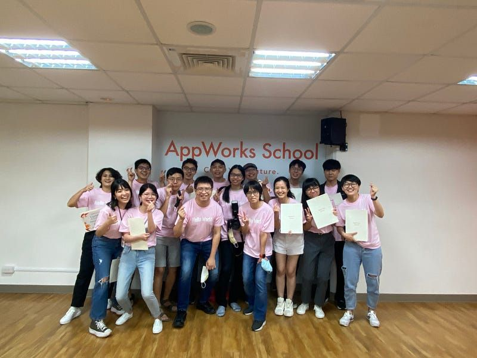

### 前言

2022 年的 8 月 8 號，對我而言是一個值得紀念的日子，因為這天是我做為軟體工程師的第一份工作開始的日子。但就在半年前，我其實連 API 是什麼都還不知道。

2022 年的上半年，可以說是我人生中最奇幻的旅程之一。雖然說穿了，就只是參加了一個培訓工程師的轉職培訓營，但一直到現在，我仍深深感受到自己何其有幸，能加入 AppWorks School，並遇到一群志同道合的優秀夥伴以及讓我打從心理敬佩的老師。

做為半路出家的工程師，我自認在這條路上受過太多人的幫助。也因此，希望能夠趁著這個時間點整理一點自己的心得，並能夠幫助到任何對成為軟體工程師感興趣，或是想要申請 AppWorks School 的朋友。

以下大概會分成兩個部分：

1. **轉職軟體工程師的路徑**：給對於轉職軟體工程師有興趣的朋友，介紹幾個方向，並解釋為什麼我最後會選擇 AppWorks School。
2. **申請 AppWorks School 的準備**：給決定要來 AppWorks School 的朋友，針對面試和書審，解釋我當初的準備方向和細節。

> 對 AppWorks School 培訓計畫有興趣的朋友，可參考官網。

> Coding Bootcamp Batch #21 報名截止於 2023/03/19
> <https://school.appworks.tw/batch-21-schedule/>

### 轉職軟體工程師的路徑

稍微搜尋一下「轉職軟體工程師」，應該可以看到非常多討論。除了這份職業在近幾年越來越熱門之外，要轉職入行的路徑五花八門也是原因之一。

比較主流的路徑應該可以分成三種：自學、研究所、培訓班。

#### 自學

自學是一個相對有彈性的路徑，事實上我一開始也是先在 Udemy 上面買了一堂 BootCamp 的課程來學習。但就現在回顧而言，我自認當時的學習成效並沒有那麼好，有兩個主要理由

**沒有參考基準點**

在整個學習的過程中，我除了不斷學習新知識之外，其實我並不清楚以我自己學習到的知識，在真實的軟體界能夠完成什麼事情，或在工作上我應該會能夠做到什麼。

比如說，我好像能夠做出某個小功能，但我沒有整個專案開發的輪廓，導致我不清楚這個小功能在整個專案裡面應該扮演什麼角色（這裡的角色，可以是專案功能上的，但也可以是專案開發流程上的。）

換個說法來講，我能夠做出一些零碎的小專案（比如 to-do list 之類的）或具備一些零碎的知識，但因為缺乏對一個完整專案或工作的理解，因此完全不知道以自己目前的能力，能夠勝任什麼樣子的工作。

此外，我所具備的這些零碎知識，也還無法串起一整個比較大型的專案。

**沒有獨立完成專案的能力**

延續上一個理由，要完成一個獨立專案會需要串起很多東西。但其中必然會遇到許多意料之外的問題，特別是如果專案主題是自己想出來，而非他人的教學內容專案的話。

這件事情非常考驗工程師獨立解決問題的能力，而這也是我轉職初期面臨的最大挑戰之一：「**順著教學走都非常順，但一旦遇到意外就完全不知道該怎麼辦。**」

我認為，這是自學者非常難跨越的門檻之一。因為所具備的相關知識實在太少，通常連網路上找到的答案都看不太懂，更常發生連怎麼問問題都不知道的窘境。

這裡所遇到的問題可以參考 [Why Learning to Code is So Damn Hard | Thinkful](https://www.thinkful.com/blog/why-learning-to-code-is-so-damn-hard/)，而這也是 AppWorks School 一開始一定會提醒所有學員的事情。

也因此，我個人會比較建議，轉職初期也許可以透過自學，但只要下定決定往這條路走，那報名研究所或培訓班不失為一個好選擇。

#### 研究所或培訓班

在 AppWorks School 的培訓班中，我自己也有和其他人討論過這兩者的差別。就結論上來說各有優劣，端看你自己的需求。

就時間上來說，一般培訓班需要半年，而研究所通常是2年，因此有時間上考量的人當然可以選擇培訓班。但這就引申出一個問題是，僅透過培訓班的半年真的足夠成為一個合格的工程師嗎？

我認為如果只針對能否就業的話，答案是肯定的。事實上我在就業面試的過程中也遇過非常多技術主管和我提到，是否為本科系並非考量重點，而工程師本身的能力還是來自於是否足夠努力。

換個角度來說，培訓班出來的我們的確可以勝任工程師的工作，但如果未來還想要更進一步的話，就要記得回頭補齊資工系同學在學校會學習過的知識。

但回到軟體工程師的本質來看，無論是培訓班還是研究所，工程師都必須不斷在工作中累積新的知識才行，並不是選擇了哪一條路後，就可以有一勞永逸的想法。

#### AppWorks School 或其它培訓班

當初會選擇 AppWorks School 是我培訓班的第一志願，主要有以下幾個理由：

> **免費**

AppWorks School 是完全免費，而且也沒有任何保證金的機制。這件事情本身就非常吸引人，而我認為這個水準的課程絕對值得好幾萬的學費。

事實上，在我申請的當下，AppWorks School 並非業界唯一免費的培訓班，但卻是唯一沒有沒有保證金或其它繁雜的申請準備條件者。參加者可以在比較沒有後顧之憂的情況下，全心全意投入在學習當中。

> **名氣和錄取率**

以類似的培訓班來比較，當時我所看到最知名的就是 AppWorks School。而聽聞網路上其他人的說法，培訓班的錄取率大約只有 7–8%（我所報名的後端班據說更低）。

這對我來說是一個非常大的吸引力，因為工程師非常需要互相討論新知識。因此比起授課老師，我當時認為一起學習的同儕也非常重要。最後事實上也證明，我所遇到的每個同學都是寶藏，每個人都有太多可以學習的地方。

> **紮實培訓流程**

雖然當時有盡可能地做了功課，但培訓流程的細節並非申請之前可以完全瞭解的，因此當初在選擇 AppWorks School 的時候，很難說我是因為充份瞭解了紮實的培訓細節才來報名的。

#### 但畢業後的現在，我認為我可以很負責任地說，AppWorks School 的培訓絕對超乎想像的紮實。舉例而言，當初報名時已經知道正式培訓每週大約會花 70–75 小時，但實際上我一天會待在那裡大概 13 個小時，因此我大概是花了每週 90 個小時左右的量才勉強追上進度。也正是這個程度的訓練，我才能在短短半年內有突飛猛進的成長。

### 申請 AppWorks School 的準備

#### 原則和方向

對於 AppWorks School 來說，招生進來的學生接下來的路徑，就是完成School 指派的任務，完成後並找到相對應的工作。這個過程中 School 最不願意見到的就是學生**半途而廢（退出）或結束後找了與工程師無關的工作**，而最有可能導致這個意外的地方，應該就是完成專案的過程。

誠如前述，我做為一個初學者（實際上，我大部分的同學都在程式方面有比我更良好的基礎），我每天要花大約 13 個小時才能追上大家，這其實是非常辛苦，而且很容易把能量用盡的。在這種狀況下，對於學生而言，可以有各種放棄的理由；但對於 School 而言，他們當然就是希望篩選出，在這種狀況下還是不會放棄的同學。

因此，我歸納出三個特質，是我們在申請 AppWorks School 的時候，可以盡量準備並主動調強的特質。這三者分別是「動機」、「程式經驗和接受挑戰的能力」、「對程式工作的理解與未來規劃」。

> **動機**

這是最重要，但也是最抽象，也是我認為最難準備的東西。

原則當然是不會變的，我們要證明給 AppWorks School 說，我們並不是那種會中途退出或半途決定不做工程師的人。因此，「為什麼」要當工程師就顯得格外重要。

值得一提的是，做為轉職生，前一份工作的推力當然會是一個動機，但強調這個部分是比較容易扣分的。因為離開前一份工作的理由並沒有辦法充份說明為何選擇工程師，而強調前一份工作的推力更有可能顯示出一種「遇到困難就逃跑」的印象。再次強調，我們要證明我們並非那種會半途而廢的人。

因此，動機這裡的準備方向，應該是為什麼工程師吸引我們才對，這個方式才能證明工程師對我們的獨一無二之處。從過去的經驗中找到與軟體工程相關的部分，拿出來強調軟體工程因此吸引自己，才會是上策。

> **程式經驗和接受挑戰的能力**

再次強調我們要證明在 AppWorks School 的訓練下，會不放棄一直到結束。而剛剛有提到，最有可能導致這個意外的地方，就是完成專案的過程。而我自己最有可能放棄的時候，正是那個每天花13個小時才能追上大家的時候。

我們可以試想一下，如果我當時已經具備一定程度的程式水準，每天只需要花9個小時的時間就可以完成相同程度的東西呢？是不是就更沒有什麼理由要中途放棄了。

換句話來說，我個人十分建議在申請 AppWorks School 之前，就先自行學習相關的知識。一來是申請的時候可以用來證明自己已經具備相關經驗，二來是可以在實際完成專案的時候也能夠更輕鬆一些。

不過，即使沒有比較具體的程式經驗，如果能證明自己擁有接受挑戰的能力的話，應該還是可以的。比如說，強調自己過去遇到的重大挑戰，並說明自己克服的過程，也會是一種可以思考的方向。

> **對程式工作的理解與未來規劃**

我認為，開始開發之後發現工程師工作與自己想像不同，也會是學生半途退出的可能原因之一。而如果對這份工作有足夠的認識，也就比較不會因為一些挑戰而放棄。

因此，我認為主動瞭解工程師平常的工作內容型態，以及思考未來做為工程師的規劃，也會是一個非常加份的事情，值得花時間準備並主動向 AppWorks School 說明。

#### 行為面試題庫

參考了其他人的心得以及回憶當時我在面試時有遇到的問題，整理出了幾個可以特別花時間準備的題目

1. 自我介紹
2. 說明申請動機？
3. 自學的經驗？
4. 為什麼決定申請前端、後端、Android、iOS？
5. 對於工程師的工作有什麼了解呢？
6. 妳覺得工作對你來說是什麼？
7. 為什麼你能確定軟體工程師是你想要的道路？軟體工程師的工作內容哪些部分吸引你？
8. 你認為你那些特質適合做工程師？
9. 人生有遇過什麼困難（最挫折的事）？怎麼解決？
10. 之前的工作經驗和加入後的未來規劃？
11. 希望一輩子當後端工程師嗎？
12. 假設沒有申請上，下一步會怎麼做？為什麼不直接去做那個呢？
13. 瞭解這個計畫內容嗎？
14. 你來申請，是為了逃避無趣的工作，還是真的對程式有熱情？
15. 工作上你遇到問題通常是怎麼解決的？
16. 你的同事通常怎麼形容你？

以下這是我還記得有被問到的問題

1. 為什麼去念哲學系？（我是哲學研究所畢業後直接來的，因此這可能就類似於詢問上一份工作相關的問題）
2. 對於未來的規劃？
3. 這個回答是剛剛想的還是現在臨時想的（接在問我未來規劃之後）？
4. 自己有什麼人格特質，是適合工程師的？
5. 對工程師工作的理解？
6. 感覺我是一位對未來很有規劃的人，過去有沒有超出規劃以外的事情？
7. 如果沒有來這次面試的話，會有什麼原因？

#### 技術面試方向

如果我沒弄錯的話，從我這一屆（#15）開始，AppWorks School 還多了一個技術面試（\*編註）。具體流程會是面試官發給我們一張包含一個邏輯相關題目的作答紙，我們作答後將答案用口頭的方式說明給對方聽。一題接一題後直到時間結束。

技術面試主要想要測試的事情有兩個：邏輯思考能力、與其他工程師對談討論的能力。

*\*註：本文完成於 2022 年 8 月，現今申請流程已無技術面試*

> **邏輯思考能力**

這個比較單純，就是看受試者的邏輯思考能力而已。作題當下冷靜思考，盡自己全力完成即可。

> **與其他工程師對談討論的能力**

這個能力可能比較容易為人所忽略。工程師在工作的時候其實會花非常多的時間與他人討論，無論是確認產品需求，還是單純詢問遇到的問題。

而技術面試一個隱藏的關卡就是在考這個能力，因此能證明自己能夠有效與其他工程師溝通，也是非常重要的事情。

首先，遇到不瞭解的東西一定要盡可能與對方討論，不要自己埋頭苦幹之後發現其實某些細答在一開始就搞錯了。

另外，在卡關的時候也可以主動向對方表示自己的想法，並與對方討論可能的解題方向。

可以參考以下由 Google 所提供面試示範，可以有更明確的輪廓。

[How to: Work at Google — Example Coding/Engineering Interview — YouTube](https://www.youtube.com/watch?v=XKu_SEDAykw&t=1s&ab_channel=LifeatGoogle)

### 後記

先感謝願意閱讀到這裡的讀者。

這一路走來，我不斷提醒自己，我實在何其有幸能夠加入 AppWorks School。我至今都還不能想像，如果沒有 School，我要如何在短短半年內完成這麼多事情。

能夠以軟體工程師的身份找到第一份工作，我打從心理感謝 AppWorks School，以及這一路上所有幫助過我的人。但也正因為受到太多人的幫助了，我希望能夠透過這篇文章盡一點棉薄之力，幫助任何有志轉職為工程師的朋友。

我也希望能告訴讀者，School 真的是一個非常好的地方。如果你也對轉職軟體工程師感興趣的話，一定要來報名 AppWorks School。
