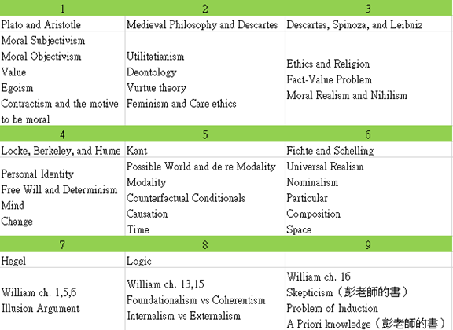

# 背景介紹

四上提早一學期畢業於台師大公民教育與活動領導學系，之前幾乎沒有任何哲學背景，大一的時候意外修了一門叫做「道德推理」的通識課程，開始對哲學感興趣。之後一下的時候跑去旁聽形上學，發現聽不懂乾；雖然系內有哲學概論和倫理學，但當時幾乎都在耍廢沒有上課XD。三上的時候決定念哲研所，三下開始念了一年ㄉ書這樣。

文長，建議搭配音樂，我個人推荐這首❤

### 台大成績：榜首

西洋哲學綜論：62

哲學英文和邏輯：64

總分：126

最低錄取分數：113

### 政大成績：榜首

哲學基本問題：72分

西洋哲學史：79分

總分：223分（72*2+79）

正取最低分數：136

最低錄取標準：131

### 用書（真正的書單建議會在後面提到）

西洋哲學史：傅偉勳，《西洋哲學史》，三民

邏輯：彭孟堯，《基礎邏輯》，學富文化，第二版

形上學：純旁聽台大課程的內容

倫理學：

James Rachels原著，林逢祺翻譯，《道德哲學要義》，桂冠

Louis P. Pojman and James Fieser, Ethics: Discovering Right and Wrong. 7ed., Boston, MA: Wadsworth Publishing, 2011.

旁聽台大課程的內容

知識論：

《知識論》，彭孟堯，三民

旁聽台大課程的內容

在寫這份心得的時候，其實政大才剛放榜，台大則還沒。原本想趁這個時間玩還願，但是來不及買就下架了QAQ

**等不到還願上架的我，只好來還願寫心得文了XD**

如同題目註明的，這篇心得會採取台大為主的考試導向方式，來分析現在的哲學所考試，也是我念了這一年下來的感想。

這樣的分析是以考試為主，具體上的意思就是，即使在哲學基礎不夠穩固的情況下，應該還是能取得不錯的成績。

會有這樣的方向，還是因為師大沒有哲學系，我幾乎沒有任何系內的資訊或可以詢問的朋友，導致在準備的過程中幾乎沒有什麼具體的方向（一年前我連有分析哲學和歐陸哲學的差異都不知道Orz）。此外，雖然幸運有考上，但是自問哲學基礎其實還是非常淺的。

不過相對而言，**即使是幾乎完全沒有哲學背景的前提下，只要有一個正確的方向，仍然是有相當大的機會可以考上的。**要是當初我能有一個明確的方向，有很多路就可以不用多走。

希望以夠幫助到有看到這篇文的哲研所考生，希望你們都不要因為資訊不足的原因，而犯了很多我自己犯過的錯誤。

以下將分成台大和政大兩部分來寫，台大為主，**特別強調重點是準備方向的觀念**，不同學校或同學校的不同年份，都會有細節上的不同。

換句話來說，特別是好幾年後才看到這份心得的朋友，絕不要照抄，畢竟即使是台大，五年前的準備方向和現在的準備方向仍然是有差的。（五年前是歐陸，現在是分析）

# 台大

先觀察今年的考題，我們考試導向的分析方式，就是先去思考題目會出什麼，再跟據得到的資訊來思考準備方向。反過來說，我們要避免讀完書之後發現題目方向根本不同。而且最好要做到連細節都能搞定的狀況。

細節的部分，在台大是可以辦到的，政大反而還更難一些。原因就是**台大有公布參考用書**。

從結論上來說，我們觀察106~108的考題，會發現**台大的考題完全出自於參考用書**，大致上我們可以預期如果參考書目不變，明年應該也差不多。

可是，我們還要更進一步猜測，有什麼題目最有可能考，連同作答邏輯都要有，也就是細節的部分。一樣是因為有參考用書可用的原因。

在那之前，我想先談談我之前因為用錯書籍而導致的慘狀。

前面有說過，我原本的知識論用書是彭孟堯老師的《知識論》，而直到我快把書念完的時候，我遇到了一個非常大的困難，就是我發現我根本還是不會寫台大的過去考題。

比如說，我對於Foundationalism和Coherentism之間的矛盾幾乎沒有概念，也不清楚Empricist Foundationalism會遇到什麼concept方面的問題，我甚至不知道原來Reliabilism就是Externalism。

不過反過來說，5年前的知識論考題我幾乎都會寫，而且是相當順手的那種。

這邊顯然是有一個很大的問題，在於用書上。不同的書籍對於同一個問題的處理邏輯是有所差異的，以Reliabilism來說，我原本的用書是談到Goldman提到此學說，並進一步介紹其學說的發展。然而，台大書單的介紹邏輯則是談到Internalism的問題後轉而介紹Externalism，再介紹到Reliabilism。後者根本沒有談Goldman的學說怎麼發展的。

因此，台大書單的邏輯是Internalism和Externalism一起介紹，且強調彼此間的優缺點。重點不是那種介紹方式比較好，而是近年的台大考題邏輯就是順著這種方式來考。

彭孟堯老師的書仍然是相當好的，但是其中的介紹邏輯是符合過去的考試方向，因此如果只看這本書，在應對現在台大考題上，會遇到極為嚴重的困難。比如說，如果我只有讀彭老師的書，那今年知識論的那題Internalism可能可以寫一些，但關於如何和Externalism有爭論的問題我大概就回答不出來了。

我們如果想念知識論，兩本書都值得一讀，但如果要準備台大考試，那顯然台大用書是較符合考題邏輯的。我們不只要有辦法回答題目，而且連作答邏輯這種細節都要有辦法掌握。

我自己還算幸運，當時發現問題的時候還有一些時間，因此彭孟堯老師那一本我就沒有再念最後一章了，轉而重念台大書單的內容。不過，多念彭孟堯老師那一本反而在政大考試的時候幫了我一把，這真的始料未及，後面介紹政大的時候會再提。

同樣的問題也發生在我念倫理學的時候。我之前有修到那門叫做道德推理的課程時，用書中有提到 Rule-Utilitarianism 所面臨到的問題，當時書中給的稱呼叫做「規則崇拜」。同樣的東西，在台大書單中所提到的則是「inconsistent」，其內容其實是一樣的。但重點在於，106年的倫理學考題中，題目提到有一個inconsistent的問題，然而若我只有看過原本的書，我可能就不知道如何應答。

這會造成我其實知道但寫不出答案的情況，應該避免。再強調一次，我們要熟到連出題邏輯都有辦法掌握。

以上的觀念如果能夠掌握，其實就已經差不多了。可以用在任何學校的考試。不過，跟據這個觀念來準備台大的考試，還有一些更具體的建議能夠分享給大家。

台大考題有一個特色，就是兩題取一題寫就可以了。換個說法，書只要念一半(X)。這邊的重點在於，如果時間不夠，寧願把少部分的主題念到精，也不要把全部都看過但不熟。

## 倫理學

倫理學應該算是比較簡單的部分。簡單的原因在於其實不同的用書不會有很毀滅性的差異，大概就像是我前面所說到的差別而已。

最佳念法，推荐可以到台大的倫理學課堂旁聽，同時念倫理學的台大用書。目前如果還是吳澤玫老師授課的話，她的用書其實就是台大的參考用書，不過版本可能會有差別（新版本會有新的章節！）。老師本身就有可能是出題老師，再加上授課用書一模一樣，完全可以做到掌握細節。

我當時大三下撞了必修而不能去旁聽，因此寫信給老師（吳澤玫老師）想說能不能要到上課資料。現在回想還是非常感謝老師當時給了很多建議，版本差異也是她跟我說的，另外老師有自己的網站，上面會有授課資料PPT。我當時就是一邊自己啃書一邊看她的PPT。讚！

倫理學的大重點是Utilitarianism、Deontology and Kant、Virtue theory、Value。剩下的章節則是小命題如Contractism、Egoism、Subjectivism和Objectivism，或是與其它學科有關的命題如Religion、Care，或後設倫理學的Fact-Value、Realism。

有這樣的前提之後，我們跟據歷屆考題，大致上就可以預期明年可能的考題了。

106(Utilitarianism and Care Ethics), 107(Absolutism and Contractism), 108(Subjectivism and Religion)

從剩下的題目中就可以抓出109最有可能的考題了，**Deontology and Kant再不考大概就說不過去了吧**，後設倫理學則不知道老師有沒有打算考。

## 形上學

首先必須強調一件事情，就是台大現今的考試是分析的考法，與過去的歐陸是不同的。準備的時候一定要注意。

最佳念法，一樣推荐台大書單和旁聽台大課程。這幾年都是鄧敦民老師授課，他的授課特色在於每堂課之前都會有一個影片可以看，是10分多鐘的課堂精華。其實看精華就可以應付考試了(X)老師同樣是可能出題者，他的上課用書大約有近一半和台大參考用書重疊，老師上課滿用心的，如果時間比較趕，建議至少要聽課程主題與書單主題重疊的課程。

同樣是三下，同樣撞了另一堂必修，當時我算是滿衰小的吧= =不過寄信詢問老師之後，老師還是很大方地開放了課程內容(重點是影片精華RR)給我，而且不久前還讓我約了時間去詢問形上學相關的問題(我對時空比較感興趣喇)，真的還是要在這邊感謝老師的幫忙。

不過其實我這次考形上學滿抖的，因為老師課堂沒有教proposition，但這次有考(是書單內容)……而另一題則是perdurantism and endurantism的爭辯，老師只有在change的章節中提到，我相當於是用了另一本書的另一種邏輯來回答。這邊再強調一次，即使是同個主題，不同書籍的介紹邏輯還是有差，大家還是記得要看Loux那一本R（嘆

台大書單那本的章節是比較少的，大致上就是存在（particular、universal）、模態（modality、causation）、反實在論這三種。考了三年之後，其實剩下的考題真的不多了，針對性地準備可以在非常短時間內完成。

106（particular and time）、107（universalism and modality）、108（propositions and perdurantism）

剩下的章節剛好是兩個，anti-realism和causation。其中causation是老師上課會提到的主題。考前盡量可以把這兩章處理到最熟。

（其實我在打心得文的時候還以為第一題是anti-realism……之後感覺怪怪的才再去翻書，傻眼XDD）

## 知識論

**個人認為知識論是最難處理的**，不是因為我對知識論沒興趣的關係(XD)，而是因為台大目前108的書單分成兩個部分，在完全沒有基礎的情況下，兩本書的書寫邏輯不同，會造成滿大的困擾。我雖然一開始讀錯書，但是在第一本書的基礎下，要再入手這本書還是滿快的。

大致上，我會建議可以先讀完彭孟堯老師那本的第一章，有一個「Justified true belief is knowledge」的觀念後再開始讀台大書單。台大書單的閱讀順序建議是「Williams的1、5、6章>>Bonjour的那四章>>Williams剩下的三章」。當然一樣搭配旁聽，這幾年來台大幾乎都是由梁益堉老師授課，上學期的授課內容則是有約後一半的課程是和Williams重疊的。這邊極度推荐可以去聽一下Williams的課，因為那本真的不好讀= =我當初讀到快khí-siáu了，主因還是我沒有基礎啦，連scepticism其實就是skepticism都不知道……

不過，如果我沒記錯的話，Williams的書好像不是過去的參考書目，而且其實近年來的考題也都沒有明顯是考其書本內容的東西，也就是其實只要念Bonjour就好了(X)。基本上，知識論的考題分成「Illusion Argument、Foundationalism vs Coherentism、Internalism vs Externalism、Problem of Induction」這四個（以及可能附帶的skepticism），剛好就是Bonjour的四個章節，所以說念Bonjour就好了(開玩笑的啦XDD)。Williams的書寫邏輯則像是不斷地在找尋對抗Scepticism的方法，在邏輯不同的情況下還是會有和Bonjour重疊的部分，在念完後整理的時候會是有點困擾的，可以注意一下。（如果之後的書單還是一樣的話）

值得一提的是，知識論的書單幾乎沒有提到任何關於先驗知識的部分，我在彭孟堯老師的書中有讀到，結果反而一定程度上幫到了政大的考試，這個我們晚點再說。

另外，梁老師現在是系主任，在上學期(107上)的課堂中有提到，107下學期會舉辦對碩班有興趣的同學開設的講座。這部分是我在老師課堂上意外聽到的，可以看得出來老師雖然忙於研究，但還是滿積極地想要吸引對哲學感興趣的人。這邊也要感謝當時老師願意特別回信告訴我相關的事情，雖然我已經用不到了，不過有興趣的朋友還是可以去哲學系辦打聽一下。這些可遇不可求的小道消息也是旁聽的好處就是了，而且William的書是少數網路上找不到PDF檔的教科書(?)，可以在老師課堂上免費拿列印的內容，太神啦！

想要預測知識論考題會有一個比較尷尬的地方，在於其實那四個主題都已經考過了，而且一定程度上今年是考過去考過的題目。比如說，今年考了一題Internalism，但是按照Bonjour那本的書寫邏輯，這個討論是和Externalism一起的，因此其實就是考Internalism vs Externalism，而重點在於，106考過Externalism，兩年的考題雖然不一樣，但其實寫出來的東西是幾乎一樣的。同樣的情形也發生在Foundationalism vs Coherentism上。

這部分就比較尷尬了，不是很清楚老師接下來會怎麼出，另外Williams的書也沒有考過，不過，如果再往回看更多年一些，就會發現其實能考的東西好像就真的只有這些，所以也是不用真的太擔心啦。

106（Externalism and Coherentism）、107（Foundationalism and Problem of Induction）、108（Internalism and Illusion Argument(後者與105重複)）

## 邏輯

邏輯的特色在於死板，會就會，反之亦然，這個我想大家都懂。練習一定是必要的，但跟據考題我們仍然有一些可以取捨的地方。

我當時沒有旁聽，我個人覺得邏輯基本上應該不會有不同教法的差別，所以倒也不用特別去聽台大的課。用書只推荐台大那份書單，特色在於它講解得非常詳細，尤其在關係述詞邏輯這個地方顯得特別重要。台大歷年來的邏輯考題，在關係述詞邏輯這個地方考得非常困難，如果沒有通盤瞭解加上大量練習，是絕對無法應付的。台大的書單剛好符合這個需求。

我當初是讀彭孟堯老師的《初階邏輯》，雖然名義上是有介紹到關係述詞邏輯，但其實這本沒有介紹到ID和IR這兩個東西，而且在把自然語言轉化成關係述詞邏輯的符號這邊，是少了相當多更具體的練習的。比如說，「邏輯最好的人」要轉換成關係述詞，要用「存在一個人，且對於所有『其他』人而言，這個人的邏輯比他們都還要好」這種方式來呈現，也就是(∃x)[(y)(x≠y)→Lxy]。沒有看過具體的示範應該是很難自己想到吧QAQ

我當時邏輯比較晚念，已經考前一個月了才發現我雖然念完了整本書，但考題幾乎不會。建議各位，邏輯最好先念，念完之後每天都花一點時間練題目。而如果和我一樣英文不好，在關係述詞邏輯之前的章節可以看彭老師的書，但關係述詞邏輯一定要好好把台大的書單吞進去R

反過來說，大家其實可以發現，台大的考題除了關係述詞邏輯就沒有什麼東西了，過去的第一大題關於一些基本觀念的問題，只要讀完彭老師那本書的第一章就可以了。我們大致上不太需要用到真值表法、樹枝法或是其它邏輯系統。把關係述詞邏輯會用到的所有東西準備完就足以應付考試了。（也就是說，台大那本書單也不用完全念完。）

不過，彭老師那本的第十一章，後面附了一些考題，其中有一些題目我認為是值得在考前練習的，特別是一些EI和UG的規則限制，可以透過這些題目來搞清楚。題目分別是11,29,33,34,46(特別要看解答),52,68,75(特別要看解答)。

邏輯的重點在於「valid, truth, 和 inconsistence的定義、sentential logic 和predicate logic的證明和公式(台大書單在一開始有附)、predicate logic和自然語言的轉換」這三個。念書的時候記得隨時要看一下台大題目看看自己有沒有頭緒，不要念完才發現其實根本不會寫。

## 英文

我沒有特別念，不過我認為如果有能力自讀台大的書單，那應該都不會有太大的問題。我自己是學測14級、指考80分左右的實力，大學則是有加強聽說能力，但閱讀書寫是到大三才開始慢慢補回來，而且主要來源也是去旁聽哲學系課程的東西喇……這部分我可能沒有什麼比較好的建議，建議大家多用台大的那份原文書單做練習就是了……XD

值得一提的是，今年的英文考題，居然叫我們用全英文申論……這還真的是以往沒有考過的方式，考生記得要注意一下。我其實個人覺得是比英翻中還要簡單一些就是了。另外，閱測的文章有滿多都會觸及一些關於哲學到底是什麼東西的文章，我個人是滿喜歡這些文章的。比如說，這次有一題在討論關於我們不應該只依賴科學的文，當下我馬上就想到核終幫和以核養綠，嘻嘻。之前則有考過關於哲學介於自然與人文之間的「No man’s land」，也是相當精彩。對比台灣社會對於自然科學扭曲的崇拜心態，這些文章某種程度上也是可以用來反思的吧，唉。

最後我把台大108的書單貼給大家，可以用書名加pdf的關鍵字搜尋看看(大家當做沒看到這句R)，寫此篇文章的當下109還沒出來（不過進擊的巨人115話出了，窩豪興奮R），記得要再去確認（包含版本）。

形上學：Loux, M. 2006. Metaphysics: A Contemporary Introduction, 3rd Edition. New York: Routledge.

知識論：Michael Williams (2001) Problems of Knowledge: a Critical Introduction to Epistemology, Oxford University Press. （Chapter 1,5,6,13,15,16）、Laurence BonJour (2010) Epistemology: Classic Problems and Contemporary Responses, 2nd Edition, Rowman & Littlefield Publisher Inc.（Chapter 4,6,9,10）

倫理學：Louis P. Pojman and James Fieser, Ethics: Discovering Right and Wrong. 7ed., Boston, MA: Wadsworth Publishing, 2011.

邏輯：Hausman, A., Kahane, H., and Tidman, P. 2010. Logic and Philosophy: A Modern Introduction, 11th edition. Boston: Wadsworth.

（以下為3/17補述，因為台大成績意外的低，而這篇文是在3/7寫完的）

剛剛看到了台大的成績，西哲綜論和哲英邏輯分別是62和64= =，分數比想像中低太多了，原本覺得政大寫這麼爛平均還有75的情況下，台大寫得比較穩應該分數會比較高。雖然據說一般錄取分數就這樣啦，但從考試導向的思維來說，這邊也許是有些文章可以做的。

大致上，台大改得比較嚴格應該是肯定的。不過，我比較在意的事情是，特別是在西哲綜論的地方，尚有38分是可以爭取的。平均下來我一題大概被扣了三分之一的分數，雖然可能大部分被扣在形上學，不過我後面會提到，普通人在100分鐘的時間限制下應該是不太可能會再有更好到哪裡去的表現了。

以單純考試導向的思維來理解的話，我覺得我們分數也許有被刻意壓低的感覺，也就是說，100分鐘的書寫時間限制下，大概不會有任何一個可能世界中(?)有人能拿80以上的分數。我能想像我做到最好的情況，特別是形上學的部分，也許就多個10分，變成72分而已。也就是真實滿分不是100而是80(X

不過這真的不好說啦，也許就我太爛QQ

# 政大

整體而言，我覺得政大是比較難準備的。原因除了**沒有書單參考外，政大的考題比較多變，不像台大穩定。**依賴台大的準備模式不太能夠在政大取得一樣的成績，像我今年就吃了滿大的虧。以下還是以科目來分開解析，分別是哲學基本問題和西洋哲學史。

## 哲學基本問題

除了邏輯沒有出現過之外，任何方式的考題基本上都有出現。相當於是台大的西洋哲學綜論加上英文的感覺。無法用特定一本書去概括，因此，我認為其實只要把台大的東西準備好，自然就可以來考試。比如說，之前曾經考過人格同一性和心靈實體，剛好就是台大書單沒有，但台大形上學課堂會談的東西。

另外，我猜測可能是因為政大較偏歐陸的關係，考試模式不像台大習慣考特定的理論，而是給出一個實例再請考生提出自己的想法（其實這也是以前台大還偏歐陸的時候的考法）。以倫理學中的墮胎為例，台大過去曾考過moral absolutism，主題是Aquinas的Doctrine of Double Effects，基本上我們都會進而提到教會人士據此而反對墮胎（但以介紹理論為主）；政大今年則直接給出一個實例，我們可以運用任何我們想到的方法來提出並辯護自己關於墮胎的觀點。這一定程度上是仰賴臨場反應的，待會可以分享一下我今年的作答是如何，各位參考看看就好。

這邊想要額外說一下，今年的第一題考題，要是我沒有看彭孟堯老師的《知識論》，我就不會知道a priori是先驗知識，可能就不會寫了……雖然念西哲史的時候就知道這是Kant說的東西，但當時只知道中文RRRR

## 西洋哲學史

這部分就是要額外準備的東西了。我當時是讀了傅偉勳老師的西洋哲學史，也算是比較標準的教科書吧。我個人在這裡做了一點thau-tsia̍h-pōo的東西，就是因為整本書太厚不可能全部背下來，所以我自己做了一些取捨。我很難說到底這樣的結果是好還是壞，因為我剛好就在今年吃了大虧= =以下說明我的想法。

對我來說，重點還是在於在有限時間內把重要的東西記起來，畢竟我其實還是以台大為主，因此設定了一個寒假的時間來念完它。首要之務，就是編排出重要哲學家的順序來取捨了。

最重要的哲學家，也就是每年必從這裡面出1個以上的哲學家，絕對要背熟，包含Plato、Aristotle、Descartes、Kant。

然後是可以獨立出考題也可以和前面的哲學家一起出的，也要背熟，包含理性論的Spinoza、Leibniz；經驗論的Locke、Berkeley、Hume；觀念論的Fichte、Schelling、Hegel。其中以Leibniz和Hume最為重要，Hegel則意外地不常獨立出題，可能是因為太難了吧。Schopenhauer也沒考過，但書中會提就是了。

最後，則是中世紀的神存在論證以及共相論，這裡哲學家大致上是伴隨理論出現的，且通常是一次考一串人物。

再剩下的則還會有Plato以前的哲學家，和當代不同的思潮，這些我就選擇放棄，投資效益實在太低，然後今年我就被打臉了幹XD

先說說今年發生什麼事情，然後再說而我認為我的想法可以改進的地方吧QAQ

各位可以看一下今年的考題，總共三題的情況下，前兩題就已經包含了數位Plato之前的哲學家，也就是那些大概在整本哲學史裡面只會佔據兩三頁的人，我在剛拿到考卷的時候好像還聽到我旁邊的人罵了一句髒話還是嘆了一口氣，我完全可以理解這種感覺。今年也太考偏了吧= =

這群哲學家裡面我唯一有點印象的是Parmenides，但能說的東西也就一點，最意外的還是我看到Pyrrho of Elis這個人的時候，嚇然想到我在彭孟堯老師的《知識論》裡面有看到所謂皮羅主義，幸好當時有查了它的英文是Pyrrhoism。不得不說，彭老師您真的是我的救星啊XDD，然後再次提醒各位，英文真的很重要（嘆

其他哲學家就亂寫了，事後翻書也知道其實沒有一個是寫對的。不過從結果來看，不會的人應該也是佔多數就是了，尷尬一波QQ

這次考試給我最大的教訓，也就是我認為可以改進的地方，就是「最好用某種脈落式的主題把哲學家串在一起背」。以第一題為例，這邊的考法明顯是「主題為Plato的理型論，而這個理論之前受誰影響，後又受Aristotle如何改進」，二三題也是差不多的情況。這是我之前所忽略的事情，有在準備政大的朋友是可以注意一下的。

在這種出題邏輯下，第二題的Hume因為考在懷疑論的脈落下，所以接續的人就是歷史上的懷疑論者了，這與我之前念Hume的時候，必定接續英國傳統經驗論脈落的邏輯是不同的。

不過，即使真的考出了一些非常冷門的哲學家，也都不太可能會成為主題。最誇張的情況，如去年考的現象學或是今年的第二題，就把自己能想到的東西全部丟上去吧，其他人應該會不會比較好就是了。

跟據今年的考題來推測明年的考題組成，啟蒙運動那一票哲學家考出來的機會相當高，中世紀的神存在和共相論也是比較有可能的，剩下就是從今年考過的人裡面再挑一些出來或當代的人了。

順帶一提，政大今年西哲史做為第二科考試，考試時間是到12:10，我寫的時候沒有注意，還以為是到12:00，害我寫得很匆忙，這個大家可以注意一下。

## 這裡提供我自己寫的歷屆考題

[台大政大106學年度](../Year106/zh.md)

[台大政大107學年度](../Year107/zh.md)

[台大政大108學年度](../Year108/zh.md)

## 最後，分享一下我自己的讀書方式

一般來說，我在讀完第一次的時候，會整理出這一章的重點。內容的呈現方式最好弄成「A理論的主張>>A理論遭受的攻擊>>B理論因此形成>>B理論遭受的攻擊>>自己支持哪一個」。**因為這就是考試時要寫的東西**，尤其在寫台大這種比較穩定的出題方式時，最好看到關鍵字，判斷是在考哪一個章節，就**把之前背好的整個章節重點直接抄上去**，再跟據題目的問答方式做微調。（比如說，無論是考Internalism還是Externalism，我的答案是差不多的）

然後，把這章的重點背下來。念34章的時候背12章，念56章的時候背1234章，直到最後把整本書背完，就算是念完一科了。

之後，設定一個時間為一輪，一輪內把東西全部背一次。這個時間可以是三天，或一週，或更長一點，念完越多東西就需要越多的時間。用這個方式一直複習到考前。

比如說，我當時念到最後是，把西哲史+邏輯切割成九天，倫理學、形上學、知識論各佔三天的時間，以九天的時間為一輪複習。可以參考以下的Excel。

背頌的時間可以是吃三餐的時間、上下學的時間、洗澡的時間。通常我一個通勤30分鐘左右的時間，可以背完西哲史當天的部分，或一半哲學綜論的內容。有效利用零碎時間的方式，不會佔據平常的念書時間，而且可以確保東西不會忘記。

如果有仔細觀察就會發現，我形上學其實都只有台大旁聽的東西，完全沒有proposition，幸好今年另一題我好歹不是完全不會寫……（抖

整體下來，我從2018年的寒假開始念到2019年的考試前。分別是寒假念完西哲史，2月~7月念完倫理學和形上學，7月~隔年1月念完知識論和邏輯。學期中因為還有自己系內的事情要處理，因此時間是延得比較長的，不然一般全力念的話，我認為2個月處理好一科是合理的。

另外，其實我暑假到10月左右的時候，念到有點脫力，所以大家會發現知識論和邏輯那邊花了還滿多時間的……其實就是在耍廢啦QQ。另外，1124選舉完之後我消沉了一陣子，當時的想法是連高雄都失守的情況下，最後被中國併吞，我要不就戰死，要不就逃走吧唉，還念屁哲學幹。

結果就是，最後一月底發現邏輯好像問題很大，知識論也答非所問。趕緊把台大的書單找來啃XDD

### 還有一件事情是我考前有做的，就是練筆！

練筆這件事情其實是很重要的，我們都說是考試導向的準備方式了，會不會某個東西和有沒有辦法寫出答案還是有一些差距的。

基本上，一份一百分鐘的考試，建議大家最好寫到95分鐘。以台大的西洋哲學綜論為例，能夠抓到形上學33分鐘，知識論30分鐘，倫理學33分鐘來作答，是非常好的。而且其中思考的時間最好越少越好。前面說過的念書方式，在記錄重點的時候最好也記錄成手寫時間符合這個時間的量。

換個說法，我個人想不到還有任何人有辦法寫出比上面這種方法更好的回應了。這種方法幾乎就是給你一份已經整理好的教科書，然後你把上面的東西抄上去而已。這種要盡全力利用所有可以取得分數的機會的想法，對於考生應該還是必要的，不過還是要強調一次，考試導向與研究還是會有些落差就是了。（而且我只拿62分……

有了這樣的觀念，剩下的其實也就是一些更瑣碎的東西而已，比如我考試會帶巧克力去含在嘴裡，要帶個廢紙去墊桌腳避免不穩，要有墊板避免桌面不平，文具手錶要多帶幾份之類的。這邊值得一提的是，我台大的考場，共同教學館那間教室超悶；政大考試的時候則是不能喝水，而我當時的考場資訊大樓的桌子超小。這些大概無法預防，但還是可以注意一下。

台大的考卷格式是一本（好像是8頁），基本上不會有寫不完的問題；政大是四面連起來的大紙（但第一面的前面一半是考生資料不能使用），如果照我說的那種方法來回應，有可能會寫不夠（我西哲史寫到第四面的一半，而且還是在我很多哲學家根本就寫不出東西的情況下）。

這一年準備下來的心得就是這樣了，從3/5政大放榜開始寫到3/7今天，也有點意外發現這一年下來能夠寫的東西居然有這麼多。在沒有什麼背景和資源的情況下，厚著臉皮跑去找不認識的學長姐和老師問問題，考前還把練習好的歷屆考題寄給課堂上助教請他協助批改，現在想想真的好大的膽子XD。

無論如何，這一年下來有太多值得感謝的人了，能考上還是有賴於這些人的協助。寫這篇心得文的的原因，也是希望未來有興趣念哲學所的朋友，不會像我一樣因為沒有資訊管道而走錯很多路。任何有興趣考研的人都歡迎問我啦，雖然我3/26就要入伍了，剛好可以在開學前把兵當一當（沒在大學就當完真是失策！），不過這段時間大概就無法太快回應有問題的人了。（**想要找家教的話我也樂意協助喔！**）

## 最後來閒聊一點自己的想法。

我在心得文裡面沒有避誨傳達自己在政治上的一些觀點，可能會讓一些人感到不太舒服。雖然我認為想念哲學的人應該都還滿同溫層的啦乾，不過這邊想強調的是，1124選完當天我和朋友聊了一個晚上，之後那幾天我真的滿消沉的。（不過3/16立委補選完是有小開心一波，耶~）

雖然哲學各自有自己的專攻領域，但誠如柏拉圖的想法，我們不可能也不應該自外於自己生長的社會，尤其在東亞已經進入後冷戰時期以來最大的秩序改變時期，台灣在這個脈落之下面臨的衝擊，念哲學的人不應該沒有感覺。

這可能就是所謂實踐的重要性吧。我常常和朋友開玩笑說也許我當初應該念物理系，畢竟時空理論還是我最感興趣的東西，但其實大學系所對於政經人文方面的訓練，讓我不只能夠重視人文學科，而且不致流於太過左膠式的幻想，我還是相當感謝它們的。

無論如何，如果被問到我是否願意為台灣上戰場，我的答案絕對是肯定的。

**分享一個從《進擊的巨人》裡面節錄的片段，是我個人滿有感觸的一段。**

> “…How did things get to be this way?
> Both their bodies and their minds rotting away. Their freedom stolen away, every single bit of it. They’ve lost their self-confidence as well…
> If people knew they would end up this way, I don’t think anyone would agree to go to the battlefield in the first place.
> But everyone is burdened by a certain “something”, and they plunge head-first into hell.
> In most cases… that “something” is not their own will. Usually, it’s their environment’s or other people’s expectations, and that leaves them no choice.
> However, the hell those who choose to burden themselves is different. On the other side of that hell they can see something.
> That thing they see might be hope, or it could be just another hell.
> But you will never know… unless you keep moving forward…”
> “UNLESS YOU KEEP MOVING FORWARD.”

> From Shingeki No Kyojin chapter 97

#SpeakUpForTaiwan

共勉之。

p.s.現在最大的夢想，就是還願能夠快點上架ㄌ（怕.jpg）

2019/03/07