### 台大

#### 哲學英文與邏輯

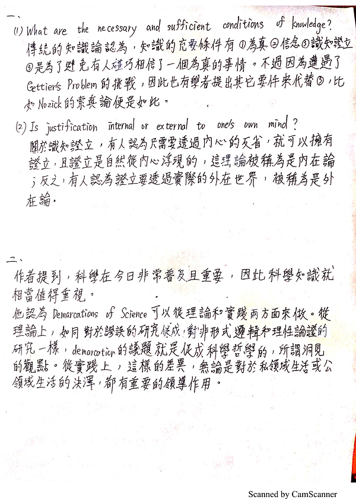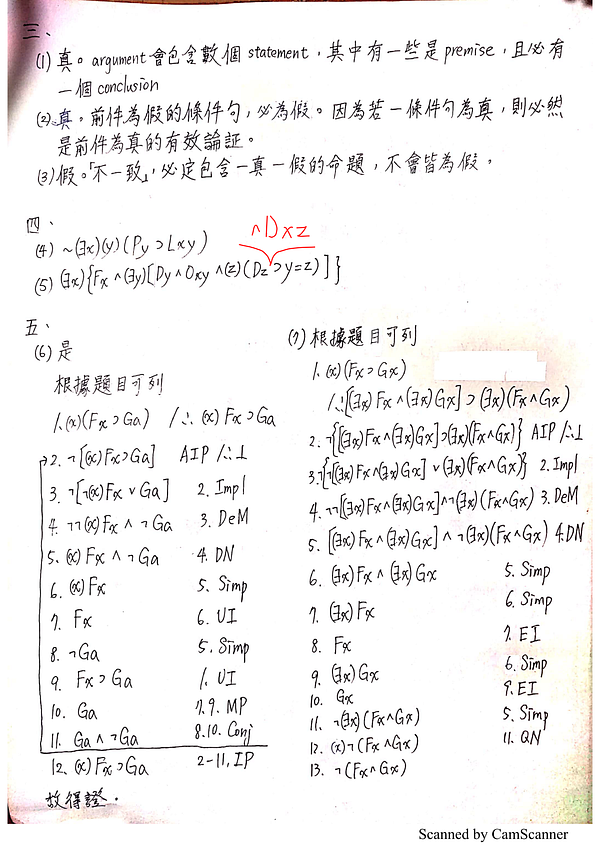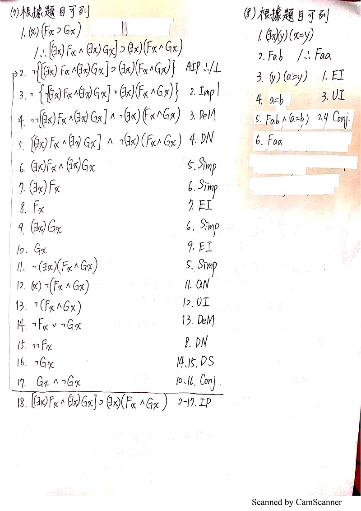

---

#### 西洋哲學綜論

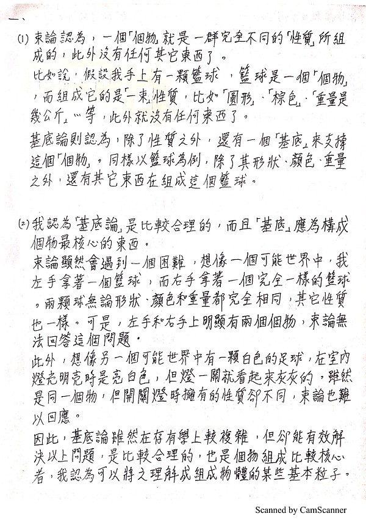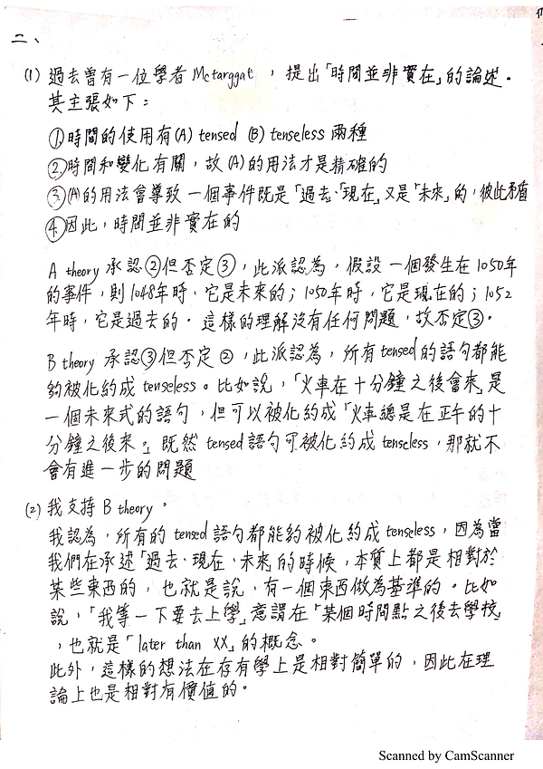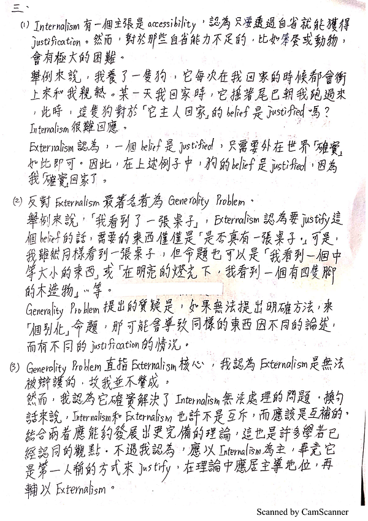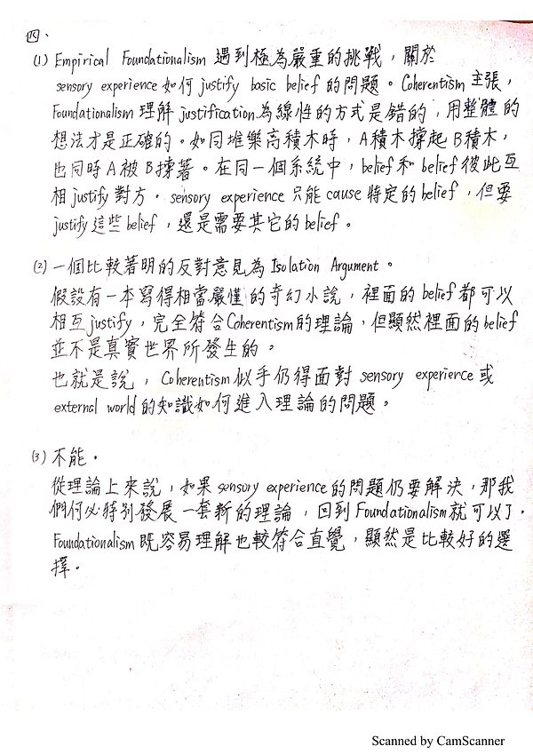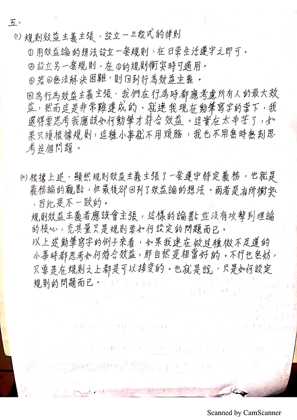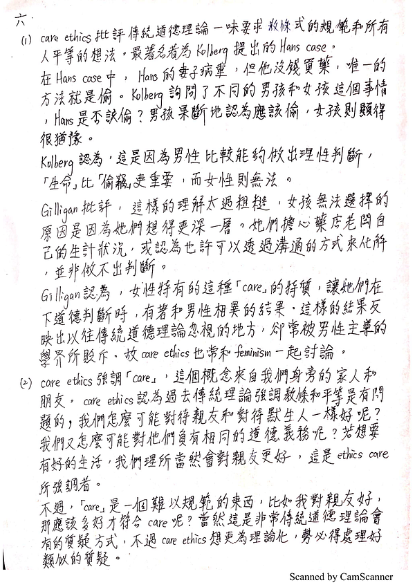
### 已知錯誤

哲學英文：偽科學那邊因為看不懂所以翻得很爛
邏輯證明(8)：原本寫的時候不會ID和IR，茲修正如下。
邏輯證明(7)：第10步的EI用錯了，因為第8步時x已經自由了，所以不能這樣用。想要弄出Gx的話，要使用到步驟1。修正如下
倫理學，五，(2)：規則效益主義者的回應，其實不知道該怎麼寫

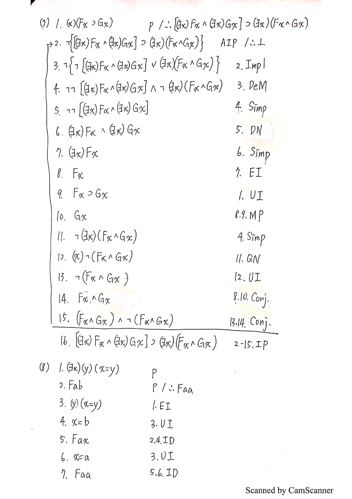

已知錯誤

---

### 政大

#### 哲學基本問題（最後一段是西哲史）

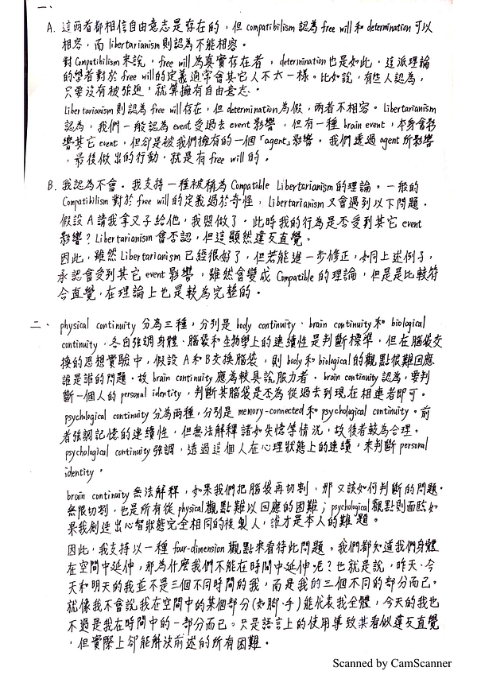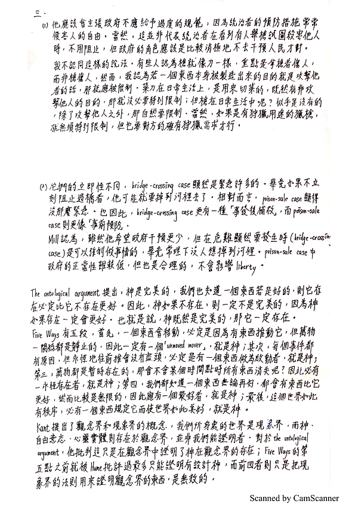
#### 西洋哲學史（第一題在上面）

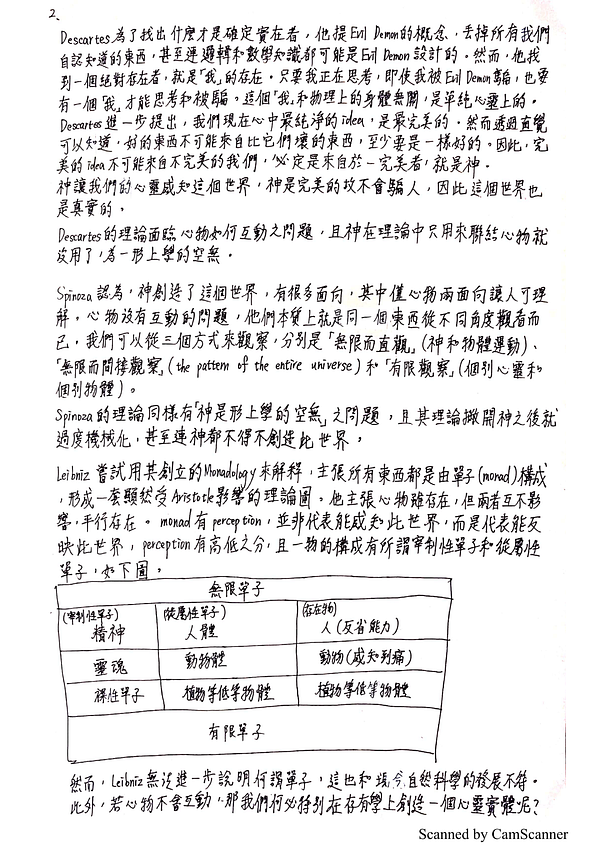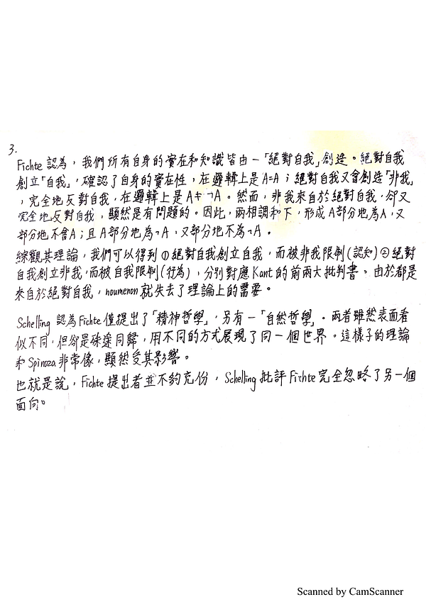
#### 已知問題

哲學基本問題，3：時間分配不佳，導致沒有足夠時間回答。
西洋哲學史，2：Leibniz的理論可能沒有正確回答到問題。
