### 台大

#### 哲學英文與邏輯

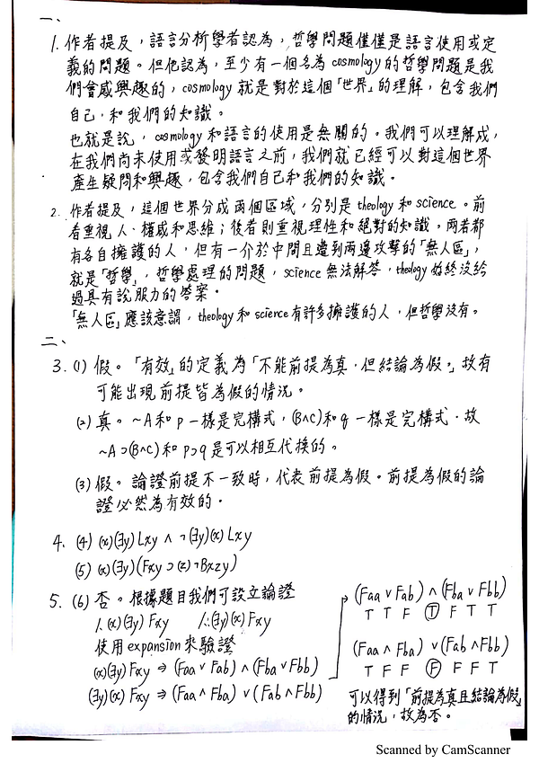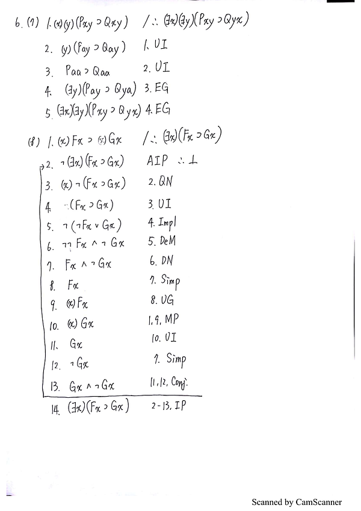
#### 西洋哲學綜論

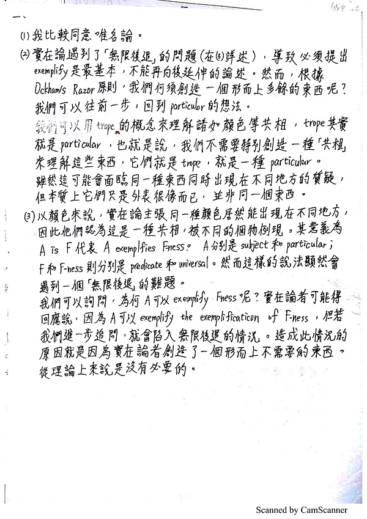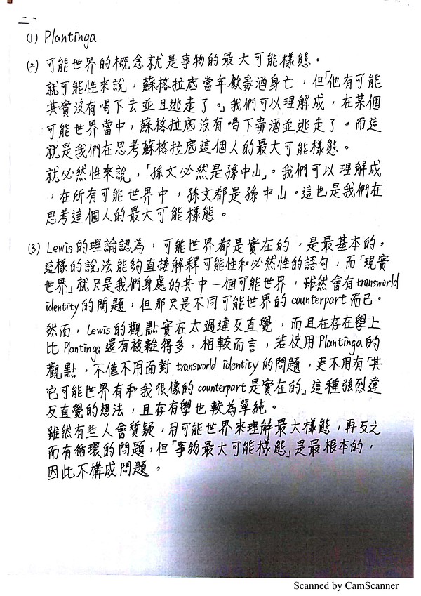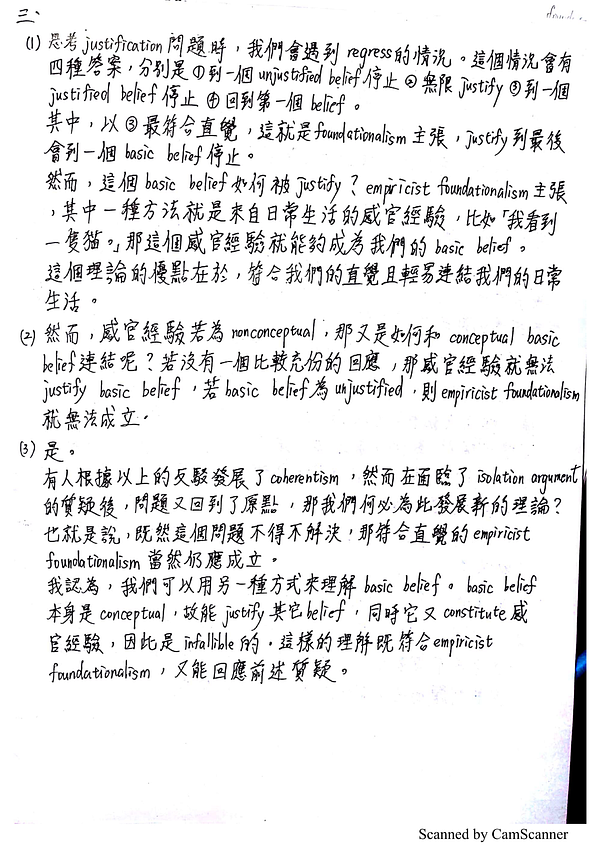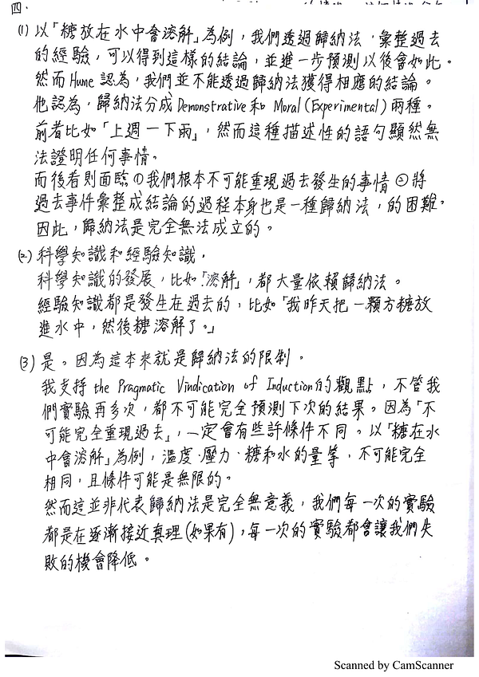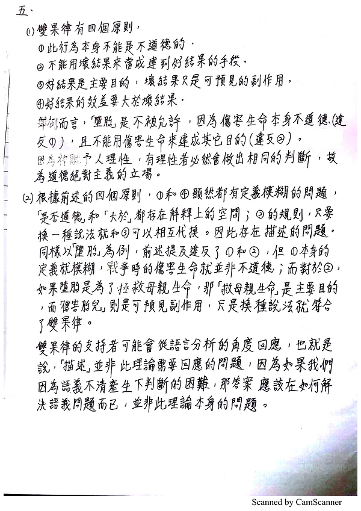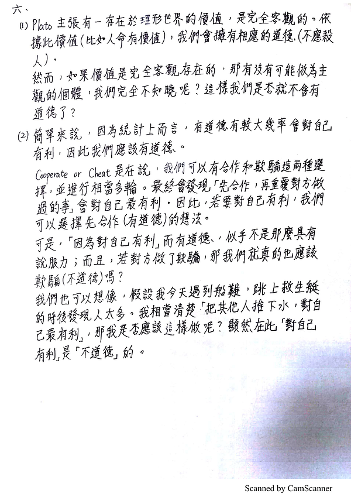
### 已知錯誤

倫理學，五，(2)：雙果律支持者的回應，其實不知道該怎麼寫
倫理學，六，(1)：應該是寫錯了，柏拉圖說了靈魂和神，且舉了壞人得好報的例子
哲學英文與邏輯，六，(7)：不確定第4步能不能這樣做，不過至少能用反證法，因為結論在反證時可以變成(x)(y)的形式，再弄成Paa和Qaa就可以了。（以下附上新的解法）

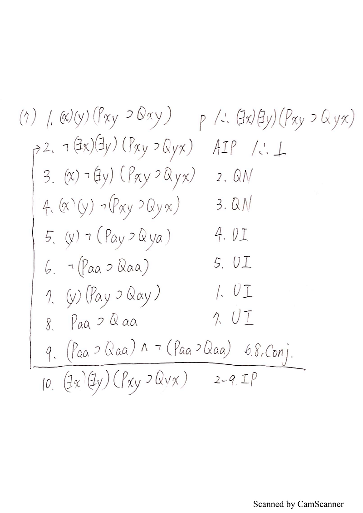

---

### 政大

#### 哲學基本問題

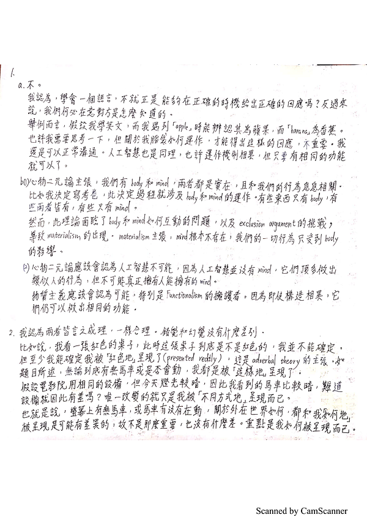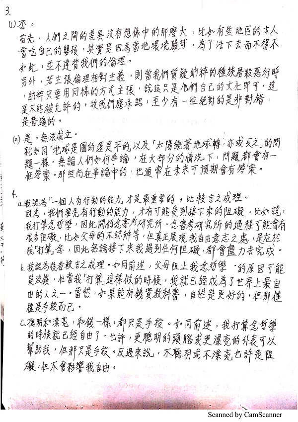
#### 西洋哲學史

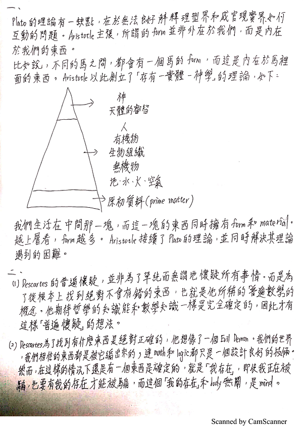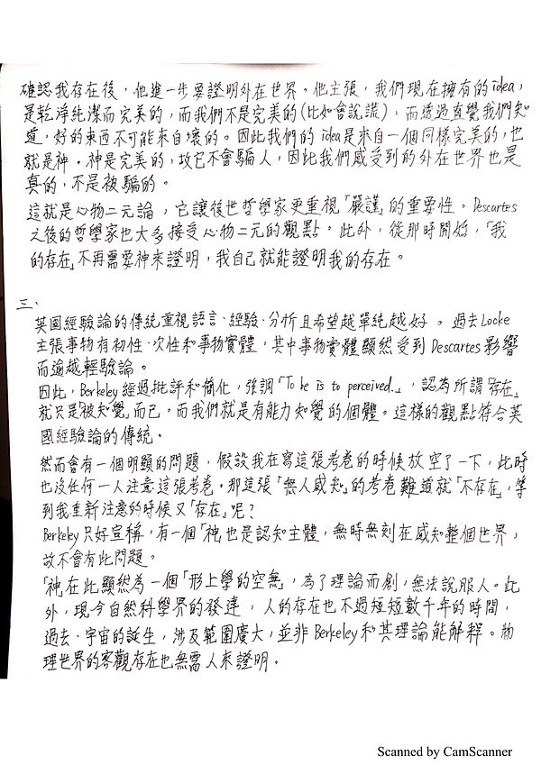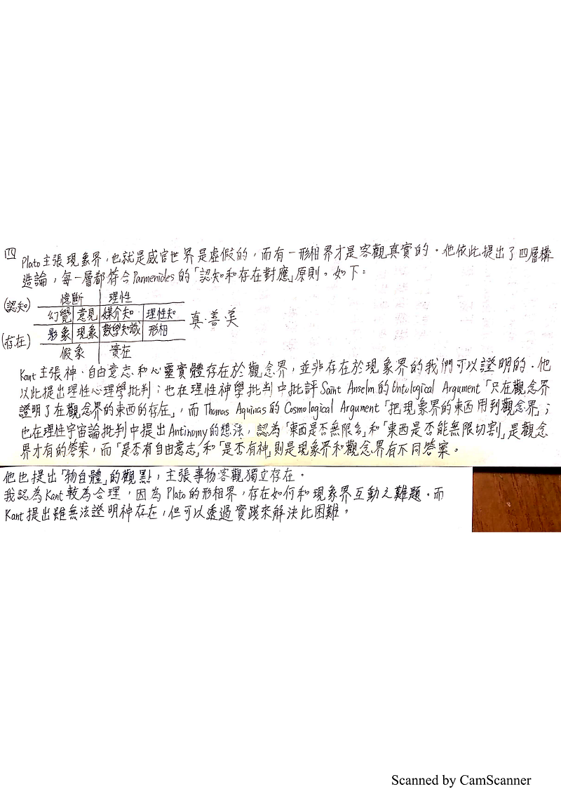

---

#### 已知錯誤

西洋哲學史，四：完全沒有念過現象論，連胡塞爾都不知道，應該錯得滿嚴重的
