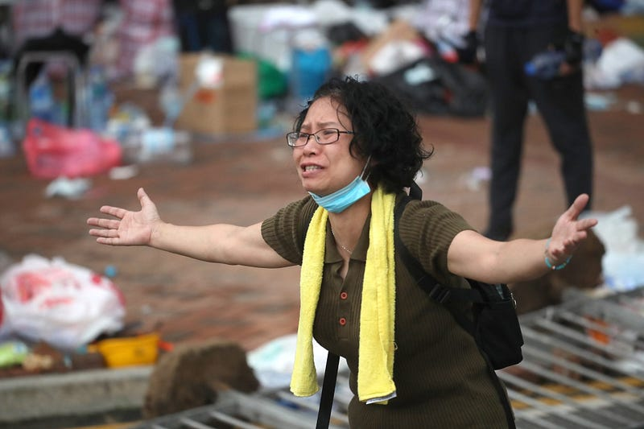

「我問妳喔，妳對這塊土地有感情嗎？」

「蛤？」我一頭霧水地看著男友，還沒弄清楚他想要說什麼。

「妳有家吧？」他接著問，我還沒搞懂，我剛明明只是問他對於香港反送中的看法而已。「有啊，當然有。」我看著他，他一如既往地皺著眉頭，陷入沉思。「這和我剛剛問的問題有什麼關係？」男友時常這樣子，總是無法正面回答一個問題，他習慣把問題弄得很大，又喜歡透過問答的方式來和我對話，我一直都沒有辦法理解。

「對妳來說，家是什麼？」大概是看到我一臉不解，他又問：「妳願意用什麼東西來換走妳的家？」

「不可能吧，家就是家，不是什麼可以換走的東西吧。」說到這裡，我好像有點懂男友想說什麼了。「你的意思是說，香港人正在捍衛他們的家嗎？可是反送中的主要訴求應該不是這個吧？」

男友點了點頭，繼續說道：「我知道，我想妳也知道吧。關於那個情殺案，以及後續中國一如既往想要藉機侵蝕香港司法的行為。」他停了一下，好像在等我的反應，而我至今都還沒有習慣將從小說到大的「大陸」改成「中國」。男友深吸了一口氣，又說道：「但這次我想和妳說的東西不一樣，我想和妳說的是，七百萬港人中就有一百多萬人出來遊行，這會只是送中條例的問題嗎？」

「恩……」我一時間無法回應。男友則繼續說：「其實我一直不知道，妳是否曾經對這塊土地，我是說，就是台灣這塊土地，有什麼深切的感情。」他又看了我一眼，用舌頭舔了舔嘴脣，彷彿擔心我會生氣一樣。「但對我來說，這是我出生、成長的地方，是我的家，不是什麼可以取代的東西。」

「因此，當今天有一群人將這塊土地視為一個反攻其它地方的工具時，我會感到憤怒，妳也知道我是在說國民黨這群人。而今天還有另一群人要和國民黨合作，併吞台灣，把台灣，也就是我的家，當成是他們自己的交易籌碼，當成是他們自己的殖民地時，我即時拚了我的命，也會阻止他們這樣做。」

「而香港已經被這樣做了。」男友看著地板，突然面無表情。

我正想說點什麼，卻被他突然抱在懷裡，還沒反應過來，耳邊就已經傳來他的耳語：「妳知道嗎？其實我一直不知道該怎麼向妳提起這件事情，妳並不是一個會關心政治的人，頂多就像一般年輕人一樣，知道婚姻平權的事情而已。到底中國的威脅有多大，妳大概也沒有很擔心，只覺得我們這群狂熱份子杞人憂天。」

「所以，當妳主動問起我香港的事情時，我其實非常激動，但我也不知道應該怎麼和妳說才好，怕妳又覺得我太激進，什麼逢中必反之類的。」

「可是，我還是想和妳說，」他放開了我，我才意識到他剛剛抱得多麼用力，讓我差點沒辦法呼吸。

「當妳失去自己的家，妳發現那群人正大肆破壞妳出生成長的土地，而妳發現妳甚至對這件事情無能為力的時候，那份絕望的感覺，經過長時間的累積，沉殿在妳內心最深處，藉由某些事件引爆出來，這就是反送中。

「妳覺得這種遊行會有用嗎？老實說，一點屁用都沒有。那妳覺得香港人會不知道這種事情嗎？他們當然知道。

「那，為什麼，他們還是出來遊行？

「因為，為了自己的土地，為了自己的家，我怎麼可能不做點事情，怎麼可能不去奮鬥，即使這種反抗只是困獸猶鬥，但我至少可以對我自己說，我為了我的家園拚命過了。」

男友握緊雙拳，繼續說道：「可是妳知道嗎？台灣還有軍隊，還有投票權，我們還有機會，我們還有辦法守衛我們的家。」他的氣勢高漲，但突然間，他任由雙手垂下，無力地搖擺著，好像突然又失去了全身的力氣。他緩緩說道：「但是妳知道嗎？我不知道台灣人民有沒有足夠的能力來為自己的家園而戰，最終有可能會害我們輸掉這場戰役的，居然是同樣和我們生長在這塊土地的其他台灣人。」

我知道他在說我。

「十一月二十四號那天晚上，我從來沒有這麼絕望過，而當我在思考這些問題的時候，我總是在想，如果真的有神，為什麼衪會如此殘酷，直到這塊土地即將要流盡了最後一滴鮮血，人民仍然沒有醒過來。

「而當我下定絕心要為這塊土地做點什麼的時候，我才發現，原來不是這塊土地需要我，而是我需要這塊土地啊。」他把眼鏡拿了下來，用袖子擦了擦眼框。我這才發現他不知何時已經紅了雙眼。

「這裡是我的家，沒有任何東西可以取代，我會為了我的家園戰到最後一刻。」

那個瞬間我突然有點懂了他的感受。我抱住他，而他輟泣了起來，像極了一個剛出世的嬰兒，在尋找自己的母親一樣。

蘋果攝記，何家達攝，來源：<https://www.facebook.com/ApplePhotographers/photos/a.1102941106576079/1102977469905776/?type=3&permPage=1>
