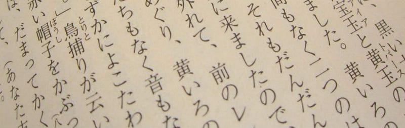

[from “https://www.japan-zone.com/new/learn\_japanese.shtml](https://www.japan-zone.com/new/learn_japanese.shtml)”

（華文版本請拉到下面）

This article is for those who started to learn Japanese words after being able to use hiragana and katakana.

The first thing to remember is the origin of this language. East Asian languages are famous for the hieroglyph, which means it was created from pictures, and you won’t be able to read it while seeing how it is written. As a result, it is important to spend extra time learning how to write them down in the beginning. This is why it must take time to learn the so called “kanji” (漢字).

It could be much easier to start with romanization system, but hiragana (平仮名), katakana (片仮名), and most importantly, kanji, must be learned if you want to study more. Being able to use kanji will help you learn and remember Japanese words much more easily in the future. For example, kaisha (会社) in Japanese means company, including 会 (kai) and 社 (sha). On the other hand, shakai (社会) means society. If you already learn 会 and 社while leaning kaisha, it will be just a piece of cake to learn shakai. This could also bring you the concept behind every Japanese word. Try to learn every kanji except for the difficult ones such as kirei (綺麗), but you should al least be able to recognize them.

Katakana words are also hard to remember. The most difficult ones, in my opinion, could be the R sound and ones with long(ー) and short(ッ) sound. The good news is that there are some basic rules for those translated from English. However, keep in mind that there are too many words you need to learn individually.

Take “internet” for an example. Internet in Japanese is “インターネット”, which is always a nightmare for the beginners. But it is actually easy to remember. The first thing we need to do is to divide the English word into different parts, so internet will be “in”, “ter”, “ne”, and “t”. That’s how Japanese translate this word, by finding specific katakana for these four sounds. Then, we got “イン”, “ター”, “ネッ”, and ”ト” in return. The basic rules we are using here is that, first, when we meet words with “er” or “ar”, we get a katakana with “ー” as a long sound in the end, such as “ter” into ター in this case. Second, for short sounds like “net”, we get a katakana with “ッ”. Finally, “t” will become ト,and “ll” (ball for instance) will become ル.

As you see, what the word sounds like does not really matter, even though in some case it does. Instead, you need to write it down and try to divide it into different parts. Well, it is not that hard actually, but there are still some words which don’t follow these rules, and others not coming from English. After all, it is at least not as hard as it used to be after you learn these rules.

（華文版本）

這篇教學是給已經學會平假名和片假名，但剛開始背日文單字者。

第一件我們要知道的事情，就是關於日文的啟源。這部分對於已經熟悉東亞方塊字，特別是漢字(かんじ)(kanji)系統的人，是相當簡單的事情養不贅述。對於表音文字系統的使用者，則必須再花費一段時間學習漢字要如何書寫。

基本上，學會漢字對於日文的學習有相當大的助益。雖然在初學期間會是一個大挑戰，尤其是日文的漢字和華文所使用的漢字常常有些許的不同，比如「步」和「歩」；或是相同的漢字表達不同的意思，比如「勉強」代表念書；「大丈夫」代表沒關係。然而，在擁有一定程度的漢字量後，接下來透過漢字來記憶就會讓新單字變得很好背。比如說，「会社」(かいしゃ)(kaisha)代表公司，「社会」(しゃかい)(shakai)則代表社會。如果在學到公司的時候有把漢字記起來，則背到社會這個單字的時候，就只要把已經學會的「社」和「会」反過來即可。單純透過假名來學習的話，就無法具有這種優勢。因此，除了那些太難的漢字，比如「綺麗」(きれい)(kirei)，或是其它日本人本身就不常用的漢字之外，盡量把遇到的漢字都記起來比較好。不過就算是那些不會被寫出來的漢字，還是要有能力辨認才行。此外，學漢字還有一個好處，就是可以幫助你瞭解這個單字背後的概念，這會緩慢並深遠地幫助你對於日文的瞭解。

除了漢字之外，平假名也是一個難以處理的東西。就我個人的經驗來說，最難的當屬帶有R的音以及長音(ー)和短音(ッ)，但其實仍然是有跡可循的。不過，雖然有跡可循，還是有很多單字要一個一個背才行。

拿「網路」來當例子，網路的英文是「internet」，片假名中則是「インターネット」。這應該是初學日文者最頭痛的幾個單字之一，不過這個單字其實並不難背。首先，我們要先把原文的英文字拆開成幾個部分，分別是「in」、「ter」、「ne」、「t」。這四個部分分別對應到「イン」、「ター」、「ネッ」、「ト」，我們可以從中窺見幾個基本規則。首先，遇到「er」或「ar」結尾的時候，會出現一個片假名並拉長音(ー)，也就是這裡的「ター」；而出現短音的時候則使用「ッ」來處理；最後，如果遇到「t」或「ll」(比如ball)結尾，則分別使用「ト」和「ル」來處理。

其實並不難理解，不過重點就在於說，不要太關心原文怎麼念(雖然有時候會需要)，而要關心這個字怎麼拼並將之拆開，這樣就很簡單了。當然，還是要記得有很多單字並不完全依賴這些規則，而且還有一些單字並不是從英文來的，這些都要額外一個一個背。這些就沒有什麼辦法了。

[臉書專頁](https://www.facebook.com/%E5%93%B2%E5%AD%B8%E5%AE%85-Philosophy-Otaku-111203980427942/?modal=admin_todo_tour)
