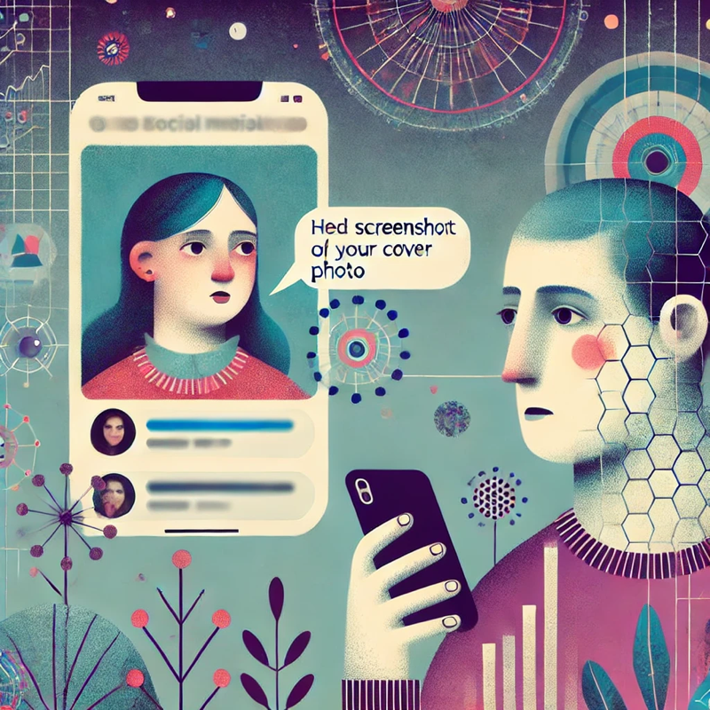

([華文版本](zh.md))

Let’s imagine the following scenario:

1. A man is recruiting candidates, and a woman reaches out to him via private messages.
2. During their conversation, the man sends the woman a screenshot of her profile cover photo from a social media platform and compliments her: “Your cover photo looks great! Also, I drink whiskey too.”
   **(Photo details**: The image was taken at a public event, featuring a promotional background related to whiskey. The woman was wearing formal attire appropriate for the occasion.)
3. The woman continues the conversation but expresses discomfort with his actions, stating: “By the way, I find it quite disturbing when someone accesses and saves my photos without permission and then makes it known to me. It makes me feel harassed and uncomfortable.”
4. The man, feeling frustrated, responds that the cover photo is public information that anyone can see. After stating his position, he blocks the woman.

This scenario is a modified version of a real-life incident. I happened to come across discussions on the topic and felt compelled to explore it further.

The following analysis focuses solely on the event itself, without making personal judgments about those involved.

### Intuitive Reactions

As a cisgender straight man, my initial instinct was to sympathize with the man’s position.

However, is this instinct truly reasonable? After deeper reflection, I wanted to examine the origins of my intuition and explore the potential causes of this conflict.

Everyone has their own instincts. Before diving into the analysis, let’s adjust a few factors to see how they influence our perspective:

- **Would your instinct remain the same if gender was not a factor, or if the roles were reversed (i.e., the woman sent the man a photo)?**My instinct tells me that I would be more sympathetic toward the person who sent the photo. This suggests that my perception and expectations differ based on gender, likely influenced by societal norms.
- **Would the situation feel different if he hadn’t sent the image but had simply said, “I happened to notice your cover photo. It looks great!”?**My instinct still leans toward sympathizing with the person who sent the image, implying that, even without considering the woman’s feelings, the act itself significantly affects how we judge the situation.

### Incident Breakdown

We can break down the woman’s actions into three key aspects:

1. **Subjective emotions**: She felt “disgusted” and “uncomfortable.”
2. **Cause of her emotions**: The man sent her a screenshot of her cover photo and complimented her.
3. **Corresponding action**: She expressed her negative feelings directly in the conversation.

The same breakdown can also be applied to the man’s reaction after being called “disgusting.”

#### Examining Subjective Emotions

> **Emotions are inherently subjective and do not require justification. Only the individual experiencing them can validate them.**

For example, if I feel sad right now, that feeling does not require a logical reason to exist — only I can truly experience my own sadness, and no one else can dictate whether it is justified.

More broadly, we typically experience emotions first and only afterward try to analyze their causes.

Therefore, what deserves discussion here is not the feelings themselves, but rather the **cause of these feelings** and the **appropriateness of the response to them**.

#### The Validity of Emotional Causes

Let’s consider several examples and evaluate how justified the emotional response might seem in each case:

- Someone sends me a leaked, secretly taken inappropriate photo of myself → I feel disgusted. (Probably making sense to most people)
- Someone sends me a public, sexy photo from my Instagram → I feel disgusted.
- Someone sends me a casual, everyday photo of myself and says I look great → I feel disgusted.
- Someone (a friend or acquaintance) verbally compliments my fashion sense → I feel disgusted.
- Someone simply exists in the world → I feel disgusted. (Probably not making sense to most people)
- Jewish people exist → I feel disgusted.

As the examples become more extreme, consensus on what is “justified” likely increases. This suggests that our emotional responses are shaped by personal experiences as well as broader societal contexts.

#### The Validity of Responses to Emotions

Just as emotional causes can be discussed, so can the responses triggered by those emotions. Let’s examine these examples:

- I feel disgusted → I accept the compliment despite my discomfort. (Most people probably will agree that the man should not get mad at this)
- I feel disgusted → I avoid responding directly and continue the original discussion.
- I feel disgusted → I express my discomfort but use more tactful language.
- I feel disgusted → I explicitly tell the other person, using strong words like “disgusting.”
- I feel disgusted → I physically assault or kill the person.
- I feel disgusted → I set their house on fire and kill their entire family.
- I feel disgusted → I initiate genocide against their ethnic group. (Most people probably will agree that the man should get mad at this)

Again, as the responses become more extreme, consensus on the man’s justification likely increases.

### Secondary but Less Critical Discussion Points

- **Did he really “access” the photo?**

Supporters of the man may argue that **“it was just a cover photo, not something that was specifically downloaded or accessed in a technical sense.”** Meanwhile, some supporters of the woman have pointed out that **“saving and re-uploading someone’s photo like this does feel creepy.”**

Regardless of the technicalities, the key issue for the woman was likely **not** the act of “accessing” the photo itself but rather the fact that **her image was used in a way she did not like.**

- **“I wouldn’t feel uncomfortable if this happened to me.”**

Some argue that they would be happy to receive a similar message and thus find the woman’s reaction unreasonable.

However, as discussed earlier, emotions are personal — what one person finds acceptable does not negate another person’s discomfort.

### **Cisgender Heterosexual Man’s Privilege & Collective Trauma of the “Second Sex”**

As a cisgender heterosexual man, my initial instinct was to see no issue with the man’s actions and to feel that being labeled “disgusting” was an overreaction.

However, this does not mean that my judgment of **the cause of emotions** and **the appropriateness of responses** is inherently reasonable. Instead, it is influenced by personal experience and societal conditioning.

To put it differently, many women have experienced harassment from an early age — whether through unsolicited inappropriate messages or having their photos misused by men.

Within this context, a woman feeling uncomfortable when her image is used in a conversation without consent is understandable.

#### The Collective Experience of Harassment

Consider the following scenario:

1. In a particular society, women frequently receive unsolicited and inappropriate messages from men. Their social media photos are often misused for objectification.
2. A woman raised in this society has personally encountered similar situations.
3. The incident described in this article occurs.
4. The woman reacts strongly, while the man is baffled by her response.

In debates surrounding such incidents, people tend to draw from their own experiences — whether in support of the man or the woman.

When we lay out the broader context, it becomes difficult to assign absolute blame. Both individuals are acting based on their respective personal experiences.

- The woman, shaped by her past experiences and understanding of societal dynamics, perceived the man’s action as uncomfortable and responded accordingly.
- The man, even though he was possibly unaware of this social context, was still acting far away from the real sexual harassment.

Before rushing to conclusions, we must acknowledge the hostility that women often face in society. By understanding the broader context, we might arrive at judgments that differ from our initial instincts.

#### The Impact of the Word “Disgusting”

We discussed the perspective from the woman, but is it possible to do it from the man’s?

Earlier, I mentioned that my initial instinct was to sympathize with the man. Upon reflection, I realized that the word **“disgusting”** played a significant role in this reaction.

When I imagined myself in the man’s position, I felt deeply uncomfortable with that word choice.

At its core, **“disgusting”** can describe both an action and a person (e.g., “creep” or “gross guy”). Although the woman may have intended to critique the behavior rather than the individual, the immediate impact of seeing the word likely felt personal and offensive.

### Conclusion

Well, the first takeaway might be that, one’s feelings cannot be invalidated, but their causes and the resulting actions can be discussed, just as what we do in this article.

After all, social boundaries are difficult to navigate. Even we ourselves may not fully understand our own reactions, and that’s why we have to try to do more self reflections to understand why we have such emotions.

However, by acknowledging broader societal dynamics, I still hope that we are able to strive toward mutual understanding.
