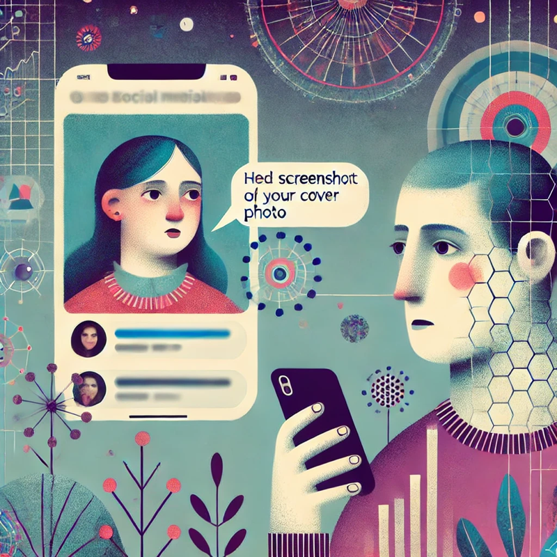

讓我們來假想以下的事件：

1. 有一個男生正在徵才，有一個女生透過私訊主動聯繫對方。
2. 在洽談的過程中，男生傳送了一張女生在社群軟體上的封面照片，並稱讚：「你的封面照片好讚，而且我也喝威士忌。」
   （照片內容：該照片是在公開活動上的擺拍，背景與威士忌相關，女生的穿著屬於正式場合的服裝。）
3. 女生繼續洽談，但在回應中表達了對男生此舉的不適感，並直言：「我覺得這種未經本人同意擅自存取對方照片，又讓對方知道的行為，滿噁心的，我有被騷擾的感覺，是不舒服的。」
4. 男生對此表示不滿，認為封面照片是公開資訊，任何人都能看到。他表達完立場後，直接封鎖了女生。

這是一個經過修改的真實事件，筆者偶然注意到相關的討論故有感而發，以下僅就事件本身進行討論，不涉及任何當事人本身或其它行為。

### 直覺

筆者作為順性別異男，第一時間對男生的處境較為同情的。然而，這種直覺是否合理？在深入分析後，筆者希望釐清這種直覺背後的成因，並探討衝突的可能來源。

所有人都會有直覺，讓我們先來置換幾個要素來為後面的分析作準備：

- 若不考慮性別，或將性別對調（女生傳照片給男生），讀者的直覺也是一樣的嗎？
  筆者的直覺是會更同情原本傳照片的人，這也反映了在筆者的個人經驗中，對於不同性別的認知或期待是有所不同的。
- 如果今天沒有傳照片，而是單純表達「我剛好點到你的封面照片，我覺得很讚欸！」會比較好嗎？
  筆者的直覺是會更同情原本傳照片的人，代表就算不考慮女生的感受，行為本身確實會影響我們對於事件的判斷。

### 事件分析

我們可以先把女生的行為分解為三個部分：

- 主觀感受：她感到「噁心」與「不舒服」。
- 感受的成因：男生傳送她的封面照片並表達稱讚。
- 對應行動：她在訊息中直接表達自己的負面感受。

類似的拆解方式同樣適用於男生在收到「噁心」這個詞後的反應。

#### 主觀感受的探討

> **感受是主觀的，無需合理性，也只有個人能為其背書。**

比如說，假設我現在很難過，這個感受的存在本身不需要任何理由，也只有我可以真正感受到這個感受，沒有任何人有辦法去代替我感受到這份難過的感覺。

進一步來說，我們通常是先產生情緒，然後才去探索其成因。

因此，真正值得討論的並非感受本身，而是感受的成因與對應行動的合理性。

#### 感受成因的合理性

讓我們試想幾個例子，感受一下這些感受成因的合理性：

- 有人傳了我被偷拍外流的不雅照給我 → 我覺得很噁心（大多數人應該會覺得合理）
- 有人傳了我公開在 IG 上的性感照片給我 → 我覺得很噁心
- 有人傳了我的日常生活照給我說我很好看 → 我覺得很噁心
- 有人(或朋友)口頭稱讚我很會穿搭 → 我覺得很噁心
- 這個人存在在世界上 → 我覺得很噁心
- 猶太人這個種族存在在世界上 → 我覺得很噁心（大多數人應該會覺得不合理）

越邊緣的範例應該會越有共識吧？而其中的重點，與個人的社會經驗以及整體的社會脈落有明確的關係。

#### 對應行動的合理性

同樣的，再試想一次以下的例子：

- 我覺得很噁心 → 順著對方的意思接受對方的稱讚（大多數人應該會認同男生不應該為此生氣）
- 我覺得很噁心 → 不正面回應，繼續原本的討論
- 我覺得很噁心 → 與對方表達這件事情，但使用比較多委婉的詞彙
- 我覺得很噁心 → 與對方表達這件事情，但直接使用比如「噁心」的詞彙
- 我覺得很噁心 → 衝到對方面前打他或殺他
- 我覺得很噁心 → 放火燒他全家，把他全家都殺光
- 我覺得很噁心 → 對他的種族進行滅絕的行動（大多數人應該會認同男生應該為此生氣）

一樣，越邊緣的範例應該會越有共識。

#### 其他可能非關鍵的討論點

- **是否真的「存取」了照片**

男生的支持者可能會糾結於「這只是封面照，沒有特別下載或存取」，而女生的支持者中則被零星地注意到了「這種先下載再上傳上來的行為確實噁心」。

無論是哪種，女生的感受來源大概並非技術上的「存取」，而是「照片被拿來做了她不喜歡的事情」。

- **我的感受與女生不同**

有些人可能認為收到相同訊息會開心，進而質疑女生的反應過度。

但感受是個人的，不能用「別人不會這樣覺得」來否定，如同前面討論過的一樣。

### 順性別異男的幸運 & 第二性的集體創傷

筆者作為順性別的異男，一開始的直覺確實不覺得男生的行為有什麼問題，也覺得收到「噁心」的回應太過激烈。

但這不代表筆者對於「感受成因」與「對應行動」的判斷是合理的，而是受限於自身經驗與社會文化影響。

換句話說，許多女性從小就會經歷騷擾，包括陌生男性傳送不適訊息、照片被惡意使用等。在這樣的背景下，女生對照片被引用會有強烈不適感，這是有脈絡可循的。

#### 被騷擾的集體經驗

讓我們再試想一個狀況：

1. 在某個社會中，女性在成長過程中都會遇到奇怪的男性帳號傳來騷擾的訊息，而自己在社群上的照片也常常被男性拿去意淫。
2. 某個生長在這個社會的女生也從小有類似的經驗。
3. 發生了這篇文章一開始提到的假想事件。
4. 女生為此表達強烈的不滿，而男生對此大惑不解。

事實上，在支持與反對的意見中，我們也可以看到各自的支持者或多或少帶入個人經驗。

當我們將整個脈絡攤開來看，或許難以簡單判定誰對誰錯，因為雙方都帶有各自的個人經驗。

女生基於個人經驗以及他對社會脈落的理解，感受到了不適的情緒並做出他認為合理的反應；男生不一定理解這個社會脈落，但他的行為也確實與真正的騷擾訊息相去甚遠。

但在作出誰對誰錯的判斷之前，我們常常忘記女性在社會中所受到的敵意，而透過疏理出完整的脈落，也許我們最後作出的判斷與一開始的直覺會有所不同吧。

#### 「噁心」一詞的使用

我們從女生的角度來分析了社會結構對第二性的不公平，但我們有機會從男生的角度來看看這個事情嗎？

在文章一開始提到，筆者同情男生的直覺，在進一步分析之後，與「噁心」這個詞彙的使用應該有滿大的關係。

當筆者思考這件事時，試著將自己代入男生的立場，並對這個詞彙產生強烈的不適感。

追根究底，「噁心」可以用來形容「行為」或是「人」（比如「噁男」），也許事件中的詞彙使用是針對行為，但當下看到時更有感覺是針對人，會因此而非常不爽，也許就是當下的直覺吧。

### 總結

第一個可以與各位分享的事情，應該就是感受與行動的合理性可以討論，但感受本身是無法被否定的。

不過，與人相處的界線終究還是是很難抓的吧。我們不可能全然地瞭解對方。我們甚至無法完全理解自己。如同前述，我們往往是在產生情緒後，才回過頭去探究其成因。

但建立在對社會脈落之上，如果能有更多的理解，我們也許還是能期待，互相理解變得更加有可能吧。

還是期待世界能夠有更多的溫柔。
