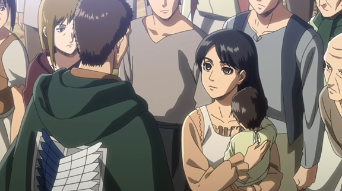
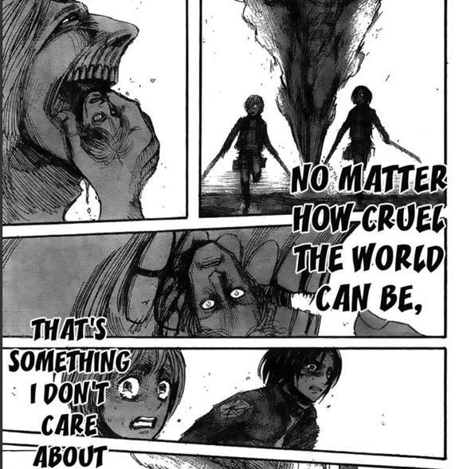
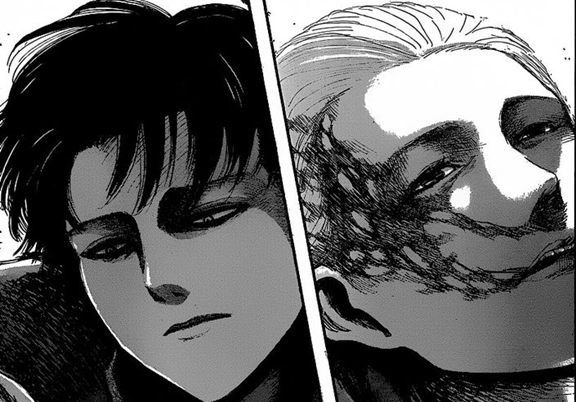
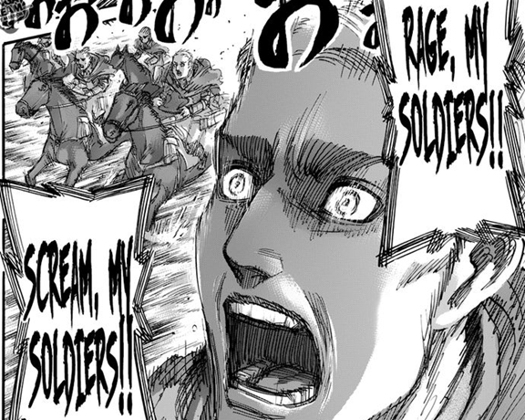
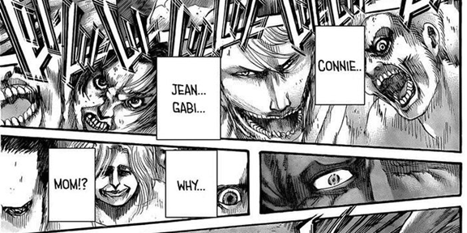
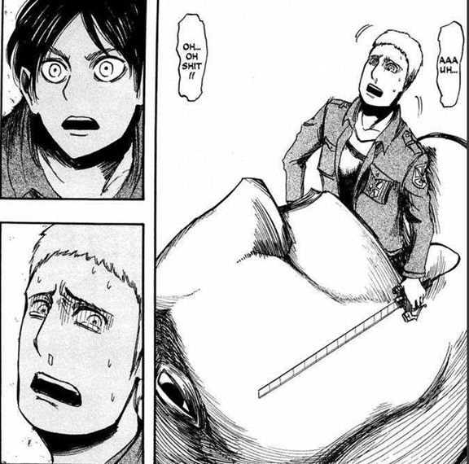
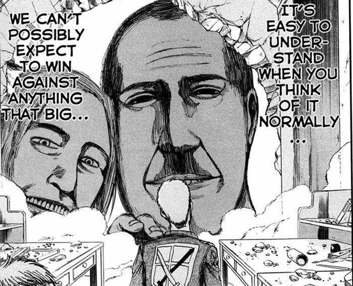
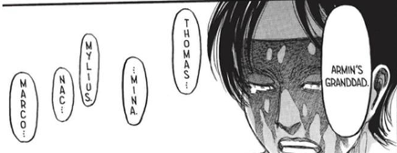
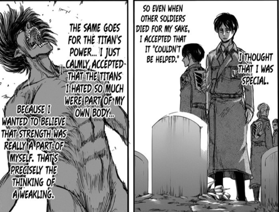
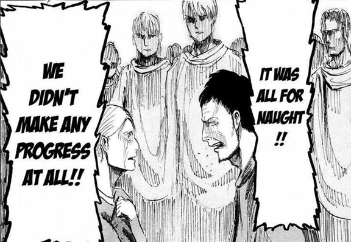

> 如果一個人能死，那正是代表他曾經活過。

> 暴雷警告：直到漫畫第138話

> 我也會在文章裡談到《冰與火之歌》（《權力遊戲》）。不想被暴雷的人可以跳過「(暴雷)」的段落。

這篇文章會出現受到[諫山創《進擊的巨人》：所有的政治一開始都是去追尋自由，但在最後是去學會背負犧牲 — 文學的實驗室 — Medium](https://medium.com/%E6%87%B6%E8%82%A5%E8%B2%93%E8%AC%9B%E5%B9%B9%E8%A9%B1/%E8%AB%AB%E5%B1%B1%E5%89%B5-%E9%80%B2%E6%93%8A%E7%9A%84%E5%B7%A8%E4%BA%BA-%E6%89%80%E6%9C%89%E7%9A%84%E6%94%BF%E6%B2%BB%E5%9C%A8%E4%B8%80%E9%96%8B%E5%A7%8B%E9%83%BD%E6%98%AF%E5%8E%BB%E8%BF%BD%E5%B0%8B%E8%87%AA%E7%94%B1-%E4%BD%86%E5%9C%A8%E6%9C%80%E5%BE%8C%E6%98%AF%E5%8E%BB%E5%AD%B8%E6%9C%83%E8%83%8C%E8%B2%A0%E7%8A%A7%E7%89%B2-ba6a18c0940c)的啟發。誠摯地推荐各位也可以去看看。

「死亡」在《進擊的巨人》中扮演了非常重要的角色。如同大部分的少年漫畫一樣，主角常常要冒著生命危險與他們的敵人戰鬥，但無論面對的敵人有多強，我們通常都不會預期主角群會因為實力不足而有真正死亡的風險。然而，進巨中重要角色死亡的速度快到讓人聯想到《冰與火之歌》(《權力遊戲》)。在《冰與火之歌》中，(**暴雷**→)當讀者開始把某些人當做是重要角色之後，他通常就會在下一章莫名其妙地死亡，然後視角就隨即轉到原本被當作是反派的角色上(←**暴雷**)。進巨沒有這麼誇張就是了，畢竟我們還是能夠指出三個主要角色，也就是艾連、米卡莎和阿爾敏，但其他角色就比較難說了。

### 死亡場景

死亡在進巨中可以說是履見不鮮了，但是見到深愛的角色死去仍然是一種嚴重的打擊。在這一段中我會嘗試就我記憶中所及，稍微談談我認為最重要的幾個死亡橋段，因此已經很熟悉劇情的人是可以直接跳過這段的。

第一個場景是艾連母親的死亡，出現在第2話〈那一天〉(その日)中。這個場景其實是相當讓人印象深刻的，而這也同時暗示了整部作品的黑暗、血腥和憂鬱。不過實際上嚇到我的場景則是在第4話〈初陣〉(初陣)中艾連同袍的死亡，以及艾連被生吞的場景。當然我們之後知道艾連其實沒有真正死掉就是了，不過這一段正是我開始覺得這部作品有趣，並決定要繼續追下去的地方。而這一樣也可以說是重新定義了「冒著生命風險」在少年漫畫中的意義。另一段則是第5話〈絕望中的暗淡光輝〉(絶望の中で鈍く光る)中，那一對被艾連稱之為是笨蛋夫妻的女方嘗試對只剩下半截身軀的男方進行CPR的橋段。

在托洛斯特區保衛戰中，艾連因為暴走而失去控制，導致當時奉命保護他的駐紮兵團精英陷入是否放棄任務的爭執中。當時領導人伊安．迪特里希獨排眾議，要求所有人即使在知道會導致巨量傷亡的前提下，還是要優先保護艾連，而最後他卻也因此犧牲了自己的生命。在第14話〈原始慾望〉(原初的欲求)中有這樣一個描述，所有人從出生開始都是自由的，因此為自由而戰從一開始就不需要任何理由。然而，也有另一個描述提到，即使最終達到目的，所需要付出的代價也可能會因為過高而讓人高興不起來。

下一個場景出現在女巨人的劇情中，這段包含了大量普通士兵以及特別作戰班成員的死亡。與托洛斯特區保衛戰不同的是，捕獲女巨人的計畫不只完全失敗，還死了一群包含佩托拉在內的重要角色，而動畫的改編更是多了一段佩托拉遺體在里維面前被丟棄的畫面，非常地殘忍。

如同阿爾敏在第27話〈艾爾文．史密斯〉(エルヴィン・スミス)中所論述的一樣，有些人在面臨重大決擇時，總能夠比別人更果斷地捨棄必須捨棄的東西，但這不代表捨棄必然會帶來預期的結果，有時候反而會什麼都沒有得到而失去一切，如同在女巨人戰役中一樣。這一段的死亡場景也是我開始意識到，即使是重要配角也可以隨時在作者的筆下輕易死去。

不過，看完這段後反而讓我有點釋懷了，畢竟從這裡開始，我反而可以做好心理準備迎接任何絕望的劇情。比如說，在厄特加爾城的劇情中，我們可以看到調查兵團的城員被野獸巨人玩弄於股掌之間；其後救回艾連的劇情中，則死了另外一大票士兵，同時艾爾文失去了他的右臂，而漢尼斯則諷刺地被同一個當初他不敢面對的巨人吃掉。而最終剩下的人得以回去，也不過就只是因為艾連無意間觸發了始祖巨人的力量而已。

王政篇之後的瑪莉亞城牆奪還戰則是作品中少數最慘烈的戰役之一，艾爾文也在此隕命，只有九名兵團成員最終得以回來。不過也是這段劇情中，艾爾文臨死前的演說讓這部作品對於死亡和希望的意義達到了另一個高度。

進巨在進入瑪雷篇章後不只進入了另一個高度，所有的死亡也開始變得輕描談寫卻又沉重無比。調查兵團一開始對於瑪雷的奇襲導致了一場接近屠殺的結果，並間接導致了莎夏的死亡。島上除了調查兵團外的幾乎所有成員都因為喝了吉克的脊髓液而變成了巨人被殺害。地鳴毀滅了幾乎整個世界，漢吉、弗洛克與其他配角一個一個在對抗艾連的劇情中死亡。目前最新第138話〈長夢〉(長い夢)中，連約翰、柯尼和賈碧都被變成了巨人。亞妮的父親、萊納的母親和法爾可的父母也都在他們正要團圓之際被變成了巨人。我只感覺我的胃又開始痛了起來，我還以為我不會再因為任何劇情而心痛了的。

### 死亡、痛苦、憂鬱和絕望

我認為進巨對於描繪憂鬱與絕望頗有獨到之處，那種在血腥、黑暗又絕望的劇情中萌生的情緒實在讓人難以忘懷。進巨的劇情從頭到尾都不斷地在告訴我們這個世界的殘酷，而其中最為亮眼的地方就是它描述死亡的方式，在這一段中我會透過幾個不同的角度來切入諫山創所描述的死亡場景。

### 突如其來的死亡

在進巨中如果要討論死亡，我第一個會想到的就是突如其來的死亡。任何角色都有可能在下一章中突然領便當，如同前述，這讓人不禁聯想到《冰與火之歌》。

這種類型的死亡有艾連班在第一次面對巨人時的戰役、里維特別作戰班面對女巨人的場景、莎夏的死亡以及約翰、柯尼和賈碧被變成巨人的橋段（雖然目前還不知道他們會不會死就是了）。

這些場景共同的特色，就在於讀者大概沒有不會預期到這個角色居然馬上就要死了，而且這種場景通常都在前面都會有某些讓人感到溫暖或振奮的劇情，兩者的反差正是最讓讀者痛苦的地方。比如說，艾連的初戰是在團隊成員對於未來充滿憧憬討論結束後開始的，隨即幾乎所有成員都被吃掉了；里維的特別作戰班成員在死亡之前，則剛因為艾連決定相信他們，而讓彼此間的感情升溫，艾魯多還趁機提到了佩托拉和歐魯的黑歷史；莎夏則是在柯尼表達了他對約翰和莎夏的情感之後隨即遭到槍殺；約翰與柯尼等人被變成巨人的橋段則是發生在許多人即將團圓之際。

諫山創可以說是相當會虐待自己讀者的作者了吧，他非常擅常先給讀者一點希望，隨後馬上把讀者推落絕望的深淵。這種突如其來的死亡恰好也印證了艾爾文在最後演講中所提到的，無論你過著怎麼樣的人生，死亡對於有人都是公平的，但也正是這種公平性讓死亡變得如此殘酷吧。

### 絕望的死亡

如果突如其來的死亡讓我們知道人們可以輕易死去，則絕望的死亡就代表了人們無法避免死亡的結局。我認為包含這種元素的死亡，有托洛斯特區保衛戰中關於駐紮兵團精英的劇情、米可班在厄特加爾城對陣野獸巨人的橋段、艾爾文率領的自殺式突襲以及佩托拉和漢尼斯的死亡。

這些場景的共同特色就是絕望或無止盡的戰鬥，而且似乎有個人正在背後暗地嘲笑他們的苦苦掙扎的人生。伊安當時曾經與里柯爭論說，人類所能做到最好的選擇，就只剩下用盡全力掙扎而已了。米可班的成員各個都是精稅，但沒有人能夠打一場永無止盡的戰爭。吉爾迦甚至還在臨死前找到一瓶酒瓶，滿心期待的他反而在最後發現酒瓶是空了。這種宛如被開了一場難笑的笑話的場景，在里維從佩托拉父親那裡得知佩托拉感情的場景中被描繪到極致。漢尼斯則是在好不容易找到可以一雪之前無法保護艾連母親的恥辱，卻在最後在艾連與米卡莎的面前被同一隻巨人給吃掉。

這種絕望的感覺在艾爾文領導的自殺式攻擊那邊也描述得非常好。當時弗洛克已經崩潰，跟馬洛爭論說根本沒有需要保護馬匹，畢竟沒有活人有辦法乘坐。正如同他所述，在場所有人幾乎就只會在莫名其妙的狀況下死掉，而在弗洛克內心所能想到的，就只剩下無盡的後退而已了。這也是為什麼他在之後遇到希琪的時候會提到馬洛最後大概只有後悔的這件事情。這也讓我想到了一開始艾連小隊在初戰巨人時幾乎全部戰死的橋段，當時他們後悔了嗎？我想應該是吧。畢竟當你知道原來自由的代價如此高昂時，任何人都應該會躊躕不前的。

諫山創不只很會虐待他的讀者，也同時非常善於虐待他所創造的角色。這部分我在討論萊納的時候有很詳細的解釋([從萊納到蘭尼斯特，從自殺到自由](../../Reiner_From_Suicide_To_Freedom/Mandarin/reiner_from_suicide_to_freedom.md))。進巨中的角色常常要為了生存而打一場看不到盡頭的戰鬥，而且只有稍有失手就會失去生命。這種絕望的感覺可以輕易地讓所有讀者都感受到，而且即使好不容易贏下了某些小勝利，也因為高昂的代價而讓人難以真正高興起來。

### 隨機的死亡

雖然進巨中的角色可以算是很容易死掉了，但我們還是必須承認有那麼一些人的確就是不會死。不過，諫山創也花了很多的力氣來讓這件事情合理化，其中之一就是不斷強調死亡的隨機性。

隨機的死亡場景第一次出現在托洛斯特區保衛戰，其中伊安雖然明顯是比較有價值的士兵，但卻是與他唱反調的里柯活了下來；艾爾文所領導的自殺式突襲中死去的也是艾爾文與馬洛，而非弗洛克；而在最新第138話中，即使是即將邁入終點的劇情中，被變成巨人的人也只是剛好那群沒有巨人之力者，與角色過去的劇情幾乎毫無關聯。

正如同艾爾文在最後一段演講中所述，無論我們過上怎麼樣精彩或有價值的人生，死亡都只是隨機發生的。沒有人知道是到底是明天會來，還是死亡會先到來。那些還活著的人大部分都只是因為幸運的關係而已。以阿爾敏為例，他三次幸運逃離死亡都是在極為罕見的狀況下發生的。他第一次被艾連所救，第二次因為認識亞妮而沒有被女巨人踩死，第三次則是在極為殘酷的狀況下，透過犧牲團長的生命來得救。（至於里維為什麼選擇阿爾敏，可以參考[為什麼里維沒有救艾爾文](../../Why_Levi_Does_Not_Save_Erwin/Mandarin/why_levi_does_not_save_erwin.md)）隨機的死亡是諫山創告訴讀者世界殘酷的一種方式，但即使是那種竭盡全力在生活的人也難以逃脫這種結果，實在是非常讓人痛心就是了。

### 他人的死亡

無論一個人用多麼悲慘的方式結束生命，死亡對於每個人來說都只會發生一次。然而，經歷他人死亡卻可以是很多次，而這種恐懼也是可以無限累積的。如同達茲在第11話〈回應〉(応える)跟馬可所說的一樣，當他的戰友死在面前的死後，他唯一擁有的想法就只是幸好不是他而已。

達茲最終因為不知道什麼時候會輪到自己的恐懼而崩潰，畢竟他能活著也只是因為運氣好而已。雖然他的情緒是可以理解，而且也非常傳神，但是其實這裡的主題並不是這個。我認為對於他人的死亡，進巨中真正描繪地非常出色的地方，是在於體驗他人死亡的同時，同時體驗到一個活生生的個體遠離你而去的事實，而非只是你自己也有機會死亡的可能性。

死亡並非只是一個個體的逝去，而是一個故事的結束。每個人都有自己獨一無二的故事，而這種東西是不可能被取代的。死亡所代表的，就是這個獨特的存在將不再復返的事實。

進巨花了很多的篇幅在描述這件事情。比如說，在動畫第11集中，里柯在實行堵住城牆的計畫之前，曾經向艾連提到了為數不少的名字，並同時強調每一個名字都代表著一個完整的故事，每一個名字背後都是一個有血有肉的人；在第65話〈夢想與詛咒〉(夢と呪い)中，艾連哭著求希絲特莉亞吃掉他，因為他再也無法忍受那些因他而死去的人，當時他也一個一個把所有人的名字都講了出來。其後看到了希絲特莉亞成為女王的艾連也還是懷抱著相同的想法，並在想到逝者時暗自詛咒了自己的無能，在第68話〈城牆之王〉(壁の王)中。

另一個非常好的例子則是非常關心部下的里維。在第32話〈慈悲〉(慈悲)中，艾連注意到里維在特別作戰班全數陣亡之後突然變得很多話，而他也意識到這是因為里維的後悔與孤單所導致的。在第110話〈虛偽之人〉(偽り者)中，里維在聽了吉克的解釋後，強調被毀滅的村子是拉加哥村，而不是「那個村子」。里維所做的事情就是提醒吉克他所毀掉的不只是一個隨便的村子，而是住著有許多擁有不同故事的個體的「拉加哥村」才對。最後則是在第113話〈暴惡〉(暴悪)中，里維即使在砍殺變成巨人的昔日部下時，都還惦記著他們是否還在巨人身體的什麼部分。

諫山創非常會在角色死亡時描繪出他人的情感表現，藉此告訴讀者死去的不只是一個角色而已，而是一個有血有肉的個體，但也是這種描繪方式讓這部作品變得更哀傷與憂鬱。這也是為什麼艾連會在王政篇時自暴自棄吧，畢竟他終於意識到他只是意外獲得巨人之力，而非真的比較特別。那些為他而死的士兵每一個都有其獨特且無可取代之處，而且如果不是因為巨人之力，還有可能比艾連更有價值，只是最終是艾連活了下來而已。

### 沒有意義的死亡

在第1話〈致兩千年後的你〉(二千年後の君へ)中，落魄的調查兵團遇到了一個正在尋找自己兒子的母親，最終卻只能得到一隻好不容易搶回來的手臂。她當時詢問團長自己兒子是否有為人類的未來做出任何貢獻，但團長只能哭著承認這次的調查仍然什麼都沒有得到。

這一段的描繪非常傳神，而且也是緊緊抓住整部作品的主題。沒有人想要死這件事情當然是沒有錯的，但實際上我們也常常是在找尋死亡的意義。如果死亡是有意義的或是能夠換來什麼東西，那死亡本身就顯得沒有那麼恐怖。這也是為什麼許多人常常會為了某些理想而犧牲自己的生命，比如自由等等。實際上，進巨從頭到尾也不斷地在詢問對於自由的價值，以及我們能夠犧牲到什麼樣的地步來換取自由。

進巨沉重且憂鬱的地方不只是死亡而已，更讓人痛心之處其實是沒有意義的死亡。戰友逝去了，而我們什麼都沒有得到。在第18話〈現在應該做什麼？〉(今、何をすべきか)中，就是這種希望能夠換來什麼的想法讓約翰改變了；在女巨人的篇章中，則是死了一大票的士兵以及里維部下之後，卻什麼也沒有換到，而且在動畫中佩托拉的屍體甚至沒能被戴回來。但最讓人難過的是，所有的犧牲卻是什麼都沒有換到。另外一個例子則是弗洛克在與主角群爭論時，強調即使是無名小卒如他，也應該有權利知道自己是為什麼而死吧。

另一方面，即使是有換取到成果的任務也可能因為代價過於高昂而難以讓人承受。這在之前已經討論過了，無論是托洛斯特區保衛戰還是瑪莉亞城牆奪還戰都是如此，而這也是什麼我們似乎很難在這部作品中找到真正的喜悅之情吧。

### 死亡的意義

這個世界上當然會有一些人願意為了崇高的理想而犧牲自己的性命，而這也值得我們致上無限的敬意，但這不代表犧牲必定會換來好的結果。實際上，大概也沒有人能夠在犧牲的當下知道自己能換到什麼東西吧，唯一確定的就只有如果沒有犧牲，就不可能會能得到任何東西而已。因此，我們唯一能做的就只有嘗試並等待結果，但大多數情況下我們甚至沒有辦法知道我們在歷史中會扮演什麼角色就是了。

這個想法第一次出現，是由伊安在托洛斯特區保衛戰中爭論是否放棄艾連時所提到的，不過最讓人難以忘懷的段落則是艾爾文在自殺式突襲前的演說，而這段演說也把這個想法帶到了另外一個高度。在演說之前，弗洛克問了艾爾文如果生命最終都會進入一個終點，那不管做什麼是否都是沒有意義的呢。艾爾文隨後就提出了這段精典的言論，生命的意義並不只是由當事人定義而已，而是由那些追隨你腳步的人所決定的。因此，任何人都應該盡全力來榮耀逝去的戰友，並把自己生命的意義交給後來的人定義。

艾爾文的這段演講可以算是進巨中最精典的幾個片段之一了吧，只不過艾爾文也沒有因此而有機會活下去就是了。（對艾爾文有興趣的可以看看[艾爾文心中的惡魔－《進擊的巨人》中的《烙印勇士》](../../Erwin_The_Real_Demon/Mandarin/erwin_the_real_demon.md)）雖然如此，對於死亡的意義，我們的確可以因為這段演講而有了更深的感觸。人類的知識也是一代一代繼承下來的，就如同一條悠長的河流一樣，但每個人都只佔據其中的一小部分而已。

艾爾文的演講也讓死亡的意義進入了另一種層面的討論。從這個角度來看，一個人的生命已經不再只屬於他自己，而是那些已經逝去的夥伴。如果你想要死，那你就一定有為了他人而非自己而死。這段描述在第97話〈手手相傳〉(手から手へ)中與艾連對法爾可所說的：「但大家都會被某些事物驅使著一腳踩進地獄裡，而大多數的情況下，這些理由都不是出於自己的意志，反倒是在他人或環境所逼之下不得不為之的結果。」換句話來說，我們仍然在找尋死亡的意義，只是從自己變成由他人定義而已。(對艾連這段話有興趣的可以看看[艾連的地獄，屠殺的道德正當性](../../Eren_Hell_And_Genocide/Mandarin/eren_hell_and_genocide.md))

死亡的意義由追隨著來定義這件事情雖然是由艾爾文說的，但我認為詮釋得最好的地方卻是莎夏的死亡（可以參考[莎夏與那顆馬鈴薯](../../Sasha_And_Innocence/Mandarin/sasha_and_innocence.md)）。是誰定義了莎夏死亡的意義呢？顯然就是賈碧了。正是莎夏這個角色最後才讓賈碧得到了不會踏上與萊納相同道路的結果，因此她最後才能意識到真相並擺脫仇恨。（可以參考[從晦暗不明的未來中拯救賈碧 — 從種族的符碼到國族的認同困境](../../Saving_Gabi/Mandarin/saving_gabi.md)）

另一個例子則是馬可的死亡，而定義其意義的則是約翰。在第127話〈終末之夜〉(終末の夜)中，漢吉讓約翰想起了已經奉獻出心臟的戰友，而這段就類似於當時艾爾文對里維所說的話。我們知道正是馬可的死亡讓約翰成為了我們所知道的現在那個約翰，因此定義馬可死亡意義的就是約翰。(可以參考[約翰的怒火，歷史洪流中的無可奈何](../../Jean_And_The_Burden_Of_History/Mandarin/jean_and_the_burden_of_history.md))

另一方面，吉克可以說是提出了另一種切入死亡意義的觀點。他認為因為無法避免的絕望人生，艾爾迪亞人最好一開始就不要出生在這個世界上是最好的。也就是說，只要打從一開始就沒有出生，那當然就不會有悲慘死亡的可能性就是了。這是一個讓人滿意的解答嗎？對於艾連來說顯然不是。我們可以在托洛斯特區保衛戰中看到，阿爾敏曾經問過艾連為什麼他會想要在知道外面只有地獄般世界的前提下，還是決定要出去呢。而艾連的回應是「因為我已經出生在這個世界上了」。

這段就正是艾連的人生哲學。雖然他曾經被擊敗並想要在一死了之中尋找救贖的可能性，但他母親的一席話也讓他想到了存在本身的重要性。也就是第71話〈旁觀者〉(傍観者)中的「僅僅是出生在這個世界上，就已經夠偉大了。」我想大部分的讀者應該都像我一樣，或多或少有被這一段給拯救吧。艾連應該也是如此，這也許也是為什麼他最後決定要寧願毀滅世界也不是接受吉克的計畫吧。

對於所有東西的討論都預設了存在，因此沒有任何東西優先於存在。討論死亡的意義無異於討論生命的意義，畢竟如果一個人能死，那正是代表他曾經活過。
