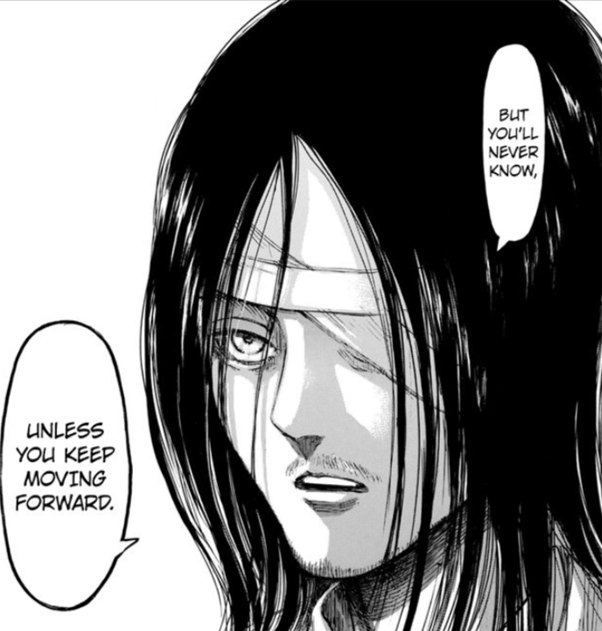
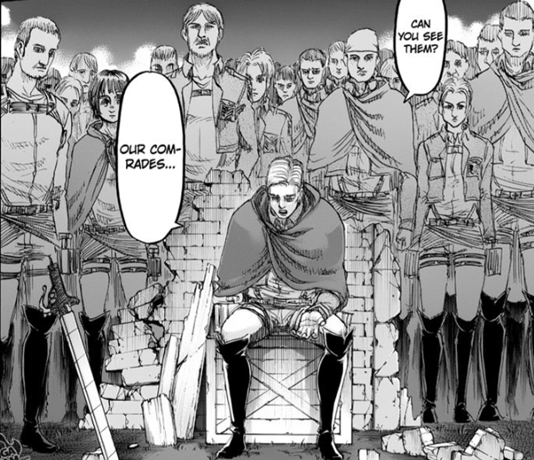
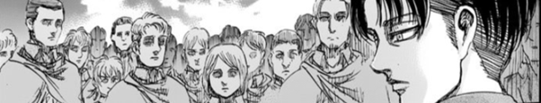
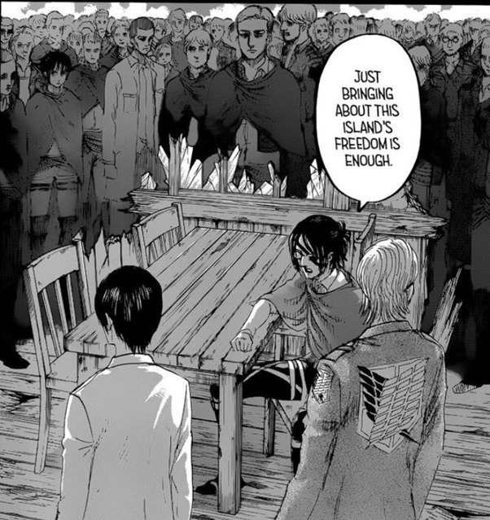
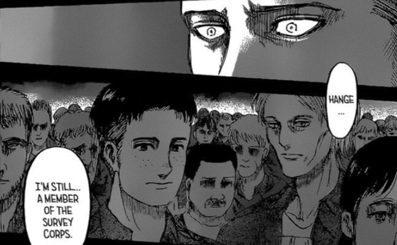
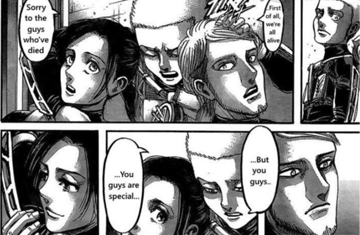

### **暴雷警告：直到漫畫第131話**

#### **我也會在文章裡談到《Code Geass 反叛的魯路修》不想被暴雷的人可以跳過「(暴雷)」的段落。**

> 「英雄會捨棄你來拯救世界，但反派會捨棄世界來拯救你。」

> 「為什麼事情會變成這樣？身心都被侵蝕，被徹底地剝奮了自由，也迷失了自我。如果早知道會這樣，應該沒有人會願意上戰場吧。但大家都會被某些事物驅使著一腳踩進地獄裡，而大多數的情況下，這些理由都不是出於自己的意志，反倒是在他人或環境所逼之下不得不為之的結果。不過，自己將自己推入深淵的人所看見的是不同的地獄，他們看到的是存在於地獄盡頭的某些事物。那很可能是希望，亦或是更悲慘的地獄。無論如何，只有一路前行的人才能得到最後的答案。」

這是一段出自第97話〈手手相傳〉(手から手へ)中，艾連對法爾可所說的話。這段看起來相當哲學的節錄一直都是我相當喜歡的片段之一。在本文中我嘗試簡單分析艾連的意思，我也會談談一些其它的東西。

### 開戰宣言

艾連與法爾可交朋友的主要目的是為了與調查兵團的成員連絡，這我們都相當清楚。不過當時他內心的想法是什麼，又為什麼導致他講出這一番話呢？我認為解答的線索藏在他在發動突襲前與萊納在地下室的對話中。

在第100話〈開戰宣言〉(宣戦布告)中，當艾連向萊納說了許多他在潛入瑪雷之後看到的事情。壞蛋當然到處都是，但像法爾可這樣的好人也不在少數。雖然艾連曾經將他們都視之為敵人，但實際上他們也是與自己一樣的平凡人而已。

這個體驗就如同萊納當初潛入帕拉迪島上一樣，他一開始也認定島民都是一群惡魔，但最後卻也發現他們只是一群如同自己的普通人罷了。這也導致了他最後受不了罪惡感而神分裂。

另一方面，艾連顯然是在思考周全之後還是決定痛下殺手。當然，其實我們在第131話〈地鳴〉(地鳴らし)中可以看到他一邊哭著一邊向那個無辜卻即將死於地鳴之下的小孩道歉，而且他還將自己視為比萊納更糟糕的存在。

### 地獄的盡頭

艾連最終還是決定發動地鳴了。如同萊納所做的，這無疑會導致一場無可挽回的大屠殺。如果這場屠殺意味著地獄，則萊納一頭栽入的地獄就是屠殺帕拉迪島的島民，而艾連的地獄則是地鳴所帶來的結果。

然而，萊納和艾連的地獄並不相同。萊納屠殺島民的理由是他想要拯救世界，他想要證明自己並成為能夠讓母親驕傲的兒子。也就是說，他其實什麼都不知道。這就是艾連所說的：「是在他人或環境所逼之下不得不為之的結果。」

艾連就完全不是那麼一回事了，他很清楚自己所做所為的意義，而這也是他與萊納在根本上的不同。如同他所述：「自己將自己推入深淵的人所看見的是不同的地獄，他們看到的是存在於地獄盡頭的某些事物。那很可能是希望，亦或是更悲慘的地獄。無論如何，只有一路前行的人才能得到最後的答案。」

### 承擔責任的象徵意義

> 自由所伴隨的並非想做什麼就做什麼的能力，而是自主承擔選擇帶來的後果的能力。這就是為什麼將自己推入深淵的人所看見的是不同的地獄。

大家都會被某些事物驅使著一腳踩進地獄裡，但自己將自己推入深淵的人所看見的是不同的地獄。雖然艾連在這裡告訴法爾可的是他即將要做的事情，但在本作中我們也可以看到類似的場景。最讓我印象深刻的就是被過去戰友給驅使的人，比如說在第80話〈無名的士兵〉(名も無き兵士)中的艾爾文與里維，以及第127話〈終末之夜〉(終末の夜)中的漢吉、約翰和米卡莎。

這種驅使他人的負擔在多數時候都太過沉重，以及於背負者常常會只想要直接放手一走了之。第98話〈太好了〉(よかったな)中威利．戴巴就有對這件事情非常清楚的詮釋。他會主動出來承擔家族責任的理由，其實與他的意志沒有絕對的關係，只是剛好輪到他而已。類似這樣的巧合，我非常推荐看看《Code Geass 反叛的魯路修》一直到**(暴雷→)**第22集〈血染的尤菲〉**(←暴雷)**。無論如何，他們最終都主動栽入屬於自己的地獄，而唯有他們可以看清地獄盡頭的景象。

### 為艾連辯護

> 人與人之間的衝突在只剩下一個人以下的情況下就不會再發生了。 — 艾爾文．史密斯，第63話〈鎖〉(鎖)

自由瑪雷篇開始之後，關於艾連屠殺行為的道德問題一直都是論壇上非常主流的話題。以下我嘗試提供一些能夠為艾連辯護的想法，但謹記一件事，這部作品從來就沒有什麼簡單的答案，因此也不要在沒有思考過的情況下隨便接受我的看法。

讓我們從「還有其它選擇嗎？」開始吧。這也是艾連在第107話〈來客〉(来客)中質問漢吉的。其後就我所見，許多人看起來是相當支持這個看法並因此接受艾連的決定。實際上，約翰也或多或少是同意這件事情的，如同在第127話〈終末之夜〉(終末の夜)中他與漢吉的爭辯中所述。就這件事情上我也是同意的，畢竟在第123話〈島上的惡魔〉(島の悪魔)中，在米卡莎的記憶中我們可以看到艾連大概也是用盡了所有可能的手段了吧。

但是這個理由並不夠充份，或是說這其實隱藏了一個前提。一般我們在思考這種議題的時候會先傾向於將所有生命視為是平等的。比如說，拿五條生命換取一條生命就必須要有很好的理由才能在道德上被證成。如果我們想為艾連辯護的話，那我們就至少要反對生命平等的前提，或是說支持某些生命比其它生命更有價值的前提，但這個前提需要進一步的說明。

第一個生命不平等的理由，可以是人命比其它生命還要更重要。我們不太會在意捏死螞蟻的行動，而如果拿五條螞蟻的生命來交換一條人命，聽起來也不是什麼不太能接受的事情。然而為什麼我們會比較重視人命的價值呢？一個明確的理由就是因為我們是人類，身為人類本身就已經有足夠充份的理由來說明人命價值高於其它生命。而即使是對於其它生命，我們也通常會將親近人類的生命視為比較有價值者，比如貓狗等寵物。可以這麼說吧，我們對越親近人的生命就負有越高的道德義務，而這也相當符合直覺，因為實際上大部分的人應該就正是這樣想的。當然，何謂「親近」似乎有討論的空間，但我認為這是在不同脈落下可以有不同答案的，比如老一輩的台灣人有禁食牛肉的習慣，這是因為過去農業社會常視水牛為重要的朋友，這個狀況下我們對於牛就會負有更高的道德義務，畢竟誰會想要把朋友端到桌上吃掉呢？

同樣的道理，即使是人命也有親疏遠近之分，因此我們對於家人、愛人和朋友都會有比較高的道德義務。當然這不代表我們對於陌生人就完全沒有，只是兩相比較之下的結果而已。這應該也相當符合直覺，而實際上艾連也提過類似的想法，在第108話〈大道理〉(正論)中，艾連曾提到不希望他所珍視的夥伴成為短命的巨人繼承者。此外在第105話〈殺人子彈〉(凶弾)中，柯尼也曾說過雖然這對其他人並不公平，但他還是很慶幸至少約翰與莎夏活了下來。

如果你一直到這裡都還是能夠接受我的想法，那應該也不難接受我接下來要說的。艾連是一個艾爾迪亞人，而身為一個艾爾迪亞人本身就已經足夠將艾爾迪亞人的生命價值視為是比其它種族都要高了。這個預設是為艾連辯護時的一個重要，但常常為人忽略的一個隱藏前提。我們可以用一個比較形式的方式來整理我的想法。

> (P1) 身為一個艾爾迪亞人就足以讓一個人有充份的理由來視艾爾迪亞人的性命有比其它種族還要更高的價值。
> (P2) 艾連是一個艾爾迪亞人。
> (P3) 發動地鳴是唯一可以拯救艾爾迪亞人的方法。
> (C) 艾連發動地鳴並沒有錯。

### 誕生在這個世界上的重要性

在[萊納、自殺、自由](../../Reiner_From_Suicide_To_Freedom/Mandarin/reiner_from_suicide_to_freedom.md)中，我討論過出生在這個世界上大概是唯一一件完全不是出自於自由意志的事情了。既然如此，一個人的種族、國族、文化或甚至能夠遇到的人也大多不是由當事人所決定的。但也正是因為如此，這種無從選擇的東西有時反而會讓人視為理所當然，並不顧一切地為這份信仰獻上生命。

我曾在[《進擊的巨人》中的人文情懷（中）-史學篇](../../Humanity_Part2_History/Mandarin/humanity_part2_history.md)討論過統治會嘗試控制這些東西來符合他們自己的利益，因此我們所瞭解的文化歷史有可能是被捏造出來的。但這不代表我們所認知道的東西都是一場幻覺，也不代表我們不能以此為由展開行動。最重要的是，我們誕生在這個世界上的事實是千真萬確的。

艾連也是如此。在第115話〈支持〉(支え)和第130話〈人類的黎明〉(人類の夜明け)中我們看到他只是假裝支持吉克的安樂死計畫而已。然而吉克的計畫到底出了什麼問題呢？我認為艾連最沒有辦法接受的地方，就是這違反了「誕生於這個世界」的想法吧。我們的所有一切都是從存在開始的，而違反這件事情就等於是違反了所有的事物。

從另一個角度來看，艾連的敵人也可以說是一點錯誤都沒有。為了自己的信仰來戰鬥從來就不會需要任何理由。第127話〈終末之夜〉(終末の夜)中的爭論可以說是最佳的詮釋，因為本來就不存在所謂正確錯誤，或是說贏的那一方就是正確的，如此而已。

話雖如此，我其實並不是文化相對論（cultural relativism）的支持者，至少我認為存在的價值在道德上比文化差異性更為重要。這當然只是提外話而已，不過在關於何謂對錯的討論上，里維也曾經提到過兩次相關而且有點費解的評論。在第25話〈緊咬〉(噛みつく)中，里維就曾對被女巨人追趕的艾連說過，他雖然不知道對錯，但艾連要做屬於自己的決定；在第59話〈邪道的靈魂〉(外道の魂)中，約翰正因為沒能開槍殺人而後悔，但里維卻告訴他這只是一連串的反事實條件因果關係而已，並不存在所謂的對或錯。這實在非常有趣，也讓我想到了所謂的事實價值問題（Fact-value problem）的討論。這個世界上只有一些事實，而價值的存在其實就只是人們對於特定事實的偏好與否而已。

我們還是把相關的問題留給哲學家煩惱就好了吧。關於艾連的屠殺行動，似乎仍然有一個未解之謎。艾連的這個行為是自由的嗎？如果艾連的這個行動本質上是出自於誕出於這個世界的結果，那既然誕生在這個世界上是完全與自由意志無關的結果，艾連的行動還能夠被稱之為是自由的嗎？

")