### *暴雷警告：直到漫畫第84話、動畫第55話，以及《烙印勇士》第93話。*

> 「做好心理準備吧……當這個男人的夢想崩毀之時，死亡將會造訪你，那是絕對無法逃避的死亡！」 - 不死的索特

艾爾文．史密斯是調查兵團第13任團長，在瑪利亞之牆收復行動之中陣亡。雖然不是主要角色之一，但我認為這個角色的刻畫非常值得專文討論。我也會同時比較在《烙印勇士》中出現的主要角色古力菲斯（グリフィス）。我認為艾爾文這個角色的設計，也許很大程度地參考了古力菲斯。如果不想被暴雷的話，最好也先看過這部作品。

### 角色

艾爾文是一位聰明且受人信賴的團長，在漫畫初期就已經出現過了，而且還有一話直接以他的名字為標題，也就是第27話〈艾爾文．史密斯〉(エルヴィン・スミス)，其中也提到了如果必要，他會毫不留情地犧牲部下以達成目的。

不過，對於這個角色比較詳細的描述則是在王政篇才開始。他曾經詢問過父親，關於人類如何知道牆外的人類已經全部滅亡的事情。父親從一個歷史學者的身份回應說，其實根本不可能有人能證明這件事情，而且官方歷史課本中還出現過許多自相矛盾的地方。此外，完全沒有任何來自第一代進牆之人的資訊更是相當離奇，唯一的解釋就是人民的記憶遭到竄改。

艾爾文把這個想法分享給朋友的同時，恰巧讓憲兵給聽到了，最後導致父親的去世。從此以後，艾爾文不只陷入自責的情緒之中，也下定決心要證明父親的想法。最後我們都知道他父親是對的，牆外仍有人類存活，而王政府竄改了人民的記憶。

### 心中的夢想與惡魔

對於政府如何修改歷史以符合統治利益有興趣的人，可以參考[《進擊的巨人》中的人文情懷（中）-史學篇](../../Humanity_Part2_History/Mandarin/humanity_part2_history.md)。在這裡我更想要談談艾爾文的夢想，以及足以讓他成魔的道路。

第27話〈艾爾文．史密斯〉(エルヴィン・スミス)是我們第一次看到艾爾文有可能成為惡魔的描述，也就是阿爾敏在和約翰解釋艾爾文的行動時，提到那些能夠進步或克服困難的人，都是那些能夠在關鍵時刻果斷捨棄人性的人。

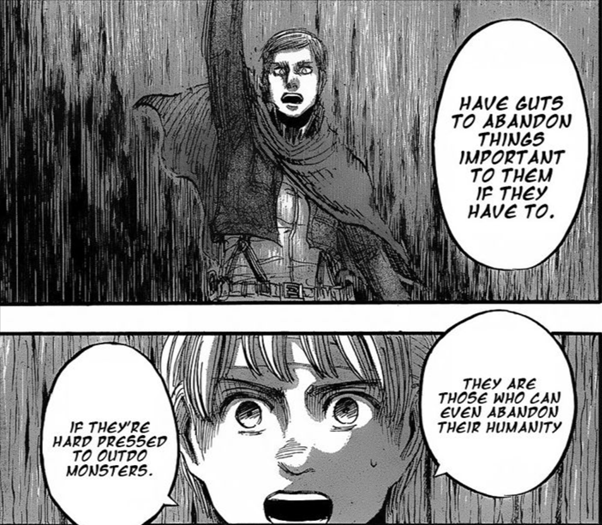

不過，能夠在必要時捨棄人性並不是我所想描述的成魔之道。即使行為者本身可能會因為捨棄重要的部下、同伴、朋友，甚至愛人而有罪惡感，我們通常不會因此而譴責他們，畢竟他們可能完全沒有選擇的餘地。

相對而言，我們會譴責的大概是那種只關心自己，或是為了自己的利益而犧牲他人者。以艾爾文的例子來說，這恰好就是他的夢想可能會帶他走向的道路。

我們可以在許多場景中看到這條道路的可能性。比如在第62話〈罪〉(罪)中，總統薩克雷就曾經在與艾爾文的對談中提到，他根本不關心人類的未來。才剛發動革命成功的艾爾文對此驚訝不已，但薩克雷在說明其想法之後，提到艾爾文其實與他沒有什麼差別。艾爾文如果真的在意人類的未來的話，那就會果斷捨棄部下並服從政府指示了。意識到薩克雷看出這一點的艾爾文，遂向其坦承了他一直以來的夢想。

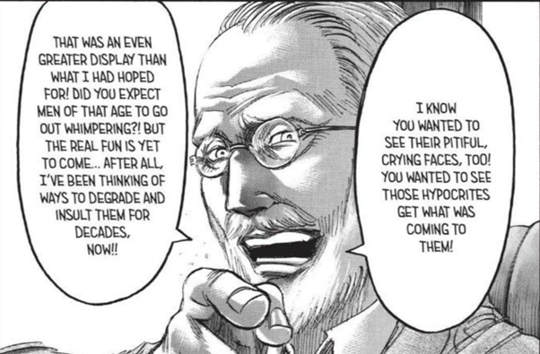

我一開始並不是很瞭解，為什麼這一段對話會出現在這裡。直到重讀了很多遍之後，才意識到任何經驗老到的人都能夠看出艾爾文心中最重要的事情莫過於他的夢想，而不是什麼人類的未來。另一個深諳此理的人便是皮克西斯。在第63話〈鎖〉(鎖)中，皮克西斯在與艾爾文對話的時候責怪了薩克雷和艾爾文的自私，並提到他早已準備好在必要時對抗薩克雷。兩人的對話就在艾爾文提到，如果世界上只有一個人就不會有任何爭鬥，而皮克西斯稱其為歪理之後結束。

從這個角度來看，皮克西斯也許反而是唯一一位真正關心人類未來的人吧。重新再看一遍第27話〈艾爾文．史密斯〉(エルヴィン・スミス)，我們會發現艾魯多．琴向艾連解釋為什麼艾爾文深受信賴，並領導代表人類希望的調查兵團。這大概是這個角色最諷刺之處了吧。僅僅在必要之時犧牲小我來完成大我並不是我想談的主題，艾爾文的自私，以及為了自己的夢想而寧願犧牲人類未來的想法，才是我接下來想說明的主題。

### 古力菲斯與成魔之道

瑪利亞之牆收復行動是艾爾文這個角色最重要的轉捩點。他在這場戰役中陣亡，而他距離實現其夢想僅有一步之遙。我曾經在[為什麼里維沒有救艾爾文](../../Why_Levi_Does_Not_Save_Erwin/Mandarin/why_levi_does_not_save_erwin.md)討論過里維沒有選擇艾爾文的原因，有興趣的人可以看看。在第80話〈無名的士兵〉(名も無き兵士)中，里維曾詢問艾爾文為什麼沒有快點告訴他們擊敗野獸巨人的方法，反而擺出一張萬事休矣的表情，而艾爾文的回答讓里維有點摸不著頭腦。他的回應是，他真的很想進地下室。

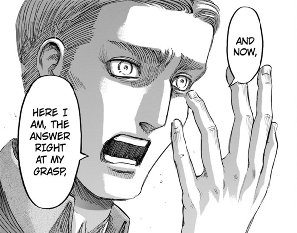

艾爾文解釋了他對於直接進入地下室的渴望，就算這件事情會直接導致人類戰敗也在所不惜。隨後我們看到了這部作品中讓人難以忘懷的其中一幕，也就是艾爾文和里維被過去戰死的戰友給包圍的場景。

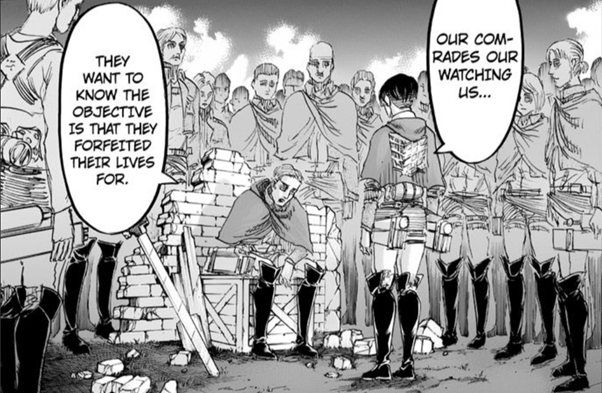

其實類似的場景也出現在第76話〈雷槍〉(雷槍)之中，當時艾爾文站在一群過去戰死的部下的屍體上，思考著他這輩子所做過的事情，並反省自己從某段時期開始就不再與戰友分享自己的夢想了，因為他逐漸發現，當其他人正在為了人類未來獻上自己的心臟時，只有他一個人正在追逐自己的夢想。

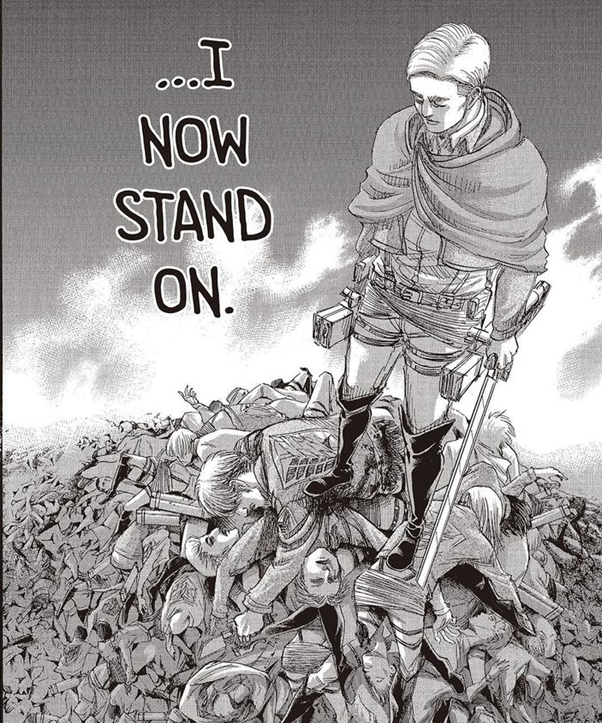

這兩個畫面都讓我聯想到了《烙印勇士》中的古力菲斯。在這部作品第93話〈武裝〉(武装)中，也有一幕是古力菲斯站在一群屍體上。當時的古力菲斯與艾爾文類似，率領著一個稱作鷹之團的傭兵團（這個「鷹」某種程度上可能也影響了諫山創筆下法爾可，也就是 Falco 的部分），並藉由打贏無數戰役而逐漸接近擁有自己國家的夢想。但他最終失敗而且被關進地牢，受虐多年並導致其半身不遂。雖然被同伴救出，但他已經不可能完成自己的夢想了，因此最後選擇利用一個被稱之為貝黑萊特的東西引發第五次「蝕」，犧牲昔日戰友的性命來換取重生的機會。

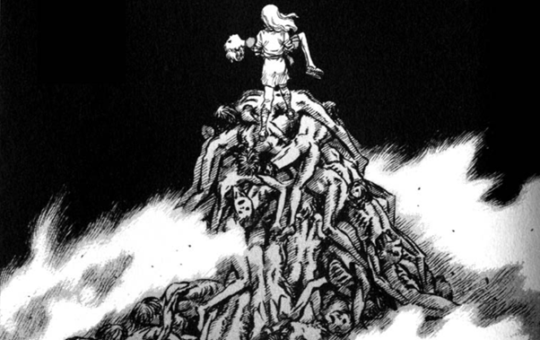

古力菲斯在很多方面都與艾爾文類似，最重要的一點大概是他們同樣都對犧牲部下有罪惡感。在《烙印勇士》第17話〈喀絲卡〉(キャスカ)中，古力菲斯曾經為了金錢而與一個老男人睡過一晚，之後向其部下喀絲卡解釋說，有錢就不用派部下上戰場送死。在《烙印勇士》第93話〈武裝〉(武装)中，縱使已經決定犧牲戰友來發動「蝕」，古力菲斯仍然強迫自己不要道歉，也不要有任何後悔與罪惡感，來迴避腳下屍體的事實。

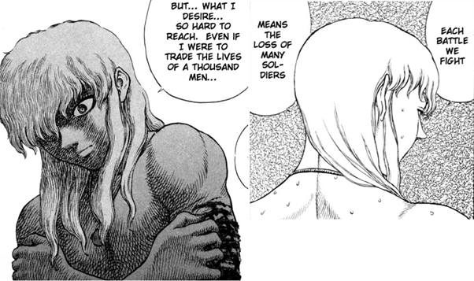

兩人另一個相似之處，就是在於他們同樣擁有一位出色而且深受信賴的部下。艾爾文有里維，而古力菲斯有凱茲（ガッツ）。在第71話〈我曾經做過的夢〉(いつか見た夢)中，在艾爾文詢問是否能夠託付巨人藥劑給里維時，里維曾經反問過這為什麼不是一個命令就可以了。雖然艾爾文當時有給出看似合理的答案，但實際上並沒有真正回答到里維的問題。里維隨後詢問艾爾文在完成夢想之後有什麼打算，而艾爾文回應說他也不清楚。我認為，實際上第一個問題的答案就藏在里維的第二個問題裡面，而這與艾爾文的罪惡感脫不了關係。

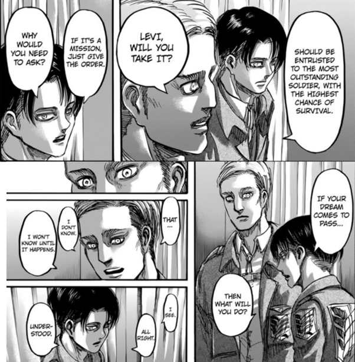

實際上，在《烙印勇士》中也有一個相當類似的一幕。在《烙印勇士》第10話〈暗殺者〉(暗殺者)中，古力菲斯為了達成建立王國的夢想，因此被捲入了宮廷鬥爭之中。為此，他必須請一位擁有實力且深受他信賴的部下來完成一個暗殺的任務。然而這種任務與一般戰場上堂堂正正地擊敗對方不同，完全是一種沒有榮譽的行動，也是那種會被瞧不起，甚至如果失敗的話會被古力菲斯撇清關係者。古力菲斯當時詢問凱茲是否能夠完成這項任務，而凱茲反問為何不直接命令他就可以了。

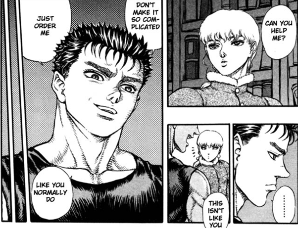

為什麼古力菲斯當時不是命令，而是詢問凱茲呢？我認為這是出自於某種罪惡感。這種骯髒工作與命令部下在戰場上殺敵不同，執行工作的人本身即使在成功之後，也都有可能會受到罪惡感的反噬，但這對於古力菲斯而言是必要的行動，而且他又不能信任任何其他人。這份罪惡感導致他採用詢問而非命令的方式。

回到艾爾文身上，如果艾爾文的確是因為罪惡感而詢問里維，那他是因為什麼而有罪惡感呢？答案當然與他的夢想有關。他的夢想正是他背負沉重罪惡感的源頭，但也是讓他得以繼續走下去的力量來源。而這一切都將會在瑪利亞之牆收復行動之後宣告結束。

在[《進擊的巨人》中的人文情懷（上）-哲學篇](../../Humanity_Part1_Philosophy/Mandarin/humanity_part1_philosophy.md)中，我曾經處理過肯尼提到的，所有人都要背負著某個夢想才能走下去，因此所有人都是夢想的奴隸這個想法。艾爾文在放棄夢想，也就是終於得以不用繼續背負罪惡感之後迎接其死亡。艾爾文完成夢想之後想要做什麼呢？我想里維應該比任何人都還要清楚這個答案吧。這正是為什麼他感受到艾爾文的罪惡感之後，隨即詢問了這個問題，這也與他最後選擇了阿爾敏而非艾爾文有深遠的關係。

雖然艾爾文與古力菲斯有眾多類似之處，但最重要的分歧點就是在於他們最後的決定。如同前述，古力菲斯最終決定犧牲戰友來完成夢想。艾爾文則在第80話〈無名的士兵〉(名も無き兵士)中，選擇了犧牲自己來拯救部下的性命以及人類的未來。

不用我多說，我們都知道在這場戰役中發生了什麼事情，特別是艾爾文自殺式攻擊前的演講。雖然結果是如此，但在第76話〈雷槍〉(雷槍)中，艾爾文其實還是有認真思考過進入地下室的可能性，即使調查兵團全軍覆沒也一樣。這大概就是為什麼在第72話〈收復作戰的夜晚〉(奪還作戦の夜)中，他決定上前線而不是聽從里維的建議待在安全的後方。當時艾爾文大概就已經在思考戰敗後還是能夠進入地下室的可能性了。里維大概也很清楚這件事情，因此他才會詢問艾爾文的行動是否比人類的未來還要更重要，而艾爾文則直接給了正面的答案。在此之前，里維打斷艾爾文冠冕堂皇理由的行為也變得合情合理了。

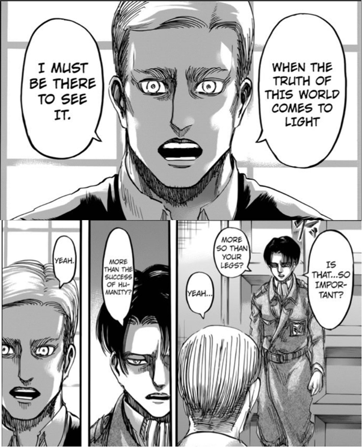

雖然艾爾文終其一生都在追求自己的夢想，甚至不顧人類可能因此滅亡的風險，但他最後仍然放棄了夢想並犧牲自己。當然我們知道他曾有機會回來，在第84話〈白夜〉(白夜)中，弗洛克背著重傷的艾爾文到里維旁尋求協助，當時他也稱艾爾文為惡魔，而他的唯一任務就是要把這個惡魔帶回來。這是艾爾文最後一次被稱之為惡魔，而他最終也並沒有回來。

艾爾文最終有成為惡魔嗎？答案顯然是否定的。

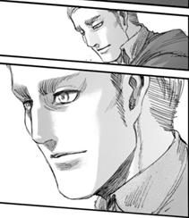
