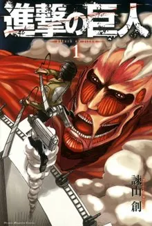

> Only a handful of works deserve to be called truly great.

*Spoiler alert through Chapter 132*

## Introduction

Attack on Titan (進撃の巨人) is one of the most successful Japanese manga series, and it is also my personal favorite. As the work approaches its conclusion, I want to try introducing it to more people. Every work has a certain natural audience, and Attack on Titan is no exception. I still think everyone should read it, but I also suspect that some readers will be drawn to it more strongly than others. This essay is split into three parts, each dealing with one outstanding aspect of the series: philosophy, history, and literature. Anyone interested in any of those fields should, I think, find something to love here.

## Philosophy

> The way out of slavery is to learn how to love.

I want to begin with philosophy. The story of Attack on Titan is always circling around a single issue: how a person can escape being a slave and become truly free.

### (I) Going Outside the Walls

In the early part of the story, Eren believes freedom means being able to go outside the walls without living under the threat of titans. Those who are satisfied with life inside the walls, or who have simply grown used to it and no longer think it necessary to challenge the land beyond, are treated by Eren as little better than livestock.

In this context, freedom can be understood as the freedom to go wherever one wants. We can find a similar idea in the dialogue between Levi and his friend Isabel in No Regrets (悔いなき選択), and also in young Shadis's way of thinking in Bystander (傍観者), Chapter 71. In No Regrets, Isabel tells Levi and Farlan that after spending time with the Survey Corps, she has started to understand that their wish to go beyond the walls is similar to the wish she and her friends once had to leave the Underground.

> "I think I kind of get why they want to go outside. Leaving the walls feels like... the dream we used to have of getting out of the Underground someday. A lot of our friends died for that dream, and every time I looked at them I thought: 'I have to get the hell out of this place.'" (Isabel, No Regrets, Chapter 6, "Creature")

Shadis thinks in much the same way as Eren. In fact, their lives share quite a few similarities. Both want to leave the walls for similar reasons, and after being battered again and again by failure, both eventually realize that they are merely ordinary people.

> "The Survey Corps are proof that humanity still has imagination and a free spirit. They are humanity's pride." (Grisha Yeager, Chapter 71, "Bystander")

### (II) Living as a Human Being

The second understanding of freedom appears after the Survey Corps finally reaches the ocean and the veil over the world is lifted. The Eldians are the public enemy of the entire world, and freedom becomes much harder to define. Still, both Eren and Zeke agree that if the world sees the Eldians as devils, there is no way for them to be free while they remain hated and oppressed.

That feeling can be manipulated through historical interpretation, which I will discuss later, but within the story itself the problem seems almost impossible to solve. That is why, in Chapter 115, "Support" (支え), Zeke decides to adopt the euthanasia plan originally proposed by a previous Beast Titan, while in Chapter 130, "Dawn of Humanity" (人類の夜明け), Eren decides instead to destroy the world.

> "If Eldians had never been born, there would be no death or suffering. They would not die. To not be born into this world at all, there is no better salvation than that." (Eren Yeager, Chapter 115, "Support")

In this context, freedom no longer means simply being able to go wherever you want in a physical sense. It means being able, inwardly, to recognize yourself as a "human being." In the real world, Black people were once treated as commodities to be bought and sold. Women were treated as subordinate to men, or even as little more than tools for sex and childbirth. We Taiwanese, after massacre and colonization, were forced to see ourselves as "proper Chinese."

Under such conditions, people gradually forget who they are and where they come from. In the end they lose their identity and subjectivity, becoming tools that exist for others. Why is Jean Valjean called 24601 in prison? Because prisoners are not regarded as human beings, so they do not need names. For a similar reason, Ymir tells Historia in Chapter 40, "Ymir" (ユミル), to live under her real name.

> "You promised me that when I revealed my secret, you would live under your own name."
> "Krista, I have no right to tell you how to live. This is only my wish... Hold your head high and live."
> "Krista, I used to be like that too. I thought maybe it would have been better if I had never been born. My very existence was hated by the world, and I died for their happiness. But deep down I wished that if I had another chance at life, I would live only for myself." (Ymir, Chapter 40, "Ymir")

From the perspective of the outside world, the Eldians are not even human. They are devils who must repay the sins of their ancestors, and so of course they have no freedom. In Chapter 86, "That Day" (あの日), by reconstructing the history of their own people, the Eldians finally begin to live as human beings. That is also why Eren asks whether, after killing the enemies on the other side of the sea, they will finally become truly free.

> "On the other side of the walls was the sea, and on the other side of the sea was freedom. I always believed that.

> But I was wrong. On the other side of the sea were enemies... So if we kill every one of our enemies over there, will we finally be free?" (Eren Yeager, Chapter 90, "The Other Side of the Wall")

By the way, the image of "livestock" appears again here in another sense. In Chapter 107, "Visitor" (来客), Eren rejects the proposal that Historia should inherit the Beast Titan, because forcing a handful of people to become disgusting giants and breed for the survival of the race is, in his view, no different from livestock reproduction.

### (III) Everyone Is a Slave

I have already mentioned two ways this work understands freedom, but it does not stop there. Think of Kenny Ackerman's view in Chapter 69, "Friends" (友人): no one can escape the fate of becoming a slave. Everyone has to be drunk on something in order to keep moving forward, and that makes everyone a slave to something. Those who have no ideals or mission soon die, and perhaps that is where human value lies.

From that perspective, the truly free people might actually be those who have given up their dreams. Is there such a character in Attack on Titan? Other than the dying Kenny, the first person I think of is Erwin Smith. In Chapter 80, "Nameless Soldiers" (名も無き兵士), Levi asks Erwin to give up his dream and lead a suicidal charge with his life. Erwin responds with a smile, and then the scene cuts away. That is Erwin's moment of freedom, because he is no longer a slave to his dream. I think this is also why Levi chooses not to inject Erwin in Chapter 84, "Midnight Sun" (白夜): he does not want to drag a man who has already become free back into slavery.

> "Can you forgive him? He was forced to become a devil, and it is exactly what we wanted him to do. Now that he is finally leaving this hell, we are trying to call him back again." (Levi Ackerman, Chapter 84, "Midnight Sun")

### (IV) Love

According to Chapter 112, "Ignorance" (暴悪), Eren describes Mikasa as a byproduct of titan experiments who will forever obey her host. For Eren, something like that could not possibly be freedom. Yet in Chapter 130, "Dawn of Humanity" (人類の夜明け), we learn that Eren was lying, and that Zeke actually believes Mikasa's actions come not from some Ackerman survival instinct, but simply because she loves him that much.

> "A host? A protective instinct? I don't think that's it. So... you want to know what that Ackerman girl's feelings for you really are? If you ask me... Eren, those feelings have nothing to do with instinct or any obligation. What drives her to cut down titans for you is simply that she loves you." (Zeke Yeager, Chapter 130, "Dawn of Humanity")

Slaves have no will of their own. They only know how to obey. Does Mikasa only obey Eren? Zeke thinks the answer is no: she loves him. If love is something that rises from the deepest part of the self, then Mikasa should be free. Only human beings understand what love is, or perhaps only the truly free do. It was here that I realized how important "love" is to this work. In Chapter 89, "Meeting" (会議), Kruger, the Owl, tells Grisha that once he enters the walls he must try to love someone, or else history will only repeat its tragedies. In Chapter 130, "Dawn of Humanity" (人類の夜明け), Eren decides to save Historia, Mikasa, Armin, and all the other Eldians by destroying the world. That comes from his love for his comrades, and it is also why, in Chapter 108, "Sound Argument" (正論), he does not want any of his fellow 104th trainees to inherit his titan.

On the other hand, a person can lose their way because they are unable to love themselves. They stop knowing why they should continue living in this world. In Chapter 71, "Bystander" (傍観者), Eren and Shadis do not know what is special about them. They try to prove their worth by doing something great and fail, and so they cannot love themselves. At that point, the author uses Carla's words to remind us that we do not need to be great, because simply being born into this world is already greatness enough.

> "Do you really have to be special? Is it not enough if others don't recognize you? I don't think so. At the very least, this child does not have to be great. He does not need to be better than everyone else. Just look at him. Isn't he adorable? That means he is already great enough. Because he was born into this world." (Carla Yeager, Chapter 71, "Bystander")

This is salvation for me too.

Finally, there is another question concerning free will. If the inheritors of the Attack Titan can see the future, does that mean the future has already been decided? And if the future is already fixed, then for the people living in the present, does that mean they have no ability to change anything at all? In other words, would every choice they make already have been determined in advance, leaving no freedom in the first place?
