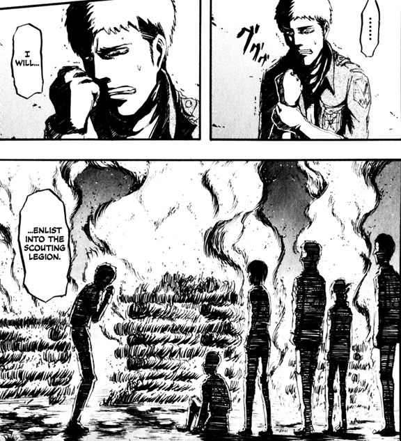
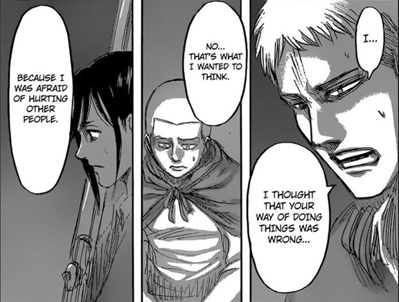
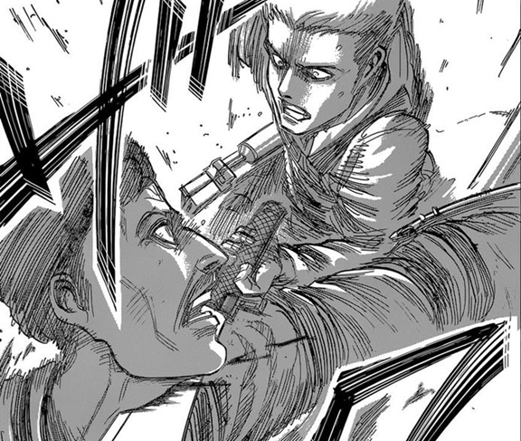
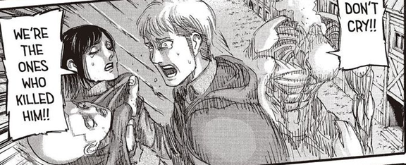
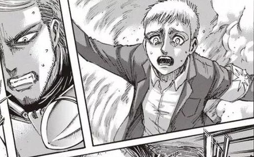
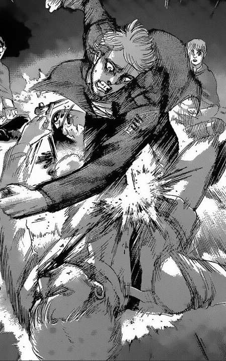
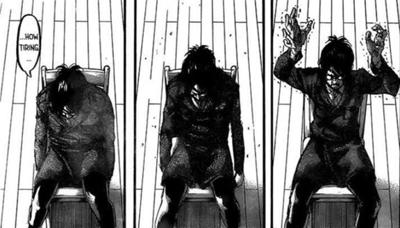
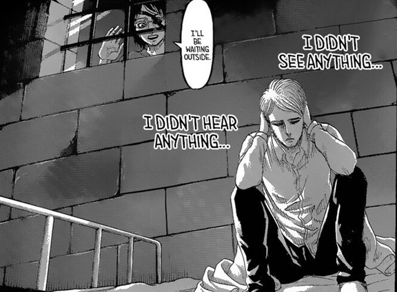
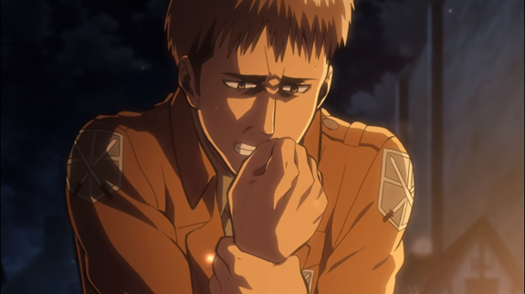

### Spoiler Alert until Chapter 137.

#### I will also talk about chapter 2 of Hunter × Hunter, Breaking Bad, and The Crown. You can avoid it by skipping the “(Spoiler)” part.

> You can never understand a person unless you know what makes zim angry.

There is a great amount of characters in Attack on Titan, all of which are special in a specific way. Among the main characters, Mikasa is the best in using the vertical maneuvering equipment, Armin is the smartest, and Eren possesses the strongest purpose. Reiner, Annie, Bertolt, and Ymir all have titan powers. Krista is exactly Historia as the member of royal family. Connie and Sasha are here for everyone’s happiness, and there are at least illustrations for their hometowns to describe their personalities and motivations..

On the other hand, Jean does not seem to have anything special, and most people might not even know that he is born in the Trost district. He appears as the person who only acts for his own interest, with a blunt personality that sparks conflicts easily. This is well said by Reiner when they are trying to confront the female titan, in *The Female Titan* (女型の巨人), Ch. 23.

Let’s conceive the Attack on Titan without Jean’s existence. Will it be possible to make sense as a story? It will. Jean is not a necessary character. However, this does not follow that we don’t need him. This character needs to exist as an important role even if it may have little to do with the main plot. I consider Sasha representing the innocence in [Sasha and the Only Innocence](../../Sasha_And_Innocence/English/sasha_and_innocence.md). Similarly, I think that Jean represents something. This is ordinariness.

### What makes an Ordinary Character Special

Why is being an ordinary person so important? This is because readers like me are ordinary people as well. I discuss in [The Humanity in Attack on Titan (Part III)](../../Humanity_Part3_Literature/English/humanity_part3_literature.md) that it is important to make readers experience the same feeling as they do in the real lives. This is also why many mangas for teenagers, let’s say, choose to begin with a normal high school student. With this kind of beginning, it somewhat makes readers feel like the protagonist is the same as they are, and people will be more eager to continue reading as they want to see how an ordinary person like themselves can do. Another great example is *Breaking Bad*, in which (**Spoiler**→)the problem of Walter White meets in the beginning is exactly the middle-age crisis that most Americans meet. (←**Spoiler**)

However, a complete ordinary person without any uniqueness is not attractive at all, and Jean as a character must have something special to stand out. What makes him special? In my opinion, we can reach the answer by seeking for what makes him angry. I come up with this from chapter 2 of *Hunter × Hunter*, (*Spoiler*→) in which Gon asks the captain to give up interfering the fight between Kurapika and Leorio, with the reason that one can never be understand without knowing what makes zim angry. (←*Spoiler*) We can see another good example again in *Breaking Bad*, (*Spoiler*→) in which we get to know more about the main character Jesse Pinkman by seeing him getting furious anytime when it comes to kids, which also causes himself into trouble many times. (←*Spoiler*)

What makes Jean angry, then? Along the whole story, there are two turning points for Jean. The first is the death of Marco, as Jean confirms this in *What Should I Do Now?* (今、何をすべきか), Ch. 18. He, after remembering what Marco told himself, in the end decides to join the survey corpse and becomes a totally different person. This is one of my favorite scenes, by the way.

The second turning point is his realization that he must kill real people instead of merely titans, in *Soul of a Heretic* (外道の魂), Ch. 59. In fact, we know he never really gets used to this, as we can see him hesitate and being self-skeptical when it comes to similar situations, in *Welcome Party* (歓迎会), Ch. 64 when he kills the first person, *The World They Saw* (彼らが見た世界), Ch. 74 and *Cleaver* (大鉈), Ch. 83 when he fights against Reiner, *Victors* (勝者), Ch. 104 when he misses the thunder spear to the cart titan, and in *Pride* (矜持), Ch. 126 when he intentionally misses the shot.

These two turning points make Jean who is, but the first one is far more important to Jean in my opinion. Being able to hesitate before hurting others does not make one special. Sasha and Connie both share the same feeling as well, though. As a result, it is the first turning point, the death of Marco, that makes Jean the unique one. Most importantly, this is also what makes him angry.

In *Night of the End* (終末の夜), Ch. 127, after realizing the truth of Marco’s death, Jean furiously beats Reiner until being stopped by Gabi. Some anger will not disappear after realizing the truth. For example, even after reading *Eichmann in Jerusalem: A Report on the Banality of Evil* and realizing how people in Nazi think, the anger of any Jew against them will not simply disappear. The emotion will continue to exist with its pure form. This is what Jean has against Reiner, even if he knows what Reiner suffers from. Ironically, Jean is the one who does not want this hatred to be inherited by their descendent, as we can see him refuse to toss Gabi and Falco out of the airship after Sasha is killed, in *Assassin’s Bullet* (凶弾), Ch. 105. However, this inconsistency and anger are, again, exactly what makes Jean the one we know about.

### Being Ordinary and Great

> “I am simply the one who holds the wheel. Now I know why my predecessors never tried to grab it. It’s so heavy. I wish I could let go this very moment, but a time has come where I must not. It just happened to be me. I am simply the man this responsibility fell upon” by Willy Tybur in *Good to See* (よかったな), Ch. 98.

As Eren proposes, in *From One Hand to Another* (手から手へ), Ch. 97, most people are burdened by something to do what is beyond their own will. If they knew what lies in the destination, they probably would have chosen a different path. However, there are people who choose to dive into hell with their own freedom, and only these people will know what really lies in hell.

Willy Tyber knows that he needs to make Liberio interment destroyed and Eldians living there become tragic victims, even he himself included, and then the world will finally cooperate with his country. This is an evil act and reminds me of Erwin sacrificing his subordinates without hesitation in *Erwin Smith* (エルヴィン・スミス), Ch. 27. Even Magath admits they are demons as well. On the other hand, although Willy hesitates and wants to escape, as we can see the quotation above, he still chooses to dive into hell with his own will. However, Willy emphasizes that it is not because of his uniqueness. Instead, it just happens to be him.

Willy is right. The great people might be great themselves. In most cases, however, they are just swept to the position by the flood of history, and are forced to become the so-called great people. If Jean does not die, he will probably become the leader of the corpses or even the general as Connie argues, in *A Sound Argument* (正論), Ch. 108. Without a doubt, he seems better than Connie with a smart head, but he is however an ordinary person. It just happens to be him, simpliciter. It is also the same for Hange, as she remembers what Sannes once told her, that there is always an actor needed for a role when the previous one leaves, in *Guides* (導く者), Ch. 109. Besides, she also complains that Erwin’s only mistake is choose her as the leader of the survey corpse, after the dispute against Eren, in *Visitor* (来客), Ch. 107. By the way, I think a great example is *The Crown*, which (**Spoiler**→) talks about the biography of Queen Elizabeth. (←**Spoiler**).

It is not bad to be ordinary, because it is already great enough to be born to the world, according to Eren’s mother, in *Bystander* (傍観者), Ch. 71. On the other hand, what is the hell for Jean, then? It is probably the fight against Eren. In fact, he can simply do nothing and, according to Floch, to live a comfortable life as what he intends to do during his trainee day, in *Sunset* (夕焼け), Ch. 125. This is also illustrated well in the beginning of *Night of the End* (終末の夜), Ch. 127, in which Jean dreams about having a normal life and wants to avoid Hange’s awakening, and we can actually see a similar scene in *Wound* (傷), Ch. 13 and *Primitive Desire* (原初の欲求), Ch. 14, in which Armin tries to awake Eren. By the way, Jean’s situation also reminds me of Reiner that what he wants to do in the end comes true when he already gives it up, as discussed in [Self-hating as Reiner Does](../../Reiner_From_Suicide_To_Freedom/English/reiner_from_suicide_to_freedom.md). Moreover, Jean seems to somewhat agree with Eren’s idea or that there is simply no other option. In *Night of the End* (終末の夜), Ch. 127, he argues against Hange and Magath for justifying Eren’s behavior. However, Hange’s argument reminds him of Marco who makes him get rid of his selfish personality. With this burden, he chooses to dive into hell in the end. In addition, this is also why he only debates with Magath while it concerns a seemingly more important topic, but beats Reiner furiously because of a single person. After all, we get to know Jean by knowing what makes him angry.

