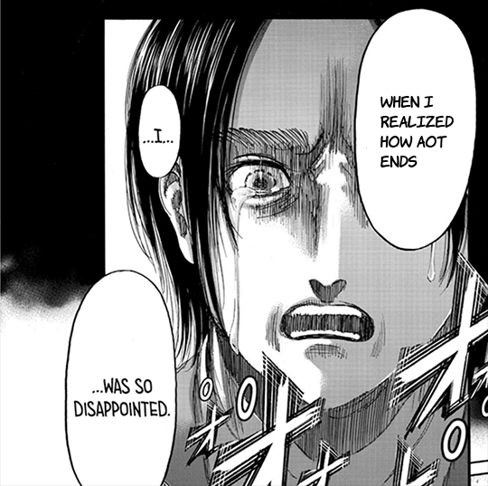
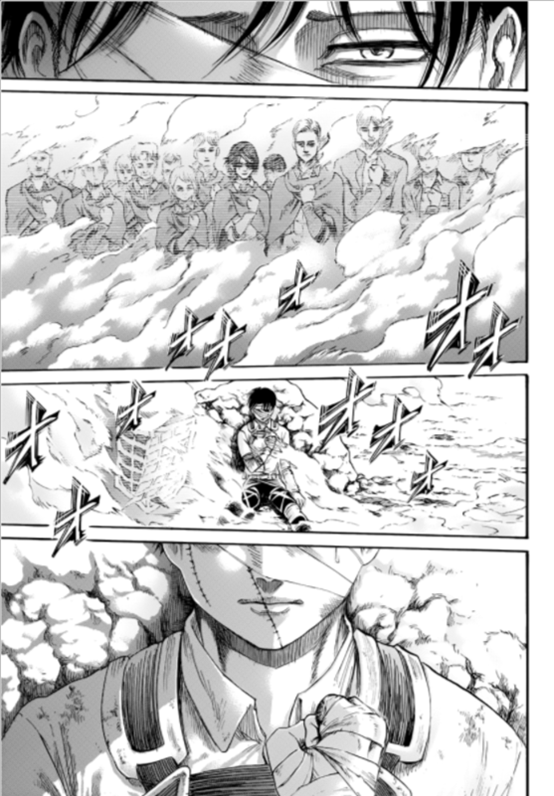

> 暴雷警告：直到漫畫第139話

現在是進巨完結後的隔天，而我還是找不到讓我能夠滿意這種結局的理由。雖然結局不差，但也實在說不出好在哪裡。對於像進巨這樣史詩般的偉大作品，我認為它應該值得一個更好的結局。這篇文章的目的就是解釋我的理由。

不過我必須重申，這樣子的結局絕對不糟。讓人不滿的地方是進巨明明已經到達了另外一個鮮少有人能夠企及的高度，卻只有這種差不多及格的結局。如果滿分是100分的話，那巨人的劇情絕對值得120分的評價，但結局卻只有60分而已。換句話來說，客觀上這個結局不差，但主觀上難以滿意而已。

### 未完成的感覺

整體而言，最後結局給人最大的不滿就是一種「未完成」感。這其實從結局前的倉促劇情中就可以感受到了，而我也的確在一月得知即將完結的時候，就已經做好心理準備說不可能把所有伏筆都好好收完。

如同前述，最後幾畫中的劇情已經失去了原本作品的嚴謹敘事和邏輯，而最後一話的未完成感也更嚴重。以下我會分成兩個主要的部分來討論這種未完成的感覺是從哪裡來的。

#### 不完整的劇情

未完成的支線和不夠明顯的設定有非常多，雖然這些幾乎都是可以事後解釋的，但我個人仍然期待諫山創在作品中就能夠好好解釋清楚。當然我也知道有些人會認為讀者根本就不該期待所有事情都要作者解釋，但我認為，如果一個架構嚴謹的作品會在事後還需要讀者們大費周章解釋的話，那這部作品的嚴謹度實在會讓人深感懷疑。以下是一些例子。

**為什麼80%的人一定要死掉？**

如果你要殺掉幾乎所有島外的人來保護島民，那為什麼不干脆殺掉所有人？我認為如果艾連（或尤米爾）最後是殺掉所有島外的人，那至少這還可以是視為呼應艾連曾經在第90話〈到牆的另一側〉(壁の向こう側へ)中所說過，殺掉所有牆外的人是否就能夠獲得自由的橋段。

艾連的死亡在這個解讀下也變得毫無意義。在最後一話中艾連的死亡是被用來讓阿爾敏成為拯救世界的英雄。但顯然島民仍然需要備戰，且戰爭與衝突從未停止過。那到底艾連的死亡是為了什麼？有些人認為這就是諫山創想要描述的一種世界的真實，但我認為如果要描寫真實應該會有更好的方法，我會在之後提出我認為比較的結局來說明這件事情。最重要的是，到底為什麼要殺80%而不是全部？

有些人是解釋說，艾連毫無選擇的能力，因為那都是尤米爾做的。但艾連至少應該是可以控制戴娜不要吃掉貝爾托特的吧？那到底艾連的能力是到什麼樣子的地步呢？另外如果艾連別無選擇，那難道他都沒有嘗試反抗過嗎？我們所認知的艾連應該是一個最不可能輕易放棄的角色了吧，如果我們看到的是他放棄後的樣子而不知道他歷經了什麼嘗試，那這部分對於角色性格的描寫就會有些衝突。

**第二點是關於尤米爾的目的**

尤米爾的目的大概是最需要卻幾乎沒有解釋的地方了吧。在最後一章裡面，尤米爾是因為不斷追求愛情而遇到米卡莎，而這一幕作者畫了一個當時米卡莎向艾連表達感情的橋段。然而一直到最後，尤米爾想要追求的事物以及為什麼找到米卡莎的原因都仍然沒有被解釋清楚。

一種可能的解釋是，尤米爾想要瞭解，一個人對於所愛之人到底可以做到什麼樣子的地步。在看到米卡莎親手殺掉艾連之後，她瞭解了其實她不需要為了對於王的愛而持續遵尋其命令，最後才變成了我們所看到的結果。可是我實在沒有辦法被這種說法說服，畢竟她都被困了這麼長一段時間了，真的只是因為這個樣子？

當然，我並不是在說愛情需要有任何道理，但作者一直以來對於人物情感所描述的深度以及厚度，完全無法在這裡展現出來。米卡莎感謝艾連幫他圍上圍巾的那一段超級感人，而我也認為諫山應該是可以描寫出尤米爾的心境來給這段感情更好的描寫的。劇情上是可以理解，但我認為仍然有更好的描述才對。

**第三點則是關於窺探未來的能力**

關於知曉未來能力這件事情，作品中至少有三個地方談到這件事情。首先是第89話〈會議〉(会議)中，梟要求古利夏要記得繼續愛人來，這樣米卡莎和阿爾敏才能被拯救；第121話〈未來的記憶〉中古利夏則是能夠與來自未來的艾連以及吉克互動；第131話〈地鳴〉(地鳴らし)是在說艾連已經知道面前小孩會在未來的地鳴中死亡。

我一直以來都是認定，艾連應該是看到了某些未來的片段，最後導致他毫無選擇只能發動地鳴，而且還不得不犧牲他的戰友，以及與他的摯友們發生衝突。此外，這一切都應該要與尤米爾的目的有所關聯才對。

從最後一話來看，我只對了一半。雖然這的確與尤米爾的目的有關，但艾連其實也找不太清楚狀況。也就是說，艾連在不清楚狀況的情況下決定要毀滅世界？我是完全不能接受這種說法的，如果艾連是在知曉一切可能性後，發現這是最好的結局而不得不為之，這種說法還比較可以讓人接受吧。

順道一提，那個怪誕蟲也一直都沒有明確的解釋。艾連死亡之後它就跟著一起死掉了嗎？我認為無論有什麼子的解釋都比現在這種胡亂猜側的結果還要好上許多。

#### 不完整的情緒

讓我們先暫時回到第138話，也就是一堆人一起被變成巨人的地方。從這裡開始會有兩種可能性，一種是一切努力都白費的超級壞結局，另一種則是實際上第139話中變回普通人的結局。而如果從這兩種可能性上去選，我絕對會選擇第一種，這是基於我對這部作品理解的結果。

我必須說，對我而言這部作品所給我帶來的衝擊一向是它所討論的死亡、痛苦、憂鬱和絕望。雖然在閱讀這些橋段的時候常常會被深深地傷害，但卻也能在其後討論生存意義時被其拯救。這正是閱讀進巨最有樂趣的地方之一，我也曾為此寫過一篇文章：[死亡、痛苦、憂鬱和絕望，從存在中尋找救贖的可能](../../Death_Depression_Despair/Mandarin/death_depression_despair.md)。

我在心得中有提到，以艾爾文死掉的那一段為例，無論你身前有什麼樣的人生或夢想，死亡通常只是隨機而且平等地發生的。艾爾文和馬洛死掉，但是弗洛克活下來；前者懷抱壯志而死，後者當時只是一個平凡的路人沒死。

這種就是巨人所描繪出的殘酷世界，我們感覺優秀而不該死的人卻死了，但那些感覺該死的人卻還活著。死亡的隨機性代表著一種平等，卻也正是世界如此殘酷的證明。

我認為第138話裡面，被變成巨人的那些人各自懷有不同的理想，卻只是因為某些巧合而變成巨人的劇情，與我一開始對這部作品的理解是比較有一致性的。

以賈碧為例，賈碧即使花了這麼長的劇情好不容易擺脫仇恨，結果瞬間就變成巨人。一切努力好像都白費了，這種絕望感一直是我對巨人又愛又恨的地方。

可是結局卻馬上又變回正常人，還上演大家團圓的戲碼，這是讓我一開始很錯愕之處，也與我對這部作品的理解不太一致。一開始世界即將毀滅的感受也沒有得到抒解。

換個說法，我其實一直都很期待作者要怎麼在最後一話狠狠地傷害我，但最終似乎不是真的非常痛，所以才很錯愕。說好的深深傷害呢？XD

我們撇開不一致的問題，其實所有人變回來而且最後還上演大團圓的劇情並不是真的很糟，但是這種轉折需要多一點的章節來處理才是比較好的。如果有任何類似這樣大幅度轉變的劇情，以進巨的篇幅來說應該要至少三到四話來處理才是比較好的。然而作者只有花兩話，因此這種情緒收不回來的感覺當然會存在，也是為什麼會有一種「不完整」的感覺。

一個例子是動畫中漢尼斯的死亡。這裡的劇情中包含了幾個不同的事件。首先是艾連與米卡莎遇到了吃掉艾連母親的巨人；隨後漢尼斯出現並說他終於等到了這個復仇的機會；艾連嘗試變成巨人未果；漢尼斯被抓到而且即將要被吃掉；艾連繼續嘗試但還是失敗；漢尼斯被吃；艾連崩潰；米卡莎向艾連表白；艾連回應了米卡莎；最後艾連意外控制了巨人。

剛剛這一連串的事件在現實世界中頂多也就五分鐘或更短吧，不過動畫卻花了長達超過半集的量來刻畫這一系列事件。會這樣子做的原因就是因為情感的轉折需要時間描述。上一段裡面每一個句子都代表著一種情緒，而如果要從一個情緒轉到另一種上面的話，就會需要時間以及讓人可以接受的情節才行，這也就是為什麼動畫會花這麼長的篇幅來處理這一段。

總而言之，如果維持第138話的無力與絕望感是我的理想，但如果要轉成像第139話那樣的話也沒什麼不行，但需要更多的篇幅來處理會比較好。這就是我想要解釋的東西，而我也必須說，進巨中有太多難以忘懷的橋段了，但最後一話的劇情我可能過了一段時間就會忘記吧。

### 理想的結局

跟據之前在各個討論區所見，我嘗試著幫進巨想了一些我認為比較好的結局。

#### 從種族的角度

在最後一話中，阿爾敏嘗試的和平談判失敗，在場的艾爾迪亞人遭到攻擊。萊納為約翰擋下子彈而喪生，最後的遺言則是他很後悔殺掉馬可；法爾可也是為了保護賈碧而死。

島民在隨後數年內受到暴復性攻擊，畢竟要世界其他人相信巨人之力消失仍然是相當困難的事情。島民遭到屠殺之後政權倒臺，不過因為沒有辨識艾爾迪亞人的方式，因此仍然有許多人逃到了世界的其它角落。數百年後艾爾迪亞人這洜種族消失在人們的記憶中，巨人則只有在歷史書籍中會被提及而已。

這可以呼應我前面所提到的，寫於所有一切努力都白費的部分。變回人類的劇情給了我們一點希望，但隨即又因為被殺掉而陷入了深深的絕望。主要角色過去花費的努力就如同艾爾文或漢尼斯一樣幾乎都白費了。賈碧可能因為法爾可死亡的原故而再次墮入憎恨的枷鎖；約翰則會如同萊納一樣後半輩子都生活在後悔之中，因為其實他早就在最後那場戰鬥中原諒萊納了。

這個結局也可以促使讀者對於種族議題重新思考，而這正是馬雷篇章開始後的重要主題之一。

#### 從自由的角度

(1) 艾連雖然一輩子都在追求自由，但最後卻發現他無法承擔代價，或是他發現他反而成為了自由的奴隸。

(2) 怪誕蟲的目的是繁殖，但尤米爾渴望自由，因此她創造了進擊的巨人來幫助她。進擊的巨人不會受到任何控制，擁有跨時間的記憶並且會不斷追尋自由。尤米爾在2000年後找到了艾連，做為最後一任進擊的巨人來幫她殺掉怪誕蟲，代價則是艾連的性命。艾連在看過各種時間線上之後意識到這條才是最好的，因此他別無選擇。

這種結局可以呼應貫穿整篇故事的想法，也就是自由。這也可以解釋為什麼梟要求古利夏要記得愛，否則悲劇將會不斷再次上演。

(3) 地鳴成功毀滅了除了島民之外的整個世界，艾爾迪亞人雖然獲得了真正的自由，卻因為罪惡感而終日生活在痛苦之中。此外，為了避免艾爾迪亞人繼續變成巨人，艾連需要被殺掉或是變成如同亞妮那樣子的結晶體。如果是結晶體的話，則艾連就是要如同睡著一樣進入結晶體很久的一段時間，最後一幕則是與米卡莎道別，進入夢境的艾連第一個夢到的就是米卡莎。

這種結局也可以解釋為什麼艾連會在第一話哭；此外因為他要睡上很長的一段時間，因此米卡莎留了下一封信給艾連，內容的開頭則是「致兩千年後的你」。

### 對於人物內心的刻畫

無論是什麼樣子的結局都需要高超的描繪技巧才行。雖然我前面一直在批評結局，但我還是認為諫山創對於人物的刻畫以及分鏡的掌握非常的優秀。以里維那一段為例：

這一頁裡面完全沒有任何文字，但是里維的情緒卻讓人非常能夠感同身受。如果看得仔細一點，我們還可以發現其實他有偷偷流了一滴眼淚。這裡的分鏡可以說是非常優秀的表現，也看得出來為什麼諫山創一開始就會被編輯評為分鏡優秀的創作者。

無論如何，我最終都還是想謝謝諫山創帶給我這麼一部偉大的史詩作品。我所有的批評都出於我實在太愛這部作品了。正因為太愛這部作品才會被結局傷得很重，我想我可能還是要花點時間才能慢慢走出來吧。