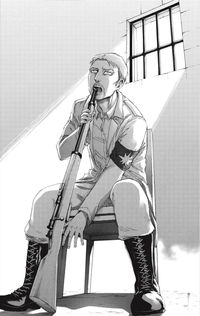
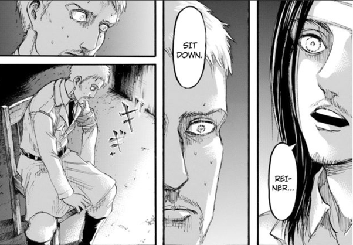
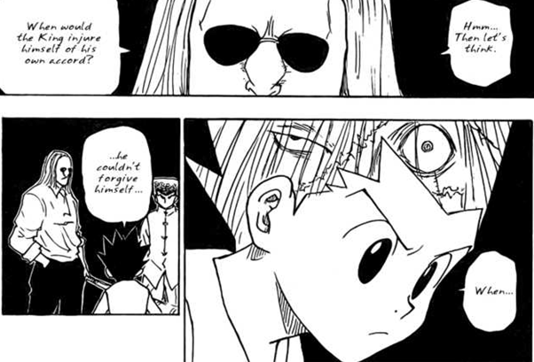
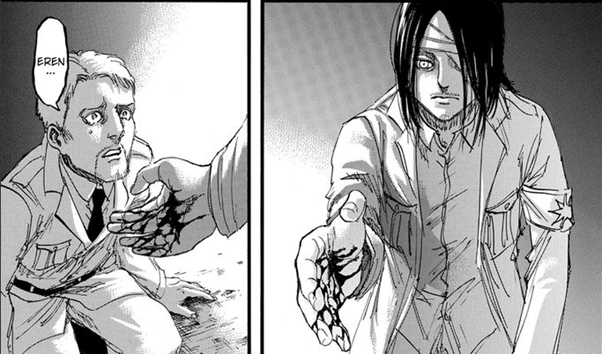
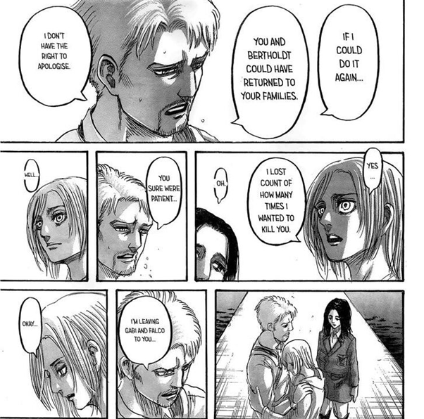

### Spoiler Alert until chapter 127.

#### I will also talk about Hunter *× Hunter at chapter 262, A Song of Ice and Fire (Game of Thrones), Code Geass: Lelouch of the Rebellion, and Neon Genesis Evangelion. You can avoid these spoilers by skipping the “(Spoiler)” parts.*

> The reason I hate myself so much is that I don’t even have the courage to kill myself.

")

Reiner is literally my favorite character in *Attack on Titan*, for the conflict and contradiction in his whole life. This character also inspires me a lot, and thus I decide to write something for him.

### The Character

It is probably impossible for any AoT fan to forget Reiner. He is born in Liberio internment zone with his Eldian mother and realizes the identity of his Marleyan father as he grows up, in *The Boy Inside the Walls* (壁の中の少年), Ch. 94. His purpose of life is to be the best son for his mother and the hero to the world by becoming the Warrior to “save the world”.

However, he is very weak as a candidate, and he is finally chosen as the Warrior mainly because Marcel wants to save his brother, in *Liar* (嘘つき), Ch. 95. This leads to his first confusion. Why does Marcel apologize to him? Why is it not a glory to become a warrior? This is where he knows that he is in fact really weak.

His second confusion appears when he meets his father. He thinks his family can be united as he and his mother finally become the honorary Marleyans, only to be called the demon and sees his father run away, in *Liar* (嘘つき), Ch. 95. Why is he rejected by his father? Why his family cannot be united? This is where he knows that he cannot be the best son.

After infiltrating Paradis Island, he meets his third and probably the biggest confusion, that people living there are nothing more than some normal people like themselves, instead of the devils as he is taught in Marley. Why there is no devils on the island? Why is killing innocent people the way to save the world? This is where he loses his last purpose and finally loses track of who he is, in *The World They Saw* (彼らが見た世界), Ch. 77, and in *Opening* (開口), Ch. 46.

In Marley arc, after losing his purpose and feeling guilty of what he has done, Reiner tries to commit suicide but gives up in the end because there are still people like Falco and Gabi he values, in *From One Hand to Another* (手から手へ), Ch. 97. Reiner’s attempt is one of my favorite scenes in AoT, by the way. We, then, see another epic scene (also one of my favorite) as the judgement is passed to Reiner, in *Guilty Shadow* (疾しき影), Ch. 99. Reiner, sit down!

Reiner’s story as a character ends here approximately. Although he is then forced to join others into fighting against Eren, this is less important for his character. However, maybe there is still something very important for him to do since Isayama has not let him die, as we can see him used to concept Jean who furiously beats him because of Marco’s death, in *Night of the End* (終末の夜), Ch. 127. By the way, the name “the end” seems to show the possible cooperation between the islanders and Marleyans, after their final debates and even the furious fights.

### The Worst Betrayer

Reiner shows his identity as a betrayer in a literally dramatic way. In *Warrior* (戦士), Ch. 42, after almost crumbling under great stress, he reveals his true identity to Eren all of a sudden, and hastily conduct the plan to catch Eren and Ymir. This is not the classic betrayer we look forward to, though.

A successful betrayer, as I expect, is the one who hides zieself in the darkness, planning everything until the end, and shows zis true identity with everything well prepared. The betrayer should show zis identity with an evil smile as everything is under zis calculation. Reiner and Bertolt, however, shows the opposite. They show nothing but fear, as if they are the ones who gets betrayed. This is quite weird, but also what makes it dramatic and attractive.

Why does Reiner simply break down like that? First, he is probably at his limit, as we can see him lose track of his identity and consider himself a real soldier to risk his live saving Connie before Bertolt tries and fails to remind him of his true identity, in *Soldier* (兵士), Ch. 39. By the way, the chapter name “*Soldier*” as chapter 39 and “*Warrior*” as chapter 42 also imply what lies in Reiner’s mind. Second, Bertolt tries to cheer Reiner up (or maybe reminds him of his true identity) by informing him the possibility to returning to their hometown, since they finally find the one who eats Marcell. After that, Eren tries to play it off as if Reiner is simply too tired, only to, in my opinion, remind Reiner of everything he has done, including the one to Marco, and in the end makes him collapse.

### Judgement

> When would one injure zieself? When zie couldn’t forgive zieself.

I mention above that I really love the scene illustrating the judgement being passed to Reiner. Reiner collapses as he listens to Eren’s question about the death of his mother, in *Declaration of War* (宣戦布告), Ch. 100. While Willy is asking if he can be alive, Reiner asks if Eren can kill him because he simply wants to die. This is, again, one of my favorite scenes, and it reminds me of what I saw in *Hunter × Hunter*.

(*Spoiler Below*)

In Chimera Ant arc, right before breaking into the palace, Morel asks under what circumstances will the king injures himself? This reminds Gon of Kite and he proposes the answer of the unforgiveness to oneself. Well, we know what exactly happens in the palace and what happens to Gon later.

(*Spoiler Above*)

In my opinion, this is definitely what lies in Reiner’s mind when he meets Eren. He simply cannot forgive himself. He even wants others not to forgive himself, as we can see in *Night of the End* (終末の夜), Ch. 127, before him being beaten by furious Jean. In addition, not only does he want to hurt himself, but he also wants to die. The best for him is to be killed by Eren, the one he feels guilty about the most, and this is why he needs the judgement from no one but Eren.

This does not end here, though, since we all know how Isayama likes to torture his characters. Reiner is looking forward to Eren’s judgement, as we can see, in *Declaration of War* (宣戦布告), Ch. 100, that he never forgets Eren’s curse on that day, in *Opening* (開口), Ch. 46. The most interesting thing here is that Eren forgets what he says and even asks Reiner to forget it, which makes Reiner confused then.

Concerning Eren’s idea, I would suggest reading [Eren, Hell, and Genocide](../../Eren_Hell_And_Genocide/English/eren_hell_and_genocide.md). What we see here for Reiner, however, is that he even fails to ask his enemy to kill him. Instead, he even gets sympathized by Eren. This is not a happy ending, but nothing more than a tragedy however. While Eren gives his hand to Reiner to help him to his feet, he then brings Reiner to yet another hell instead of the seemingly peaceful conciliation. Well, Eren does understand what Reiner thinks after all. How ironic.

### Life is a Joke

> Life is nothing more than a joke.

Reiner is a tragic character, and I am not sure if he can be even considered a hero. He wants to be the hero who saves the world but cannot. He feels guilty and wants to die, only to be sympathized by Eren. In the end, he loses his purpose and wants to vanish or be forgotten, while he is being forced to be the hero to save the world. This is like the author’s sarcasm, but this is also what makes this character so attracting. Reiner lives with purpose only to find himself unable to do anything. While he has already given up everything, he is forced to do what he eagers to in the first place. It is funny, though, as we see in *Pride* (矜持), Ch. 126. After being awaked while having no idea about what is going on, Reiner is asked to save the world. This is probably why the last page of the chapter appears from the perspective of Reiner. Well, Reiner’s story reminds me of *House* *Lannister* in *A Song of Ice and Fire*.

(*Spoiler Below*)

There are four members I want to talk about in the *House Lannister*, Tyrion, Jaime, Cersei, and Tywin. All live with some purposes only to find the inability of themselves.

Tywin spends his whole life for the revival of Lannister and can be seen successful as he beats Robb Stark. However, Jaime as the oldest son wants the identity as a Kingsguard and refuses to succeed to the Lord. He seems to have no choice but to leave it to Tyrion, whom he hates and resents, for his dwarf appearance and that he causes the death of his wife during the birth. He refuses to do so as a result, but is killed by Tyrion in the end, probably not knowing the incestuous relation between Jaime and Cersei.

Cersei wants to live as the princess in the fairy tale, and Tywin promises her to marry Prince Rhaegar, who she sees as her Prince Charming, only to find him die in battle. She is then forced to marry Robert whom she later resents because he is nothing more than an alcoholic and is the kind of person who will violently beat his wife. She, then, turns her attention to her son but in the end sees him die in front of herself, as the victim in the games of throne.

Jaime always wants to become the honorable knight who devotes himself to the king, which leads him to the conflict between his father and is disowned by him. However, he suffers from not being able to protect Queen Rhaella from being raped by King Aerys, and he is even forced to kill Aerys in the end, earning himself the derogatory nickname “Kingslayer”. He loses his honor, and is even deprived of his unparalleled sword skill while losing his right hand. He even loses his love as the relationship between Cersei begins to break down. He loses his father as he sets Tyrion free, and is even informed by Tyrion that he kills Joffrey (not the truth though), and Cersei in facts has sex with different men. In the end, after losing everything, he becomes the Lord Commander of the Kingsguard.

Finally for Tyrion, he is an ugly dwarf and is seen as the devil who kills his mother during the birth. Lacking love from others make him sly, sophisticated, and sharp-tongued. He is forced to see fifty of his soldiers raping his first love, Tysha, a civilian who marries the teenage Tyrion, and then he rapes her as the last one. After that, he refuses to admit there is true love, and thus he always stays at brothels where he finds the prostitute Shae. In appearance, he plays with her but we all know that he in fact falls in love with her. We can see Tyrion even risking his life trying to hide her in the palace, while he even questions himself for the reason and still refuse to admit his love. However, after the murder of Joffrey, Shae betrays him by testifying his guilt and displaying their affairs. After finding her sleeping with his father, he kills both and escapes. For his whole life, Tyrion probably eagers to find someone to truly love himself, although he seems to always be joking about it. His own purpose of life breaks down, again and again, until his world collapses.

(*Spoiler Above*)

The members in *House Lannister* are my favorite characters in *A Song of Ice and Fire*, for that the conflicts and sarcasm in their lives always remind me of the paradoxes in my life. In *Code Geass: Lelouch of the Rebellion*, (*Spoiler→*) In the end, Lelouch becomes the emperor as he hates the most, and Suzaku becomes Zero whom he hates the most, too. (←*Spoiler*) Reiner is the same. He never succeeds in what he wants, but is forced to do it when he has already given up.

Life is nothing more than a joke.

Well, although I say that Reiner does not do anything successfully, there is certainly one thing simply not the case. In *Midnight Train* (闇夜の列車), Ch. 93, Reiner asks Falco to save Gabi from the dark future. Those who are interested in Gabi’s story can see (saving Gabi from the dark destination). We know that Gabi is saved, as she confesses her guilt to Falco, in *Sneak Attack* (騙し討ち), Ch. 118. In my opinion, Gabi avoids the demon path because of the love from Falco and Sasha’s father. Reiner is at least successful in this case.

After all, after being furiously beaten by Jean and saved by Gabi, in *Night of the End* (終末の夜), Ch. 127, being able to reconcile with Annie, in *Wings of Freedom* (自由の翼), Ch. 132, and being saved by Jean, *Battle of Heaven and Earth* (天と地の戦い), Ch. 135, in he seems finally free from his guilt and agony.

### Death, Freedom, and the Meaning of Life

> Being hated by others makes me want to die, but being loved by others gives me the same feeling. Do people like me really deserve so much love like this? I am afraid. I want to die.

What follows are just some miscellaneous ideas.

From Reiner’s perspective, death might be easier than living in the world while hating himself. Falco recognizes this as he sees Reiner’s body not repairing himself, in *Assault* (強襲), Ch. 103. Sometimes I feel the same, and I cannot help but think, whether we can be considered free after the death. There are two reasons as what follows.

Before that, however, I feel necessary to emphasize that I am not suggesting you commit suicide. Remember to ask for help if you seriously want to die for being depressed or for any other reason.

In [Why Levi Does Not Save Erwin](../../Why_Levi_Does_Not_Save_Erwin/English/why_levi_does_not_save_erwin.md), I discuss why Levi does not save Erwin and try to argue, in the first reason, for the idea of freedom after death. To put it in a nutshell, death is the beginning of one being free, since one needs purposes to live but is simultaneously the slave to zis dream forever, until death. This can be the first reason.

For the second, then, everything I do is partly based on my free will. For example, I eat dinner because I decide to do it, but also because I am hungry. There is always a reason for anything I do. However, I cannot say I do something completely free if there is a reason other than my freedom. In other words, if I eat dinner only because I decide to do it, this can be counted as acting totally free. This is nonetheless impossible in my opinion. Everything I do has at least a reason, and this can be traced back to where I am born in the end. According to this, the only thing I can do with a real freedom is to kill myself, since being born to the world has nothing to do with my decision, which means I am totally not free with respect to my existence. Killing one’s self is also the only thing that does not require any reason other than one’s free will.

In fact, in episode 24 of *Neon Genesis Evangelion*, (***Spoiler***→) the seventeenth and final Angel, Tabris, sees death as his absolute freedom. (←***Spoiler***) Again, I am not suggesting anyone commit suicide. I am just inspired by Reiner’s story. Sometimes we lose track of ourselves, and we want to ask why we are born to the world. What is the meaning of life? Eren’s mother offers an answer, in *Bystander* (傍観者), Ch. 71, that what matters is your existence. You are great enough to be born to the world. In the so-called TV ending of *Neon Genesis Evangelion*, (***Spoiler***→) Shinji Ikari finally overcomes the emotion of his self-rejection, and is then able to recognize his existence. Does he really change anything? Probably not. He only changes his mind, after all. (←***Spoiler***)

If you take my idea, then you probably can accept what I want to propose in the following. Being born to the world is the one and only one thing beyond my freedom, and no one is responsible for anything beyond zis free will. Consequently, who is responsible for the answer, the meaning of life, is the one who creates us. You can consider it God, Devil, the Evil Genius, or even your own parents. The correct answer is however not what matters here, since you can never find your creators, and even your own parents are created by others. It does not, however, follow that there is no answer. You can create your own. You are free to do so. There can be even more than one. While creating for your own self, you are also creating the ones for others, as Erwin argues, in *The Unknown Soldiers* (名も無き兵士), Ch. 80. Remember, that anyone is created because being needed, as Onyankopon describes in *Brave Volunteers* (義勇兵), Ch. 106.

I suggest creating your own meaning of your own life will be the freest thing you can ever do. Just try to love yourself.
