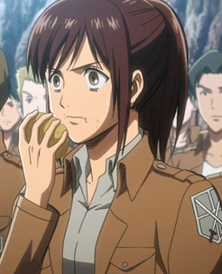
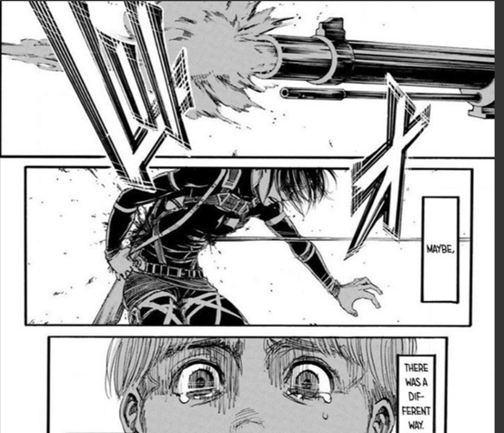
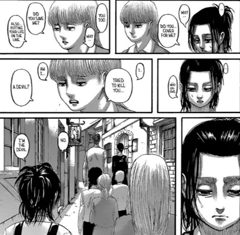
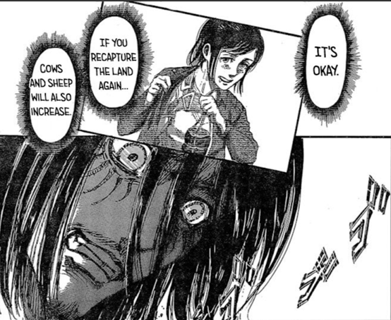

### Major Spoiler Alert until Chapter 133 (at least 105) (Manga) or Episode 75 (at least 67) (Anime)

> As she dies, so does my innocence.

### The Character

Sasha Blouse (サシャ・ブラウス) is the member of the 104th training corpse with Eren, Mikasa, and Armin. She appears as an innocent, simple-minded, yet kind of eccentric girl who dares to eat a potato during the initiation and even tries to bribe the instructor with half of the potato, in One by One (個々), Ch. 15. She then earns herself the name of “The Potato Girl” (芋女).

This could be one of the funniest scenes in Attack on Titan. There is no one who can forget this funny event as Jean says in Squad Levi (リヴァイ班), Ch. 51. Even Reiner chooses this to tell his family members after their reunion, in The Boy Inside the Walls (壁の中の少年), Ch. 94.

Without a doubt, Sasha (and probably her best friend/lover Connie XD) is the one who never stops bringing fun to others in the complete story. However, her sensitivity can be seen while trying to hide her local accent even in conversing with her peers. Ymir thus asks her to just be herself, in I’m Home (ただいま), Ch. 36.

### From Innocence to Sophistication

Isayam uses Chapter 36 mainly to describe Sasha this character. She used to live in a village in the forest by hunting with her father alone, until the food shortage due to the fall of Shiganshina. Sasha refuses to share the land with the newcomers at the beginning, but still joins the military later.

Sasha’s life is like the Eldians living inside the wall. Both know nothing about the world until leaving the forest or wall. If Sasha symbolizes the innocence in the story, her death represents the loss of it.

Sasha dies in Assassin’s Bullet (凶弾), Ch. 105. We can see everyone in the AoT community shocked for the sudden death of Sasha’s right after this chapter was released (even though Isasyam has explicited mentioned that an important character will die soon before the chapter is released). There are condolences everywhere, and soon it becomes the passionate hatred of Gabi, who kills Sasha with a rifle. We can even see people calling Gabi “Garbage” at that time.

The question appears then. Why did Isayama choose to let Sasha die here? Here I want to offer my own answer. Sasha dies after Eren and the survey corpse bring the surprise attack to Marley (even though Willy and Magath have already anticipated this). The is the important turning point because Eren just kills a great amount of innocent civilians, even including children. That is undoubtedly a massacre, which could be considered breaking the only possibility of peace (if there is any), from Declaration of War (宣戦布告), Ch. 100 to The War Hammer Titan (戦鎚の巨人), Ch. 101.

I mentioned the only possibility of peace, because this possibility is shown in Brave Volunteers (義勇兵), Ch. 106, especially when Sasha praises Niccolo’s cooking skill. Again, Sasha brings happiness to other. We may be able to conclude that one way to bring peace with the ones you don’t know is to stay innocent to the world. As Isayama turns to Eren’s perspective when he is practicing the rifle skill with Armin and Mikasa, however, Eren does not believe there is a(n) innocent/peaceful way.

Eren pulls the trigger, and we see the scene Sasha gets shot again. This is one of my favorite parts in AoT. Eren triggers the war and breaks the possibility of peace, and he destroys the only innocence simultaneously. Since Sasha represents the innocence, she is killed then. I personally feel so sorrowful for Sasha’s death, but I would have done the same if I were the author.

Another similar scene appears in Mikasa’s memory, in Island Devils (島の悪魔), Ch. 123, in which Eren appears right before Sasha’s death. Mikasa asks herself whether there can be a different path. Since Eren has destroyed the peaceful path, nothing can stop Sasha’s death.

### Death is Yet Another Beginning

It is said that people don’t die. They are forgotten. Does Sasha’s bring us anything after her death? She does. I just mentioned that staying innocent might be a way to bring peace. The change of Gabi shows the opposite, though. After all, anyone should not look forward to an easy answer for any issue in this work.

")

Gabi’s innocence tells her that people living in the Paradis Island are devils who don’t take the responsibility of their own guilt. Her hatred grows mush bigger after her hometown Liberio gets destroyed. However, she gets confused while being attacked by Niccolo (she sees as the ally) but then forgiven by Sasha’s father (she sees as the enemy), in Children of the Forest (森の子ら), Ch. 111. She, then, begins to understand that people on this island are nothing more than the normal people just like herself, and completely gets rid of her hatred after hearing the conversation between Kaya (the one saved by Sasha) and Sasha’s father, in Sneak Attack (騙し討ち), Ch. 118. Finally, she is reconciled with Kaya after saving her, in Thaw (氷解), Ch. 124.

From Gabi’s story, we can conclude that being innocent sometimes blindfolds and disorientates a person. The only way against this is to let go of the prejudice and try one’s best to understand the complete context. Sasha’s death brings not only the islanders but also Gabi from innocence to sophistication.

Besides, Gabi is really good at shooting. Is there anyone who is also good at shooting? it’s Sasha! It can be a coincidence, but I think Isayama did it on purpose, as Gabi finally becomes Sasha from the perspective of Kaya after saving her.

Niccolo is the same with Gabi, he seems to build an intimate relationship with Sasha. Sasha’s last word is “NI KU”, which means “meat” in Japanese. However, her last word could also be “Niccolo” which she fails to say.[1] Well, it should be Connie if there is exactly one who shares a deep relationship with Sasha.[2] In addition, Mikasa also seems to have a good friendship with Sasha.[3] However, considering how Erwin dies right before his dream comes true. Levi confirms Petra’s feeling after her death. This is exactly what Isayama will do to his poor characters.

After all, we know that the possibility of peace does not disappear completely as Sasha’s father chooses to forgive Gabi instead of avenging his daughter with the knife given from Niccolo, in Children of the Forest (森の子ら), Ch. 111. This more or less gives me some salvation in this complicated world.

Thanks again for bringing us so much happiness, Sasha. May your soul rest in peace.

[1] This might be a stretch for some people, but I think it makes sense for two reasons. First, Japanese are really good at abbreviating words and using homophones. The homophone here is exactly what you should expect while watching any Japanese drama. Second, the main goal of Niccolo as a character is to trigger the turning point of Gabi. Everything he does is based on how he is saved by Sasha, so I don’t think Isayama chooses the name “Niccolo” just by accident, and it should be “NI KU” if there is something behind this name.

[2] In The Beating of a Heart Can Be Heard (心臓の鼓動が聞こえる), Ch. 9, Sasha blames herself for yielding to a titan, and it’s Connie who asks her to keep moving. In Delusions of Strength (武力幻想), Ch. 17, when the main characters are still in the training corps, we can see Connie and Sasha training together. In Welcome Party (歓迎会), Ch. 64, the survey corpse is fighting against Anti-Personnel Control Squad, and Sasha save Connie when he is about to be shot. In A Dream I Once Had (いつか見た夢), Ch. 70, Sasha mentions the discussion about Connie’s mother turning into a titan, and the one who comforts Connie at that time is Sasha. In Night of the Battle to Retake the Wall(奪還作戦の夜), Ch. 72, it’s Connie who tries to stop the unconscious Sasha after seeing the meat, and he begs for Sasha to stop because killing her is the last thing he will do. Besides, Connie also reminds Eren that even Sasha would share meat with others and thus Eren remembers this event after Sasha’s death. In Cleaver (大鉈), Ch. 83, it’s Connie who takes care of the injured Sasha. In Too Little, Too Late (後の祭り), Ch. 102, Connie and Sasha show up together as their first time seen in the Marley arc. When Connie buddy hugs Sasha and Jean, Sasha responds by holding his arm, and it’s also Connie who sends Sasha’s last word to Eren, in Assassin’s Bullet (凶弾), Ch. 105. Connie is the one who changes the most after Sasha’s death. He even questions Mikasa for this in A Sound Argument (正論), Ch. 108. Besides, in the same chapter we can see Connie and Sasha laughing at each other as they both blush after Eren says he treasures all of them. In Pride (矜持), Ch. 126, when Connie is thinking about whether to feed Falco to his mother, he wonders whether Sasha would agree with his decision or not. Finally, in Sinners (罪人達), Ch. 133, Connie apologizes to Eren for blaming him for Sasha’s death.

[3] In The Beating of a Heart Can Be Heard (心臓の鼓動が聞こえる), Ch. 9, it’s Mikasa who saves Sasha after Sasha fails to kill the titan. In Necessity (必要), Ch. 16, it seems to be the first time Mikasa notices Sasha and how she is somewhat being bullied by Ymir. This happens after Mikasa tries to express her feeling to Eren but does not notice the one who sits beside her is however Sasha who wants her bread. In Delusions of Strength (武力幻想), Ch. 17, Mikasa told the instructor that it’s Sasha’s fart that makes such noises while in fact it’s the fight between Eren and Jean. Mikasa then pays Sasha by filling her mouth with a bread. In Erwin Smith (エルヴィン・スミス), Ch. 27, Sasha seriously warns Mikasa after the female titan screams. In “Location of the Counterattack (反撃の場所), Ch. 54, when the survey corps is fighting against the Reeves Company, Sasha saves Mikasa when Reeves is about to shoot her. In Reply (回答), Ch. 61, Sasha jumps on Mikasa and Mikasa holds her while celebrating their victory against the government. In Outside the Walls of Orvud District (オルブド区外壁), Ch. 67, it’s Mikasa who notices that Sasha does not eat anything. Sasha does not have any appetite because they just kill several people. In Night of the Battle to Retake the Wall(奪還作戦の夜), Ch. 72, when Sasha loses her mind and keeps attacking everyone, Mikasa takes her punch on her well-trained abs, but still asks Connie to stop her as if nothing special happens, while Marlowe who also gets punched is already bleeding. Mikasa has probably got used to it after all. In Assassin’s Bullet (凶弾), Ch. 105, Mikasa cries so much as seeing Sasha dies. I am not sure if it is the first time I see Mikasa showing her deep emotion to one other than Eren. In Brave Volunteers (義勇兵), Ch. 106, Mikasa wakes Sasha by holding her ponytail. This shows their friendship as it could be offending to hold a stranger’s ponytail. We can also see her frustratedly sitting at Sasha’s grave in the same chapter. In A Sound Argument (正論), Ch. 108, we can see Mikasa sitting beside Sasha with a ponytail as well. Finally, in Island Devils (島の悪魔), Ch. 123, we see Mikasa’s memory in which she drinks together beside Sasha, and Sasha’s death appears again as what she regrets seriously.
