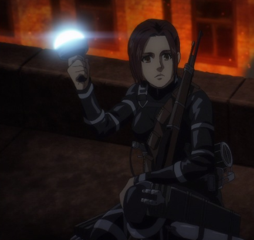

### 嚴重暴雷警告：直到漫畫第133話(至少第105話)或動畫第75集(至少第67集)

> 我的純真亦伴隨她的死亡逝去了。

### 關於角色

莎夏．布勞斯（サシャ・ブラウス）是與主角艾連、米卡莎和阿爾敏等人一樣，是第104期訓練兵團的成員。她以一個天真無邪卻又行事古怪的方式出現在作品。在第15話〈一個接一個〉(個々)中，她在入團儀式中吃偷來的馬鈴薯，而且被教官質問的時候還嘗試想要分一半(其實根本不到一半XD)給教官，因此贏得了「馬鈴薯女孩」(芋女)的稱號。

這可以算是本作最好笑的幾個片段之一。約翰就曾經在第51話〈リヴァイ班〉(里維班)中提到與他們同期的人中，沒有人會忘記這件事情。我們在第94話〈牆壁中的少年〉(壁の中の少年)可以看到，就連萊納在與家人團聚的時候也提到這件事情。

莎夏（以及她最好的朋友/戀人柯尼）無庸置疑地可以說是整篇作品中的開心果。然而，她其實也是一個相當敏感的人。我們可以在第36話〈我回來了〉(ただいま)中看到尤米爾叫她表現出自己原本的樣子，因為即使是在朋友旁邊，她還是會嘗試隱藏自己家鄉那個與眾不同的口音。

### 從純真到世故

諫山創用了完整的一個第36話來描述莎夏這個角色。她過去與父親在森林中靠打獵維生，但因為瑪莉亞之牆陷落之後所造成的食物短缺落被迫與難民分享土地。莎夏一開始拒絕放棄既有的生活，但最終還是加入了軍隊。

莎夏這一段改變就像是艾爾迪亞人一樣。兩者原本都生活在森林或城牆內，對於外在的世界一無所知，但最終都被迫面對了世界的真相。如果莎夏象微在本作品中的純真，那她的死亡真代表著喪失了這份純真。

莎夏死在第105話〈殺人子彈〉(凶弾)中。我們可以看到所有進巨的粉絲被這突如其來的死亡嚇得不知所措（縱使實際上鍊山創有先明確說過會有一個重要角色死亡）。大家的悲痛與悼念之情隨即轉變為對於兇手賈碧的憤怒。我們甚至可以看到有人用「垃圾」來稱呼賈碧（Gabi→Garbage）。

這裡隨即浮現了一個問題。為什麼諫山創要讓莎夏在這裡死亡呢？以下文章中我想要嘗試提供我的想法。莎夏的死亡發生在艾連與調查兵團對於瑪雷帝國的偷襲之後（隨著威利和馬迦特早就預期到這件事）。從第100話〈戰鎚巨人〉(戦鎚の巨人)到第101話〈開戰宣言〉(宣戦布告)，這個事件可以算是一個相當重要的轉折點，因為艾連在此戰役中殺害了無數的平民和小孩，這種接近屠殺的行為無可避免地催毀了和平唯一的可能性（如果從一開始就有的話）。

我提到唯一和平的可能性，因為這種可能性是存在的。在第106話〈義勇兵〉(義勇兵)中，我們可以看到從莎夏大讚尼柯洛的廚藝，從而轉變了尼柯洛對於島民的看法。莎夏的純真也許可以是一個通往世界和平的道路。不過這個畫面隨即轉到艾連與阿爾敏和米卡莎等人正在練習步槍的視角，艾連並不認為有和平(純真)的方法。隨著艾連扣下板機，畫面再度轉變，而我們再次看到沙夏被射殺的結果。這一段的描寫可以算是我最喜歡的整個巨人片段之一。艾連扣下板機的行為摧毀了和平的可能性，也同時摧毀了巨人中唯一的純真。既然莎夏就代表那份純真，她當然就應該要死在這裡。我對於莎夏之死的難過並沒有因為減少任何一點，但如果我是作者的話，我大概也會做一樣的事情吧。

另一個類似的場景則出現在第123話〈島上的惡魔〉(島の悪魔)中，這話主要是米卡莎的回憶。其中莎夏死亡的場景再次出現，並緊接在艾蓮之後。米卡莎在回憶中詢問自己是否有另一條不一樣的可能性。然而，既然艾蓮已經走上了這條道路，莎夏的死亡自然就無可避免。

### 死亡與另一段開始

似乎有一段話是這麼說的：「人不會死，人只會被遺忘。」莎夏在死後有帶給我們任何東西嗎？答案是肯定的。雖然我才剛在上一段提到莎夏的純真可以是一種通往和平的路徑，但賈碧的轉變可以說是剛好與之相反。不過我們本來就不應該期待一個簡單的答案就是了，特別是像巨人這樣的作品。

賈碧的純真讓她認為帕拉迪島上的人民是一群不願意償還祖先罪過的惡魔。她的憎恨隨著家鄉雷貝里歐被摧毀而增加，卻因為被尼柯洛（她視為同伴）暴打後又被莎夏父親（她視為惡魔）原諒而轉變成困惑。這在第111話〈森林的孩子〉(森の子ら)中有非常清楚的描述。然後，她開始瞭解島民也不過就是一群與她沒有什麼不同的普通人。在第118話〈偷襲〉(騙し討ち)中，在聽到卡亞（被莎夏救的小女孩）和莎夏父親之間的對話後，她最終完全放下仇恨並對自己的所作所為表達無限的懺悔，並在第124話〈冰釋〉(氷解)中在救下了卡亞之後與她達成了和解。

從賈碧的故事中我們可以看到，帶著純真看待事物有時候反而會使人盲目。唯一的方式就是拋棄偏見並盡全力瞭解整件事情的脈絡。莎夏的死亡可以說是同時讓島民和賈碧脫離了純真。

此外，賈碧精湛的射擊技術也讓人不禁聯想到莎夏。兩人同樣出類拔萃的射擊技巧只是一個巧合嗎？我認為作者有意為之，就如同在卡亞眼中，出現在她眼前拯救自己的賈碧卻有著莎夏的形象。

尼柯洛也和賈碧相當類似，而且他似乎和莎夏有種非比尋常的關係。莎夏的遺言是「肉」，發音則是「NI KU」，但是這其實可以被視為是「尼柯洛」的前半段發音，而莎夏沒能把它說完[1]。

柯尼當然也是莎夏的誹聞對象，他們不但是最佳搞笑夥伴，也很明顯地互相在意對方[2]。另外值得一提的則是米卡莎與莎夏的友好關係[3]。不過看看里維與佩托拉最後用什麼方式收場，再看看艾爾文死在他自己的夢想前面，我們就可以知道這的確就是諫山創最喜歡的劇情了(哭)。

無論如何，和平的可能性不會完全消失。在第111話〈森林的孩子〉(森の子ら)中，莎夏的父親在接下尼柯洛遞給他的刀子之後決定原諒賈碧。這或多或少給了我一點救贖，無論這個世界多麼殘酷。

再次謝謝莎夏帶給我們無可取代的歡笑。

[1] 可能會有人認為這種說法過於牽強，但我認為無論莎夏到底是說不是說「肉」，這仍然是一個作者故意為之的劇情。有兩個主要的理由。首先，日本人非常喜歡縮寫文字和玩諧音哏，而這種程度的諧音正是我們常常會在日劇中看到的取名方式；另外，尼柯洛這個角色出現的目的就是為了帶出賈碧的轉變，而他的所有行動都建立在他對莎夏的感情上。因此，我認為諫山創在一開始設定這個角色的名字時，應該有意地找了一個與日文中的「肉」有關的名字。

[2] 在第9話〈聽能見心跳的聲音〉(心臓の鼓動が聞こえる)中，莎夏正在自責於乞求巨人的原諒，而正是柯尼要她快點繼續行動；在第17話〈武力幻想〉(武力幻想)中，我們可以看到柯尼和莎夏在仍是訓練兵時就一同訓練；在第64話〈歡迎派對〉(歓迎会)中調查兵團正在與對人壓制部隊作戰，而千均一髮之際救了柯尼的就是莎夏；在第70話〈我曾經做過的夢〉(いつか見た夢)中，莎夏提到過去他們曾經討論過柯尼的媽媽變成巨人這件事，而當時負責安慰柯尼的就是莎夏；在第72話〈收復作戰的夜晚〉(奪還作戦の夜)中，是柯尼負責阻止因為太久沒有看到肉而失去理智的莎夏，他還同時發自內心地懇求莎夏停止行動，因為他無論如何都不想親手殺掉莎夏(笑)，而且他還提醒了艾連莎夏也曾經要和大家分享她偷來的肉(艾連才能在莎夏死掉後馬上想到這件事)；在第83話〈剁刀〉(大鉈)中，是柯尼負責照料因為攻擊萊納而負傷的莎夏；在第102話〈為時已晚〉(後の祭り)中，在瑪雷帝國篇章首次出現的莎夏也和柯尼一同行動；在第105話〈殺人子彈〉(凶弾)中，當柯尼從後面抱住約翰和莎夏時，莎夏用握住柯尼的手臂來回應，其後也是柯尼傳達了莎夏的遺言；柯尼也是莎夏死亡後改變最多的，在第108話〈正論〉(正論)中甚至為此質問過米卡莎。我們也可以在同一話中看到兩人因為艾蓮的一番話臉紅後，互相嘲笑彼此的話面；在第126話〈矜持〉(矜持)中，柯尼獨自思考到底要不要把法爾可餵給母親，而他最後就是在詢問莎夏是否能夠理解他的行為；最後，在第133話〈罪人們〉(罪人達)中他則是向艾連道歉，因為他曾經為了莎夏的死而責怪過艾連。

[3] 在第9話〈能聽見心跳的聲音〉(心臓の鼓動が聞こえる)中，米卡莎救了因為失手而差點被巨人殺掉的莎夏；米卡莎第一次注意到莎夏應該是在第16話〈必要〉(必要)中，雖然這是因為她嘗試表達自己對艾蓮的感情卻沒注意到身邊的人早就變成正在覬覦她麵包的莎夏，不過隨後她也看到莎夏正在被尤米爾霸凌(?)的場面。在第17話〈武力幻想〉(武力幻想)中，米卡莎用莎夏的放屁聲來隱瞞教官艾蓮和約翰打架的事實，隨後用麵包賭住莎夏的嘴來阻止她的抗議；在第27話〈艾爾文．史密斯〉(エルヴィン・スミス)中，莎夏在聽到女巨人叫聲後非常激動地警告米卡莎要小心；在第54話〈反擊的場所〉(反撃の場所)中，莎夏一箭救了因為疏乎而沒有注意到利布斯持手槍的米卡莎；在第61話〈回答〉(回答)中，因為收到戰勝王政府的消息，開心的莎夏跳到了米卡莎身上；在第67話〈奧爾福德區外牆〉(オルブド区外壁)中，米卡莎注意到並關心莎夏沒有吃東西，而此時的莎夏正因為首次殺人而沒有任何食慾；在第72話〈收復作戰的夜晚〉(奪還作戦の夜)中，米卡莎用她堅實的腹肌(?)抵擋了莎夏失去意識的一拳，卻好像沒事一樣地叫柯尼快點制服莎夏，而一旁被同樣一拳打到的馬洛則已經開始流鼻血，看來米卡莎大概已經很熟悉這種場面(?)；在第105話〈殺人子彈〉(凶弾)中，米卡莎在莎夏的遺體旁泣不成聲，而這似乎是首次我們看到米卡莎對於艾蓮以外的人表達出這麼深的感情；在第106話〈義勇兵〉(義勇兵)中，米卡莎拉住莎夏的馬尾來叫她起床，能夠允許他人抓住自己馬尾也許可以算是一種友好的證明，而同一話中我們也能看到米卡莎坐在莎夏的墓碑旁悼念好友的離去；在第108話〈正論〉(正論)中，我們能看到同樣是馬尾頭髮的米卡莎坐在莎夏旁邊；最後在第123話〈島上的惡魔〉(島の悪魔)中，我們能看到米卡莎的回憶中曾有過她與莎夏一同喝酒的片段，而莎夏死亡的那一幕也再一次出現在她最後悔的情緒裡。
