### Spoiler Alert until Chapter 137.

#### I will also talk about Puella Magi Madoka Magica. You can avoid it by skipping the “(Spoiler)” part.

> Don’t give them truth. Give them hope and belief.

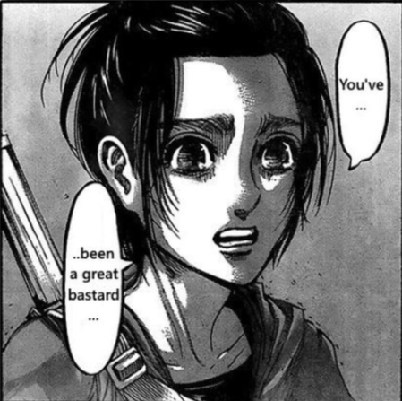

Gabi is the main character since the Marley arc, and she appears as a passionate and somewhat attractive young girl until, well, she kills Sasha in *Assassin’s Bullet* (凶弾), Ch. 105. After that, almost every AoT fans hate her, as if she is the second Reiner. I remember there are people who simply call her “Garbage” instead of the real name Gabi. However, I cannot help but feel interested in the characters like Reiner and Gabi, and I think Gabi could be considered the most important character in the early stage of Marley arc.

Just a Reminder: Anyone who is interested in Sasha can read [Sasha and the Only Innocence](../../Sasha_And_Innocence/English/sasha_and_innocence.md).

### The Character

In the beginning, Gabi could be seen as the successful result of the Marleyan historical education, which I have been discussed in [The Humanity in Attack on Titan (Part II)](../../Humanity_Part2_History/English/humanity_part2_history.md).

The first turning point is the surprise attack from Eren and the survey corpse, in which she sees her hometown being completely destroyed, from *The War Hammer Titan* (戦鎚の巨人), Ch. 101 to *Assassin’s Bullet* (凶弾), Ch. 105. Her hatred to the demons of Paradis Island then grows so much that she chases her enemies to the airship, and gets captured after killing Sasha.

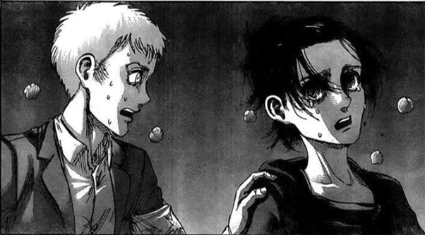

After that, she meets her second turning point after confessing to Niccolo who she sees as an ally, only to be attacked by him. She is then taken to Sasha’s father, but is then forgiven by the one she sees as a demon, in *Children of the Forest* (森の子ら), Ch. 111. By the way, I think the title of chapter 111 does not only mean the kids who live in the forest like Sasha, but also implies that Gabi cannot a way out of the forest in which she gets lost.

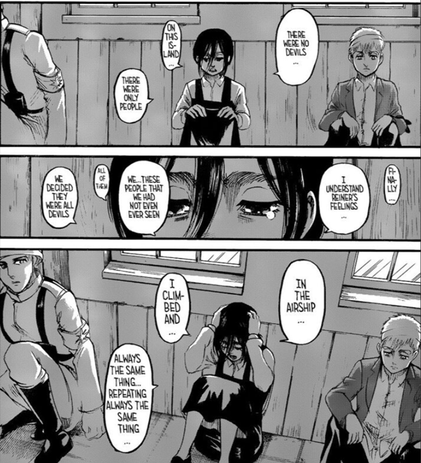

Gabi then begins to understand that people on this island are nothing more than the normal people just like herself, and completely gets rid of her hatred after hearing the conversation between Kaya (the one saved by Sasha) and Sasha’s father, in *Sneak Attack* (騙し討ち), Ch. 118. Finally, she is reconciled with Kaya after saving her, in *Thaw* (氷解), Ch. 124.

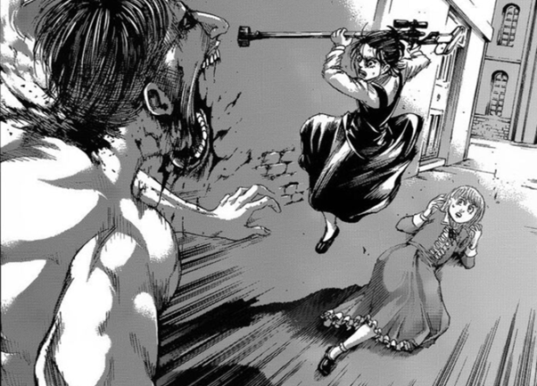

### Symbol

I discuss that Isayama is good at coming up with several symbols that represent what we feel in reality, in [The Humanity in Attack on Titan (Part III) - Literature](../../Humanity_Part3_Literature/English/humanity_part3_literature.md). For example, in *Titans* (巨人), Ch. 137, Armin picks up a leaf to represent his friendship with Eren, but it becomes a baseball from Zeke’s perspective.

Leaf is a leaf, but is also the friendship with Eren from Armin’s perspective. What a symbol does, is to represent something abstract with something concrete. The most famous symbol might be A Star of David in World War II, used by Nazi in the Holocaust to identify Jews. In such racist society, this badge, as a symbol, represents the inequality or, more specifically, the discrimination to Jews. In other words, this badge is a badge appearing a yellow hexagram, but is also the subordination and oppression from the perspective of Jews.

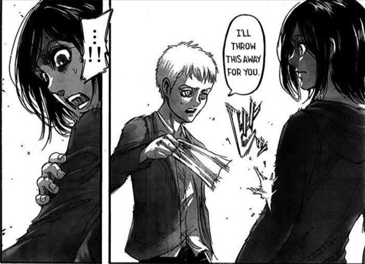

The armband used to identify Eldians in Marley works similarly, which also represents the slavery and is significantly related to the main idea of AoT, freedom. In *A Sound Argument* (正論), chapter 108, Gabi insists wearing the armband right after it is taken off by Falco. Her behavior here, also as a symbol, represents her slavery. It reminds me of the famous Panopticon, too. On the contrary, in *Sneak Attack*(騙し討ち), Ch. 118, it becomes Gabi who takes off Falco’s armband after Falco’s confession. Her behavior here, as a symbol again, represents her being free in the end.

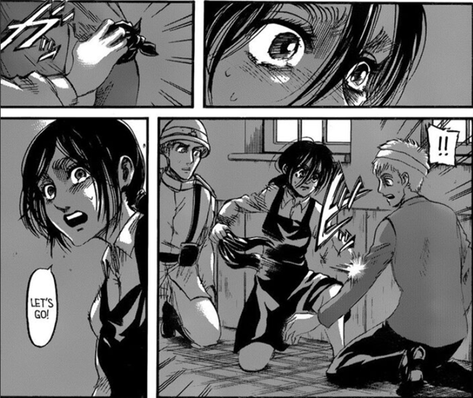

By the way, the title here is interesting, too. Chapter 108 contains four debates, the one about Historia’s pregnancy, the one about believing Eren or not, the one about taking off the armband, and the one about the ambush to Paradis Island. “正論” is translated as a sound argument, yet in Japanese it can be used as a sarcasm. This might have some implications what Gabi argues for her armband.

Another one which seems to be a symbol is the hairstyle. It seems the Gabi’s hairstyle is similar with Eren’s. They both have a somewhat longhair and sometimes a ponytail. Although I don’t figure out what it stands as, Gabi has almost the same life as Eren does. Eren meets two turning points similar with Gabi. He sees his mother eaten by a titan, and decides to kill all the titans in the world with hatred. After that, he realizes the truth of the world and knows that it is not as simple as he thinks.

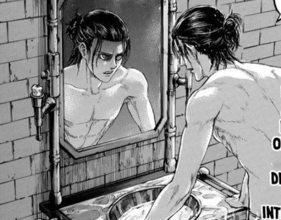

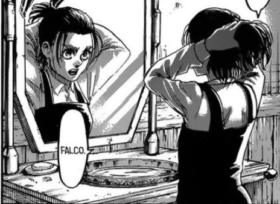

For the last but not least, Gabi seems to have a good gun-shooting skill, as we can see in *Assassin’s Bullet* (凶弾), Ch. 105, *Two Brothers* (兄と弟), Ch. 119, and *Thaw* (氷解), Ch. 124. If there is any other one with the same skill, it should be Sasha, as we see in *I’m Home* (ただいま), Ch. 36, *Location of the Counterattack* (反撃の場所), Ch. 54, *Welcome Party* (歓迎会), Ch. 64, and *Assault* (強襲), Ch. 103. It is not a coincidence, in my opinion, because Kaya is saved twice by Sasha and Gabi with their shooting skills. Gabi in a sense inherits the identity of Sasha, with the symbol of shooting skill.

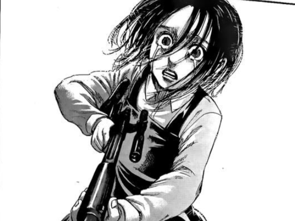

### Love, Freedom, and the Dark Fate

Reiner asks Falco to save Gabi from their deep and dark fate, in *Midnight Train* (闇夜の列車), Ch. 93. Reiner knows how Gabi thinks better than anyone else, and Gabi will end up the same way he did in Paradis Island. Reiner always suffers from the guilt and is eager to die, which I discuss a lot in [Self-hating as Reiner Does](../../Reiner_From_Suicide_To_Freedom/English/reiner_from_suicide_to_freedom.md). As a result, he does not want this to happen and thus asks Falco to save Gabi.

Pardon me for talking about the title again. The midnight train implies the path to the dark future. While the train is physically taking Gabi, at midnight, to the internment in which the Eldians are being oppressed, it is also taking Gabi to the dark fate where she knows nothing but the hatred to the islanders. The symbolization of train can be also found in *Puella Magi Madoka Magica*. (**Spoiler**→) In episode 9, after Sayaka finally becomes a witch, Kyoko takes her corpse with Homura and meets Madoca on the rails at midnight. (←**Spoiler**) I think the rails somewhat represent the different paths or possibilities. What Reiner asks, then, is that Falco could lead the train to a different path for Gabi.

In *Puella Magi Madoka*, (**Spoiler**→) the fate cannot be twisted, as the more Homura wants to save Madoca, the less possible Madoca can be saved from becoming a witch. (←**Spoiler**) In AoT, however, Gabi successfully avoids the same path as Reiner. She is saved by Sasha, Niccolo, Kaya, Sasha’s father, and most importantly, Falco.

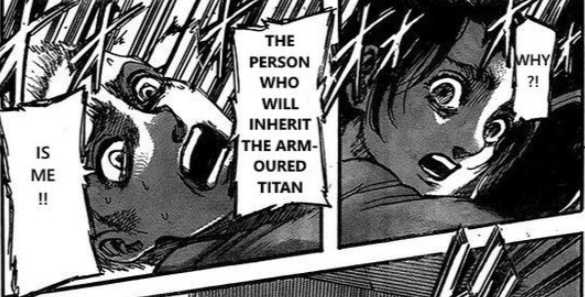

> “The one who will inherit the armored titan… IS ME!” — Falco, Assassin’s Bullet (凶弾), Ch. 105

In my opinion, this leads to an important issue which seems to lack in AoT, the power of love. In fact, Isayama does not really focus on the feeling of love until Marley arc, and Falco and Gabi could be the first who really represent the real love story. Although love can sometimes undermine one’s freedom, as I discuss in [The Humanity in Attack on Titan (Part I) - Philosophy](../../Humanity_Part1_Philosophy/English/humanity_part1_philosophy.md), Falco‘s love to Gabi nonetheless sets her free from being a slave anymore. Falco, as a falcon, symbolizes the freedom bringer. A similar symbol of a falcon representing freedom also appears in *The Dawn of Humanity* (人類の夜明け), Ch. 130, and Eren, with his boy appearance, opens his arms and says freedom as if he is flying, in *Rumbling* (地鳴らし), Ch. 131. Chapter 137 was just released when I am writing this article, but this point of view, I think Eren will be saved by Mikasa in the end, and I cannot come up with a better ending. This has been implied by Kruger in *Meeting* (会議), Ch. 89, in which he tells Grisha to try to love, in order to save Mikasa, Armin, and everyone else. It is nonetheless hard to say whether behaviors based on love will lead to a good ending or not, with, again, the example of *Puella Magi Madoka*, in which (**Spoiler**→) Sayaka falls mainly because of love, while Madoka is saved because of love, too. (←**Spoiler**)

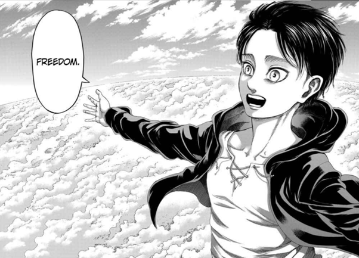

### Most of Us Are Not Better than Gabi

> We learn from history that we do not learn from history. — Hegel

As I see in any forum discussing Gabi and any video on Youtube about the reaction mashup of season 4, people tend to hate Gabi, feel tired of her keeping claiming the crime of Eldians thousands of years ago, or just laugh at her innocence and ignorance. Let me quote a part of the conversation between Gabi and Kaya, in *Guides* (導く者), Ch. 109.

> “There are people outside the walls and they call us devils, but I don’t understand why they hate us so much. Mia, Ben, Tell me. What did my mom do? What did she do to deserve this hatred?”
>  “That’s because for thousands of years…We have been slaughtering people all over the world.”
>  “Thousands of years?”
>  “You think you forgot all that! For thousands of years, Eldians use the power of titans to subjugate and exploit the world. Stealing other cultures, forcing people to give birth to children they don’t want. Killing an unaccountable number of people. Even if you devils inside the wall turn a blind eye, the world will never forget these sins, and that’s why things turn out the way they are now. Stop pretending to be the victim.”
>  “But my mom was born and raised in this area. I don’t think she has ever done any of those terrible things.”
>  “As I said, 100 years ago your ancestors committed an unforgivable sin.”
>  “A hundred years ago, but what did we in the present do wrong?”
>  “Recently, you destroy my town…”
>  “My mom died four years ago. That’s not her fault.”
>  “As I said, your ancestors massacred people around the world…”
>  “MY MON DIDN’T KILL ANYONE! Mia, answer me. Why did my mom die such a painful death? There must be some reason. It doesn’t make sense. Why was my mother eaten alive? Why did she die?”

Well, Gabi simply seems stupid here. You can say that she has just been brainwashed and cannot figure out the truth. In fact, some people argue that Sasha’s father and his family including Kaya is exactly Marleyans instead of Eldians for two reasons. First, Gabi recognizes their southern Marley dialect as they first meet each other, in *Guides* (導く者), Ch. 109. Second, when Eren drags all Eldians to the path and tell them he is going to bring ruin to the world, it seems that the family members of Sasha’s father know nothing about this after that, as we can see in *Thaw* (氷解), Ch. 124. If it is the case, it simply feels more ironic as the one Gabi argues against is exactly a Marleyan, and it makes Gabi seem more stupid. As I mention in the beginning, however, I sincerely recommend reading [The Humanity in Attack on Titan (Part II) - History](../../Humanity_Part2_History/English/humanity_part2_history.md), in which I try to explain why history could be dangerous to people.

Some people consider Gabi stupid. They are probably right. However, you need to agree that most people don’t act better than Gabi. People living in the Eastern Europe and Southeast Asia, my country Taiwan included, should know this better than anyone else. Wars never end here, and we have been colonized by different countries for hundreds of years. It is just hard to know who you are, where you come from, and what culture you belong to. We Taiwanese have been colonized by Netherlands, Spain, Ming Empire, Qing Empire, Japan, and China. Yet we are still struggling for being recognized as a country while currently China still claims us as a part of them.

History is complicated, after all. If you think you are better than Gabi, then you should ask yourself one thing. How much do you know about the history of your country? What is the difference between what you learn and what Gabi learns? People living in Taiwan called themselves Japanese a hundred yeas ago, and called themselves Chinese fifty years ago. Who exactly are us? A similar question is asked by Pieck, in *Above and Below* (天地), Ch. 116, and Gabi cannot find a proper answer for this.

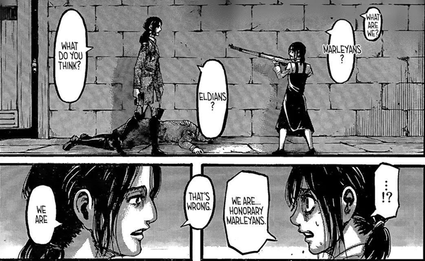

> “Are you a Taiwanese, or Chinese?”

> “…I am an R.O.C.er?”

Gabi’s recognition confusion of her country and hatred to her Eldian ancestors clearly represents the Taiwanese problem. Take the 228 Incident, for example. For Taiwanese, this should be considered a massacred to the local people by a foreign army. If one tends to consider zieself a ROCer (Republic of China, well, not People Republic of China. Don’t be confused.), this at best can be interpreted as a bad policy by the local government. The confusion of the historical interpretation still exists in our languages and culture, which is also the problem that Taiwanese needs to deal with soon. Maybe you know it or not. Many Taiwanese nowadays still see themselves as a part of the Chinese (中華, not 中國) culture, and this has always been so confusing for most foreigners.

Isayama offers this issue for as to think about, not just a stupid girl. This is also why AoT is so great, because it is also the reflection of all people in the world. Do you know that the sun rises in the west? I think this world is a big mirror which reflects the reality of our real world. We live in history, yet seldom people know its importance. That’s why we never learn anything from history.

")