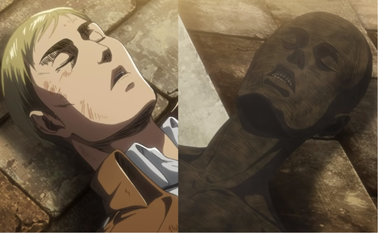

> 完成一個夢想也意味著失去一個人生的意義。

> 暴雷警告：漫畫84話或動畫55話

### 介紹

艾爾文的死亡是《進擊的巨人》中最讓人動容的場景之一。實際上在那場戰役之中也留下了諸多讓人難以忘懷的事件。艾爾文對於新兵的演講和隨後的自殺式攻擊、里維和野獸巨人的戰鬥、阿爾敏為了擊敗超大型巨人的犧牲、為了選擇救艾爾文還是阿爾敏的爭執。雖然每個事件值得大書特書，但這篇文章的目的很單純，就是為了解釋一個問題──為什麼里維選擇救阿爾敏而不是艾爾文？

### 背景

如果讀者已經忘記這個事件是怎麼一回事，這裡有一個簡單的回顧。艾爾文死在漫畫第84話〈白夜〉(白夜)或是動畫第55話〈白夜〉(白夜)中。兩者在劇情上沒有明顯的分歧。

艾爾文當時在側腹部受到了嚴重足以致命的傷害，因為他為了幫里維轉移野獸巨人的注意力而領導新兵做自殺式的攻擊，而被野獸巨人丟出的石頭砸中了身體。另一方面，阿爾敏也因為全身嚴重燒傷而在死亡的邊緣中掙扎，原因是為了幫艾蓮爭取時間而做為超大型巨人的誘餌。

巨人針只有一劑，因此只能拯救一個人。要救誰的爭執就要演變成手腳之爭時，漢吉即時出現並說服米卡莎放棄。然後我們就看到最另人動容的一幕，艾蓮抓住里維的腳踝，透過詢問里維是否知道大海來做最後的哀求，直到弗洛克把他拉走。

里維決定把巨人針用在艾爾文身上，但被艾爾文一個舉手的動作給打斷。他馬上意識到艾爾文在彌留之際夢到了他小時候舉手問父親那個影響他人生最重要的問題，也就是大家怎麼知道牆外沒有任何人存活。接下來如我們所知，里維決定把針劑注射給阿爾敏，艾爾文隨後就過世了。雖然弗洛克有詢問過原因，里維並沒有正確回答，只是請求他能夠原諒團長。漢吉隨後也表達他對這件事情的不理解，但也接受了這個結果。

### 為什麼里維選擇了阿爾敏？

《進擊的巨人》擁有非常嚴謹的劇情，因此阿爾敏當然不是因為做為主角而擁有不死之身。我認為里維最終選擇他的原因有兩個，而第一個理由與這部作品的核心議題，也就是自由，脫不了關係。

《進擊的巨人》可以被視為是一部在討論何謂自由的作品。去到牆外的自由，能不被歧視為惡魔的自由，能用普通人生活的自由。對這個議題有興趣的人也可以看看我在[漫畫心得：《進擊的巨人》中的人文情懷（上）-哲學篇](../../Humanity_Part1_Philosophy/Mandarin/humanity_part1_philosophy.md)中的討論。

何謂自由？要怎麼成為一個自由的人？雖然整部作品都嘗試著在回答這個問題，在第69話〈友人〉(友人)中肯尼．阿卡曼卻給出了一個非常有趣的觀點。他認為所有人都是某件事情的奴隸，所有人都必須要醉心於某件事情才能夠進繼走下去。我們可以理解成沒有目標的人生沒有活的價值，而擁有目標才是人人的本質。

從這個角度來說，艾爾文正是他夢想的奴隸。他用盡他的一生嘗試證明他父親對於牆外有人的假設是正確的。他甚至把這個夢想置於全人類未來的前面，並曾經想要放棄他的戰友和部下，獨立進入藏著他夢想的地下室。我們可以在第80話〈無名的士兵〉(名も無き兵士)他對於里維的坦白中看到這件事情。

")

里維說服艾爾文放棄夢想之後，艾爾文露出了一臉解脫的神情。我當時並沒有看懂，一個剛放棄夢想即將赴死之人為何不是形容枯槁呢？我反覆閱讀了很多次，最終得到了艾爾文是因為終於獲得自由才顯現出這種表情的結論。他當然知道自己即將赴死，也知道自己已經失去活下去的目標了。不過他也不再是自己夢想的奴隸了。

艾爾文身為自己夢想的奴隸，最終籍由放棄夢想來獲得自由。如果真是如此，那里維沒有救他的原因就是他不想要把艾爾文再拉回這個他無法成為自由之身的地方。里維比任何人都瞭解這件事情，作者特別在他做決定的時候，讓我們看到過去里維所看到的，阿爾敏的夢想和肯尼的坦白，以及最後艾爾文放棄夢想時的神情，因此里維決定讓他離開，讓他獲得自由。這是第一個理由。

中的片段")

### 艾爾文與他的夢想

第二個理由則與艾爾文的夢想有關，與之相關的線索一直藏在故事的細節之中。如同前述，艾爾文一直對於自己部下的死亡有很深的罪惡感，這主要來自於他實際上是為了自己的夢想，而非人類的未來在奮鬥。雖然他最後選擇犧牲自己，但實際上他曾認真思考過如果作戰失敗，自己仍然能夠進入地下室的可能性。比如說，在第76話〈雷槍〉(雷槍)中，回顧了自己一生的艾爾文雖然對於戰友的死亡感到自責，但隨後就想到了自己即使在戰敗之後仍然有機會進入地下室。看得出來這個夢想對於艾爾文來說，可以算是他人生中最重要的事情，一直到對里維的告白以及領導自殺式攻擊之前，他大概都認定這比人類的未來都還要重要。實際上，蕯克雷和皮克西斯也對此相當清楚，我們可以在第62話〈罪〉(罪)和第63話〈鎖〉(鎖)中艾爾文與他們的對話看得出來這件事情。

里維清楚這件事情嗎？我認為答案是肯定的。在第71話〈我曾經做過的夢〉(いつか見た夢)中，艾爾文詢問過里維是否能夠將巨人針劑託付給他，而里維詢問這為什麼不是一個命令，而是一個詢問。我認為艾爾文以詢問代替命令的原因是來自於他的罪惡感，這件事情我在[艾爾文心中的惡魔](../../Erwin_The_Real_Demon/Mandarin/erwin_the_real_demon.md)中有非常詳細的討論。里維很清楚這件事情，因此他隨後馬上詢問艾爾文在完成夢想之後會想要做什麼，並得到了一個不清楚的答案。

另外一個細節則藏在第72話〈收復作戰的夜晚〉(奪還作戦の夜)中。里維和艾爾文有一段非常有趣的爭論。里維再度詢問艾爾文在完成夢想之後會想要做什麼，並接著要求艾爾文待在安全的後方指揮大家。艾爾文雖然提出了一些冠冕堂皇的理由，但是馬上就被里維斥為無稽之談。不過里維最後還是放棄說服艾爾文，在他確認了艾爾文把自己的想法視為比人類的勝利都還要更重要之後。

我們可以從這裡推論出，里維其實比任何人都還要更瞭解艾爾文內心的想法。他知道艾爾文大概把自己的夢想放在人類的未來還要前面，因此艾爾文才會在缺少一隻手臂的情況下仍然堅持要上前線，這樣的話在戰敗的情況下才會還有機會能夠一探地下室的秘密。這就是為什麼里維會直接打斷艾爾文，因為他知道再好聽的理由都只是他的一些藉口而已。最後，雖然艾爾文遠離前線的選擇應該是對人類最好的，但里維仍然決定「相信艾爾文的判斷」，因為他知道，沒有任何東西可以阻擋他眼前的男人向其夢想獻出自己的心臟。

")

里維此後的行動與這次爭論有沒有什麼關係呢？我認為是有的。假設你身邊有任何一個人，就像是艾爾文一樣用盡一生在追尋某個夢想，當他完成夢想的時候會發生什麼事情呢？完成夢想對於一個人來說，就相當於是失去了人生意義一樣。當時里維正準備要把巨人針劑注射到艾爾文身體時，被艾爾文舉手的動作給打斷了。處在彌留之際的艾爾文夢見了他舉手詢問父親問題的時刻，也是影響他一輩子的那個時間點。我認為，這也許讓里維想到了艾爾文即將失去人生的意義，失去了他整個人生的動力來源，既然如此，為什麼要把他叫回來承受這種痛苦呢？這就是第二個原因。

很難說兩個理由中哪一個比較合理，而且說不定你跟本就不認同我提供的任何一個想法。不過這部作品中本來就不會有什麼簡單的答案就是了。艾爾文的死亡是我最喜歡的橋段之一。我們在人生中難免會遇到難以決擇的時刻，在阿爾敏和艾爾文之間做出選擇就像是這種艱難的選擇。雖然最終艾爾文仍然在不知曉這個世界的狀態下過世了，他做為第13任調查兵團團長可以算是出色地完成了任務。最重要的是，他最終也獲得了自由。
