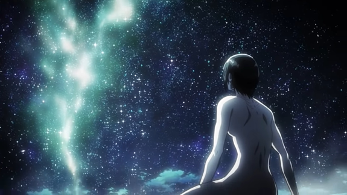
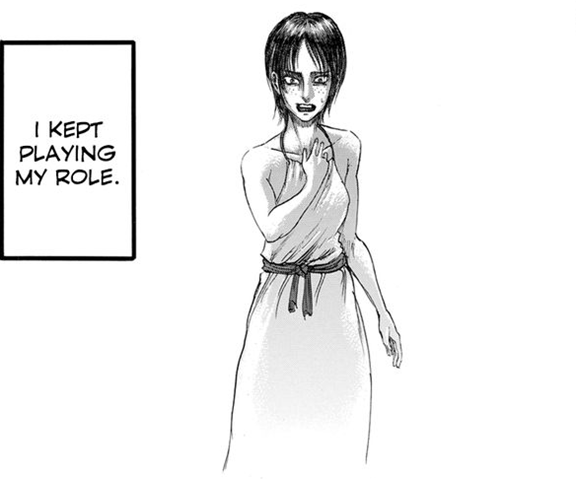
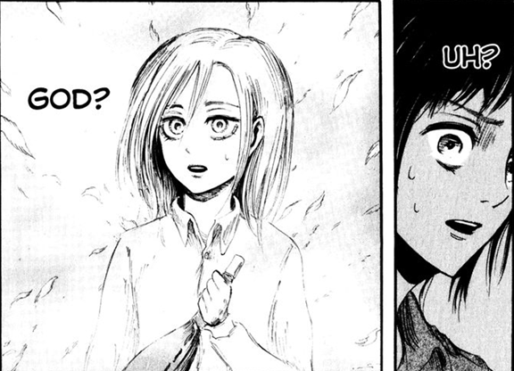
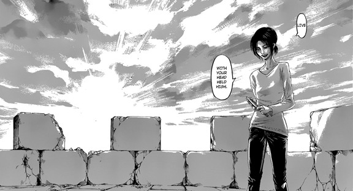
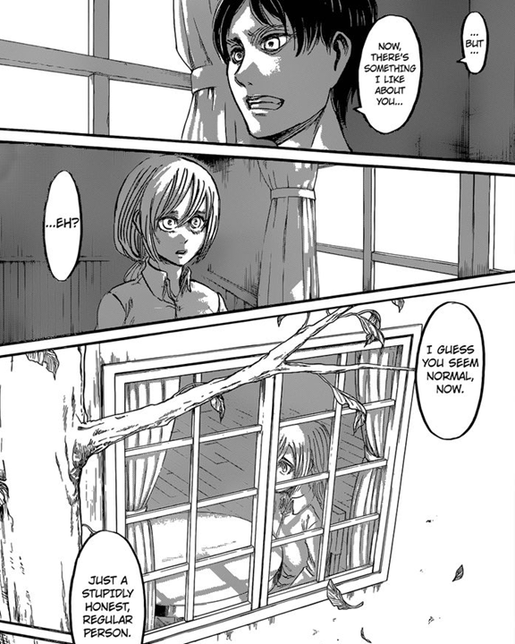
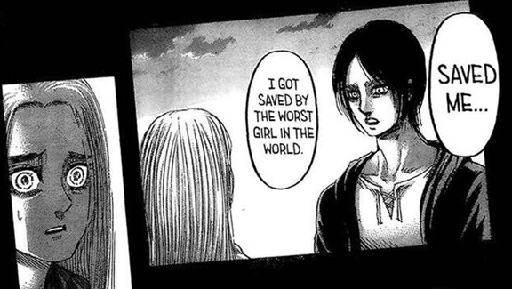
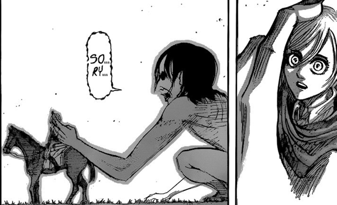
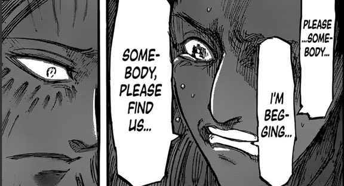
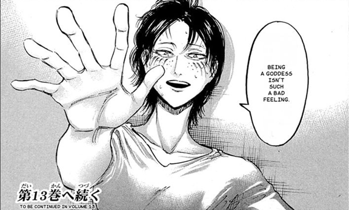
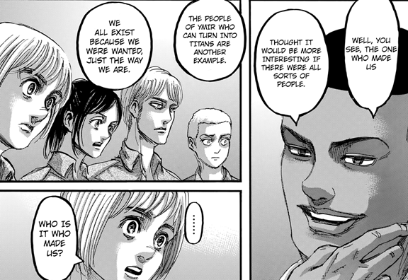

> 「我們都是因為被需要而存在的。」- 歐良果彭

> **暴雷警告：直到漫畫第137話**

> **我也會在文章裡談到《獵人》、《Code Geass 反叛的魯路修》、《黃金神威》、《悲慘世界》以及《底特律：變人》。不想被暴雷的人可以跳過「(暴雷)」的段落。**

身為作家所遇到的難題之一就是在闡述角色內心想法的方式。平鋪直述地把想法講出來一般來說都會顯得過於刻意，因此許多人會採用讓不同角色之間對話的方法來間接展現其人生哲學。換句話來說，與其讓一個角色不斷地在內心獨白，不如創造另一個與其對立的角色，透過兩個人的爭辯來讓讀者瞭解這個角色。這就是一種創作的技巧。

在《進擊的巨人》中也許多類似的例子，比如在第80話〈無名的士兵〉(名も無き兵士)中用里維來襯托艾爾文的想法（對艾爾文有興趣的人可以看看[艾爾文心中的惡魔－《進擊的巨人》中的《烙印勇士》](../../Erwin_The_Real_Demon/Mandarin/erwin_the_real_demon.md)）；約翰的角色特質基本上就是建立在馬可的死亡之上（可以看[約翰的怒火，歷史洪流中的無可奈何](../../Jean_And_The_Burden_Of_History/Mandarin/jean_and_the_burden_of_history.md)）；賈碧是因為法爾柯，才能在最後能夠擺脫憎恨的歷史（可以看[從晦暗不明的未來中拯救賈碧 — 從種族的符碼到國族的認同困境](../../Saving_Gabi/Mandarin/saving_gabi.md)）；而我們也可以透過比較在第99話〈內疚的身影〉(疾しき影)以及第100話〈開戰宣言〉(宣戦布告)中艾連與萊納的地獄來更瞭解兩人的想法（可以看[艾連的地獄，屠殺的道德正當性](../../Eren_Hell_And_Genocide/Mandarin/eren_hell_and_genocide.md)）。

尤米爾與希絲特莉亞的關係也是如此。我們不只透過兩人的互動來瞭解這兩個角色，也同時可以看出作者想要傳達的想法。雖然兩人的故事在劇情中段就已經告了一個段落，但我認為他們的這段感情仍然值得在此記上一筆。

### 愛自己

尤米爾和希絲特莉亞劇情的轉戾點是出現在第40話〈尤米爾〉(ユミル)中。尤米爾在請求希絲特莉亞用真正的名字活下去之後，就化身成了巨人跳下城堡與其它巨人戰鬥。當時尤米爾是這麼說的：

「克里斯塔，我也曾經是如此想的，認定如果自己一開始就沒有出生在這個世界上反而會是更好的。我的存在本身就導致了我受到的憎恨，而我也為此而死。然而當時我也因此下定決心，如果我有第二次活下來的機會，這次我想要只為自己而活。這是我發自內心的渴望。」

尤米爾這一段話是什麼意思呢？在第89話〈會議〉(会議)中，我們可以看到尤米爾小時候是一個路邊的乞丐，但卻被帶到某個宗教團體視為皇家成員的後代，還甚至被冠以「尤米爾」的名號。然而，被瑪雷當局破獲的組織卻反過來誣陷尤米爾是始作俑者。尤米爾雖然選擇繼續扮演其角色，最後卻還是與組織成員一起被送往「樂園」。

被誣陷的尤米爾當時為什麼選擇繼續扮演她的角色呢？我們從她的記憶中可以看到，這是因為她在這個角色中得到了被需要的感覺。而之後她的第二次機會則是意外吃掉馬賽，如同我們在第95話〈騙子〉(嘘つき)中所見。此後她決定要為自己而活，直到遇見希絲特莉亞後又再次改變了想法。

為什麼是希絲特莉亞呢？在第40話〈尤米爾〉(ユミル)中我們可以看到，尤米爾在希絲特莉亞的身上找到了某些屬於自己的特質。希絲特莉亞做為一個私生子，被遺棄並獲得一個新的假名「克里斯塔」後，被送到了訓練兵團。此後她總是假扮成一個會為他人著想的小孩，但就如同尤米爾指出的一樣，其實她只是想要一個會受他人認可的死亡方式而已。這也正是為什麼她在嘗試拯救達茲的時候，完全沒有尋求尤米爾的幫忙。

那為什麼希絲特莉亞會變成這樣呢？如同尤米爾一樣，在被父親遺棄之後的她認定自己是不被需要的小孩。這導致了她自殺傾向的人格特質以及尋求他人認可的渴望。因此做為克里斯塔，她不斷地想要透過幫助他人來讓自己陷入生命危險。比如說，在第11話〈回應〉(応える)中，她不斷志願要去支援前線；在第15話〈一個一個〉(個々)中，她幫了莎夏一把；在第21話〈開門〉(開門)中，她雖然很害怕但還是決定加入調查兵團；在第24話〈巨樹森林〉(巨大樹の森)中，她則是帶著額外的馬來幫了阿爾敏、約翰以及萊納一把。

尤米爾是最清楚只為他人好的生活態度會遭致什麼後果的人，因此她沒有辦法對希絲特莉亞的行動睜一隻眼閉一隻眼。她所想要做的，就是提醒希絲特莉亞關於愛自己與自我肯定的重要性。順道一提，同樣的主題也在第71話〈旁觀者〉(傍観者)描述地非常好，也就是艾連母親告訴夏迪斯教官的那一段話。能夠出生在這個世界上本身就已經是很偉大的事情了。

希絲特莉亞最後接收到了尤米爾的想法，並在第41話〈希絲特莉亞〉(ヒストリア)中決定用自己的姓名繼續活下去。她也同時捨棄了總是為她人著想的人格特質，但如同艾連在第54話〈反擊的場所〉(反撃の場所)中所提到的一樣，這反而讓她的行動顯得更自然，也更像是一個普通人。事實上，艾連曾被教官提到擁有最堅定的目標，也可以理解成他是一個最「真」的角色吧，難怪他能夠感受到克里斯塔的虛假之處。

這段對話或多或少在最後影響了希絲特莉亞，讓她決定拒絕把艾連吃掉。當時她正準備要打入巨人針劑，理由則是與她的責任有關，不過最後映入她腦海中的尤米爾的一番話，促使她決定丟下針劑跑去救艾連。這段應該要怎麼解釋會比較好呢？守住自己的責任同時意味著為他人而活。即使打入針劑最後能夠獲得她一直夢寐以求的父親的愛，這也與愛自己相去甚遠。此外，艾連當時正受到與希絲特莉亞過去相同的痛苦。他認定自己打從一開始就不該出生在這個世界上，但這正是希絲特莉亞過去一直想要逃離的想法，也因此最終她決定要拯救眼前這個無助的男孩。

「雖然我是人類的敵人，但我是站在你這邊的，艾連。我沒辦法成為一個好女兒，也不想成為什麼神。我只是，如果看到人在我面前，一且哭一且說根本沒有人需要他，我就會想對他說，根本不是這麼一回事啊。」第66話〈願望〉(願い)

這也大概是為什麼艾連在第130話〈人類的黎明〉(人類の夜明け)中會提到希絲特莉亞正是拯救他的人。我認為希絲特莉亞不只拯救了艾連免於死亡的命運，也同時從自我厭惡的深淵中拉了他一把。最終艾連在第130話〈人類的黎明〉(人類の夜明け)決定拒絕吉克的「安樂死」計畫，因此吉克在第115話〈支持〉(支え)中提到，這個計畫的目的正是他認為一開始就不應該出生在這個世界上是對艾爾迪亞人比較好的，而艾連當然是不會認同這件事情的。當然啦，拯救艾連的女孩可曾經過說人類最好都被巨人吃光算了，艾連會發動地鳴也是情有可緣就是了XD

### 愛他人

雖然尤米爾一直都在叫希絲特莉亞要為自己行動，但在往後的章節中我們可以看到她實際上也不是如此。比如說，在第41話〈希絲特莉亞〉(ヒストリア)中，她冒著生命危險與巨人戰鬥，而且還為了不破壞城堡而陷入危機。此外，在第37話〈往西南〉(南西へ)中有一段希絲特莉亞和尤米爾的對話，對話中提到了尤米爾為了讓希絲特莉亞能夠進入安全的牆內，而故意在訓練中沒有表現好，最後才讓希絲特莉亞成為訓練兵中的第十名。這看起來似乎是與尤米爾的人生哲學有所矛盾。

不過，如同我們在第47話〈孩子們〉中所見，尤米爾大概是愛上希絲特莉亞了吧，因此她才會在顯然風險過高的情況之下還是強迫萊納以及貝爾托特要抓回希絲特莉亞。雖然尤米爾一直都向希絲特莉亞解釋說所有一切都是為了她自己，但這也顯然是個謊言，因為在第50話〈怒吼〉(叫び)中，她意識到牆內也有未來之後就選擇放走了希絲特莉亞。

當然了，你也許是一個心理利己主義(Psychological Egoism)的支持者，因此認定尤米爾的確只為了她自己而行動。不過我認為兩種行動間還是有一些差別存在。比如說，在第93話〈暗夜列車〉(闇夜の列車)中波爾柯就曾經提到，尤米爾如果不想要死掉的話，是可以經由把希絲特莉亞帶回來來取得活下去的機會的，然而她最終並沒有這麼做。

尤米爾和希絲特莉亞的互動在某種程度上也可以算是對我的一種救贖吧。同樣是為了他人而行動，作者在此卻描述出了兩種截然不同的狀況。一種是從來沒有考慮過自己的行動，另一個則是雖然考慮過，但為了愛卻還是做出為他人而活的選擇。

事實上，我認為這也正是為什麼在第48話〈有沒有誰〉(誰か)中，在貝爾托特因為受不了約翰和柯尼的質問而崩潰，反駁自己才是正在受苦的那一方並懇求有沒有誰能夠找到他們的時候，尤米爾之後決定救他們而非逃跑。雖然她也知道最後她會因此而被吃掉，但最後她還是選擇成為那個找到貝爾托特的人，成為那個會為他人利益而行動的人。

我誠心地建議，盡你所能地嘗試愛自己看看吧，雖然我知道這常常是一件非常，非常困難的事情。

### 名字的重要性

尤米爾要希絲特莉亞用自己的姓名生活。我認為這一個橋段也同時是作者想要告訴我們名字的重要性。事實上，類似的想法常常在近幾年很流行的人工智慧作品(或cyberpunk類型)中出現，當一些機器開始意識到自我的時候，他們通常也會需要一個只屬於自己的名字。著名的例子有《銃夢》(《戰鬥天使艾莉塔》)、《攻殼機動隊》、《尼爾：自動人形》和《底特律：變人》等等。

這些機器常常會同時有一個可以認定自己身份的號碼(產品編號等)，但也會有一個專屬於他們自己的名字。但為什麼會在已經可以識別身份的情況下，還需要一個名字呢？如果要識別身份的話，為什麼不選擇一組簡單的號碼就可以了呢？

當然，這個議題其實早就已經被廣泛地討論過了。大部分的討論都會同意名字也代表著一個人的人格，也是一個人能夠做為自己存在的證明。這是什麼意思呢？也許用一些例子來解釋會比較清楚。在《悲慘世界》中，（**暴雷**→）尚萬強在獄中被稱為是24601而非其本名（←**暴雷**），這就是因為在監獄中的尚萬強只是一個犯人，並沒有被視為是一個獨特的人。不是人的東西當然就沒有必要給他名字了，而我們也可以從此看出名字做為人的本質之處。

在《獵人》中，（**暴雷**→）梅路艾姆在第261話〈突入①〉(突入①)中詢問自己，為何做為一個無所不能的存在卻還是不知道自己的名字，他也因此在第290話〈名字〉(名前)中決定為了知道自己名字而和會長決鬥。在第318話〈遺言〉(遺言)中，梅路艾姆則在生命即將結束之際，請小麥再說他的名字一遍。（←**暴雷**）我個人真心推荐如果沒有看過獵人的人，可以至少把嵌合蟻這一篇好好看過一次，這也是我認為獵人最精彩且動人心弦的一段。從這個角度來看，名字正是自我能夠存在於這個世界上的證明。

名字代表一個人的人格與身分，也同時是存在這個世界上的證明。這件事情在《底特律：變人》中有非常詳細的說明。(**暴雷**→)如果你有玩過這個遊戲的話，你應該會記得卡菈曾經遇到過一個長得與愛麗絲一樣的另一個仿生人YK 500，並做出對這個角色最重要決定之一，也就是拋棄愛麗絲與否的決定。當然應該是沒有什麼玩家會選擇拋棄的選項啦。但是這也同時代表著，卡菈所需要的其實並不是一個被稱作YK 500的東西，而是一個被稱作愛麗絲的人。愛麗絲在此所代表的與YK 500不同，不只是一個名字，而是愛麗絲這個人的身分，而這也正是卡菈所需要的。當然反過來說，愛麗絲所需要的也是卡菈，而非任意一個同樣型號的家務機器人。

康納的劇情中也有有類似的橋段。如果玩家選擇維持機器人的身分，那最後就會被更新型號的機器人RK 900給取代。這是因為做為機器人所擁有的就只是RK 800的代號，而RK 800並沒有辦法顯示出人類的獨特性。康納只有做為康納，才是真正活在這個世界上的人類(←**暴雷**)

如果你能接受以上的觀點，那你應該就也能接受名字對於一個國族的重要性吧。這種最意識型態的東西反而常常是最根本而且最重要的東西。比如說，在《Code Geass 反叛的魯路修》中，(**暴雷**→)戰敗的日本被剝奪了名字而成為十一區，而起身抗爭的人則稱自己為日本人。(←**暴雷**)此外，無論是自己還是國族的名字，都必須要用自己的語言才能夠正確地稱呼。這在《黃金神威》第182話〈關於我不熟悉的父親〉(私の知らない父のこと)中有提到，(**暴雷**→)一個民族最重要的就是保護自己的語言和信仰。(←**暴雷**)

無論如何，尤米爾做為一個其實並不是很重要的角色，只是剛好在一場意外之下獲得了巨人之力，才剛好在進巨的劇情中佔有一席之地。但即使是如此，我們也能夠看到她的人生哲學如何深深影響其他人以及甚至主角本人。這也是為什麼我如此喜愛進巨的原因，畢竟我們可以發現即使是一個小小的配角，都能夠在其中挖掘出如此深刻的意義。
