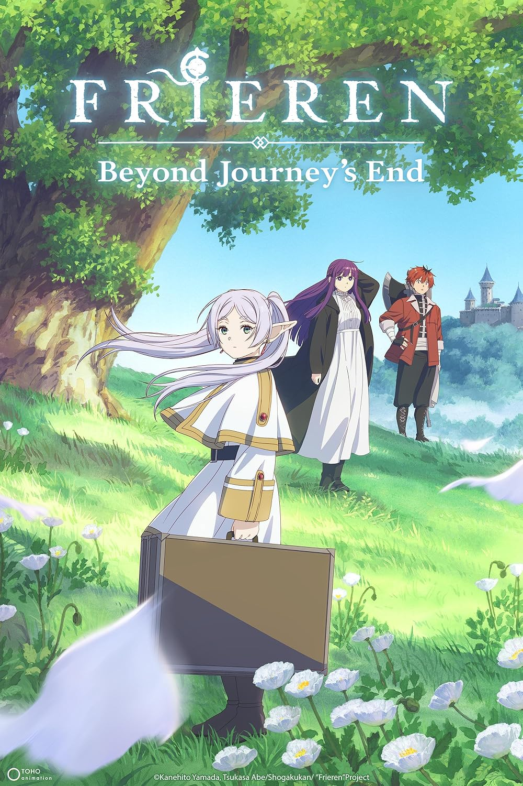

在寫這篇文章的當下，《葬送的芙莉蓮》動畫第二季也已經播出一段時間了。
這部作品有很多看似很神奇的地方，特別是平淡到近乎無聊的劇情，以及沒什麼明確目標的主角，卻能在當代社會掀起一陣熱潮，甚至成為了最受歡迎的動畫之一。

這種現象讓人不禁想要探究其中的原因，為什麼一部看似平淡的作品能夠引起如此大的共鳴呢？
我嘗試從我自身的角度結合對社會的觀察來分析這個問題，並且希望能夠找到一些有趣的見解。

這大概就是這篇文章誕生的原因了。

\
有至少第一季以及第二季動畫前半的劇透，請斟酌閱讀。

## 時間的重量

以第一季所帶出來的第一個主題而言，我首先感受到的是時間的重量。

想像你養了一隻壽命可能只有十年的寵物，你雖然與他建立了深厚的感情，但也在日復一日的相處中逐漸淡忘並習慣了他的存在。

由於你的壽命遠勝過寵物，因此你下意識地覺得他就會如同往常一樣一直在你身邊，直到某一天，你突然意識到他垂垂老矣，而好像就是轉瞬間，它突然就永遠離開了你。

然後你才意識到，因為我們壽命長度的不同，導致你和他把時間放在天平的不同位置上，對你來說是習慣了的存在，但對他來說卻是珍貴無比的時間。

於是，雖然你還剩下很長很長的時間，但剩下的時間裡，你只能獨自反覆咀嚼著和他在一起的回憶，這些回憶就像是你唯一的寶藏一樣，因為你知道這些回憶是你和他之間唯一的連結了。

## 五十年流星

作品開頭所提到的五十年流星很直接地代入了這種時間重量的感受，從芙莉蓮(フリーレン / Frieren)對於這個時間長度的輕描淡寫[1]，一直到最後他意識到欣梅爾(ヒンメル / Himmel)已經離開了他[1]，才真正體會到這個時間的重量。

相較於芙莉蓮，費倫(フェルン / Fern)雖然一直都擺著一個沒有表情的臉，但也可能是因為自幼父母雙亡的關係吧，他從一開始就充分意識到海塔(ハイタ / Heiter)生命的有限性，因此他才會在海塔病倒的時候繼續強迫自己訓練[2]。

如同他回應芙莉蓮的話一樣，他的進度不能只是總有一天會完成，因為唯一一個總有一天會發生的，就是死亡[2]。

這個開頭本身就已經揭示了這部作品的風格，對於時間的重量，對於生命的意義，對於死亡的恐懼，對於後悔的情緒，對於表達感情的勇氣等等，都是這部作品想要帶給觀眾的主題了。

## 與他人日復一日的道別

我在想，這種對於時間重量的感受，對我自身也有非常大的啟發。

除了寵物之外，對我自身來說比較明顯的例子就是感受到父母的年華老去，以及身邊好友的變化了。

我們都在平淡的日復一日中逐漸習慣了身邊人的存在，但也在不知不覺中忘記生命的無常，直到有一天突然意識到他們已經老了，甚至離開了我們，才驚覺到時間的重量。

其實我們都懂，只是偶爾還是會需要一些類似這樣的作品來提醒我們而已。

## 與自身日復一日的漸行漸遠

但除了與他人的關係之外，我認為其實時間的重量，也可以從與自己的關係來感受。

看著別人小孩從出生到長大的情緒是很微妙的，而見識到別人對自己的稱謂從哥哥、姐姐轉化成叔叔、阿姨的情緒更是複雜到不行，因為就像是親眼見證了自己青春的死亡。

如果昨天的我是一個存在，那這個我已然轉身離去，隨著明天的到來漸行漸遠。

\
是的，我每天也都在與過去的自己道別，即使我也常常日復一日與自己相處的過程中逐漸淡忘並習慣了自己的存在。

我忘記存在本身就是一種奇蹟，我忘記存在本身也可以有它的意義，而也許我也會在垂垂老矣的那一天才驚覺，我已遍尋不著那些早已離我遠去的過去的自己了。

然後，我才意識到，我現在存在的每一天，都是我在這個世界上最年輕的一天，是我最有活力而且最有可能去創造意義的一天了。

如果是這樣子的話，我有什麼理由不珍惜這一天呢？我有什麼理由不愛這個還是年輕的自己呢？

## 註腳

[1]

漫畫第1話

動畫第1集

[2]

漫畫第2話

動畫第2集
