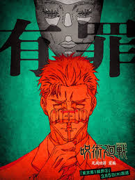
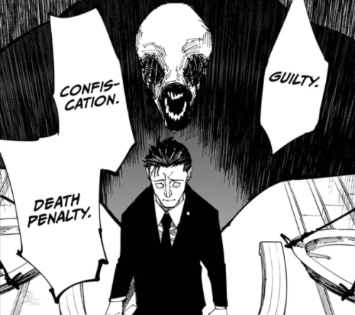

隨著動畫第三季第9集的播出，日車寬見(日車 寛見, Higuruma Hiromi)這個角色的故事也終於被完整地闡明。

這個角色可能是我在咒術迴戰這部作品中最喜歡的角色，縱與其它作品相比，他的出場我也認為是我少數看過最讓我印象深刻的精彩橋段之一。

而在漫畫裡面已經讓人印象深刻了，但動畫製作的品質無疑又讓這個橋段提升了好幾個層次，讓我對這個角色的喜愛又增加了不少。

細究我為什麼會這麼喜歡這個橋段，可能還是因為它有著極為巧妙的劇情設計，在推進劇情的時候又同時傳達了可以讓人動容的理念吧。

# 巧妙設計的安排橋段

所謂的設計巧妙，我認為就是能夠用非常自然的方式融入原本已經存在的劇情，讓讀者意料之外地看到新的劇情，又同時能夠理所當然地接受這個劇情的發展，讓人覺得這個劇情的發展沒有不合理之處，甚至覺得這應該就是必然的發展。

咒術迴戰對我來說，是一個相對比較偏向青年類型的作品，比如與差不多同期的《鬼滅之刃》比起來，這個作品顯然對於世界的描述更為複雜且黑暗，亦即，正義並不理所當然地存在或能夠戰勝邪惡，充滿惡意的角色也不會被輕易地打倒，甚至有時候還會獲得勝利，這些都是這個作品的特色。

在這樣的背景下，主角虎杖悠仁(虎杖 悠仁, Itadori Yūji)於在日車寬見出場時，已然因為澀谷事變而背負了本不應屬於他的強烈罪惡感，如同僵屍一樣行屍走肉地活動，內心充滿了對於自己無能為力的自責和對於同伴的愧疚，幾乎已經到了崩潰的邊緣，亦對於正義與邪惡的界線感到迷茫，甚至開始質疑自己是否還能夠繼續堅持正義的立場。

## 日車寬見的登場

日車寬見擁有類似的背景，他所堅持的正義顯然是有道理的，然而這個角色所面臨的困境，其實也極為寫實地反映了，應該是大部分法律人都會面臨到的難題，亦即，我們所堅持的正義因為法律的複雜性，而不一定能夠為世人所理解，但即使抱持自身的理想走上法院，面對看似同樣具備法律專業的對象，仍然可能要被迫面對與自身價值相違背的判決。

所以，對我來說，如果要有所謂的司法改革的話，也許這同時包含了兩個層面吧。一個層面可能是針對具備錯誤觀念但擁有法律專業的法匠，另一個層面則是橋接一般人民與法律專業之間的理解落差。

而最終，日車寬見也遇到了這個難題，只是相較於一般人只能接受審判結果，在他精神崩潰之際時剛好獲得了一個新的工具，讓他得以用咒術來達成他心中的正義。

## 正義的一體兩面

我們首先可以來討論一個有趣的問題：日車寬見殺掉了矇閉自己雙眼的法官還有檢察官，這是一種正義的展現嗎？

正義不應該只是一種廉價的感受，當我們站在日車寬見的立場來看，他的所作所為有其正義的一面；然後也許也不需要我特別點明，為了正義而殺人，顯然也有其違背正義的一面。

\
日車寬見自己本身自然也清楚這件事情，因此也展現在了他與虎杖悠仁的對話裡面。

在一開始，他提到「殺掉自己討厭的人，感覺比你想像中的還要舒服」，這句話同時也在展現他行為的其中一個面向，也就是為自己行為辯護的面向。

然而，就在他結束與虎杖悠仁的戰鬥後，又再度幽幽地問了同樣的問題，而這次他如同獲得救贖一樣地說出了他內心，也許也是他最渴望的另一個面向：「靠自己的意志來殺人，這其實他媽感覺糟透了，不是嗎？」

\
這是我們行為的一體兩面，但我也認為，這也正是日車寬見內心的痛苦與掙扎。

矇住雙眼還是睜大雙眼，究竟是哪個得以讓我們更接近正義呢？

## 相互賜予的救贖

\
另一方面，我們其實也知道，也許我們都想要當好人的世界裡，總是因為不知道為什麼，最終我們卻好像成為了其他人故事裡面的壞人。

這個世界上從來沒有簡單的答案，而我們都是在佈滿荊棘的道路上前進，並嘗試摸索屬於自己的道路，即使這個過程中可能讓我們傷痕累累。

而在這個迷失與掙扎之際，我們也可能渴望著能夠獲得救贖，能夠被理解，能夠被接納，能夠被原諒，能夠被愛。

\
在這個橋段，虎杖悠仁的課題是沾滿鮮血的雙手還有著無法抹去的罪惡感，而日車寬見的課題則是對於自己行為目標的矛盾與掙扎，並同樣也背負著強烈的罪惡感。

然而，透過日車寬見的能力，他無巧不巧地從虎杖悠仁的行為身上找到了他迷失的自己，而虎杖悠仁最終也從日車寬見中收獲了無罪的判決，彼此都在彼此的身上獲得了救贖，這也是我認為這個橋段最精彩的地方。

\
另外，這裡真的必須特別讚揚動畫製作的品質，關於虎杖悠仁那純粹的雙眼與靈魂，光芒耀眼地照射進日車寬見那已然腐敗不堪的內心，從而令其重拾初心的過程，即使已經看過漫畫而得知劇情，但還是實在是有夠精彩，我都看到要哭出來了。

# 用憤怒來包裝脆弱

一體兩面的也不是只有正義，對我來說，人的情緒也有其一體兩面的性質，特別是憤怒這種情緒。

你還記得你上次生氣是什麼時候嗎？是為了什麼生氣，最後又是怎麼解決的呢？

\
我們有幸生活在心理學或是情緒開始逐漸為眾人所重視或理解的時代，坊間也有非常多心理學相關的知識可以參考。

而我在過去幾年收穫最大的其中一件事情，就是理解，人如何可以同時既展現自己的力量，又同時展示自己的脆弱。

\
在虎杖悠仁坦承自己是在澀谷大量殺人之後，日車寬見展現出的情緒先是錯愕，然後是強烈的憤怒與質疑。

虎杖悠仁的行為像是主動展現了自身的脆弱，從而強迫日車寬見也不得不面對自己的脆弱，並引發了他強烈的情緒反應。

\
其實我們也是如此，在一個人展現出強烈憤怒的時候，通常也意味著他內心裡面可能同時也有著強烈脆弱的情緒，那可能是痛苦，可能是失望，也可能是恐懼，甚至可能是無助。

對於日車寬見來說，也許他同時具備以上這些脆弱的情緒，而透過武裝自己的憤怒來掩蓋這些脆弱的情緒，讓自己看起來更強大，更有力量。

這可能是一種保護自己的方式，但也許我們也因此無意間傷害了其實我們也很在乎的人，甚至可能也傷害了自己。

\
情緒是一把雙面刃，強烈的憤怒是一種強烈的輸出，而其所造成的結果，往往是淘空自身內心後所徒留下來的空洞感。

有幸能夠看到日車寬見最終選擇面對自己的內心，與虎杖悠仁分享自己的脆弱，並且從中獲得了救贖。
