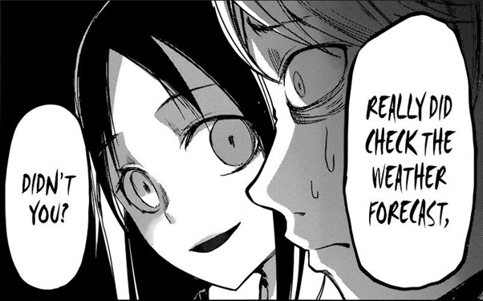

> Spoiler alert, until chapter 173 as the latest

*Kaguya-sama: Love is War* is a romantic comedy with two high school students trying their best to force each other to confess to themselves. There is a battle and a result between the two in each chapter. It seems pretty interesting at first, but what makes it so appealing is the tactics they come up for trapping each other in the situation of confession, in association with the subtle feeling in love.

### The Ambiguity in a Romance

Briefly speaking, this manga is showing the ambiguous relationship before dating. In contrast to western culture, Eastern Asians spend much more time testing the water before really going out with someone, which is also the time they remember the most. It is hard to say whether they enjoy the process or not, but it is more like you need more time to know someone after having a crush, and the testing game between the two is more like the typical game of thrones.

The implication, for testing, will do nothing by being too ambiguous to understand, but too much by being too apparent. Besides, you need to worry if the other side does not have feeling for you, or simply not ready for that. As a result, each of his behavior seems subtle and is easy to over-read. Love-hate relationship, isn’t it?

It does not matter what he actually says. What matters is how you understand what he really means. For example, you want to invite the other side, but you cannot express like you want to do nothing more than inviting him. You, then, have to find a reason, but how? The exaggeration of this process is the core of this manga, which leads to an absurd but funny consequence.

The first three chapters showing how the girl tried to invite the boy to a movie perfectly expresses what I said. It is needed to clarify who invites who, to bump into each other, and to reserve seats next to each other by chance. Well, it is certainly too exaggerated, but isn’t it what we do to whom we are in love with? Fair enough, we have fun reading these stuffs.

### The war of love between two geniuses

It is not enough, though. A genius should be able to come up with something more brilliant. The author did manage to think about great ideas, say, the “twenty questions” in chapter 8, which is the most amazing chapter in my opinion. The girl tried to trap the boy into believing she was confessing to him., but the boy would make the confession himself in the end. The boy finally avoided that by retaining his mind faculty and gave the correct answer. The trap was designed so well that it could have easily caught the boy without taking any risk even after being found as a trap. Attackable and defensible, isn’t it? Well, from the other point of view, the boy knew so much about the girl after all, to get the right answer.

This is the plot that the girl designed the trap, but actually it is usually the girl who prepared a lot to catch the boy in the situation of confession. The movie-watching plot in the beginning, the umbrella sharing in chapter 21, and the Fujiwara(藤原)-misunderstanding after celebrating the boy’s birthday in chapter 54. The girl seems to be the more prepared one for all time, with the only exception in chapter 31 about finals.

### Accidentally Revealing the True Feeling Makes It Warmer

It is quite interesting to see what idea the two geniuses will come up with in a new chapter, but it may also be boring to see all the same stuffs without any romantic one, since this manga is at least talking about a romance. The author does get the idea, and gave us what we expected. It happened in chapter 12 while the girl got a love letter. The boy tried to stop the girl from going out with another one by assuming if he was the one who wanted to go out with her, and was taken seriously by the girl. From here, the plot began to include that although the two main characters are trying to force each other to confess first, both the two are really in love with each other.

The acting cold in chapter 32 and the birthday plot in chapter 51 to 53 shows exactly the girl became a moron while revealing her true feeling, even after being so well prepared. Well, we kind of understand what it be like, don’t we? We saw it more or less while in love stories, while sometimes we are the main characters ourselves.

### A wasted good idea after becoming a serious love story

We got a brand-new plot after the main characters becoming seniors in about chapter 60s. New characters were added and the stories about the side characters were deepened. An expected obstacle, to be honest, appears in theses kinds of works, since the author needs to deepen the backgrounds of characters for a long-term serialization. However, it could simply get too shallow and inconsistent if the author didn’t make complete structure at the beginning, which is why this manga is getting more and more boring for me in the latest chapters.

Take the romance between the two main characters for example, there were more details about the backgrounds of the two, in order to depict their relationship seriously. It, however, finally became a soap opera that a poor boy attracted by a rich girl successfully got her attention but will need face the pressure from the girl’s family in the future. Seems not interesting at all, while Ishigami(石上)’s relationship was even better. Well, Ishigami’s background was simply another corny and melodramatic soap opera.

Additionally, since the boy already had a crush on the girl from the beginning (according to chapter 121), it makes no sense for what they have in mind in chapter 1. Another inconsistency is about the restriction from the girl’s family. It seems even some rumors are bad enough to break their relationship according to chapter 167 and 172, but sharing the same umbrella in chapter 21 and being confessed (even by accident) in public in chapter 61 don’t seem to stand as problems.

In other words, what makes this manga so appealing, again, is what I have explained before. It simply gets into trouble of having no deep character and plot after giving up the great idea. A possible explanation is that the author didn’t think too much in the beginning but was more or less forced to stretch the story after going viral. What to blame might be the lack of patience in modern society instead of the author.

After all, until chapter 173 as the latest, I recommend only the first 60 chapters. The plot after that is not as interesting as it was. Nevertheless, I still adore that this manga doesn’t rely on any erotic element to catch eyes. It could attract audiences by doing so, making itself vulgar and not able to serialize for a long time. Many mangas did that, so I think it needs to be praised here.
