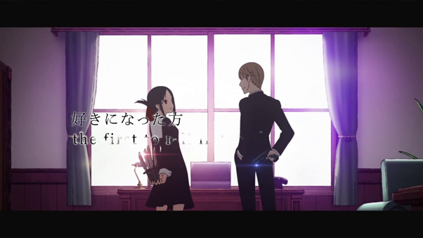
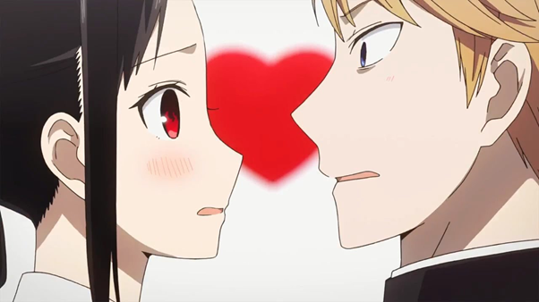
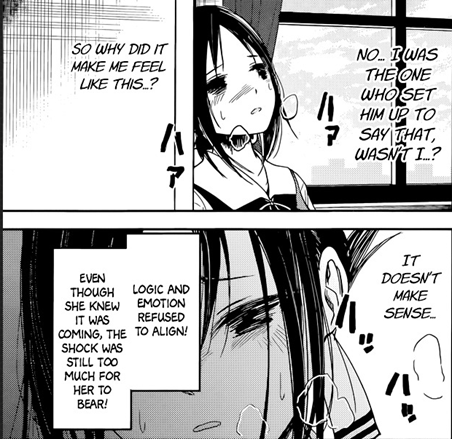

> 存在被爆雷的可能，請自行斟酌觀看，目前以漫畫第173話為最新一話的進度來討論

《輝夜姬想讓人告白～天才們的戀愛頭腦戰～》以校園愛情喜劇的方式，來呈現兩名互相想要迫使對方告白的高中生的故事。大致上每集都會有雙方的交鋒，也會有當集的交戰結果。初看時這是一個滿有趣的劇情，不過最令人著迷之處，當屬雙方為了誘使對方陷入告白的窘境，而絞盡腦汁的行為，配合戀愛中微妙又使人怦然心動的感覺，而形成一部可看性非常高的作品。

### 讓人怦然心動的曖昧

說穿了，這部作品在呈現的，應該就是正式交往前的曖昧關係。這段關係當屬戀愛關係中，除了正式交往前後之外，最讓人難以忘懷的階段。雙方處在尚不確定對方心意，因此需要互相試探的階段。因為無法確定對方心意，因此需要透過各種明示或暗示來索取更多資訊，也在同時間培養彼此間的感情和認識。

曖昧時的暗示，如果做得太隱晦，導致對方完全沒有收到，那就達不到目的；但如果太明顯，讓所有人都知道你的心意，又顯得太過尷尬。此外，也要擔心對方是不是其實沒有感覺的後果，或是對方有好感但還沒有做好準備的情況。因此，對方的舉手投足，對我方都似乎有一種草木皆兵的感覺，容易讓人過度解讀，其中的微妙之處，都是曖昧讓人又愛又恨的地方。

口是心非，成為了曖昧時最常出現的行為。比如說，想要邀請對方時卻又要同時不能顯得只想邀請對方，因此就必須找到各種理由來使自己的行為有正當性。這部作品精準地打到了這個點，以非常誇張的方式來呈現這樣的行為，最終導致了荒謬但爆笑的結果。

前三話的劇情，從送電影票到實際一起去看電影，完美地顯示上述的說法。先是爭論了誰邀誰的話題，然後不是約好去電影院看而是巧合，最後想辦法預約隔壁的位置。雖然我們當然不會像劇情中這麼誇張，但邀請心儀的對象去看電影，但又要找到正當理由的行為，不正是我們都會做的事情嗎？我們因此得以在其中找到樂趣。

### 天才間的鬥智

不過單就這樣是不夠的，既然是天才，他們工於心計的方式也要別出心裁才行。作者也的確在很多地方給出了相當精彩的鬥智情節。比如第8話的「二十題」遊戲，就是我認為最精彩的一話。女主角提出了足以讓男主角誤會成是變相告白的陷阱，想要讓男主角選擇一條其實會變成男主角自己告白的結果，但是男主角即時回神，給出了正確的答案。這個遊戲從一開始就讓女主角處在進可攻退可守的狀態，陷阱也設計得相當精巧，即使男主角最終答出了正確答案，也不會使場面變得尷尬。不過，換個角度來說，我們也可以看出男主角也對女主角有相當程度的瞭解，才能避免落入陷阱。

這是一個女主角設計陷阱的劇情，不過其實大部分的劇情中，也都是女主角在準備已久後讓男主角陷入被迫告白的窘境。比如最一開始的電影，第21話的共撐一把雨傘，第54話的慶祝生日之後的情節。女主角似乎始終都是準備比較多的一方，唯一一個男主角可以與之並駕齊驅之處，反而在於考試，以第31話為主要的劇情呈現。

### 真實感情的流露

此外，作者也適時加入了雙方在流露真實感情時的劇情，讓作品不會流於過度鬥智而使人麻木，我們不禁對雙方的純情會心一笑，提昇了整部作品的溫度。最早出現的應該屬於第12話收到告白信的情節，男主角為了阻止女主角赴約，因此提出了如果以他為對象能否阻止的假設，結果被女方當成是認真的邀請。從這裡開始，作者慢慢把劇情帶到雖然雙方的目的還是想要迫使對方先白告，但是雙方其實也的確相互喜歡的設定。

第32話的欲擒故縱和第51–53話的生日蛋糕劇情，都非常好地展現了雖然準備了非常多，但是真實面對自己感情時仍然會變成笨蛋的窘況。正是因為我們都或多或少有過類似的經驗，我們更能從中找到樂趣，也使這部作品變的更吸引人。

### 轉變成認真的愛情作品，可惜了原本的好點子

在約60話之後，漫畫進入了男女主角升上高三的篇章，也加入了新的角色並深化其他的角色劇情。這邊算是一個意料之中的瓶頸，在於像這樣的漫畫如果要長期連載，唯有深化角色背景才有可能達到目標。然而，若非一開始就已經想好完整故事的架構，很容易就會流於過於膚淺且前後無法連貫的劇情。這也是這部作品逐漸開始讓我無法那麼喜歡的地方。

以兩個主角的愛情線為例，為了認真描述雙方的感情，對於兩者的背景都開始有了更多的敘述，然後最終變成了女主角出生豪門，而男主角身為一介平民想要爭取她的注意，雖然成功，但未來可能仍要面對家族壓力的芭樂劇。這似乎不是相當吸引人的劇情，相形之下學弟追求學姐的那一段劇情反而還更精彩，但學弟過去的背景也是屬於灑狗血的劇情，仍屬可惜。

此外，既然男主角其實在很早就已經喜歡上女主角(跟據第121話)，那第1話裡雙方一開始的內心獨白中，各自認為對方理所當然會喜歡自己的說詞，就顯然有矛盾。更嚴重的矛盾之處，在於女主角如果不能讓他和男主角交往的謠言傳出來的話(跟據第167和第172話)，那難道共撐一把傘(第21話)或在眾目睽睽下接受告白(第61話)就不會有問題嗎？

追根究底，一開始這部作品吸引人之處當屬上述我所說明過的部分，而當放棄了這麼有趣的點子之後，就會陷入角色沒有深度以及一開始沒有構思劇情的窘境。一種可能的解釋是，作者一開始其實並沒有構思完整，但是因為作品爆紅之後而延長劇情，最終我們要將矛頭指向的不只是作者，產業結構導致速食文化而沒有完整劇情也是其中一個因素。

無論如何，直到現在第173話的劇情中，我認為最值得一看的當屬前60話左右。之後的劇情就已經沒有那麼有吸引力。即使如此，我還是相當推崇作品一直到現在，都沒有使用色情的方式來吸引眼球。使用情色的元素是很容易短暫吸引到目光，但就會使一部作品的格調降低，而且也無法長久經營。這還是我相當喜歡的部分。

[臉書專頁](https://www.facebook.com/%E5%93%B2%E5%AD%B8%E5%AE%85-Philosophy-Otaku-111203980427942/?modal=admin_todo_tour)
