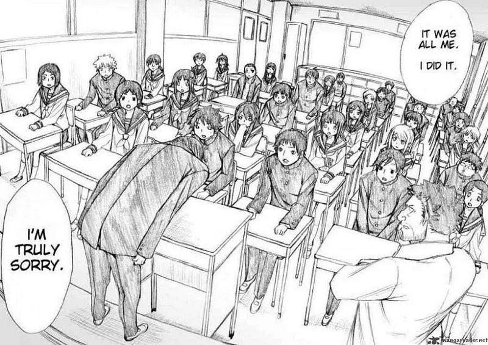

At first glance, Onani Master Kurosawa appears to be a crude, comedic work. Yet beneath its provocative title lies a surprisingly profound story — one that explores self-growth, shame, desire, vulnerability, and redemption within a remarkably short span.

In just a few chapters, the author skillfully blends humor with serious themes, delivering a message far more powerful than one might expect.

(Spoilers ahead — please read with discretion.)

### Adolescence, Sexual Fantasy, and Chuunibyou: A Chaotic Yet Honest Inner World

Kurosawa’s transformation begins with the emotional turbulence that follows his encounters with Takigawa.

Around the school trip arc, his feelings resemble those of any typical teenager confronting someone they secretly like — messy, contradictory, and painfully raw.

This naturally leads to the next major turning point: the moment he learns that Takigawa and Nagaoka are together.

The person he cares about the most chooses the person he looks down on the most. This sharp contrast pushes his inner turmoil to its breaking point.

The author then cleverly uses Kitahara’s request for revenge, along with Kurosawa’s reactions, to depict the shifting state of his heart — right before delivering a devastating emotional blow.

From that moment onward, Kurosawa’s inner world begins to crack and collapse.

As he continues the revenge “transactions” with Kitahara, he gradually moves toward self-destruction.

At the same time, his feelings for Takigawa twist into obsession, something he can satisfy only through sexual fantasies.

Ultimately, his revenge on Takigawa reaches its peak — bringing him to the final and most pivotal turning point.

### Honestly Facing One’s Own Fragility

The most iconic and powerful moment in the entire story is when Kurosawa chooses to admit the wrongs he has committed.

This scene is extraordinary — the kind that stays with you even ten years later, when most plot details have already faded.

What struck me most was the feeling that “I, too, have gone through countless moments in life wishing I had the courage to face my past mistakes, yet never being able to do so.”

Kurosawa hurt Takigawa more than anyone else, yet it is also Takigawa who offers him a form of redemption.

This contrast is intense, and it is through this moment that Kurosawa finally confronts his own fragility with honesty.

And it is from this point forward that his true journey of growth begins.

He chooses to reconcile with his inner self, and gradually learns how to love himself.

### Embracing the Inner Child, and Embracing the World

Objectively speaking, Kurosawa’s actions are indeed unforgivable. In the real world, it would be entirely reasonable for him to receive no understanding whatsoever.

Yet the author chooses a path that gently catches Kurosawa, guiding the story toward understanding, acceptance, and growth by the end.

Through Takigawa’s perspective, a subtle but significant message emerges:

Perhaps each of us carries within us a child like Kurosawa — hurt, ashamed, self-loathing.

And when we finally reach out to embrace that child, we begin to embrace the world with greater calm and openness.

### Conclusion: The Courage to Make Peace With Yourself

Within its brief length, Onani Master Kurosawa transitions from dark humor to a deeply psychological narrative.

Through Kurosawa’s journey, the story conveys meaningful insights about self-acceptance and personal growth.

For anyone who has already left adolescence behind, facing one’s own vulnerabilities again — and learning to love oneself — may not be easy.

But if we can acknowledge and embrace the inner child we’ve long avoided, perhaps we will find the courage to face the world more honestly and live a life that feels more real and free.
