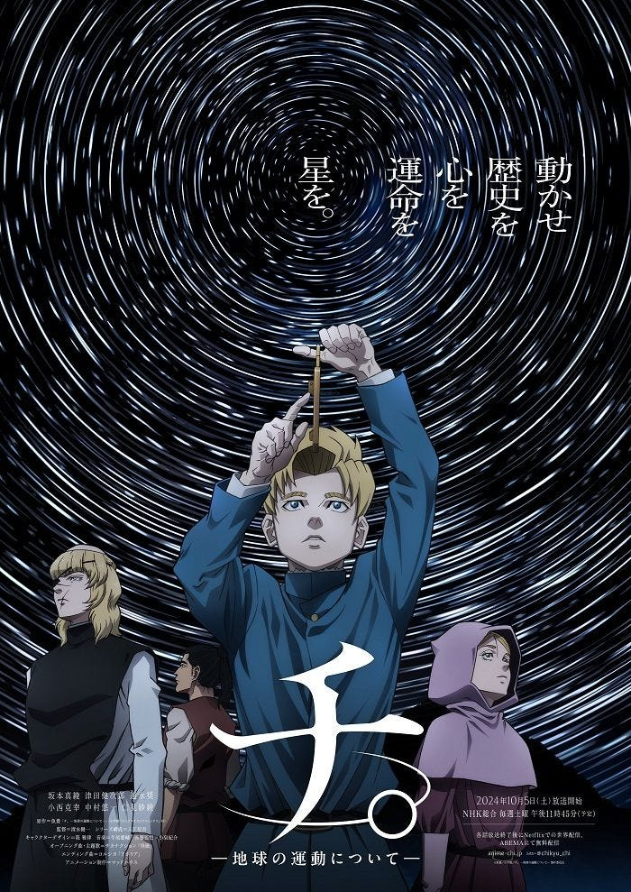

Invited by a friend to talk about this work [on her podcast](https://open.spotify.com/episode/1tusIO319WiTyiIaPXsYwV?si=azVtT80XRHKTU-nnVkijzg), I ended up writing this essay.

Since Attack on Titan, this is the work I love most — and the one I find hardest to put down.

I try to begin from two propositions, carrying a mix of doubt, reverence, and a touch of wordless emotion, to look back at those who sought truth, those sustained by faith, and those of us still searching for meaning.

First question: What price should we, or are we willing to, pay to pursue truth?

Second question: Does our life in this world truly have meaning? Where did we come from? Where should we go?

I think these two overarching questions run through the work and keep guiding us, from different angles, into self-dialectic.

### The Cost of Seeking Truth

First question: What price should we, or are we willing to, pay to pursue truth?

Motives of the truth-seekers: lofty ideals, or an ineffable stirring?

We often say truth and knowledge propel civilization; therefore whatever blocks the pursuit of truth (the ossified “orthodoxies” and churchly authorities portrayed as antagonists in the story) must be wrong.

But if we look again at those who seek truth — what are they really risking themselves for?

Take the priest in the second arc, Badeni: does he truly aim to advance human civilization, or is he closer to someone driven by a private desire to be remembered? The same question shadows the other storylines and characters.

Rarely are they propelled by pristine ideals alone. More often, they’re drawn by a feeling that cannot — and need not — be justified: the mercenary who looks up at the night sky, Okgi; the girl moved to tears by the thought that words can traverse time, Jolanta.

If so, then the price we’ll pay may depend on the depth of what moves us. Will we, like the characters, be stirred simply by the sky, the earth, the cosmos?

### Physicalism and Spiritual Connection

I’m, by temperament, quite physicalist. That surge of emotion can be reduced, to me, to a by-product of evolution: those with such tendencies happened to survive — just as we don’t ask about the “meaning” of the giraffe’s long neck; short necks were eliminated, the natural selection.

Yet in recent months I’ve been learning to meditate — trying to feel the world in a more “spiritual” way. “Spirituality” may not be mystical at all; it can be the bond between people, the emergence of a group consciousness: the camaraderie forged by striving together, an old-fashioned word like yiqi (義氣, loyalty). Within belonging and shared consciousness, the heart finds a calm, steady goodness.

Then I realized my meditation and awe walks are also a way of connecting with nature, with space itself. I sense a communion with what surrounds me: I am a tiny part of the universe and, paradoxically, inseparable from the whole — what some might call “the One.”

This helped me rethink why we call love a “mutual pursuit”. The feeling I find in that phrase is two people entering each other’s worlds, almost to the point of becoming one. In a vast universe, we happen to meet — at the right time and coordinates — someone with whom we can pursue each other. That \*\*accident — or miracle — \*\*already gives us reasons to seek, and to shoulder the cost. Doesn’t it?

### The Cost of Knowledge for All — and another round of self-dialectic

Returning to the main question: the work keeps nudging us to self-dialectic. In its final movement we see a world where free discussion and access to knowledge seem possible.

But can we truly sacrifice anything and everything for the pursuit of truth? Sharper still: Is it good for those unable to bear the weight of knowledge to obtain it? If someone refuses to share knowledge, are we justified — like the newly introduced tutor, Rafał — in taking a life for the sake of truth?

Back to real-world politics: “one person, one vote; every vote equal” is a foundation of liberal democracy. But would pure direct democracy be a good thing? Past referendums have warned us that democracy can be subverted by its own procedures when disparities in responsibility and rational judgment are exploited by the unscrupulous. Does that disprove “one person, one vote”? That conclusion is far too hasty.

The brilliance of the work lies here: it shows that every villain is a hero in their own narrative, and just when a conclusion seems near, it throws in new complications, forcing us again into a cycle of self-dialectic. In this story the “villains” look like church and faith; but let’s challenge ourselves too: If nothing — no church, no faith — ever blocked truth, would that necessarily be better?

That, in turn, opens the second question: can life still hold meaning in a world without faith?
