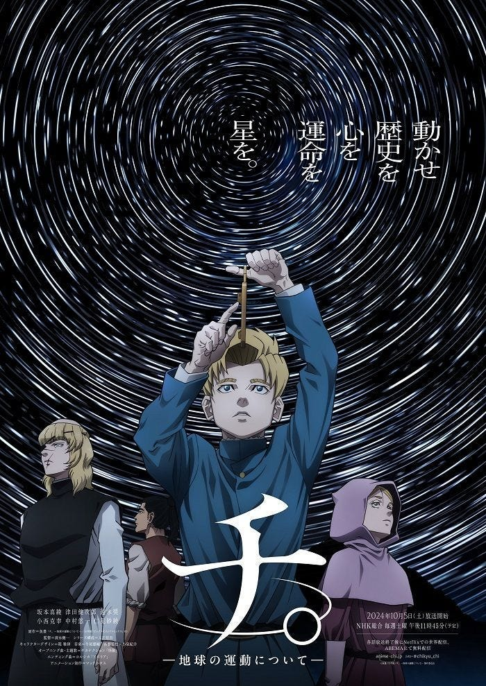

Here I want to turn to another central proposition in the work: can we find the meaning of existence in a world without faith? Where did we come from, and where should we go?

### Science — and “God is dead”

In Taiwan’s context, this may not feel pressing; “God is dead” often circulates more as a cool slogan than a lived dilemma. In truth, it’s a Eurocentric question: within Europe’s history, Christianity was once the social mainstream, so when science began to challenge ecclesial authority, the question grew acute.

Even so, it’s worth pondering — especially in this work where science and faith are in constant tension. Most characters don’t outright deny God; they debate how to read Scripture. For them, meaning still flows from God and faith; it’s our misunderstanding that leads us astray. From a contemporary vantage point, I can understand the impulse to discard the entire theological framework.

So in an age of advanced science and engineering, does faith still have value?

### Existence and suicide; feeling and reason

The work debates the claim that “suicide leads to hell.” If we assume there is no God, then there is no hell — what reasons remain for not committing suicide? As someone once said, “Suicide is the only truly serious philosophical problem.” At its core the question is: Does life have meaning?

I think that without faith, this question becomes exceedingly hard. Its special difficulty lies here: we exist first, and only then can ask about existence. Usually we ask “why” because choices are still open (What should I eat later?). But “Why am I here?” arises when I’m already here — and I didn’t choose that. Thus the question morphs into: Why not end it? Suicide is, after all, a choice still open to me.

Since I didn’t choose to appear in this world, can I assign meaning to a fact I did not choose?

My view: perhaps yes, but not through reason or deduction; the premise itself was never chosen. If we can’t prove life’s meaning by reason, what can we appeal to?

Some would say the question needs no proof — life is meaningful in itself. But if you think it does call for justification, then perhaps feeling offers an answer: a stirring that makes me willing to go forward regardless. That feeling itself can be reason enough to keep existing — the meaning of my life.

### A second self-dialectic of feeling and meaning

Yet even if that sounds persuasive, we still owe it another round of scrutiny. Is following feeling truly enough? If the protagonists only followed feeling, fear would have driven them away long ago.

Humans have a singular, perhaps noble, trait compared with other animals: we not only feel, we can also counter our feelings with reason. Why do we admire those characters? Because they feel fear — and still face it for a greater ideal. In other words, when a feeling arises, we can step back, inspect it, test its reasonableness, and then act by reason — even against what we feel.

Granting that, our reliance on feeling faces a crack. We return to the earlier question: without faith, can our lives still have meaning?

My line of thought is this: • Since I didn’t choose to exist, “finding” a pre-given meaning is impossible. But given that I am here, I can create a meaning for my existence — and because I created it, I can take responsibility for it. • Still, whatever meaning I create can’t ultimately resolve the original edge-question about life’s meaning and why not end it.

In Attack on Titan, this thread is worked out even more fully: Eren’s mother says, “Being born into this world is already great.” Commander Erwin, before the final charge, says, “The meaning of life will be defined by those who come after.” Meaning is not a one-off answer; it’s a work of continuation across generations. I explored that more fully in [my essay on Attack on Titan](../../Attack_on_Titan/Death_Depression_Despair/English/death_depression_despair.md).

### The Contemporary Value of Faith: Reverence and Humility

Suppose we set aside the question of life’s meaning and circle back: Does faith still hold value today? My present sense is that it reminds us of human smallness and limits, cultivating reverence and humility.

Traditional faith speaks of a Supreme Being; but even if you don’t admit such a being, in the face of the \*\*infinite — \*\*the universe’s vastness, the endless unknown — the gap between genius and ordinary person shrinks to almost nothing.

This perspective is especially precious now. In a polarized world, the allure of strongman politics and oligarchy returns. Some self-styled elites, deeming themselves highly educated, casually brand other groups “stupid,” believing any means are justified by their ends — even illegal surveillance, if it “works.” This arrogance corrodes democracy.

I believe the essence of democracy is a heartfelt recognition that the villager who never attended school is truly equal to you. Reading more books makes you, at best, a carrier of knowledge, not inherently nobler. Only from this premise can communication foster social progress. Of course, representative democracy (as opposed to direct democracy) reflects a pragmatic division of labor — entrusting some tasks to professionals. But division isn’t disdain, and expertise isn’t privilege.

Thus, the contemporary value of faith may lie not in furnishing a full, unassailable catechism, but in cultivating the virtues of reverence and humility: not growing arrogant before the infinite, not belittling difference, and, on the road toward truth, being both brave and self-restrained.

### Conclusion: Between Truth and Life’s Meaning — May We Not Lose Heart

Back to the two opening questions:

1. What price will we pay for truth? Perhaps the answer isn’t the abstract “everything,” but how far your genuine inner stirring will let you go. Feeling points the direction; reason sets the pace; reverence and humility keep us from trampling others along the way.
2. Without faith, does life still have meaning? If meaning can be created and owned, it may not need metaphysical warranty. It may spring from our commitments — to some work, someone we love, a larger community — from the courage to place fear in the light and still take one step forward.

In a vast universe we may be tiny gears; yet gears can mesh, transmit, and endure. May we, on the road of seeking truth, keep that unprovable, undeniable stirring; on the road of seeking meaning, keep reason to calibrate our course; and on the road where we meet one another, learn reverence and humility. If truth is worthy, its cost won’t be wasted; if life can be made meaningful, then we are already on the way.
