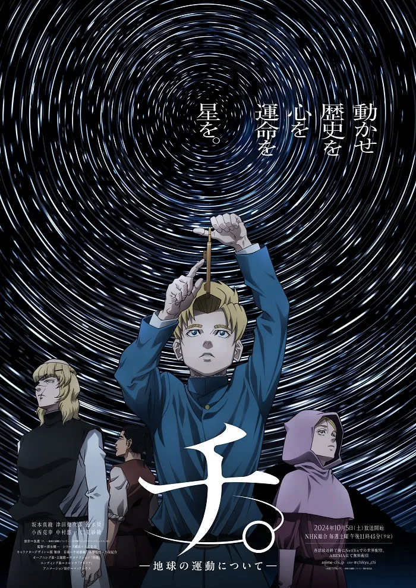

這裡我想探討作品中另一個重要的命題：

第二個問題：我們能夠在沒有信仰的世界找到生命存在的意義嗎？我們是從什麼地方來的？我們又應該往什麼地方去呢？

### 科學，還有上帝已死

這個問題在台灣的脈落下也許並非是一個嚴重的問題，反而大家可能比較常聽過的是「上帝已死」之類好像聽起來很炫炮的關鍵字。

事實上，這是個相當歐洲中心主義的問題，因為在歐洲的歷史脈絡下，基督教信仰曾經是社會的主流價值觀。 在這個脈落下，當科學的發展開始挑戰基督教信仰的權威時，這個問題才會變得如此重要。

即便如此，這仍然是一個相當值得思考的問題，特別是在這個作品中，科學與信仰的衝突是貫穿始終的主題之一。 作品中的角色大多不會直接否定上帝的存在，最多描述到解讀聖經的方式是否有問題等等。

對他們來說，生命的意義可能還是來自於神和信仰，只是我們對它的理解有誤，才導致獲得錯誤的結果 這從我們當代人的視角來看，我完全可以理解會有許多人直接認為，何不直接否定整套神與信仰的架構呢？

換個說明，在科學以及工程已經非常發達的當代，信仰還會有它的價值嗎？

### 存在與自殺；感受與理性

比如說，作品中有針對「自殺會下地獄」這件事情的辯論，但如果我們就假設神不存在，那自殺既然不會下地獄，有什麼好理由不自殺呢？

就如同有人曾經說過：「自殺是唯一真正重要的哲學問題」一樣，這個問題的本質也許是在探問：「生命真的有意義嗎？」

我認為，在沒有信仰的世界裡面，要回答這個問題其實非常非常困難。 這個問題的特殊性在於，你是先存在了，才能詢問存在本身的意義。

一般在詢問理由的時候，通常是因為我還有選擇，比如我等一下要吃什麼，是因為我還沒有決定我要吃什麼。

而我在詢問我為何在此的時候，我本身已經在這裡了。但這並非是由我決定的。 也因此，該問題才會變形成是說，為什麼不自殺呢？

畢竟自殺是一種我還沒有決定而且可以決定的事情。 既然不是由我決定出現在這個世界上，那我可以為我沒有決定的既成事實，賦予其意義嗎？

我的想法是，這也許是可以的，但這不會是一個理性或推論而能夠得出來的結論，因為這從一開始就不是一個由我決定的事情。

換句話說，我們似乎無法用理性去證成我們生命的意義，那我們可以用什麼東西去證成呢？

有些人也許會說，這根本不是一個需要證成的問題，生命本身就有意義。 但如果你也同意這是一個需要證成的問題，那也許「感受」會是一個答案吧？ 就是那份感動，讓我願意不顧一切地往前走，而這份感動本身就足以成為我存在的理由，也是我生命的意義吧？

### 感受與意義的再自我辯證

遵從感受的這個答案聽起來似乎很合理，但我們似乎還是要對這個答案進行再自我辯證。 遵從感覺真的好嗎？作品中的主角如果都完全遵從感覺，那應該早就因為害怕而逃走了吧？

我們似乎可以說，人類相對於其它動物，有一個獨特而且似乎可以說是偉大的特質，就是我們不只能夠有感受，我們還可以用理性去對抗感受。

比如說，你為什麼會覺得故事中的那些角色很偉大？不就是因為，他們可以感受到恐懼，但他們還是為了更大的理想而正面面對恐懼。

換句話來說，我們在發現感受的當下，我們有一種能力可以向後退一步，用旁觀者的角度去審查這份感受，並且退一步去思考這個感受的合理性，然後再根據我們的理性做出合理的判斷和行動，即使他違背我們的感受。

但如果你也同意這是一個有道理的論證，那我們的感受似乎出現了一些破綻。 而我們還是要回到原本的問題 — 在這個沒有信仰的世界裡面，我們的生命能夠有什麼意義呢？

我個人對於這個問題的思考邏輯是這樣子的：

首先，既然不是我決定出現在這個世界上，那我就絕對不可能找到意義。 反而是我既然已經出現在這個世界上，那我可以為我自己的存在創造一個獨特的意義，而這份意義既然是我創造的，那我當然就可以為這件事情負責。

但是無論我能創造什麼樣子的意義，這都不能從根本上回答最初的問題，關於生命的意義，以及為何不自殺的問題。

事實上，這個命題在《進擊的巨人》裡面其實有更完整的討論，比如艾蓮媽媽對前任團長提到「出生在這個世界就夠偉大了」以及艾爾文團長在最後衝峰前的演講提到「生命的意義，由後續承繼的人來定義」。也推薦各位去看我關於[《進擊的巨人》的文章](../../Attack_on_Titan/Death_Depression_Despair/Mandarin/death_depression_despair.md)。

### 信仰的當代價值：敬畏與謙遜

假設我們不去處理生命意義的問題，回到更前面的問題，信仰在當代還能有他的價值嗎？ 我現在的體會是，它提醒我們人之渺小與局限，並以此培養敬畏與謙遜。

統信仰訴說「至高者」的存在，但就算你不承認那樣存在，面對無限 — — 宇宙的無窮、未知的無盡 — — 每個天才與凡人之差異，都被壓縮得微不足道。 我認為這樣的視角在今日尤其珍貴。

極化的世界裡，強人政治與寡頭誘惑再次招手。 例如會在政治中，相信某個人可以拯救世界或相信某個人可以以一個人的力量揭發所有貪污醜聞 有些自認高知識分子的菁英，輕率地把不同群體視為「低能」，相信可以為目的正當化任何手段。

而這些人也會打從心理相信，可以用任何比如跟蹤偷拍的違法手段，只要能達成目的都沒有問題。 這種傲慢與輕率，顯然對民主社會造成了不小的危害。

我相信，民主的本質，應該就是在於，打從心裡相信那些，那些沒念過書的鄉下人，地位上與你真正平等。 讀過更多書的人，充其量只是「知識的載體」。

只有在這個前提下的溝通，才有機會促成社會進步。 當然，代議民主而非直接民主的制度設計，也反映了「交給專業者」的務實分工 — — 但分工不是鄙視，專業不是特權。

因此，信仰在當代的價值，或許不在提供一整套不可挑戰的答案，而在養成敬畏與謙遜的德性：在無限之前不自大，在差異面前不輕慢，在追真之路上，既勇敢也自制。

### 結語：在真理與生命的意義之間，願我們不失其心

回到開頭的兩個問題：

1. 為了真理，我們要付出什麼代價？ 也許答案並不是抽象的「一切」，而是你心裡那份真切的感動，允許你走多遠。感動給出方向；理性決定步伐；而敬畏與謙遜，確保我們不在路上踐踏他者。
2. 沒有信仰，生命還有意義嗎？ 若意義是可被創造、可被承擔的，那麼它未必需要形上學的保固。它或許來自我們對某事、某人、某個更大的共同體的承諾 — — 來自把恐懼攤在光下，仍選擇向前一步的勇氣。

在龐大的宇宙中，我們或許只是微小齒輪；但齒輪也能嚙合、傳遞、延續。 願我們在追尋真理的路上，仍能保有那份不必被證成的感動；在尋找意義的路上，記得以理性校準方向；在彼此相遇的路上，學會以敬畏與謙遜相待。 若真理值得，代價便不會白費；若生命可被創造為有意義，那麼我們就已在途中。
