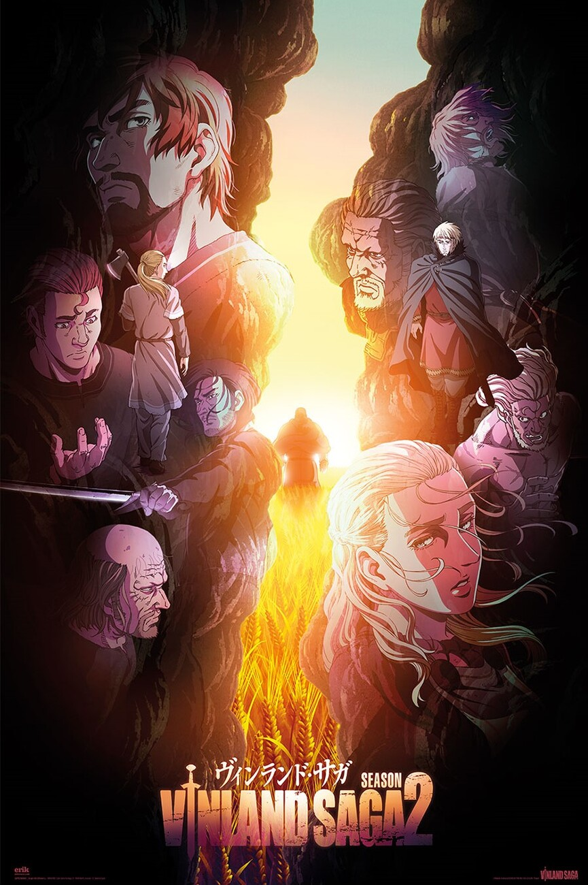

After finishing Attack on Titan and Orb: On the Movements of the Earth, I finally found another long-running work that could both captivate me and make me reflect on life at the same time.

This is a work with a brilliant story, incredibly three-dimensional character portrayals, and profoundly deep thematic ideas.

And the core of the entire work, I believe, lies in watching how different characters embody the philosophy of "I have no enemies."

Interestingly, the story is set in the Viking Age — an era defined by war and slaughter.

In a time when people took violence and hatred for granted, watching the protagonist choose a fundamentally different path and seeing how he overcomes countless obstacles to pursue that goal — that is perhaps the greatest pleasure of reading this work.

But even setting aside the thematic depth, the story and character development alone are more than enough to draw you in.

Full spoilers ahead.

## Character Portrayals

All great stories are built on great characters. We can even say that while we may not always know how to develop the plot next, we must always know what choices a character would make in a given situation.

Characters who can make meaningful choices are usually grounded in clear goals or backstories. Yet it is precisely because they have goals that humans — and characters alike — sometimes make unexpected choices. Real people are like this, and characters become flesh and blood through the same mechanism.

Vinland Saga truly has some of the most three-dimensional character writing I have ever seen, and among them, Askeladd (アシェラッド) is probably my favorite antagonist in recent years.

No one can escape the shadows of their past, and Askeladd's greatest internal conflict lies in being simultaneously the son of a slave and the last descendant of noble blood.

I believe this goes a long way in explaining why he staked his future on Canute (クヌート). He was someone who should have been worthy of leading a nation, yet fate twisted him into the leader of a band of pirates. Placing his hopes on Canute became his redemption — and his greatest gamble.

We also see that he recognized future and hope in the protagonist Thorfinn (トルフィン). That is why, in his final and most critical life decision, he chose to shout at Thorfinn to stay out of the fight, and with his dying breath, reminded Thorfinn to seek out his own true battle [1].

\
Thorfinn and Canute, in turn, become mirror images of each other.

Both haunted by ghosts of the past — Thorfinn is plagued by nightmares of vengeful spirits of those he has killed, while Canute relentlessly eliminates every obstacle on his path to kingship, yet the only one he can truly bare his soul to is the ghost of his murdered father.

Both pursue peace, yet choose vastly different paths to achieve it. The collision of these two souls, and the conflict and debate that arise from it, form the most compelling part of this story.

We also witness both characters reconcile with their past selves in their own distinct ways.

## "I Have No Enemies" — The Invincibility of the Benevolent

The first season of the anime revolves around the themes of "war," "revenge," and "violence," while the second season centers on "atonement," "rebirth," and "healing."

The parts of the manga that have yet to be animated can be divided into two arcs: one dealing with "peace," "hope," and "future," followed by one exploring "doubt," "coexistence," and "compromise."

\
Among all of these, I believe the core of this entire work revolves around the single line: "I have no enemies."

And the most brilliant moments are when Thorfinn, in order to live by those words, is beaten black and blue yet refuses to fight back [2], and when he ultimately chooses to run away from Canute's challenge [3].

\
So how should we understand the phrase "I have no enemies"?

My interpretation is that it embodies a philosophy akin to "the benevolent have no enemies" — a concept from classical Eastern philosophy.

Being invincible — not because I can defeat anyone, but because I don't need to defeat anyone.

\
In this work, people killing each other on the battlefield don't truly know one another. The so-called "enemies" are merely people who have been assigned the label of "enemy." Nothing more.

And if we bring this back to the real world — aren't we the same?

My colleagues, my friends, my family, or any stranger on the street — none of them are truly people I need to surpass.

I imagine having a better job than others, earning more money than others, living a better life than others — as if these people are my enemies, opponents I must defeat.

But in truth, these people are not my enemies, and I don't need to triumph over them to prove my own worth.

A person's existence is inherently valuable, without needing to defeat others to prove it.

\
But perhaps this phrase means even more than that.

I believe it also implies: "I am not my own enemy."

I don't need to beat anyone else, and I certainly don't need to beat my past self.

Just like Thorfinn — if I have a battle that is truly my own, then the goal of that battle must not be to surpass myself.

I don't need to prove my worth through constant self-improvement, because I am already worthy as I am.

\
And not striving to surpass yourself doesn't mean giving up — rather, it means allowing yourself to grow in a healthier way.

Put another way: I can have goals, I can hope to become better, but I don't need to harbor resentment toward anyone — and certainly not toward my past self.

\
Honestly, I don't think this is an easy thing to do.

How to pursue progress while simultaneously letting go of attachment to the past — that may be life's greatest challenge.

But it is precisely by doing so that I can free myself from being a slave to "wanting to beat others."

\
As Askeladd told Thorfinn in his final moments — Thorfinn had never once considered what his life could look like after his revenge was fulfilled [3].

While Thorfinn was still trapped in the mire of vengeance, he would mock every slave he encountered, yet he himself was the one who resembled a slave the most.

\
But perhaps I am the same — have I ever thought about what my life would look like after I've "won" against others? Perhaps I'd just keep searching for the next enemy.

Finding the meaning of life in a world without enemies — and through that, achieving true freedom.

I am still learning this to this day.

## Footnotes

[1]

Anime Season 1, Episode 24

Manga Chapter 54

[2]

Anime Season 2, Episode 22

Manga Chapter 96

[3]

Anime Season 2, Episode 23

Manga Chapter 98
