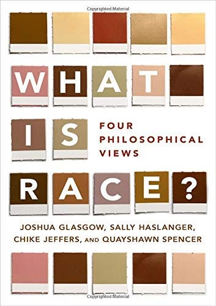

[Link](https://oxford.universitypressscholarship.com/view/10.1093/oso/9780190610173.001.0001/oso-9780190610173?fbclid=IwAR0LhJ17Y7Zt9OzlEXG09GhHfjokILgE1R5X3WMlTUKwj4H0jzntmswkJ3E)

“What Is Race? Four Philosophical Views” is a book with four different theories of race defended by four different philosophers. If you are interested in the race issues, then this book in my opinion is definitely worth reading since it offers the debates about the metaphysics of race. This can be used as the fundamental idea of anything you want for the race issues, including fighting against racism.

However, be aware that this is totally written in the north American context. You might find it hard to apply these ideas directly to any other context such as the European immigration issues because it has something to do with refugees, or we Taiwanese anti-Chinese issues because we live under the threat of the Chinese invasion. These differences should not be ignored.

In this book, you will find race coming from the white supremacy in the history of imperialism and the non-white subordination, which is different from the ordinary idea. As a result, in a sense it is considered socially constructed, including political (hierarchical) and cultural account. However, biological racial realism can still be defended in this context. It is also argued that race does not exist and is simply an illusion. These debates are too fun to be missed, and are not too difficult to read even if you have no background in philosophy. Hope you will enjoy it.

[Page](https://www.facebook.com/%E5%93%B2%E5%AD%B8%E5%AE%85-Philosophy-Otaku-111203980427942)
