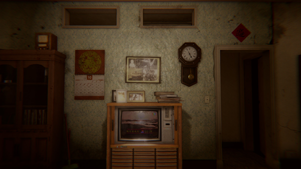
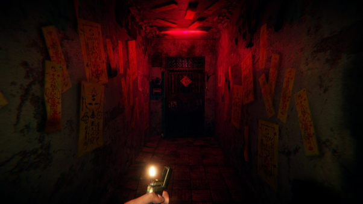
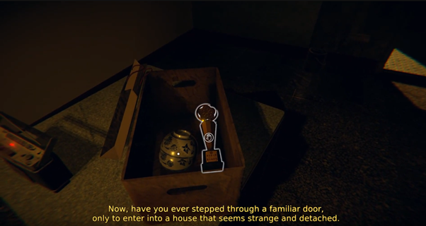
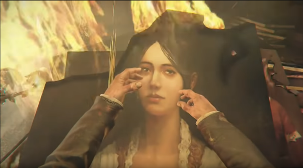
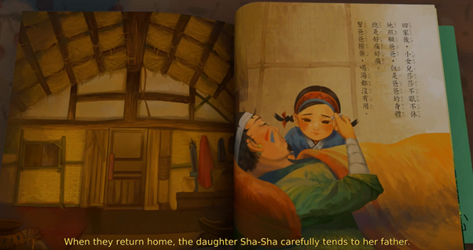
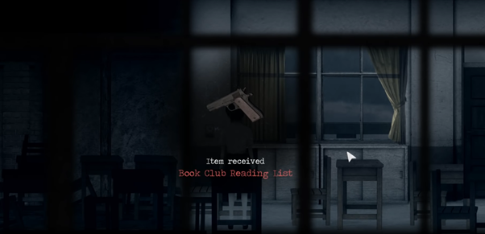
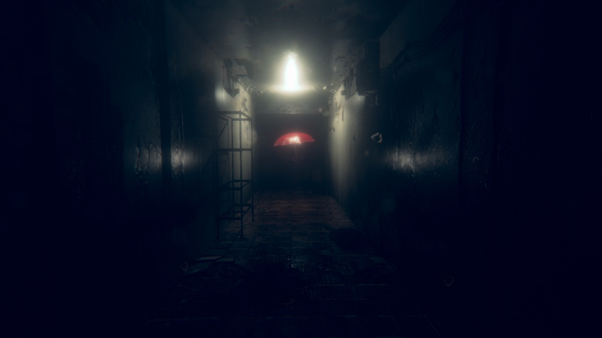

（Spoiler Alert, including a little bit about *Detention* and *Layers of Fear*）

> The excellent game producer *Red Candle Games* released their new work *Devotion* in 2019/2/19 evening, and went viral instantly on Twitch. It was once the fourth ranking on Twitch, and has reached review of overwhelmingly positive in Steam.

This game sets its background in the 1980 Taiwan society, with a tragic family and excessive superstition. Continuing the style of the previous work *Detention*, it’s a horror game built on an outstanding atmosphere and great story-telling.

I played with my friends, and intended to purchase it for the second time playing. Unfortunately, it has been removed for bugs fixing (Well, we all know that it’s because of the review-bombing by again the salty Chinese players.) It’s a pity that I still cannot experience it again.

It is worth mentioning here, that where I played with my friends is an old apartment in Taiwan, literally the background set by this game with damn so many red doors. Kind of creepy lol.

This is an excellent game I would definitely recommend. There are three main reasons for it not being just a horror game with nothing more than some simple jump-scares. The images, the story, and the horror design.

### 1. Images

The images are exquisite in the game, especially in the processing on the light and shadow, and the design on details. We might come up with a similar game called *Life is Strange*. Playing the game is like watching a movie.

This is also what it surpasses *Detention* the most. I was impressed, or actually terrified(XD) by that, which gave me a great experience playing.

### 2. Story

In fact, the story behind this game is not complicated at all. What amazed me here is its story-telling. Again, you can find the similar design in their last game, but this is just what makes it stand out from others. Well, we can always find ourselves in gameplay, as real persons experiencing a part of our lives.

The story is based on the same place but different time, so we experience different plots in different time though we open the same door. This gives us more feelings on the change of the same family.

> This is the same style in *Layers of Fear*.

The design of a family with the father wandering in their home is literally the same as well. *Detention* had a discount with *Layers of Fear*. I guess its story might have inspired the *Red Candle Games* team a lot.

Devotion is way simpler compared to the obscurity of *Layers of Fear*, and it has just one ending. Much easier but still so touching, since we can find most streamers were moved after the game.

#### Well, the reason I mentioned other streamers is that I actually had such a bad experience in late game. Let me tell you why.

I spent two times completing this game with my friends, and between them I kept being spoiled in community websites because every Taiwanese was talking about this successful game. I almost know all the things that will happen in the ending, and I kind of feel nothing while really finishing.

It’s so sad that I already knew the ending, and that I spent two times did carry me out of the plot. As a result, I took a look on different streamers’ reaction. Most of them were moved, and everyone was praising it right after the game.

There was a part which left me a great impression. It’s where the father was telling stories to his daughter. I did not expect this, and I almost forgot I was playing a horror game! This made the relationship between father and daughter much deeper, and, yeah you know, consistent to the tragic ending.

#### However, I do prefer the design here in *Detention* personally.

*Detention* used much more obscure analogies, which were way deeper and heartshaking. It is also better in imagery making. For example, the daffodil and the white-jade deer pendant.

> As Napoleon once reflected, “There are but two powers in the world, the sword and the mind. In the long run the sword is always beaten by the mind.”

### 3. Horror

There are two of the scariest parts of the game, the red-umbrella jump-scare and the dummy part.

#### Well, I emphasized in the beginning that this game is way better than some cheap jump-scares, but it would still hit you hard while trying to shock you.

Try to observe the picture again. The arrangement of the light and shadow is just perfect. After brewing for a long time, players will find that the ghost is standing behind them.

The ghost will wait even a little bit more before smashing on you. This is a great design, people who saw this before would probably be shocked again.

The dummy part is yet just another creepiest design. The best here is that these dummies won’t move like people, but just looking at them make us uncomfortable, not to mention that they would just show up behind you from nowhere.

#### Well, here is a three combo. Enjoy XD.

After all, this is an amazing game literally worth purchasing. Its horror is built on deep background story with some exquisite image and breathtaking story-telling, and the ending is just so touching.

### I will give 93 points in 100.

Well, there is still something I want to share with you guys, related to the real Taiwan society right now, inspired by the game though.

We all know that the father, Du Feng Yu, was superstitious about a cult and ended up killing his own daughter, even though he deeply loved her. This is something really happening in the past in Taiwan, and not as serious as it used to be.

#### However, on religion it is less serious, but on superstition itself? Not really.

#### Here in Taiwan, we are facing more serious superstition.

> On science and on politics.

It seems inconsistent about the superstition on science, but this is common in Taiwan. We ignore the importance of the education on humanities, and believe that we can solve all the society problems with some formulas.

What they cannot understand is the quote from *Nineteen Eighty-Four*, “Two plus two equals five.” Our society is way more complicated than just plus and minus.

> “If you keep saying two plus two equals five over and over again, then that is what people are going to think. Maybe it does equal five if we keep changing the definition of what’s normal and what’s right and what’s wrong.” by Kevin Sorbo.

The other aspect is on politics, here we will refer to the real politics happening right now in Taiwan. Ko Weng-je, Han Kuo-yu, and the last election on 2018/11/24 showed nothing more than that those who can decide the future of a country are just a group of innocent and ignorant people.

Socrates despised democracy, for that the decision of a leader should not depend on intuition but systemically thinking. That people are superstitious about electing a hero will lead themselves into hell,

> like the authority change after France revolution and the failure of Weimar Republic.

Reflected in China would be the review-bombings on this game for the sarcasm on Winnie the pooh. It is also ridiculous for some Taiwanese to blame *Red Candle Games* with Chinese, believing what they call “Politics for politics, and game for game”, as if *Detention* reflects noting on politics. They innocently think that they can always live well without even caring a little bit about politics, which we call the free-riders.

Reflected in Taiwan, we get “Nuclear Energy Rumor Terminator” （核能流言終結者）and the campaign of “Raising Green Power by Nuclear Energy” （以核養綠）. Many young and innocent people are cheated. They declare something like “beyond the blue(KMT) and the green(DPP)” or “the blue and the green are just as bad” to try to be objective in politics and disguise themselves as caring for Taiwan by science.

At the same time, there is no green power in any of their real claim except the slogan, and the leaders are actually in KMT think tank, not to mention that there will never be such objectivity in politics. We all have our own ideology, including one who claims that he doesn’t have any.

Sigh. The 228 memorial day was just a short time ago. (It was a holiday in memory of the victims in the massacre by KMT on 1947/2/28, called two-two-eight incident. However, many people like KMT and its supporters are claiming it does not exist, like the Holocaust Deniers.)

> “As long as the state permits itself to interfere in the affairs of literature, literature has the right to interfere with the affairs of state.” by Joseph Brodsky.

Anyway, Red Candle Games does give us an excellent work. If there is anything more this team can give to us especially the Taiwanese, then it would be that we never need any element related to *The Romance of the Three Kingdoms* or of some sexy showgirls. The real, deep and local Taiwanese elements are what makes it a hit.

> #SpeakUpForTaiwan