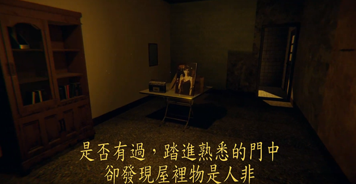
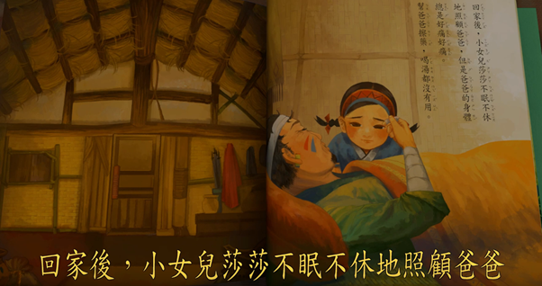
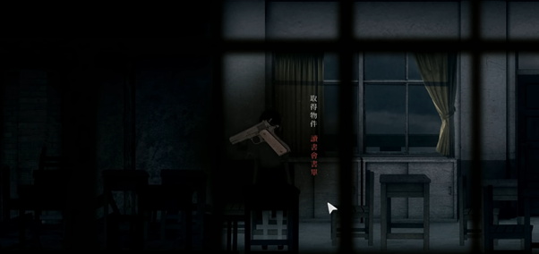

（內文有雷，且也有小部分《返校》和《層層恐懼》的雷）

> 優秀的國內遊戲製作公司「赤燭」在2019/2/19晚上釋出了新作《還願》。隨即引發了一波實況潮，並衝上twitch的前四名，在steam上的評價也達到了壓倒性好評。

其內容講述一個發生在1980年代的台灣社會，因過度迷信而導致的家庭悲劇。延續了上一作品《返校》的風格，以優秀的環境融入感和深度的故事來建立而成的恐怖遊戲。

我和朋友一同遊玩了一遍，原本打算自己也買一套再玩一次，受限於遊戲仍然處於下架的狀態，無法親自再體驗一次，不過網路上的資訊仍相當多，推荐不敢自己遊戲的人，可以多參考考。

值得一提的是，我與朋友一同遊戲的地方是一個老舊的公寓。環境與還願的背景設定一模一樣，也有相當多戶紅色的公寓大門，這種體驗實在是相當有趣XD

這是一款相當優秀的遊戲，具體上會有三個地方讓它不只是廉價的嚇人遊戲。分別是遊戲做畫、背景故事和驚嚇節奏的掌控。

## 1. 遊戲做畫

遊戲畫面相當精致，在光影的安排和細節的處理上都非常優秀。類似的作品會讓我想到《奇妙人生》，能讓人有如同觀看電影般的表現。

這也是此遊戲超越《返校》最多的部分，雖然呈現方式本質上不同，不過這讓我們的遊戲體驗(驚嚇指數XD)有了大幅的提升，是讓人相當驚豔之處。

## 2. 背景故事

實際上，背景故事並沒有什麼相當複雜的地方，最突出之處當屬其敘事手法。

雖然這也是延續了上一個遊戲的風格，但正是這種手法讓這款遊戲不再只是廉價的嚇人遊戲，我們在遊戲的同時，也某種程度上在遊戲裡看見了我們自己。

故事發生在同一座公寓的不同時間點，我們雖然打開的都是同一個門，卻因不同時間而能體驗到不同的劇情，從而感受到同一家人因時間流逝而產生的變化。這種呈現手段讓人不禁想到《層層恐懼》，事實上，一家人的設定和父親在自己房子中不斷排徊的方式也相當類似。

《返校》曾和《層層恐懼》合作推出打折活動，我想赤燭團隊應該有受到此作品不小的影響吧。

相對於《層層恐懼》的隱悔，還願的劇情在表面上單純得多，也只有一個結局。雖然比較淺顯易懂，不過在觀看各實況主的反應之後，可以感覺到張力仍然是滿大的。

這裡會提到其他實況主的原因，是因為我遊戲後期的體驗可以說是相當糟糕= =

我和朋友分了兩次完成這個遊戲，但是在中間的時間，不斷在各社群網站上被爆雷，搞到最後我幾乎都已經知道結局是什麼了，所以對於結局實在沒有什麼太大的感覺。

原本覺得這個結局似乎有點突然和莫名其妙，不過特別去看了不同實況主的反應之後，感覺應該是因為分兩次遊玩以及被爆雷的關係，導致我們無法更確實地感受其樂趣，實在是滿可惜的。

遊戲有一段讓我印象深刻之處，在於陪女兒說故事的地方。這種呈現手法讓我相當意外，幾乎讓我忘記我是在玩一款恐怖遊戲XD，它讓父女關係有了更深的厚度，從而呼應到了悲傷的結局。

不過，其實我個人比較喜歡返校在這部分的表現。

《返校》用了相當多比較隱悔，但極有深度且震懾人心的引喻。在營造意象的手法上，這個遊戲帶給我的衝擊是比較強勁的。無論是水仙還是白鹿飾品，都讓人難以忘懷。

在這個片段中，我第一個想到的就是拿破崙的名言

> 「世界上有兩種力量，分別是長劍還有人心。長劍終究會被人心給擊潰。」

## 3. 驚嚇節奏

遊戲中有幾個相當嚇人的橋段，其中最嚇人之處，當屬紅傘女鬼和紙紮人之處。

雖然之前一直強調，這款遊戲不只是一款廉價的嚇人遊戲，但是在嚇人的地方，它也是一點都不馬虎。

再觀察一次上述的畫面，光影搭配非常地到位。在蘊釀了很長一段時間之後，玩家轉身才嚇然發現女鬼在其身後，且女鬼尚等待了一段時間才衝出來。這是相當厲害的設計，即使重新觀看數次，仍有極高幾率被嚇到。

紙紮人也是嚇到相當多人之處，我認為這裡的設計非常精巧，紙紮人本身不會像人一樣活動，但看著他們本身就讓人感覺不舒服，更不用說一轉身的時候他就正出現在你身後。

> 推荐一個實況主被三連嚇的片段，實在相當精彩XD

整體而言，這是一款非常值得一玩的遊戲。建立在相當厚實的背景故事上的恐怖遊戲，擁有非常精緻的作畫讓玩家能夠深入其中，結局也有足夠的張力能讓玩家有所感觸。

### 在滿分為100分的前提下，我認為值得比九二共識還高出1分的93分，是相當實在的分數。

### 不過，在文章結尾有些想法要和大家分享看看。

我們都很清楚，遊戲主角，也就是杜豐于，迷信邪教最終害死自己女兒，雖然他始終深愛女兒。這是許多活生生發生在過去的台灣社會中的事情，現在的社會雖然仍有部分人士迷信宗教，但已然不那麼嚴重。

但是，減少的只是宗教，迷信的行為並未因此減少，只是好發於其它東西上而已。

## 最明顯之處當屬科學和政治。

迷信科學看起來似乎有所矛盾，卻是在崇尚自然組的台灣常發生的現象。我們忽略人文教育的重要性，誤以為社會政策只是套入公式就能得到好結果。他們無法理解的是，如同著名反烏托邦名著《一九八四》中所寫：「二加二等於五」，社會遠非單純的加加減減。

> Kevin Sorbo：
>
> 「如果你不斷告訴其他人『二加二等於五』，一遍又一遍，那些人就會開始如此相信。
>
> 也許就真的等於五了，如果我們持續改變那些，關於什麼是正常和什麼是對錯的定義。」

迷信政治則是另一個面向，無論是柯文哲和韓國瑜，或是上次1124的投票結果，一再驗證民主社會中，能夠決定國家大事的，只是一群無知的選民。誠如蘇格拉底鄙視民主的態度一樣，選民迷信於一個救星能夠拯救自己，最終只會將自己帶入地獄，如同法國大革命之後的政權變化德國威瑪共和一般。

反映在中國社會，就是之前遊戲因譏諷習近平而引發中國網友群起而攻之的情況。可笑之處在於，台灣也有一群秉持「遊戲歸遊戲，政治歸政治」的人，譴責赤燭的行為。就好像「返校」也只能是一款遊戲，以為只要不管政治就可以不會被政治找上，典型的搭便車心態。

反映在台灣社會，就是核能流言終結者和以核養綠。一群領導人實質上都是國民黨支持者的團體，帶領了一群高唱超越藍綠或藍綠一樣爛的天真年輕人，投下了會阻礙台灣能源轉型的公投案。

實在另人不勝稀噓。228連假也才剛過不久而已。

> 詩人Joseph Brodsky：「詩應該干涉政治，直到政治不再干涉詩。」

### 足以做為我們的警惕。

無論如何，赤燭都帶給了我們一款非常好的作品。若還有什麼赤燭能夠教會我們的，那就是不需要再用已經玩爛的三國梗，也不需要挑配會露奶的女星，只要真正在地且深度的台灣元素，依然能夠成功打進世界市場。

共勉之。

[粉專](https://www.facebook.com/%E5%93%B2%E5%AD%B8%E5%AE%85-Philosophy-Otaku-111203980427942/?modal=admin_todo_tour)

## 延伸閱讀

[劇情剖析](https://forum.gamer.com.tw/C.php?bsn=33763&snA=522)

[美心沒有死的結局解讀](https://www.ptt.cc/bbs/c_chat/M.1551219089.A.25A.html?fbclid=IwAR3CFrMB5qpVa-zkiOjpSRDvPXzoQTZyDyTHy-aNexXLndjFrZZu-nhIi2Q)

[鬼鬼：美心沒有死的結局分析](https://www.youtube.com/watch?v=hIxMPb7IA9k)

[從遊戲設計角度分析還願使用的藝術表現手法](https://m.gamer.com.tw/forum/C.php?bsn=33763&page=&snA=373&last=&fbclid=IwAR0UMhudlOq5EAPCJwgOAPWgVTWASQHt52tzzmZW4cLvdkK7-prUasdLIoI)

[還願或許真正想告訴我們的事(雷)](https://forum.gamer.com.tw/C.php?bsn=33763&snA=114&tnum=8&fbclid=IwAR18j-LZa6eLS3DHENJqEUV6567h87TvucGAu1cJb0D1QMgSzGMxOq7hRWw)

[次郎做的劇情簡介和彩蛋分析](https://www.youtube.com/watch?v=yw4k-0SvwGo)
