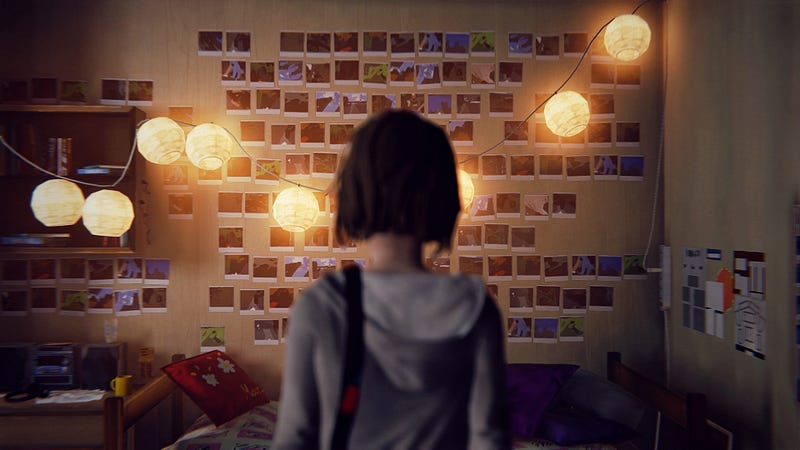

以時間穿躍為主題的故事和遊戲，一直沒有從創作的歷史中消逝。在遊戲中同樣以此為主題而獲得具大成功的，莫過於《命運石之門》；在數年前也有一個韓國漫畫《追逐時間》，讓我留下相當深刻的印象；更近期的日本漫畫《只有我不存在的城市》也屬於相當優秀的作品之一。

究竟為什麼，時間穿越的作品如此層出不窮？有什麼樣的吸引力，讓這種已經幾乎是被利用到淋漓盡致的題材，不斷地翻新，也不斷地再次廣為流傳？

我認為，時間本身的神秘性，當屬主要原因之一。「時間」究竟是什麼樣子的東西？這個問題至今都還沒有一個讓人難意的解答，在哲學上，有些人認為它與因果律脫不了關係，有些人認為事物的變化就是時間的流動。20 世紀初甚至有哲學家認為，時間根本不是一個實在的東西。

伴隨著當代物理學的發展，我們也有了一個新的角度來理解時間。而它的神秘性也恰恰成為了它最吸引人的理由之一。

另一個原因，也是我認為最重要的原因，反映在上面提到的每一部作品之中。那些擁有時間能力的人，不斷地透過時間能力，嘗試修補過去所犯下的錯誤。他們為了修正過去而拚了命地倒回，不斷地倒回，不斷地倒回，不斷地倒回……

因為後悔。

在我們的生命經驗中，後悔佔據了極大的份量。不只是因為我們常常後悔我們做過的任何一件事情，更重要的是，那些後悔的經驗會在往後的生命中不斷透過不同的方式重新演繹，成為心中無法磨滅的陰影。

你可曾在夜闌人靜之時，腦海中突然閃過一道過去的殘片，一層一層剝開過去的記憶，既而深陷無盡的旋渦。「要是我當時……就好了」、「如果我能夠回到過去，我一定……」

是啊，我們終其一生不斷地在後悔。

傷口在時間的洗禮下逝去，留下的疤痕卻更是刻骨銘心。這些強烈的情緒，藉由對於時間能力的想像，而得以找到出口。

在《奇妙人生》中，對於摯友的愧疚和感情，導致了後悔的情緒，串連起整部遊戲的主軸。

這部作品的畫面和音樂都是相當具有水準的，遊玩的過程就像是欣賞一部製作精美的電影，適合靜下心來細細品味。

每一章的開頭、結尾和部分遊戲過程會有可以純欣賞的片段，如果沒有時間上的壓力，我是真心建議大家可以停下來，把自己投入到整個遊戲中，去感受這個短暫過程中讓人心曠神怡的地方。

在劇情的部分，第一個讓我最為驚訝的地方是在於第三集的結尾，幾乎可以說是將整個背景設定，透過一次的大範圍時間旅行全部倒轉過來了。這是一個相當精彩的轉折之處，從遊完過後的回顧來看，這裡若能有更全面的發揮，應該是能夠為遊戲大幅加分的。

這一個段落的內容，主要是在講述主角麥克斯（Maxine）發現了新的能力，能夠透過凝視那些包含自己在內的照片，來回到照片當時的過去，並透過影響當時照片內的事物，來從根本上翻轉直到現在的人事物。

麥克斯藉此讓克洛伊（Chloe）的父親免去了意外身亡的車禍，然而，延續之前所提到的「混沌理論」，克洛伊卻在往後的人生中因為一場重大意外而全身癱瘓。麥克斯最終面臨了是否要依其請求，親手殺害摯友的兩難。

從這邊開始，大部分的玩家應該都可以開始意識到，這個遊戲想要暗示的主軸，那些嘗試改變過去的手段，最終都會被證明是徒勞無功……

而麥克斯那些回到過去的能力，最主要都被用在了克洛伊身上，更隱然揭露了克洛伊最終會成為這一切故事的原點，也就是麥克斯第一次始用時間能力的時候，同樣也做為終點，以一個時間旅行的劇情來說，這是最適合的結局了。

當然，從遊戲實際上的進行來說，我們也可以選擇犧牲整個阿卡迪亞灣（Arcadia Bay），犧牲一直待我們不薄的克洛伊母親、最終被證明一直默默努力的克洛伊繼父、那個我們想要拯救的被霸凌女孩、那個一直在追求我們的可愛男孩、那個原本我們討厭但臨死前仍打電話來警告和道歉的紈褲子弟、那個跋扈做作但其實一直默默憧憬且嫉妒我們的女孩、還有所有其他鎮上，與我們也許不熟，但同樣是活生生的人……

來拯救一個人，只是那個人也許比其他所有人都還要重要。

犧牲克洛伊或是整個阿卡迪亞灣，是這個遊戲的最後一個重要選擇。不得不說，每一個重要選擇都是相當讓人難以決擇的，而這也突顯出時空倒留這個能力的重要性。這個能力貫穿了整部遊戲，我們以此不斷改變，嘗試製造出一個更好的未來，最終卻發現些改變才是最後導致悲劇的結果。

我在數年前曾經看過一個相同的劇情，那部作品的名稱是《魔法少女小圓》，是一部日本動畫。

每一次的時光倒留都是一次因果線的重置，或破懷。無數次的時光倒留，如果都將目標指向同一人，最終將導致因果線指向同一目標，無數因果線匯聚一處，最終導致無法估算的後果。

誠如著名的奇幻小說作品《時光之輪》所述──「時光之輪依其意願編織命運」。

這些難以決定的選擇，每一個都讓人不斷時光倒留以採取最佳行動，最終導致的悲劇，正是這個遊戲最讓人感到深刻之處。

然而，這部分也是在回顧時，最讓人感到疑惑之處。雖然每一個選擇都看似相當重要，但實際上遊戲僅僅給出了兩個不同的結局，更重要的是，只有最後一個選擇會對結局的走向有所影響。前面的所有選擇形同浪費，可以說，這是這部作品最大的敗筆之處。

雖然說是最大的敗筆之處，但其實並非什麼大事。相對而言，它的亮點仍然非常多。我個人最喜歡的，是最後一集中的惡夢。

這一個章節十足地顯現出了這個遊戲最為優秀的影像和音樂製作功力，同時它也極富巧思。主角不斷透過不同的方式來重現當初透過時間能力形成的選擇，而那些基於善意的選擇最終導致的惡果，以一種結合恐怖元素的方式呈現給玩家。有多少人在走出那間空教室的時候，沒有被傑弗遜（Jefferson）給嚇到呢？

最後這段惡夢，讓我想到了同樣以精美影像聞名的《層層恐懼》，在解謎的設計上這個遊戲就做得比《奇妙人生》還要好，過多無謂且瑣碎的解謎段落，直接拖慢了遊戲進度並進而破壞玩家的遊戲體驗。對我來說，至今我都還不確定我是如何找找那些罐子的。

剩下雖然還有一些缺點可以討論，比如「流鼻血」來顯示能力限制卻沒有進一步說明；內森（Nathan）他家族也無其它劇情；劇情最後居然透過一張沒有包含自己在內的蝴蝶圖回到過去……等。

但整體來說，我們仍然可以說，這個遊戲製作當相優異，可以名列年度最有價值的遊戲之一。

總結而言，這個遊戲優點和缺點都相當明顯，不過考量到其特別突出之處以及售價，我會給予7分(滿分10分)的成績。
