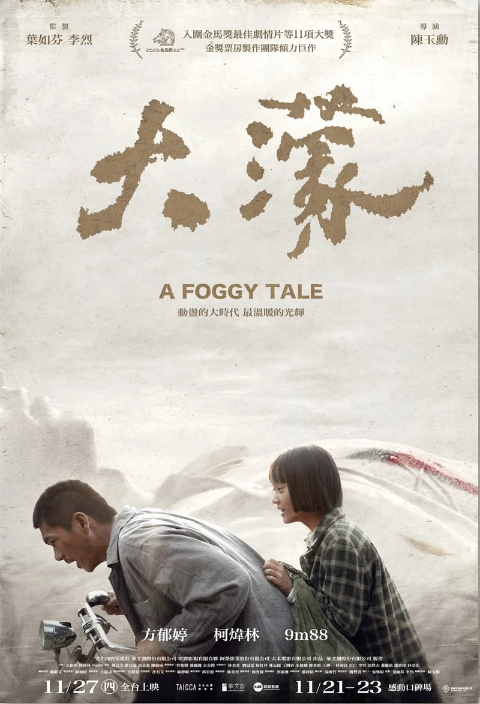

### Lovable and resilient, innocent and kind — and yet also steeped in conformist “goodwill”

I tried listening to some more mainstream commentary — trying, in a sense, to step outside my own echo chamber and hear what most Taiwanese people might be hearing.

As always, it was both surprising and not surprising: the ignorance many Taiwanese hold toward this history is genuinely heartbreaking.

You can hear many professional critics analyzing the film from various brilliant creative angles, yet rarely do you hear someone truly trying — within an understanding of the historical context — to feel the suffering and tragedy of that era.

In other words: the force that brought suffering and poverty was the Chinese Nationalist Party (the Kuomintang). And yet many people explain away the poverty and suffering as “that era was just like that,” unaware that before the Kuomintang arrived in Taiwan, Taiwan had, in fact, been one of the places with a relatively high standard of living.

When an entire generation’s history and memory are erased, Taiwanese people find it harder to distinguish the Republic of China from Taiwan; they don’t know that the Republic of China is, in essence, China; they don’t know about the theory of Taiwan’s undetermined sovereignty; they can’t clearly define what “Chinese” (華人) means; and they don’t understand the difference between “Zhonghua” (中華) and “China” (中國).

No wonder some say the Republic of China is like the largest contemporary stage of magical realism. When it has built a scale that is tilted from the very foundation, anyone who tries to straighten it will be smeared as “Why are you so ideological? Why are you still obsessed with the past?”

The absurdity is real: if I kill one person, I will be prosecuted. But if I destroy an entire people, I might be praised by posterity as a hero and granted a massive memorial hall — while my descendants can keep using that name to run for office — absurd, as if Hitler’s Nazi Party were elected Chancellor of Germany again.

And I can’t help wondering: at the end, might Ayue actually be the kind of Taiwanese person who voted for the Kuomintang?

What brings that absurd scene to mind is her conversation with her daughter — the way the next generation has gradually lost the ability to speak Taiwanese, a reality we see everywhere today.

As a teacher, in the “Speak Mandarin” movement, might Ayue also have been the kind of person who believed “speaking Mandarin is the correct way”?

“The right for children to study painting, poetry, music, architecture, sculpture, tapestry, and porcelain. Then the next generation starts scrolling TikTok. And then the generation after that has to go back to studying politics and war again.”

### How do we make them know?

Sometimes I think: the more a person knows history, the more they should be able to recognize the Kuomintang’s crimes.

If I were to list, one by one, the methods of torture used back then — if I made those who don’t understand see what those brutal techniques actually looked like — would they change their minds?

[There are many forms of torture inflicted on victims that are almost impossible to describe in words](https://watchout.tw/reports/N1qC8QWz2HFrVohJvYbv) [5]:

> *“Political victim Lin Shuiquan, in the White Terror memoir When I Saw the Sunlight, recalled that during interrogation he was beaten in turns by three people with plastic batons ‘until I was half-dead,’ along with having his legs squeezed with wooden sticks and needles shoved into the gaps of his fingernails. He was also strapped to an electric chair and electrocuted in a way that ‘sent current through the heart,’ leaving him on the verge of collapse multiple times. In his dazed stupor he heard an agent even joke: ‘Pull out his dick and shock it.’”*

[And what female political victims suffered was even more appalling](https://www.facebook.com/JMHRI/photos/a.119495608140150/3139705879452426/?id=112593462163698) [6]:

> *“For example, the so-called ‘rope torture’: after stripping the female victim’s genitals, interrogators forced her down onto a thick hemp rope while two people on each side dragged her, making the rope rub against her genitals.”*

> *“There were also cases where interrogators hung a pregnant female victim by her hair from a beam, attempting to beat a confession out of her — leading to the victim losing consciousness and the fetus slipping out, and so on.”*

[In Keelung, there was even a massacre in which iron wire was run through people’s palms and ankles, chaining multiple victims together and throwing them into the sea](https://www.cna.com.tw/news/aipl/202302250233.aspx) [7].

Even if we set aside bloody violence, the Kuomintang’s security apparatus monitored the behavior of all Taiwanese people, directly producing a generation that struggled to trust one another — sometimes even within families. The most famous example is the “Ren’er affair”: a friend you’ve known your whole life, a confidant, even a lover — only to discover they were [actually an informant](https://www.thinkingtaiwan.net/content/7923) [8], tearing apart an entire social web.

[Ma Ying-jeou](https://www.twpeace.org.tw/wordpress/?p=2461) [(former president of Taiwan)](https://www.twpeace.org.tw/wordpress/?p=2461) [was a so-called ‘professional student’ at the time](https://www.twpeace.org.tw/wordpress/?p=2461), and there are still many Taiwanese people who don’t even know this [9].

But a friend who watched the film with me gave me a new insight. Yes — what we are trying to do is correct, no matter how you look at it. But what is correct doesn’t necessarily persuade most people.

So perhaps what we need to think about is this: how do we speak in a way that makes those who don’t understand willing to understand? Maybe the answer is hidden inside this film.

In the film, every turn of the watch points to a particular year. Viewers placed in that year feel as if they have been singled out — pulled into the situation of the time.

We can’t truly push someone back into that era and force them to experience its suffering firsthand. But we can start from each person’s own life experience, and find a point of connection to that history.

And we are all small people. Perhaps that is exactly why we can find, in small people like these, an entrance into understanding.

This may be one way: to help those who don’t understand come to understand the suffering and tragedy of that era — while avoiding the posture of “stuffing suffering down someone’s throat,” which only backfires. Let each person find, within their own experience, a point of contact with history.

### Generation after generation

Searching for a brother’s body in formalin while flipping through fragments of memory from different eras — this is undoubtedly one of the film’s most moving scenes.

I often wonder: is knowledge, in fact, a kind of curse?

The closer I get to the truth, the more painful it becomes. The pain is not only the suffering and tragedy, but also the helplessness and disappointment I feel toward contemporary Taiwan. Deeper still is a bottomless sense of powerlessness and loneliness.

Ayue’s brother offers an answer: the story of two drops of water. The mission I bear in this generation becomes rain that nourishes the earth, left to the next generation — and the next generation continues to turn that rain into rain, nourishing the earth, generation after generation, without end.

It’s hard to keep tears from rising at moments like this. While watching Untold Herstory (Liu Ma Gou №15), what moved me most was the fact that political victims would have a photograph taken before their execution.

They almost all smiled for the last photo of their lives [10] [11]. I often wonder what kind of feeling they carried into the final moment of their lives — and what it took for them to still smile at the very end.

Maybe that feeling is exactly what Ayue’s brother was talking about.

As a small person, what I can do is limited. But even if I fall short, I still believe my efforts have meaning. And the next generation can inherit these results, carry them forward — generation after generation, without end.

I hope that one day, we can truly step out from the shadow of this history — so that the next generation can genuinely study philosophy and poetry, rather than being forced to return once again to studying politics and war.

### References

[5] [Political victims’ property was confiscated by the KMT regime; secret police even took a 35% “bonus” — Watchout](https://watchout.tw/reports/N1qC8QWz2HFrVohJvYbv)

[6] [Torture of female political victims — White Terror Jing-Mei Memorial Park Tour Family](https://www.facebook.com/JMHRI/photos/a.119495608140150/3139705879452426/?id=112593462163698)

[7] [Iron wire run through palms and ankles, chaining multiple people together and throwing them into the sea — Central News Agency](https://www.cna.com.tw/news/aipl/202302250233.aspx)

[8] [【Things You Couldn’t Do Back Then!】You couldn’t speak carelessly, because there was “Ren-Er” — Thinking Taiwan Forum](https://www.thinkingtaiwan.net/content/7923)

[9] [On This Day in History: Ma Ying-jeou’s Boston covert-photography incident — New Taiwan Peace Foundation](https://www.twpeace.org.tw/wordpress/?p=2461)

[10] [The Untold Stories of Untold Herstory (Liu Ma Gou №15) — GJ Taiwan](https://www.gjtaiwan.com/new/?p=105847&srsltid=AfmBOoo_onXnT3Y-H0pmG0m44lWF2LE2OVHgG-kukk0bNfy8R7BwkTsz)

[11] [A survivor looks back on the “Green Island Rebellion Case”: White Terror victims faced execution without fear, leaving a radiant smile as their final image — Watchout](https://watchout.tw/reports/kAxX4FGIiOBeUtNtFtDB)
