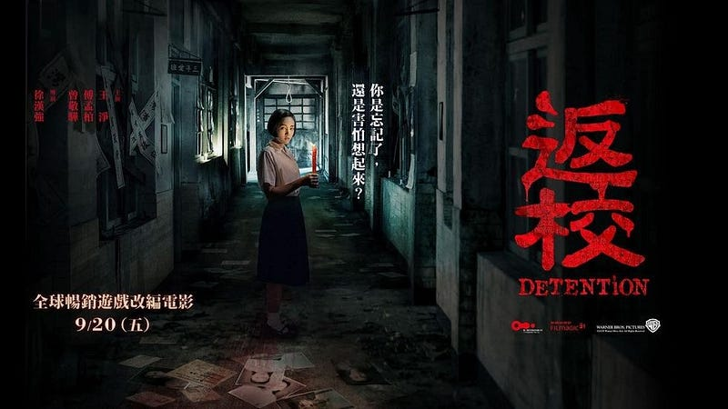
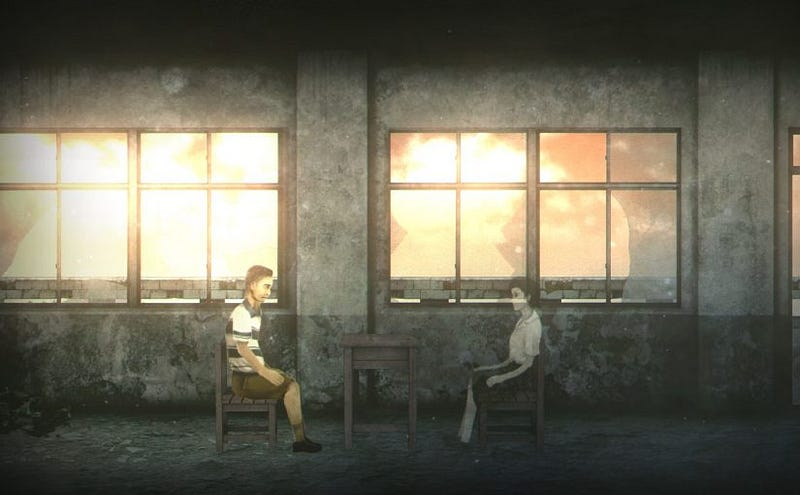

筆者早上剛和朋友進電影院看完這部今年我最期待的作品，事實上，這部作品也沒有讓我失望，雖然玩過遊戲讓我在劇情基本上不會有太多的新鮮感，但是電影的張力相當足夠，而且非常用心又忠實地呈現許多遊戲中相當經典的畫面，比如掛在上方的布偶群，魑魅魍魎和鬼差，鋼琴、紙飛機、典禮台和自殺場景、割頸片段、抓耙仔和霸凌片段、方芮欣將禁書交給白國鋒教官的大樹場景……等。

這些場景讓玩過遊戲的人可以很容易引起共鳴，電影不像遊戲隱悔，故沒有玩過遊戲的觀眾也可以輕易理解劇情。製作單位可以說是煞費苦心，無論有沒有玩過遊戲的人，都可以得到相當好的觀影體驗。

對於這部影片，我感受最深的，還是在於自由與愛情這件事情上。

年輕的朋友也許感受比較沒那麼深，但對我來說，能夠打從心裡去真正愛上，或欣賞一個人、事、物，實在是一個相當難能可貴的能力。威權體制一直以來最為人所憎惡的地方，其中一個就是其統治方法會迫使被統治者間的互相猜忌，彼此間的信任瀕臨瓦解。

誠如朱宥勳的評論：「這就是白色恐怖：最可怕的不只是打你殺你，最可怕的是讓你變成不是你。它本質上反對人類的親愛，因為它就是依靠人類的彼此怨恨茁壯的。」（<https://vocus.cc/filmaholic/5d84396bfd89780001385ea7>）

電影裡被懷疑是告密者的男同學，被毒打一頓又被反鎖起來；方芮欣被發現是真正的告密者之後遭到了魏仲廷等人的質問。去責怪告密者，這似乎是一個看起來再正常不過的反應，然而直到張老師面對方芮欣直接的愧疚和道歉，他才淡淡地說了一句：「這不是妳的錯。」

我非常喜歡這一句話。

 

能夠講出這句話是多麼不容易。雖然我們也許，或多或少都知道，錯不在方芮欣，而是國民黨。但是我們又能夠有多少能力，在受到極端壓迫的情況下，去坦然面對這件事情呢。

我的意思是說，失去了愛的能力，像我這樣的人，終究還是會選擇錯怪方芮欣吧。

如同空氣一樣，唯有在失去的時候才會讓人感受到窒息。我們又何其有幸，能夠活在民主的國度，呼吸自由的空氣，打從心裡去感受何為愛，去學習，並成長。

我想，唯有我們能夠自由，我們才能夠學會愛人；唯有學會愛人，我們才能真正得到自由吧。

致自由。

> [【影評】《返校》為什麼是台灣人都需要的電影? | 解析/點評](https://www.youtube.com/watch?v=IXMl81r1HZc)

> [🚫影評🚫返校：今年最佳電影，必得金馬｜深度解析｜劇透｜Detention｜留言抽遊戲｜](https://www.youtube.com/watch?v=jUg0EVglMX8&t=2s)

> [特／歷史真有「方芮欣」！ 《返校》5真實故事解析…網淚：比電影更可怕](https://star.ettoday.net/news/1540092)

