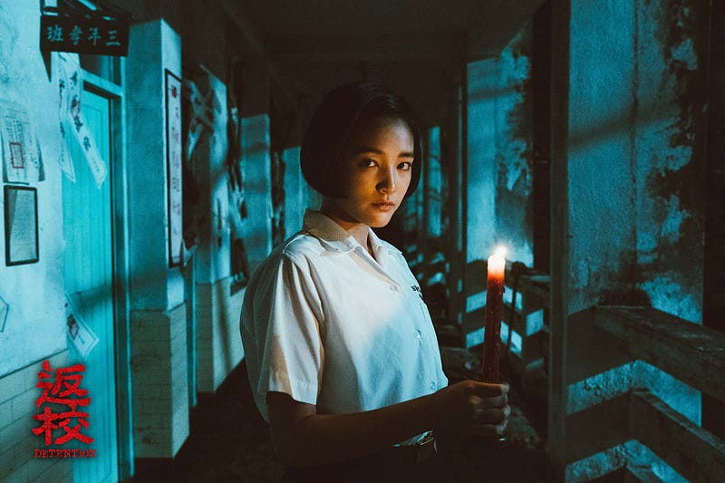

《返校》電影版做為近期台灣的流行話題，受到多方的批評是在所難免，在這裡我想嘗試為其辯護，但並不是針對單純一個火紅作品容易受到批評這部分。也就是說，一個相當紅的作品會受到各種批評，但《返校》受到的批評似乎不只是如此。

此外，也有部分觀眾批評作品講述得太過膚淺，沒有深入探討白色恐怖，對轉型正義沒有充份討論、或是劇情太過單純等等。

如同朱宥勳所述，這不是一個沒有缺點的作品，但用上述的論點來批評，我認為並不是非常公平。主要理由在於，電影本身的導向以及時代背景的差別。

第一個我想講的事情是，這部電影應該主要還是以商業導向為主。換句話來說，它大概不是走《悲情城市》路線的作品，其中的文藝氣息雖然有但是不高，整體來說更偏向於大眾化的路線。我們當然可以期待它有更進一步的討論，但我不覺得有必要這樣子要求，就如同我不會在看《玩命關頭》的時候要求它要對劇情有什麼縝密的設計，也不會它對什麼社會議題有深入的刻畫。

另外，在這部作品中，製作團隊滿明顯地想要顧及遊戲玩家，因此遊戲中許多經典的片段，都有在作品中再次被呈現。我想，這一定程度上限制了影片的製作彈性，這樣做的理由大概也和影史上比較沒有類似的作品可以參考有關，因此是採用比較保守的態度來製作的。

講到保守，但其實這部電影卻也是台灣比較有名的，在講述白色恐怖的作品中，幾乎可以算是第一個以如此直接的方式表現者。以《悲情城市》為例，片中雖然有比較隱晦地表示二二八，但相比《返校》仍然是天差地遠。

這也是我想要強調時代背景的原因，《悲情城市》發行於一九八九年，當時雖然已經解嚴，但社會仍處在相對保守的情況，雖然我們會認為《悲情城市》相對保守，但其實在那時已經是一部相當勇敢去觸碰這段歷史的作品了。從結果來說，我們也都知道，影片參加義大利威尼斯影展並榮獲最佳影片「金獅獎」的殊榮，從而振奮了整個電影界，接下來也越來越多人嘗試去挑戰這些禁忌。

《返校》所立足的時代背景是什麼呢？是整個台灣社會仍然對轉型正義有所不滿，而接近一半的人可能會選擇韓國瑜當總統，在影史上幾乎沒有任何類似改編作品可以參考，而之前的同類作品又幾乎沒有如此鮮明色彩者的時代背景。你會批評候孝賢不敢直接把二二八醜惡的一面拍出來嗎？又或是你會批評《玩命關頭》沒有深刻討論什麼社會議題嗎？如果不會，那我們也不該用同樣的理由來批評《返校》。

我想，《返校》做為一個背負這個時代背景的產物，在這個時代背景的階段性成果，就是做為第一個大眾導向的作品，以相當入門的方式來介紹白色恐怖給大眾。從它的票房和觀影者的體驗來說，我認為這個成果是可以被接受的。

若它只是一味闡述白色恐怖和轉型正義，以目前整體台灣人的認知來說，大概會被大眾評為過度政治化或撕裂族群吧，同時票房難以支撐製作成本，導致後繼無人；反之，若它就像《悲情城市》一樣隱晦或甚至完全避之不談，那可能也無法有其開創性，淪為一部普通而不具指標性的作品。

首次如此具有代表性的作品，各方都希望它能夠達到他們的理想期待，但要在種種因素中取得平衡點，做出取捨是必然的結果。《返校》可以說是相當好地達到了這個目標，台灣影史的經典中，註定會讓這部作品記上一筆。
