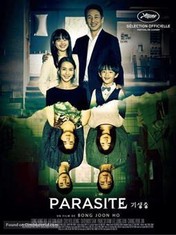

[來源](https://medium.com/@kalhoun/reflections-on-cross-cultural-issues-in-the-film-%EA%B8%B0%EC%83%9D%EC%B6%A9-parasite-9b80520e8bed)

【暴雷警告】

《寄生上流》（기생물）是一部獲獎無數的韓國電影，而直到一年後的現在我才機緣巧合下得以看到，第一個感想是，的確是一部值得獲獎的電影。因無法排解心中看完後對於這部作品的悸動，寫下一些雜感寥表對這部作品的敬意。

這部作品對我而言有兩個面向，它一方面是講貧富差距，揭示了窮人可以非常有能力，卻仍然無法翻身，在淹水的橋段中對這件事情的諷刺特別明顯；另一方面則是關於善良，也是我最難以釋懷之處。

> 不是有錢卻善良，是有錢所以善良。

善良，是富人的權利。當你有能力施於予他人卻不致對自己的生活造成過大影響時，善良的行為就顯得輕而易舉。金家一家人混入有錢人家，想方設法弄掉原本的司機和管家，善良的有錢人一家被寄生之後，原本看似邪惡的金家卻在各方面顯露出其善良的一面。

金爸仍然擔憂著被趕走的司機；金媽雖然認為不是好事，但還是幫前管家開了門；這一家人雖然把前管家和其丈夫關到地下室，但仍然惦記著他們並還是記得送食物（甚至導致最後讓其逃出來）；兒子和女兒也在不同的地方展現出善良的一面（把會帶來錢材的石頭想要送給地下室的前管家夫婦）。不過這都是在實際上不會影響他們生活的前提之下才能夠出現的行為。

相較而言，富人一家也在許多地方顯露出惡劣的一面。最精彩之處就在丈夫與妻子在沙發上調情時，兩人以他們極為鄙視的內褲問題做為調情的元素。從劇中很多細節可以看出，他們施捨東西給窮人，但他們仍然視之為猶如蟑螂的低層生物。他們會花錢體驗在雨中睡覺的生活，這卻是窮人的日常。一直到兇殺案發生時他們四處逃竄時特別明顯。

我無意深究貧富差距的問題，我也不喜歡用這個議題指責現實中的政府辦事不力，畢竟實際的社會問題絕不該透過看完電影後所獲得的廉價正義感來解決。只是，當因為貧窮而受苦的悲劇在眼前發生時，任何人都很難沒有側隱之心。故我們應當盡力，讓社會不要淪為，必須時常在這種道德難題間做決擇的結果。

這部作品到處充滿了隱喻，但已經有相當多人討論過，故不細談。總而言之，這的確是一部值得獲得大獎的作品，能夠看到這樣的作品實屬讓人相當感動的一件事。
