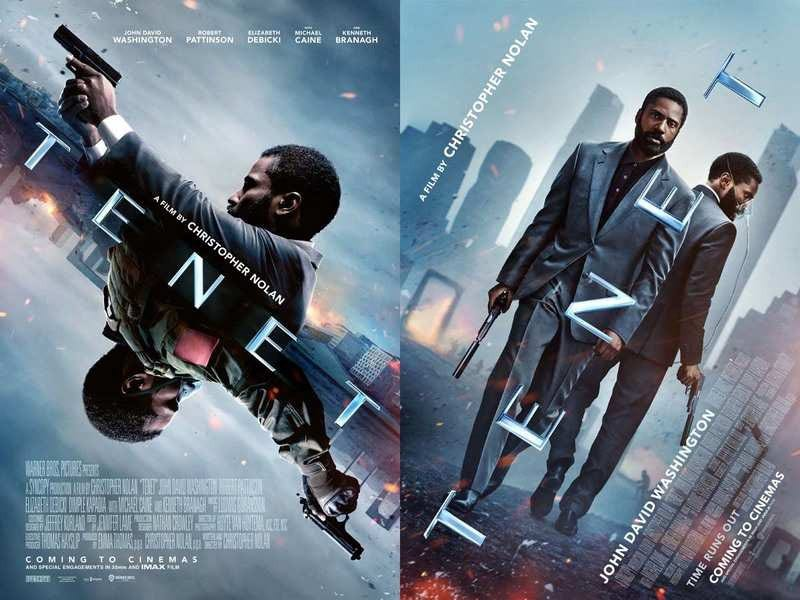
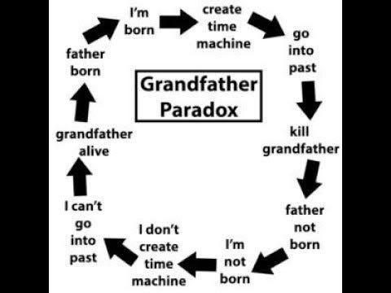
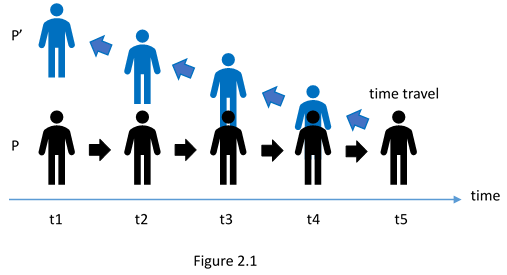
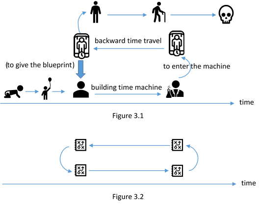

> *“What’s happened, happened.” Neil*

### Major Spoilers Alert

Christopher Nolan loves making movies based on scientific, philosophical, and psychological ideas. It is pretty fun watching his movies while trying to understand the cool theories lying in the amazing works. TENET is about time travel, and the backward one. How time can be inverted, physically, is based on the second law of thermodynamics, the entropy, and the arrow(direction) of time. A lot of people have discussed about that, so I am trying to articulate something more philosophical. The idea here is mainly based on Paradoxes of Time Travel by Wasserman (2018).

### Ludovician Time Travel and The Grandfather Paradox

What will happen if you travel to the past and kill your grandfather before he meets your grandmother? It seems impossible because doing such thing will prevent yourself from being born. This is The Grandfather Paradox as we know.

When it comes to the discussion of time, or the present, past, and future, we usually presuppose that the past is fixed. As Neil said, “What’s happened, happened.” In this sense an answer to The Grandfather Paradox will be that the time traveler will somehow fail to kill zis grandfather, whatever the coincidence is.[1] Maybe zie slips on a banana peel while trying to pull the trigger and thus fails.[2]

What’s done cannot be undone. What’s undone cannot be done. If backward time travel is possible and you travel to the past, then you should have already been there in the first place. Suppose you are 30 years old and travel to the past to meet you 20-year-old self, then you should have already met your 30-year-old self, ten years ago when you were 20. If you travel to the past to kill your grandfather, you should have already failed in the past. It does not follow that backward time travel is impossible, but if it is, then it has already happened.

This is what philosophers call the Ludovician time travel (in memory of David Lewis). Time can be depicted as a line, with all events of the whole universe included. There are already several clear timelines made by others of what exactly happens in the movie. (e.g. [this](https://www.reddit.com/r/tenet/comments/iixw59/tenet_character_timeline/)) You can take any of them and keep reading. While watching the movie, we are moving through the timeline with the protagonist’s subjective view. But while looking at the timeline, from the omnipotent (objective) view (the complete timeline), we can see that these are nothing more than a series of events. There is no genuine(real) change that brings things into existence.

As a result, if there are things that travel to the past or get inverted and move backwardly, then people in the past, like the protagonist, should have met them (it has already been at that spatiotemporal location in this universe). That’s why the protagonist has to fight himself twice. From the omnipotent view, this fight happens just once, but from the protagonist’s view, it happens twice. Any other event in the movie with things getting inverted has nothing different.

The genuine change happens in the non-Ludovician time travel, where from the omnipotent view, there can be an event at a time that becomes another “later”. Some good examples appear in Back to the Future, where the past is genuinely changed, with an old one and a new one as a result. In other words, there are two timelines (TENET only has one) in Back to the Future, the original one and the changed one.[3] Theories which consider this include branching time, parallel universe, and hypertime.[4]

However, if there is a whole universe, then the world war three or Armageddon that the protagonist tries to stop does not exist in the first place. He can take actions with this belief of course, and there can be a causal relation between his behavior and that the Armageddon is prevented, but where does the wreckage showed by the scientist come from? The existence of the wreckage implies the existence of the Armageddon in this universe, but there is no Armageddon. Besides, sometime the characters talk about how future or past can be changed because the original one is terrible. It is hard to say anyway.

### Continuous Backward Time Travel and The Double-Occupancy Problem

We usually imagine backward time travel in the following way. A time traveler enters a time machine, presses the button, and leaves the time machine to find zieself already in the past. In other words, zie somehow gets teletransported to the past. No matter how long the travel takes, this is the classic discontinuous backward time travel.

A continuous time travel, on the other hand, works in a different way. A time traveler, again, enters a time machine and presses the button. Zie begins to find everything other than things in the time machine including zieself “inverted”, as what we see in TENET, until the journey is finished. TENET differs in this depiction because the reverse movement in the movie will not end until the traveler enters the time machine again. They nonetheless share the same problem called The Double-Occupancy Problem.[5]

This problem is simple. Imagine yourself moving backwardly in time. Why won’t you bump into yourself at the last second? To clarify, you are at a location L and time T, let’s say, and starts to travel to the past continuously a moment later. Soon you will be back to the same location at the same time. There will be, then, two people occupying the coordinate point (L, T) in the same universe, but it is impossible for two objects to occupy the same spatiotemporal coordinate point and thus we meet a problem.

It might be metaphysically possible,[6] but another way to escape this is to move in space while time traveling. However, we will meet yet another problem because a person who occupies over one coordinate point in space will still collide with a part of his last-instant self even if zie moves in space while time traveling, as Figure 2.1 illustrates. The person P begins to travel to the past as P’ at time t5. He then will collide with a part of his past self at t4 and t3. This cannot be avoided for anything occupying over one coordinate point in space to do continuous time travel.

Wasserman gives an interesting solution suggested by Poidevin (2005, pp. 344–345).[7] He argued that we meet this problem because we assume the entire time machine (with the time traveler) will disappear right after the button is pressed. Since this is a continuous time travel, only a part of the time machine will disappear right after the travel starts, followed by another part one by one, which “behaves like the Cheshire Cat”.

Many technical problems remain, but it seems roughly possible even if it seems weird (But time travel is not normal in the first place). Those who don’t really get it can conceive the sun setting in the evening. While the sun is sinking into the horizon, it does not disappear suddenly. Instead, it disappears slowly, with a part first followed by another.

Back to the movie, anyone who enters the time machine will be teletransported to another location, or another coordinate point in space, to avoid colliding with zieself. Theoretically speaking, this is not as good as what I just mention because the time traveler does not move continuously in space, though it still works as a solution.

### The Problem of Free Will, Causation, and Personal Identity in Time Travel

In the first part of the movie, the scientist asks the protagonist to try to shoot only to find himself catching the bullet. The protagonist then questions if there is free will and causation. This is not clearly answered in the movie even though we might more or less find characters believing that free will exists.

Roughly speaking, if free will exists, we will be able to decide our behaviors. This means the future is not yet totally determined because we have not made any decision. However, in the movie it seems the future is already fixed as the past is. For example, in the end of the plot, Neil is going to the past to help the protagonist. This is a past event, from Neil’s view, but also a future event since he is going to experience it again. The protagonist asks him not to sacrifice himself, but he insists on leaving because “What’s happened, happened”.

The problem here is if he is able to make another decision. From a point of view, he is because he simply decides to go to the past. From another, however, he isn’t because he cannot help but do the time travel. To clarify, if he, with his free will, decides not to travel to the past to save the protagonist, can he make this decision?[8]

Another problem lies in causation. A classic problem about causation in time travel is this. Consider Figure 3.1. Suppose a scientist one day meets a person who claims to be zis future self. Zie builds a time machine in the future and travels here with a blueprint to tell zieself how to build a time machine. The scientist then builds a time machine with this blueprint. After finishing the machine, he travels to the past, with that blueprint again, to tell zis past self how to build a time machine…

There is obviously a problem. Where does the blueprint come from? It still stands as a complete story since there is nothing contradictory, but the causal relation of the blueprint coming into existence in a sense is missed, as showed in Figure 3.2. In other words, there is no explanation for the blueprint to appear into this universe. TENET meets similar problems in causation. In fact, any Ludovician backward time travel shares the same problem.[9]

Another problem concerning causation is how to be causally related with inverted objects. While the protagonist is trying to shoot, for example, he then “catches” the bullet as the scientist explains. However, how does pulling the trigger causes the bullet “to be caught”? It can be argued that it is actually the trigger-pulling behavior causes the “inverted” bullet to be caught, instead of a normal bullet. This seems somewhat puzzling though.

The problem of personal identity might not be as interesting as the previous two, but there are people who take it seriously. In Steins;Gate, for example, it is said that the time traveler cannot meet zieself, or it would cause something catastrophic. It is hard to say why meeting your past self is a problem though. However, even if we don’t see it as a problem, it can still be problematic from the other perspective.

In TENET, time travelers will be able to exist at different places simultaneously. While Kat is jumping into the sea, she is also on the boat. In the chasing scene, the protagonist is at two different cars at the same time. Neil can exist at more than three different places simultaneously. This seems puzzling, as we know if you are at Taiwan, it is impossible for you to be at China at the same time. A person cannot appear at two places simultaneously. Any backward time travel seems to allow this to happen, and thus an explanation is needed.[10]

### Conclusion

Philosophically speaking, TENET does not give anything new. And I personally don’t really like it compared to Nolan’s other works such as Momento, Inception, and Interstellar (while Neil is drop-dead gorgeous and Kat is such an eye candy). But it shows us how an abstract idea, such as meeting something inverted, can be converted into something concrete (on an IMAX screen) and dramatic. It even shows us how to physically fight one’s inverted self! This does inspire me a lot, especially when I am still suffering from finishing my these, and I hope to see more in the future.

[1] Killing any ancestor of yourself is actually a self-defeating behavior other than just a past-changing one. Anyone who is interested in this difference can find the explanation in (Wasserman, 2018, pp. 71–78).

[2] See (Lewis, 1976), (Vihvelin, 1996), and (Smith, 1997) for more discussions.

[3] See (Wasserman, 2018, pp. 79–90) for more discussions.

[4] (Wasserman, 2018, pp. 78–99)

[5] (Wasserman, 2018, pp. 32–38)

[6] (Effingham, 2020, pp. 51–52)

[7] (Wasserman, 2018, p. 37)

[8] See (Wasserman, 2018, Ch. 3 and Ch. 4) for more discussions.

[9] See (Wasserman, 2018, Ch. 5) for more discussions.

[10] See (Wasserman, 2018, Ch. 6) for more discussions.

### Reference

Effingham, N. (2020). *Time Travel: Probability and Impossibility*: Oxford University Press.

Lewis, D. K. (1976). The Paradoxes of Time Travel. *American Philosophical Quarterly, 13*(2), 145–152.

Poidevin, R. L. (2005). The Cheshire Cat Problem and Other Spatial Obstacles to Backwards Time Travel. *The Monist, 88*(3), 336–352.

Smith, N. J. J. (1997). Bananas enough for time travel? *British Journal for the Philosophy of Science, 48*(3), 363–389.

Vihvelin, K. (1996). What time travelers cannot do. *Philosophical Studies, 81*(2–3), 315–330. doi:10.1007/BF00372789

Wasserman, R. (2018). *Paradoxes of time travel*. Oxford, United Kingdom: Oxford University Press.
