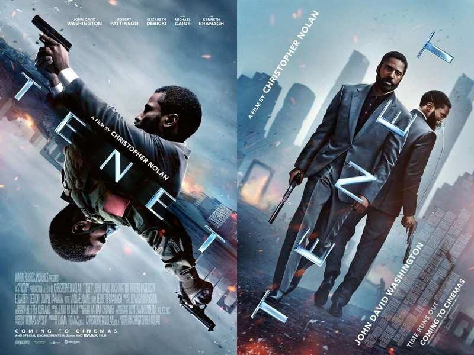
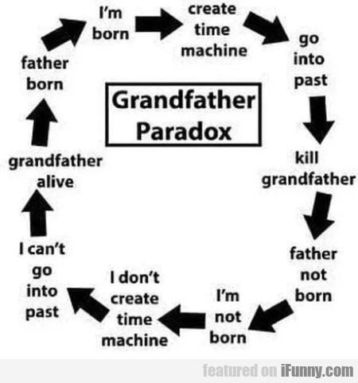
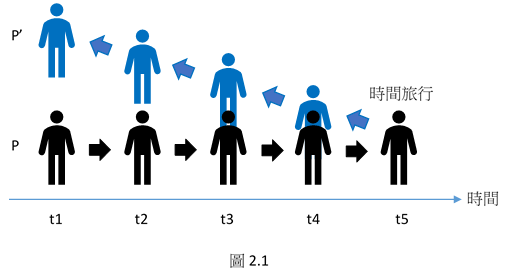
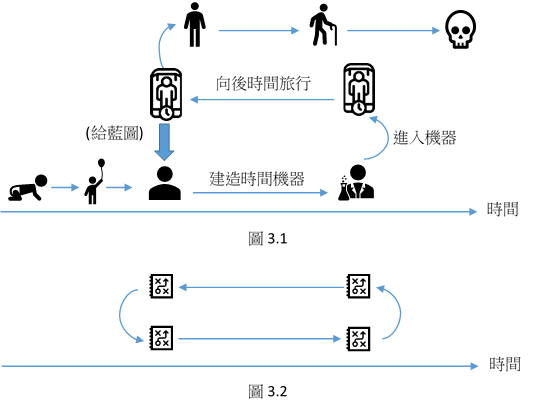

> *「那些發生過的事情，早就已經發生過了。」 — — 尼爾*

### 暴雷警告

克里斯多福．諾蘭（Christopher Nolan）的諸多電影作品常以某些科學、哲學或心理學理論做為基礎，觀影後找尋藏在背後的理論一向是件有趣的事情。《天能》是一部關於時間旅行的作品，而且是回到過去的時間旅行。物理學上的時間如何被逆轉與熱力學第二定律以及熵有關係，有很多人已經解釋過了。我嘗試在這裡幫諾蘭說明的，則是一些哲學上對時間旅行的看法。

這篇文章主要的觀點都是來自於Wasserman (2018)所著的Paradoxes of Time Travel。

### Ludovician時間旅行與祖父悖論

假設你回到過去殺掉你祖父，而且是在他遇到你祖母之前完成這件事的話，這是有可能的嗎？如果你祖父死了，那你就不可能出生，那你又怎麼可能去做件事情？這就是鼎鼎大名的祖父悖論。

[來源](https://garpedia.fandom.com/wiki/Grandfather_Paradox)

時間在哲學中的討論常常會包含過去、現在與未來，而這三者的差別就在於，過去通常是已經發生，也就是不可能再改變了。如同尼爾在電影中說的：「那些發生過的事情，早就已經發生過了。」從這個觀點來看，我們可以用「時間旅行者殺掉祖父的計畫一定會失敗」來回應祖父悖論的難題[1]。不管時間旅行者用什麼奇怪的方式失敗，比如他可能踩到了香蕉皮滑倒而失敗，反正他一定會失敗[2]。

過去的事件不管有沒有發生過都不會改變。因此，如果「向後時間旅行」（旅行到過去）是可能的，而且你也真的旅行到過去了，那你應該早就已經在過去出現過了。換句話來說，假設你30歲並旅行到10年前找到20歲的自己，則你在20歲時應該就已經遇到過一次30歲的自己了。同樣的道理，如果你旅行到過去嘗試殺掉你祖父，則你應該早就已經在過去失敗了。這不代表向後時間旅行不可能，而是代表如果向後時間旅行可能的話，那它應該早就已經發生過了。

這種時間旅行被稱之為Ludovician時間旅行（為了記念David Lewis）。這個理解方式下的時間可以被畫為一條線，而所有這個宇宙中的事件都包含在其中。電影也是如此，我們可以在網路上找到很多人畫出來的時間軸（比如[這個](https://www.facebook.com/funingee/photos/a.667086030494735/821063075097029/?__cft__[0]=AZWi63i6Gq4J5X8SG4jq1CZOjTLZ2kCMw8jKcS5NckcbBqSl4PMmKmzyRW33fFJXSTES2Bv99ix63w9zKK7MkRDHh-wGxG6w0q8a5KaXJ0E05udZV-PRKo4M8VZFkCkDWwtSkP9AK-ivOiUTplE4bvb-qbsePZ8N4aJEmy7RNKm-uA&__tn__=%2CO*F)），讀者可以先隨便找一張好看的圖放著繼續閱讀。在看電影的時候，我們隨著主角的主觀視角移動，但如果從一個全知全能的客觀角度來看（也就是網友製作的完整時間軸），我們可以發現其實這就是一連串的事件排成的序列而已。這整個完整的宇宙中沒有任何新的東西加入（to come into existence），或是說沒有真實的改變（genuine/real change）。

因此，如果有任何東西旅行到過去或像電影那樣向過去移動，那過去的人應該早就已經遇到了（因為東西從一開始就已經在這個宇宙的這個時空位置了）。這也是為什麼主角必須和自己打架兩次。從全知全能的角度來看，這件事情其實只有發生過一次而已，但從主角的觀點來看，這件事情發生過兩次。所有電影中的其它時間旅行有關的事件都會有這個情況。

而在非Ludovician時間旅行的世界中，真實的改變是有可能發生的。也就是說，即使從全知全能的觀點來看，同一個宇宙的時空位置上的事件也可以「不一樣」。以《回到未來》或《蝴蝶效應》為例，時間旅行後的世界會有兩個過去（可能也有兩個未來），一個是舊的，一個是被改變過後的新過去。也就是說，這種時間旅行會創造出至少兩個時間軸，而天能只有一個時間軸而已（不管裡面的角色有幾個）[3]。相關的理論會有分支時間（branching time）、平行宇宙（parallel universe）和超時間（hypertime）等等[4]。

只不過，如果整個宇宙在電影中可以被描繪出來的話，那所謂主角要去阻止的世界毀滅也應該從一開始就不存在於這個宇宙當中。主角當然可以秉持這個信念行動，而且他的行動也的確可以和世界毀滅被阻止這個結果有因果關係。但是一開始科學家給他看的世界毀滅後剩下的殘骸又是從哪裡來的呢？有殘骸代表整個宇宙中在某個時間點應該存在世界毀滅的事實，但實際上應該沒有這個事實才對。不過，電影中角色間的談話有時會透露出一些世界可以被真實改變的訊息，這部分就不得而知了。

### 連續性向後時間旅行與重複佔據問題

我們通常用以下的方式來描述一趟時間旅行：一個時間旅行者進入時間機器按下按鈕，然後離開時間機器的時候就會發現自己已經在過去了。換句話來說，他透過一種類似於瞬間移動的方式移動到了過去。不管旅行花了多久時間，這種旅行方式是一般我們所稱為非連續性的向後時間旅行。

連續性的時間旅行則如下：時間旅行者一樣進入時間機器按下按鈕，然後他會發現週遭的事物如同電影中演得一樣開始倒退，一直到旅行結束。不過《天能》中比較不一樣的地方在於，旅行者需要再次進入時間機器才能把自己在時間中的移動方向導正。無論如何，連續性的時間旅行會遇到一個被稱之為「重複佔據」的問題（The Double-Occupancy Problem）[5]。

問題其實很單純。想像一下你自己正在時間中倒退，那你應該為和前一個瞬間的自己相撞才對。這是什麼意思呢？假設你在某個時間點T時處在某個位置L，而你決定在一秒之後向後時間旅行，則你開始旅行之後，因為你會在同樣的時間點回到同樣的位置，因此這個座標(L,T)的地方就會被兩個人佔據，但同一個宇宙的任意一個時空點不可能被兩個以上的東西給佔據，問題因而產生。

形上學上也許是可以容許這種事情發生的[6]，但另一種解決這個問題的方式是在時間旅行的同時，時間旅行者也在空間中移動，假設我移動到了另一個空間中的位置，那時間旅行的時候我就不會同時與我過去的自己處在相同的位置了。可惜的是，我們還是會再遇到一個問題，因為人是有體積的，因此我們會同時佔據超過一個空間坐標。因此這種旅行方式雖然可以避免我完全和過去的自己相撞，但實際上還是會撞到一部分的自己。如圖2.1，假設某個人(以P表示)在時間t5時開始向後時間旅行(以P’表示)，則他會在t4和t3的時候撞到自己身體的一部分。也就是說，只要是有體積的物體在連續性的時間旅行時都會遇到這個問題。

Wasserman提供了一個由Poidevin (2005, pp. 344–345)所提出的解決方案[7]。他認為我們會遇到這個問題是因為我們預設了時間旅行的時候，整台時間旅行機器（包含時間旅行者）會在按下按鈕之後瞬間消失。但既然這是一個連續性時間旅行，那整部機器應該是緩慢地先消失一部分，然後另一部分再慢慢跟著消失才對，「如同柴郡貓那樣」（柴郡貓就是《愛麗絲夢遊仙境》中那隻身體消失後笑容會留下來的貓）。

技術上當然還有很多問題，但是大致上這是一個怪異（向後時間旅行本來就夠怪了）但可以解決問題的方式。如果你搞不太懂的話，設想夕陽西沉到地平線下的場景。夕陽在沉下去的時候應該不是瞬間就消失，而是一部分接著另一部分緩緩地消失才對。時間旅行機器也是相同的道理。

電影中則又不太一樣。進入時間機器的人會從另一個位置出來以避免撞到自己。也就是說，其實這裡偷偷藏了一個空間中的瞬間移動。理論上，我們既然想要連續性的時間旅行，就不會希望我們還得要在空間中瞬間移動才能避免某些問題，不過這的確也可以視為一種解決方法，至少電影中的人都不會因為時間旅行而撞到自己。

### 自由意志、因果、人格同一性在時間旅行中的困難

在電影的前段中有一個橋段是科學家在向主角解釋向後退的事物。而主角在接住子彈之後問了因果和自由意志的問題。這整部電影沒有給出明確的答案，但看起來應該有些角色在對談中仍透露出相信自由意志存在的訊息。

大致上來說，如果自由意志為真，則我們應該可以決定我們等一下要做什麼。因為我們還沒有做決定，因此未來也還沒有被完全決定。然而在電影中，未來看起來如同過去一樣已經被決定了。比如說，在劇情尾聲時尼爾決定回到過去救主角。從尼爾的角度來看，救主角的事件存在於過去，但同時也是個未來的事件，因為他正要再去經歷這個事件一次。主角請他不要犧牲自己，但他只留下一句「那些發生過的事情，早就已經發生過了。」

問題就在於說，他到底能不能做出其它選擇？某方面來說他看起來可以，因為他的確決定要這樣做；但另一方面他看起來又不行，因為整件事情明明就已經發生過了。問題的核心在於，假設他「透過自由意志」決定不要回去犧牲自己，那他真的可以做出這樣的決定嗎[8]？

另一個問題則是因果。讀者可以先看看以下這個經典的時間旅行因果問題（如圖3.1），假設一個科學家遇到了一個自稱未來自己的人，他在未來建了一個時間機器並旅行到現在，為了教過去的自己如何建機器，同時也給了他一張機器的藍圖。這個科學家透過這張藍圖建造了一台時間機器，並在建造成功之後旅行到過去，把那張藍圖拿給過去的自己，並教他如何建造時間機器……

這裡顯然有一個問題，到底這張藍圖是從哪裡來的呢（如圖3.2）？這整個描述中其實沒有什麼矛盾存在，但是藍圖的出現（to come into existence），或是說這個宇宙中對於藍圖的存在沒有良好的原因或解釋。《天能》也會有相同的問題，而實際上所有Ludovician向後時間旅行都會有相同的問題[9]。

另一個和因果有關的問題則是到底如何和逆行的東西有因果關係。電影中主角嘗試射出子彈時，他如同科學家解釋一樣「接住」了子彈。然而，嘗試射出子彈要怎麼導致子彈被接住呢？這似乎不太合理。一種解釋方式是區別一般的子彈和逆行的子彈，因此射出子彈就可以和「逆行」子彈有因果關係。然而這好像還是讓人感到相當困惑。

人格同一性的問題就不像前兩個那麼有趣了，但也有一些人很重視這個問題。比如在《命運石之門》當中，有一個「時間旅行者不能遇到過去自己」的設定。雖然似乎沒有什麼人解釋過這為什麼是個問題，但就算不管它，人格同一性仍然會有其它問題存在。

在《天能》中，時間旅行過後的人可以在同一個時間點出現在不同的地方。凱特可以同時在船上又跳海。主角則在飛車追逐的片段中同時待在兩台不同的車子裡面。尼爾這個時間旅行超多次的人甚至可以在同一個時間點出現在超過三個不同的地方。可是這似乎有些問題，因為我們知道，假設你現在在台灣，則你不可能同時也身處在中國。一個人是不可能同時出現在兩個不同的地方的，可是所有的向後時間旅行都有可能讓這件事情發生，因此需要一些解釋[10]。

### 結論

《天能》從哲學的角度來看應該是沒有給出什麼新的東西，而且相較於之前諾蘭拍過的比如說《記憶拼圖》、《全面啟動》或《星際效應》之類的作品，《天能》沒有給我什麼太過驚豔的感覺（反而是尼爾太帥而且凱特太有氣質ㄌ）。不過，一個抽象的哲學想法可以用具體的大螢幕（而且還是IMAX！）來呈現也還是一件讓人興奮的事情，畢竟如果沒有演出來的話，要和逆行的自己打架實在有點難想像。這無形中也給了深陷論文苦海的我一盞明燈，希望未來能再多看到類似的作品。

[專頁](https://www.facebook.com/%E5%93%B2%E5%AD%B8%E5%AE%85-Philosophy-Otaku-111203980427942)

[1] 殺掉自己或自己的祖先其實應該是一種自我擊敗(self-defeating)的行為，而非單純的改變過去。如果想知道其中的差別，可以從(Wasserman, 2018, pp. 71–78)找到答案。

[2] 可以從(Lewis, 1976)、(Vihvelin, 1996)、(Smith, 1997)找到更多的討論。

[3] 更多討論可以看(Wasserman, 2018, pp. 79–90)。

[4] (Wasserman, 2018, pp. 78–99)

[5] (Wasserman, 2018, pp. 32–38)

[6] (Effingham, 2020, pp. 51–52)

[7] (Wasserman, 2018, p. 37)

[8] 更多討論可以看(Wasserman, 2018, Ch. 3 and Ch. 4)。

[9] 更多討論可以看(Wasserman, 2018, Ch. 5)。

[10] 更多討論可以看(Wasserman, 2018, Ch. 6)。

### 參考資料

Effingham, N. (2020). *Time Travel: Probability and Impossibility*: Oxford University Press.

Lewis, D. K. (1976). The Paradoxes of Time Travel. *American Philosophical Quarterly, 13*(2), 145–152.

Poidevin, R. L. (2005). The Cheshire Cat Problem and Other Spatial Obstacles to Backwards Time Travel. *The Monist, 88*(3), 336–352.

Smith, N. J. J. (1997). Bananas enough for time travel? *British Journal for the Philosophy of Science, 48*(3), 363–389.

Vihvelin, K. (1996). What time travelers cannot do. *Philosophical Studies, 81*(2–3), 315–330. doi:10.1007/BF00372789

Wasserman, R. (2018). *Paradoxes of time travel*. Oxford, United Kingdom: Oxford University Press.
