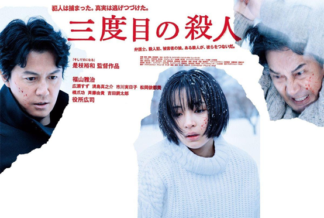
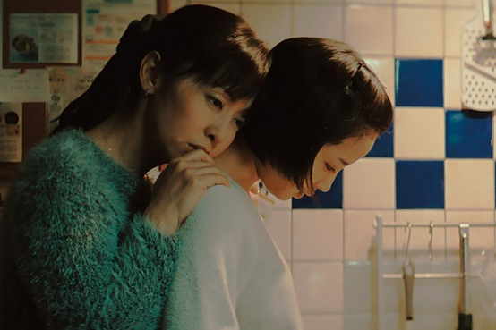
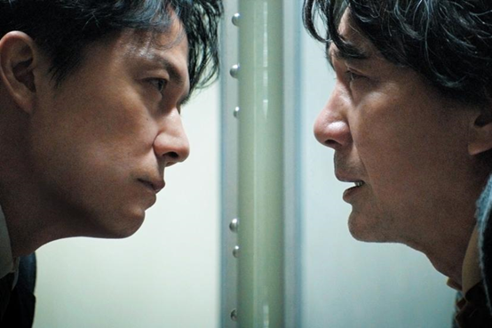

> Spoiler alert

The Third Murder (三度目の殺人) reminds me of Rashōmon(羅生門). Different people illustrate different truths. Why do people say what they say? Are they trustworthy? Well, there is no such truth in Rashōmon. In fact, it does not really matter. The Third Murder, in my opinion, is the same, and thus there is no point arguing who is the murderer. However, Hirokazu Koreeda(是枝裕和) adds something new in this movie. This, on the other hand, makes me interested in the title, the third murder. What is the third murder? If there is a murder at Hokkaidō in the far past, the second murderer should be the one in the beginning of the movie. What, then, is the third? It might be the case that Takashi Misumi (三隅高司) is sentenced to death. Fair enough, Misumi is killed, and who is the killer?

From this perspective, the killer is everyone in my opinion. Legally speaking, the movie shows the problem in the trial system, that the judge under the pressure of the performance appraisal does not have enough time for every case. The prosecutors rely on only the confession. The lawyers always care about only the strategy in the court. After all, what the criminal law shows is neither truth nor justice, but only that we should not kill people for no reason. To be more accurate, it is that you will receive penalties by murdering, for the sake of the society and the country. On the other hand, Tomoaki Shigemori (重盛朋章) wants to protect Sakie Yamanaka (山中咲江) from telling everyone that she keeps getting sexually abused by her father, the victim. It is not sure if Misumi wants to save her as well by asking his lawyer to argue that he did not kill anyone. Sakie and her custodial mother who cares only the insurance rely on the income of his father’s factory with tainted food. It is not sure whether Sakie is involved with the murder or not by her partly charred shoes and that she keeps visiting Misumi at his place. All of these kill Misumi.

Well, there are actually a lot of things I don’t understand why they exist in this movie, including the father-daughter relationship of Shigemori and Misumi, until I see [this](https://medium.com/@looky.kao/%E7%AC%AC%E4%B8%89%E6%AC%A1%E6%AE%BA%E4%BA%BA-%E9%9D%9E%E5%85%B8%E5%9E%8B%E6%B3%95%E5%BA%AD%E5%8A%87-%E6%AF%94%E6%B5%B7%E9%82%84%E6%B7%B1%E7%9A%84-%E7%88%B6%E6%84%9B-a34aa1f6e740). This review does remind me of the importance of what a family is supposed to be in Kore-eda’s works. You don’t become a mother or a father by simply giving birth to someone. Misumi seems to regret so much for not being a good father. Shigemori is similar, while his daughter is still a teenager. When Shigemori is getting closer to the truth, if there exists one, he finds that Sakie might be involved with the murder and that she keeps being sexually abused by his father. In the visiting room, as Misumi knows how much Shigemori has found, this is when Misumi and Shigemori have the same goal, that Sakie must be protected. Through the window, the warmth and the feeling are conveyed by putting the hands on it. If warmth is the proof that you are alive, this behavior could be the communication of how a person should live. After the final judgement, Misumi clasps Shigemori’s hands tightly to express his appreciation, and in the next scene Sakie tells Shigemori that people don’t care about truth at the court. At the same time I begin to think about if it is true that there are people who should not have been born, as the young lawyer argues.

I think it is correct, that a hollow container will become what is put inside. The problem is, then, how much space I have.
