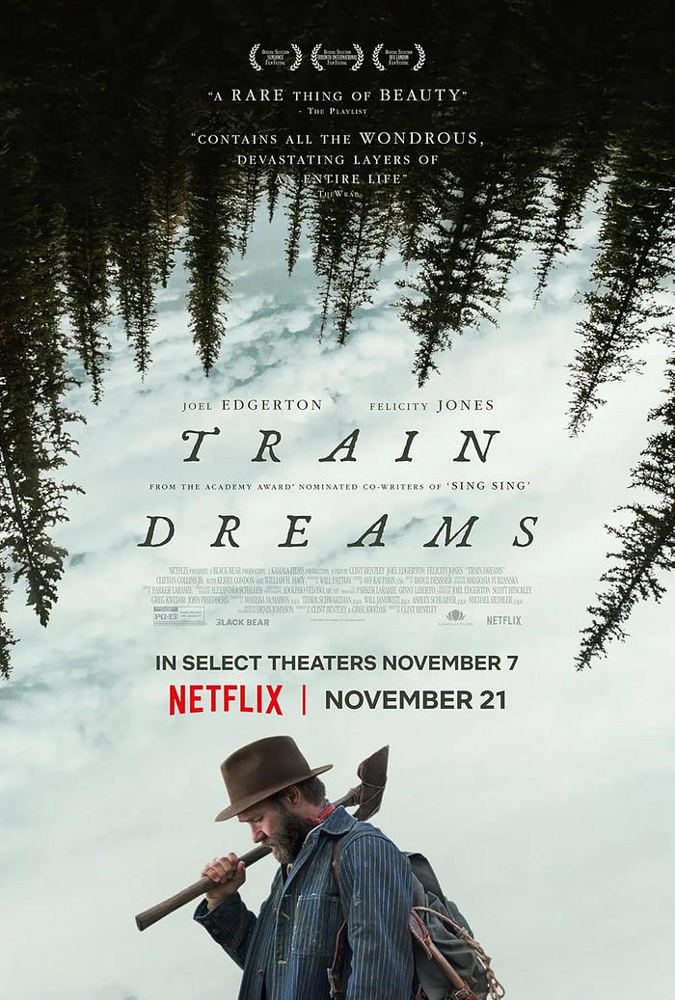

《火車大夢》講述了一位20世紀初的美國伐木工。

一個再普通不過的男人。這部作品描述的也不過是一段平凡的人生：一個平凡的男人、一段平凡的歷史、一個看似平凡的時代。

只是那個時代或許沒那麼平凡吧。畢竟那是鐵路大舉興建的年代，是舊世界逐漸瓦解、新世界迅速擴張的年代。

只是這位平凡的男人，最終卻收到了時代開給他的殘忍玩笑。

## 時間、記憶與生命

作品給人的感受緩慢而沉重，像是被悄悄吸入那個荒涼年代的深處。

孤寂、無奈、沉默，都在敘事的縫隙中緩緩擴散。

而我自己看下來的感覺是，主角的生命也許也停在那場大火裡面了吧。

從那之後，剩餘的生命就像幽靈一樣，飄蕩在過去的記憶裡。

主角表面上是在前進，但永遠只能注視著過去。

確實，我們每個人都是由過去的碎片組成的。

我們透過記憶形塑現在的自己，卻也因此受困於記憶，如同被幽靈纏身，被未完成的情緒與未說出口的話語拉扯。

在與 Claire Thompson，也就是政府雇來防止大火再度發生的雇員對話，還有在最後搭乘雙翼飛機的過程中，主角的時間好像才稍微開始有些流動起來。

但那終究是一場夢。

## 無限的孤寂

或許在生命的不同階段重讀《火車大夢》，會看到截然不同的光影。

那種感覺像是：一路走來都如此，往後也多半會是如此。

我以為某一天會有什麼不一樣的事物出現，會有某種啟示、某種召喚，帶我走向新的方向。

但我們仍然只是回望過去。

人生的意義是什麼呢？當我用盡全力去尋找它的時候卻遍尋不著。

但偶爾又會在某些片刻，感覺它似乎就在眼前。好像它其實一直散落在生活的點滴之中，在每一段不起眼的經歷裡。

不知道為什麼，我在看這部作品的時候，腦海中一直浮現出一個詞彙：無限的孤寂。

確實如劇情所示，尤其在主角使用馬車運送貨物的過程中，他得以和眾多人互動。

但孤寂感卻也在此時達到頂峰。

而所有人走到生命的盡頭時，終究都要面對這樣的孤寂吧。

我隻身來到這個世界，也將隻身離開這個世界。
