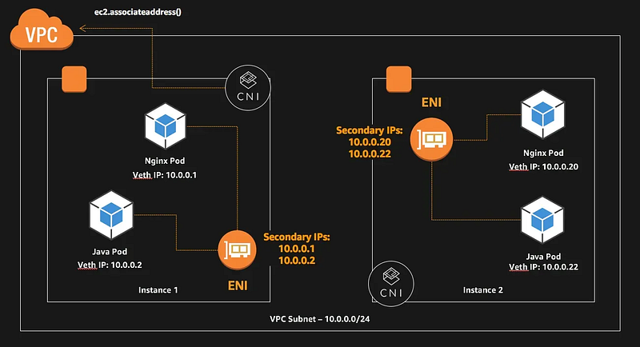
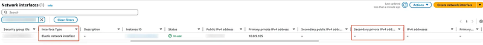
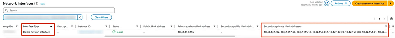
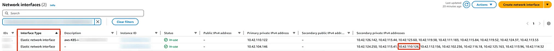

### 🔍 Introduction: Why EKS Networking Matters for DevOps and SREs

In today’s cloud-native world, **Amazon EKS** (Elastic Kubernetes Service) is a widely adopted solution for running Kubernetes workloads on AWS.

For **DevOps engineers** and **Site Reliability Engineers (SREs)**, understanding how networking works within EKS is crucial — not just for ensuring applications are reachable, but also for troubleshooting issues, enforcing security, and scaling services effectively.

Kubernetes abstracts away much of the complexity of container orchestration, but when it runs on AWS, the underlying **EC2 networking**, **Elastic Network Interfaces (ENIs)**, **VPCs**, and **Security Groups** all come into play. Pods don’t exist in isolation — they interact with nodes, load balancers, DNS, and IAM policies, all of which depend on proper IP allocation and interface configuration.

By learning how **EKS assigns IPs to Pods**, and how these IPs are tied to the EC2 network stack, you can:

- **Debug connectivity issues** between services
- **Understand IP exhaustion scenarios** and how to resolve them
- **Implement pod-level security controls** using security groups
- **Design network policies and architectures** that are scalable and secure

This foundational understanding becomes even more important when enabling advanced features such as **custom networking** or **security groups per Pod**.

In this article, we’ll break down how Pod IPs are assigned in EKS, how to inspect them from both the node and the AWS perspective, and lay the groundwork for understanding more advanced networking patterns.

### 🧠 Basics of EKS Pod Networking

### Pods and ENIs

In EKS, every Pod gets an IP address. These IPs are assigned from the EC2 instance’s ENIs. By default:

- Pods use the **Secondary IPs** of the **Primary ENI** on the EC2 node.
- If more IPs are needed, EKS allocates a **Secondary ENI** and uses its Secondary IPs.



### 🔎 Verifying IP Assignment

### On General EC2 Instances

#### The Networking Environment in the Instance

```
[ec2-user@ip-10-0-9-105 ~]$ ip addr
1: lo: <LOOPBACK,UP,LOWER_UP> mtu 65536 qdisc noqueue state UNKNOWN group default qlen 1000
    link/loopback 00:00:00:00:00:00 brd 00:00:00:00:00:00
    inet 127.0.0.1/8 scope host lo
       valid_lft forever preferred_lft forever
    inet6 ::1/128 scope host noprefixroute
       valid_lft forever preferred_lft forever
2: ens5: <BROADCAST,MULTICAST,UP,LOWER_UP> mtu 9001 qdisc mq state UP group default qlen 1000
    link/ether 06:9b:0f:55:20:bf brd ff:ff:ff:ff:ff:ff
    altname enp0s5
    altname eni-064bb4eadbeea6a6b
    altname device-number-0.0
    inet 10.0.9.105/20 metric 512 brd 10.0.15.255 scope global dynamic ens5
       valid_lft 3247sec preferred_lft 3247sec
    inet6 fe80::49b:fff:fe55:20bf/64 scope link proto kernel_ll
       valid_lft forever preferred_lft forever

[ec2-user@ip-10-0-9-105 ~]$ ip route
default via 10.0.0.1 dev ens5 proto dhcp src 10.0.9.105 metric 512
10.0.0.0/20 dev ens5 proto kernel scope link src 10.0.9.105 metric 512
10.0.0.1 dev ens5 proto dhcp scope link src 10.0.9.105 metric 512
10.0.0.2 dev ens5 proto dhcp scope link src 10.0.9.105 metric 512
```
#### From Console

- Type: Elastic network interface
- Secondary private IP: N/A


#### With CLI

- IntrefaceType: interface
- PrivateIpAddresses: only one

```
$ aws ec2 describe-network-interfaces \
  --filters Name=attachment.instance-id,Values=i-xxxxxxxxxxxx \
 --output table
----------------------------------------------------------------------------------
|                            DescribeNetworkInterfaces                           |
+--------------------------------------------------------------------------------+
||                               NetworkInterfaces                              ||
|+-----------------------+------------------------------------------------------+|
||  AvailabilityZone     |  ap-northeast-1a                                     ||
||  Description          |                                                      ||
||  InterfaceType        |  interface                                           ||
||  MacAddress           |  xx:xx:xx:xx:xx:xx                                   ||
||  NetworkInterfaceId   |  eni-xxxxxxxxxxxxxxxxx                               ||
||  OwnerId              |  012345678901                                        ||
||  PrivateDnsName       |  ip-10-0-9-105.ap-northeast-1.compute.internal       ||
||  PrivateIpAddress     |  10.0.9.105                                          ||
||  RequesterManaged     |  False                                               ||
||  SourceDestCheck      |  True                                                ||
||  Status               |  in-use                                              ||
||  SubnetId             |  subnet-xxxxxxxxxxxxxxxxx                            ||
||  VpcId                |  vpc-xxxxxxxxxxxxxxxxx                               ||
|+-----------------------+------------------------------------------------------+|
|||                                 Association                                |||
||+----------------+-----------------------------------------------------------+||
|||  AllocationId  |  eipalloc-xxxxxxxxxxxxxxxxx                               |||
|||  AssociationId |  eipassoc-xxxxxxxxxxxxxxxxx                               |||
|||  IpOwnerId     |  012345678901                                             |||
|||  PublicDnsName |  ec2-xxx-xx-xx-xx.ap-northeast-1.compute.amazonaws.com    |||
|||  PublicIp      |  xxx.xx.xx.xx                                             |||
||+----------------+-----------------------------------------------------------+||
|||                                 Attachment                                 |||
||+-------------------------------+--------------------------------------------+||
|||  AttachTime                   |  2000-00-00T00:00:00+00:00                 |||
|||  AttachmentId                 |  eni-attach-xxxxxxxxxxxxxxxxx              |||
|||  DeleteOnTermination          |  True                                      |||
|||  DeviceIndex                  |  0                                         |||
|||  InstanceId                   |  i-xxxxxxxxxxxxxxxxx                       |||
|||  InstanceOwnerId              |  012345678901                              |||
|||  NetworkCardIndex             |  0                                         |||
|||  Status                       |  attached                                  |||
||+-------------------------------+--------------------------------------------+||
|||                                   Groups                                   |||
||+------------------------------------+---------------------------------------+||
|||               GroupId              |               GroupName               |||
||+------------------------------------+---------------------------------------+||
|||  sg-xxxxxxxxxxxxxxxxx              |  xxxxx-xxxx-xxxxxxxxxx                |||
|||  sg-xxxxxxxxxxxxxxxxx              |  xxxxx-xxx-xxx                        |||
||+------------------------------------+---------------------------------------+||
|||                                  Operator                                  |||
||+-----------------------------------------+----------------------------------+||
|||  Managed                                |  False                           |||
||+-----------------------------------------+----------------------------------+||
|||                             PrivateIpAddresses                             |||
||+---------------------+------------------------------------------------------+||
|||  Primary            |  True                                                |||
|||  PrivateDnsName     |  ip-10-0-9-105.ap-northeast-1.compute.internal       |||
|||  PrivateIpAddress   |  10.0.9.105                                          |||
||+---------------------+------------------------------------------------------+||
||||                                Association                               ||||
|||+---------------+----------------------------------------------------------+|||
||||  AllocationId |  eipalloc-xxxxxxxxxxxxxxxxx                              ||||
||||  AssociationId|  eipassoc-xxxxxxxxxxxxxxxxx                              ||||
||||  IpOwnerId    |  012345678901                                            ||||
||||  PublicDnsName|  ec2-xxx-xx-xx-xx.ap-northeast-1.compute.amazonaws.com   ||||
||||  PublicIp     |  xxx.xx.xx.xx                                            ||||
|||+---------------+----------------------------------------------------------+|||
```
### On General EKS Node Instances

#### The Networking Environment in the Instance

```
[ec2-user@ip-10-42-104-146 ~]$ ip addr
1: lo: <LOOPBACK,UP,LOWER_UP> mtu 65536 qdisc noqueue state UNKNOWN group default qlen 1000
    link/loopback 00:00:00:00:00:00 brd 00:00:00:00:00:00
    inet 127.0.0.1/8 scope host lo
       valid_lft forever preferred_lft forever
    inet6 ::1/128 scope host noprefixroute
       valid_lft forever preferred_lft forever
2: ens5: <BROADCAST,MULTICAST,UP,LOWER_UP> mtu 9001 qdisc mq state UP group default qlen 1000
    link/ether 06:d6:db:1f:f2:03 brd ff:ff:ff:ff:ff:ff
    altname enp0s5
    inet 10.42.104.146/19 metric 1024 brd 10.42.127.255 scope global dynamic ens5
       valid_lft 2730sec preferred_lft 2730sec
    inet6 fe80::4d6:dbff:fe1f:f203/64 scope link proto kernel_ll
       valid_lft forever preferred_lft forever

[ec2-user@ip-10-42-104-146 ~]$ ip route
default via 10.42.96.1 dev ens5 proto dhcp src 10.42.104.146 metric 1024
10.42.0.2 via 10.42.96.1 dev ens5 proto dhcp src 10.42.104.146 metric 1024
10.42.96.0/19 dev ens5 proto kernel scope link src 10.42.104.146 metric 1024
10.42.96.1 dev ens5 proto dhcp scope link src 10.42.104.146 metric 1024
```
#### From Console

- Type: Elastic network interface
- PrivateIpAddresses: One Primary with several other non-Primary (Secondary) IP addresses


#### With CLI

- InterfaceType: interface
- PrivateIpAddresses: One Primary with several other

```
$ aws ec2 describe-network-interfaces \\
  --network-interface-ids eni-xxxxxxxxxxxxxxxxx \\
  --output table

------------------------------------------------------------------------------------
|                             DescribeNetworkInterfaces                            |
+----------------------------------------------------------------------------------+
||                                NetworkInterfaces                               ||
|+------------------------+-------------------------------------------------------+|
||  AvailabilityZone      |  us-west-2a                                           ||
||  Description           |                                                       ||
||  InterfaceType         |  interface                                            ||
||  MacAddress            |  xx:xx:xx:xx:xx:xx                                    ||
||  NetworkInterfaceId    |  eni-xxxxxxxxxxxxxxxxx                                ||
||  OwnerId               |  012345678901                                         ||
||  PrivateDnsName        |  ip-10-42-131-26.us-west-2.compute.internal           ||
||  PrivateIpAddress      |  10.42.131.26                                         ||
||  RequesterManaged      |  False                                                ||
||  SourceDestCheck       |  True                                                 ||
||  Status                |  in-use                                               ||
||  SubnetId              |  subnet-xxxxxxxxxxxxxxxxx                             ||
||  VpcId                 |  vpc-xxxxxxxxxxxxxxxxx                                ||
|+------------------------+-------------------------------------------------------+|
|||                                  Attachment                                  |||
||+-------------------------------+----------------------------------------------+||
|||  AttachTime                   |  2000-00-00T00:00:00+00:00                   |||
|||  AttachmentId                 |  eni-attach-xxxxxxxxxxxxxxxxx                |||
|||  DeleteOnTermination          |  True                                        |||
|||  DeviceIndex                  |  0                                           |||
|||  InstanceId                   |  i-xxxxxxxxxxxxxxxxx                         |||
|||  InstanceOwnerId              |  012345678901                                |||
|||  NetworkCardIndex             |  0                                           |||
|||  Status                       |  attached                                    |||
||+-------------------------------+----------------------------------------------+||
|||                                    Groups                                    |||
||+----------------+-------------------------------------------------------------+||
|||  GroupId       |  sg-xxxxxxxxxxxxxxxxx                                       |||
|||  GroupName     |  eks-cluster-sg-xxxxxxxxxxxxxxxxxxxxxxxxxxxxxxx             |||
||+----------------+-------------------------------------------------------------+||
|||                                   Operator                                   |||
||+------------------------------------------+-----------------------------------+||
|||  Managed                                 |  False                            |||
||+------------------------------------------+-----------------------------------+||
|||                              PrivateIpAddresses                              |||
||+---------+-----------------------------------------------+--------------------+||
||| Primary |                PrivateDnsName                 | PrivateIpAddress   |||
||+---------+-----------------------------------------------+--------------------+||
|||  True   |  ip-10-42-104-146.us-west-2.compute.internal  |  10.42.104.146     |||
|||  False  |  ip-10-42-124-250.us-west-2.compute.internal  |  10.42.124.250     |||
|||  False  |  ip-10-42-113-41.us-west-2.compute.internal   |  10.42.113.41      |||
|||  False  |  ip-10-42-110-126.us-west-2.compute.internal  |  10.42.110.126     |||
|||  False  |  ip-10-42-112-156.us-west-2.compute.internal  |  10.42.112.156     |||
|||  False  |  ip-10-42-102-236.us-west-2.compute.internal  |  10.42.102.236     |||
|||  False  |  ip-10-42-116-18.us-west-2.compute.internal   |  10.42.116.18      |||
|||  False  |  ip-10-42-125-163.us-west-2.compute.internal  |  10.42.125.163     |||
|||  False  |  ip-10-42-113-96.us-west-2.compute.internal   |  10.42.113.96      |||
|||  False  |  ip-10-42-114-32.us-west-2.compute.internal   |  10.42.114.32      |||
||+---------+-----------------------------------------------+--------------------+||
|||                                    TagSet                                    |||
||+------------------------------------------------+-----------------------------+||
|||                       Key                      |            Value            |||
||+------------------------------------------------+-----------------------------+||
|||  eks:nodegroup-name                            |  default                    |||
|||  eks:cluster-name                              |  eks-xxxxxxxxxxxxxx         |||
|||  Name                                          |  default                    |||
|||  created-by                                    |  eks-xxxxxxxxxxxxxx         |||
|||  cluster.k8s.amazonaws.com/name                |  eks-xxxxxxxxxxxxxx         |||
|||  node.k8s.amazonaws.com/instance_id            |  i-xxxxxxxxxxxxxxxxx        |||
|||  karpenter.sh/discovery                        |  eks-xxxxxxxxxxxxxx         |||
|||  env                                           |  eks-xxxxxxxxxxxxxx         |||
||+------------------------------------------------+-----------------------------+||
```
### After the Launch of a Pod

- Command: `kubectl run test --image nginx`

### The Networking Environment in the Instance

First, get the Pod’s IP (10.42.110.126) and the Node it’s running on (ip-10–42–104–146.us-west-2.compute.internal):

```
$ k get po -o wide
NAME   READY   STATUS    RESTARTS   AGE   IP              NODE                                          NOMINATED NODE   READINESS GATES
test   1/1     Running   0          12s   10.42.110.126   ip-10-42-104-146.us-west-2.compute.internal   <none>           <none>
```

Secondly, SSH into the corresponding EC2 instance, and A new network interface appears (you can ignore the ens6 Secondary ENI for now):

```
[ec2-user@ip-10-42-104-146 ~]$ ip addr
1: lo: <LOOPBACK,UP,LOWER_UP> mtu 65536 qdisc noqueue state UNKNOWN group default qlen 1000
    link/loopback 00:00:00:00:00:00 brd 00:00:00:00:00:00
    inet 127.0.0.1/8 scope host lo
       valid_lft forever preferred_lft forever
    inet6 ::1/128 scope host noprefixroute
       valid_lft forever preferred_lft forever
2: ens5: <BROADCAST,MULTICAST,UP,LOWER_UP> mtu 9001 qdisc mq state UP group default qlen 1000
    link/ether 06:d6:db:1f:f2:03 brd ff:ff:ff:ff:ff:ff
    altname enp0s5
    inet 10.42.104.146/19 metric 1024 brd 10.42.127.255 scope global dynamic ens5
       valid_lft 2849sec preferred_lft 2849sec
    inet6 fe80::4d6:dbff:fe1f:f203/64 scope link proto kernel_ll
       valid_lft forever preferred_lft forever
14: eni1037a54e65e@if3: <BROADCAST,MULTICAST,UP,LOWER_UP> mtu 9001 qdisc noqueue state UP group default qlen 1000
    link/ether 6a:8e:d7:cd:5e:e0 brd ff:ff:ff:ff:ff:ff link-netns cni-b53db416-c67c-6ab0-0a63-1955237ecdbc
    inet6 fe80::688e:d7ff:fecd:5ee0/64 scope link proto kernel_ll
       valid_lft forever preferred_lft forever
15: ens6: <BROADCAST,MULTICAST,UP,LOWER_UP> mtu 9001 qdisc mq state UP group default qlen 1000
    link/ether 06:79:5f:8f:45:6d brd ff:ff:ff:ff:ff:ff
    altname enp0s6
    inet 10.42.110.122/19 brd 10.42.127.255 scope global ens6
       valid_lft forever preferred_lft forever
    inet6 fe80::479:5fff:fe8f:456d/64 scope link proto kernel_ll
       valid_lft forever preferred_lft forever
```

In the route table, the Pod IP is routed through the new ENI (eni1037a54e65e):

```
[ec2-user@ip-10-42-104-146 ~]$ ip route
default via 10.42.96.1 dev ens5 proto dhcp src 10.42.104.146 metric 1024
10.42.0.2 via 10.42.96.1 dev ens5 proto dhcp src 10.42.104.146 metric 1024
10.42.96.0/19 dev ens5 proto kernel scope link src 10.42.104.146 metric 1024
10.42.96.1 dev ens5 proto dhcp scope link src 10.42.104.146 metric 1024
10.42.110.126 dev eni1037a54e65e scope link
```
#### From Console

- One of the **Secondary IPs** on the EC2’s **Primary ENI** is assigned to the Pod.
- The **VPC CNI** also creates a **Secondary ENI**, but it is **not related to this particular experiment**.


#### With CLI

- `10.42.110.126` (the Pod IP) is on `eni-00e86ccabe9797475`, which is `ens5` (the Primary ENI)
- The other Secondary ENI can be ignored for now

```
aws ec2 describe-network-interfaces \\
  --filters Name=attachment.instance-id,Values=i-xxxxxxxxxxxxxxxxx \\
  --output table
------------------------------------------------------------------------------------
|                             DescribeNetworkInterfaces                            |
+----------------------------------------------------------------------------------+
||                                NetworkInterfaces                               ||
|+------------------------+-------------------------------------------------------+|
||  AvailabilityZone      |  us-west-2a                                           ||
||  Description           |  aws-K8S-i-xxxxxxxxxxxxxxxxx                          ||
||  InterfaceType         |  interface                                            ||
||  MacAddress            |  xx:xx:xx:xx:xx:xx                                    ||
||  NetworkInterfaceId    |  eni-xxxxxxxxxxxxxxxxx                                ||
||  OwnerId               |  012345678901                                         ||
||  PrivateDnsName        |  ip-10-42-110-122.us-west-2.compute.internal          ||
||  PrivateIpAddress      |  10.42.110.122                                        ||
||  RequesterId           |  AROAXXXXXXXXXXXXXXXX:i-xxxxxxxxxxxxxxxxxx            ||
||  RequesterManaged      |  False                                                ||
||  SourceDestCheck       |  True                                                 ||
||  Status                |  in-use                                               ||
||  SubnetId              |  subnet-xxxxxxxxxxxxxxxxx                             ||
||  VpcId                 |  vpc-xxxxxxxxxxxxxxxxx                                ||
|+------------------------+-------------------------------------------------------+|
|||                                  Attachment                                  |||
||+-------------------------------+----------------------------------------------+||
|||  AttachTime                   |  2000-00-00T00:00:00+00:00                   |||
|||  AttachmentId                 |  eni-attach-xxxxxxxxxxxxxxxxx                |||
|||  DeleteOnTermination          |  True                                        |||
|||  DeviceIndex                  |  1                                           |||
|||  InstanceId                   |  i-xxxxxxxxxxxxxxxxx                         |||
|||  InstanceOwnerId              |  012345678901                                |||
|||  NetworkCardIndex             |  0                                           |||
|||  Status                       |  attached                                    |||
||+-------------------------------+----------------------------------------------+||
|||                                    Groups                                    |||
||+----------------+-------------------------------------------------------------+||
|||  GroupId       |  sg-xxxxxxxxxxxxxxxxx                                       |||
|||  GroupName     |  eks-cluster-sg-xxxxxxxxxxxxxxxxxxxxxxxxxxxxxxx            |||
||+----------------+-------------------------------------------------------------+||
|||                                   Operator                                   |||
||+------------------------------------------+-----------------------------------+||
|||  Managed                                 |  False                            |||
||+------------------------------------------+-----------------------------------+||
|||                              PrivateIpAddresses                              |||
||+---------+-----------------------------------------------+--------------------+||
||| Primary |                PrivateDnsName                 | PrivateIpAddress   |||
||+---------+-----------------------------------------------+--------------------+||
|||  True   |  ip-10-42-110-122.us-west-2.compute.internal  |  10.42.110.122     |||
|||  False  |  ip-10-42-126-142.us-west-2.compute.internal  |  10.42.126.142     |||
|||  False  |  ip-10-42-113-44.us-west-2.compute.internal   |  10.42.113.44      |||
|||  False  |  ip-10-42-123-60.us-west-2.compute.internal   |  10.42.123.60      |||
|||  False  |  ip-10-42-119-38.us-west-2.compute.internal   |  10.42.119.38      |||
|||  False  |  ip-10-42-111-183.us-west-2.compute.internal  |  10.42.111.183     |||
|||  False  |  ip-10-42-115-84.us-west-2.compute.internal   |  10.42.115.84      |||
|||  False  |  ip-10-42-119-52.us-west-2.compute.internal   |  10.42.119.52      |||
|||  False  |  ip-10-42-124-37.us-west-2.compute.internal   |  10.42.124.37      |||
|||  False  |  ip-10-42-113-53.us-west-2.compute.internal   |  10.42.113.53      |||
||+---------+-----------------------------------------------+--------------------+||
|||                                    TagSet                                    |||
||+-----------------------------------------------+------------------------------+||
|||                      Key                      |            Value             |||
||+-----------------------------------------------+------------------------------+||
|||  node.k8s.amazonaws.com/instance_id           |  i-xxxxxxxxxxxxxxxxx         |||
|||  node.k8s.amazonaws.com/createdAt             |  2000-00-00T00:00:00Z        |||
|||  cluster.k8s.amazonaws.com/name               |  eks-xxxxxxxxxxxxxx          |||
||+-----------------------------------------------+------------------------------+||
||                                NetworkInterfaces                               ||
|+------------------------+-------------------------------------------------------+|
||  AvailabilityZone      |  us-west-2a                                           ||
||  Description           |                                                       ||
||  InterfaceType         |  interface                                            ||
||  MacAddress            |  xx:xx:xx:xx:xx:xx                                    ||
||  NetworkInterfaceId    |  eni-xxxxxxxxxxxxxxxxx                                ||
||  OwnerId               |  012345678901                                         ||
||  PrivateDnsName        |  ip-10-42-104-146.us-west-2.compute.internal          ||
||  PrivateIpAddress      |  10.42.104.146                                        ||
||  RequesterId           |                                                       ||
||  RequesterManaged      |  False                                                ||
||  SourceDestCheck       |  True                                                 ||
||  Status                |  in-use                                               ||
||  SubnetId              |  subnet-xxxxxxxxxxxxxxxxx                             ||
||  VpcId                 |  vpc-xxxxxxxxxxxxxxxxx                                ||
|+------------------------+-------------------------------------------------------+|
|||                                  Attachment                                  |||
||+-------------------------------+----------------------------------------------+||
|||  AttachTime                   |  2000-00-00T00:00:00+00:00                   |||
|||  AttachmentId                 |  eni-attach-xxxxxxxxxxxxxxxxx                |||
|||  DeleteOnTermination          |  True                                        |||
|||  DeviceIndex                  |  0                                           |||
|||  InstanceId                   |  i-xxxxxxxxxxxxxxxxx                         |||
|||  InstanceOwnerId              |  012345678901                                |||
|||  NetworkCardIndex             |  0                                           |||
|||  Status                       |  attached                                    |||
||+-------------------------------+----------------------------------------------+||
|||                                    Groups                                    |||
||+----------------+-------------------------------------------------------------+||
|||  GroupId       |  sg-xxxxxxxxxxxxxxxxx                                       |||
|||  GroupName     |  eks-cluster-sg-xxxxxxxxxxxxxxxxxxxxxxxxxxxxxxx            |||
||+----------------+-------------------------------------------------------------+||
|||                                   Operator                                   |||
||+------------------------------------------+-----------------------------------+||
|||  Managed                                 |  False                            |||
||+------------------------------------------+-----------------------------------+||
|||                              PrivateIpAddresses                              |||
||+---------+-----------------------------------------------+--------------------+||
||| Primary |                PrivateDnsName                 | PrivateIpAddress   |||
||+---------+-----------------------------------------------+--------------------+||
|||  True   |  ip-10-42-104-146.us-west-2.compute.internal  |  10.42.104.146     |||
|||  False  |  ip-10-42-124-250.us-west-2.compute.internal  |  10.42.124.250     |||
|||  False  |  ip-10-42-113-41.us-west-2.compute.internal   |  10.42.113.41      |||
|||  False  |  ip-10-42-110-126.us-west-2.compute.internal  |  10.42.110.126     |||
|||  False  |  ip-10-42-112-156.us-west-2.compute.internal  |  10.42.112.156     |||
|||  False  |  ip-10-42-102-236.us-west-2.compute.internal  |  10.42.102.236     |||
|||  False  |  ip-10-42-116-18.us-west-2.compute.internal   |  10.42.116.18      |||
|||  False  |  ip-10-42-125-163.us-west-2.compute.internal  |  10.42.125.163     |||
|||  False  |  ip-10-42-113-96.us-west-2.compute.internal   |  10.42.113.96      |||
|||  False  |  ip-10-42-114-32.us-west-2.compute.internal   |  10.42.114.32      |||
||+---------+-----------------------------------------------+--------------------+||
|||                                    TagSet                                    |||
||+------------------------------------------------+-----------------------------+||
|||                       Key                      |            Value            |||
||+------------------------------------------------+-----------------------------+||
|||  eks:nodegroup-name                            |  default                    |||
|||  eks:cluster-name                              |  eks-xxxxxxxxxxxxxx         |||
|||  Name                                          |  default                    |||
|||  created-by                                    |  eks-xxxxxxxxxxxxxx         |||
|||  cluster.k8s.amazonaws.com/name                |  eks-xxxxxxxxxxxxxx         |||
|||  node.k8s.amazonaws.com/instance_id            |  i-xxxxxxxxxxxxxxxxx        |||
|||  karpenter.sh/discovery                        |  eks-xxxxxxxxxxxxxx         |||
|||  env                                           |  eks-xxxxxxxxxxxxxx         |||
||+------------------------------------------------+-----------------------------+||
```
### 🧾 Conclusion

In this article, we’ve explored how Amazon EKS assigns IP addresses to Pods using ENIs (Elastic Network Interfaces) on EC2 worker nodes.

By default, Pods receive **Secondary IPs from the Primary ENI**, and if needed, additional **Secondary ENIs** are created to provide more IP capacity.

We’ve also shown how to inspect these assignments using the AWS Console and CLI, and how they appear from within the instance.

Understanding this IP assignment mechanism is essential for debugging network connectivity and scaling your cluster effectively.

👉 **Next**, we’ll dive into how enabling features like **Security Groups for Pods** affects the way IPs are assigned, and how these changes influence the underlying network interface behavior and routing inside the node.

Related article: [Concepts and Architecture](../EKS_Pod_Security_Group/Part1/concepts.md)
