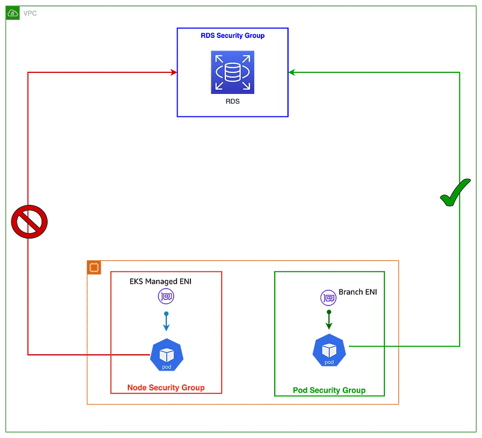
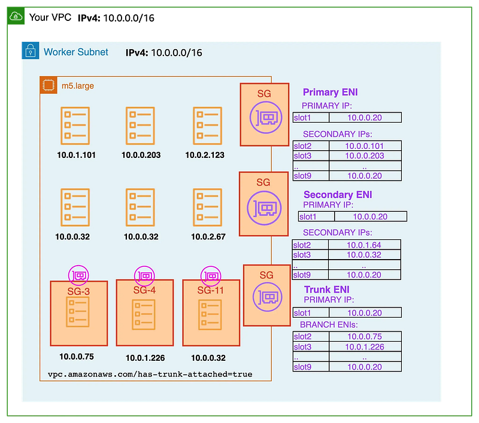

### Enabling Security Groups Per Pod in Amazon EKS

When managing Kubernetes workloads in Amazon EKS, fine-grained network control can be critical — especially when pods need to connect securely to sensitive services like RDS.

This article walks through how to assign individual security groups to pods using the EKS native VPC CNI plugin, exploring the architecture behind it, the required configurations, and a practical hands-on example.

### 🛡️ Why Assign Security Groups to Pods?

By default, all pods on an EC2 worker node share the same security group as the node. This limits granularity and could expose workloads to unnecessary risk.

With “Security Groups for Pods,” you can assign a unique security group to specific pods, restricting access to services like RDS on a per-pod basis.


### 🌐 The Architecture: Trunk & Branch ENIs

When Security Groups for Pods or Custom Networking is enabled, EKS transitions from assigning secondary IPs directly on the worker node’s ENI to a more dynamic architecture:

- **Primary ENI**: Default network interface attached to the EC2 instance.
- **Trunk ENI**: A new ENI type that allows attaching multiple **Branch ENIs**.
- **Branch ENI**: A virtual interface assigned to a pod, with its own IP and security group.

This mechanism enables Amazon EKS to provision isolated network paths per pod.


### 🔧 How to Enable Security Groups Per Pod

#### Step 1: Enable ENABLE\_POD\_ENI

Set the `ENABLE_POD_ENI` environment variable on the aws-node daemonset:

- EKS will create a `Trunk ENI` named `aws-k8s-trunk-eni` on the Worker Node

> *⚠️ Best practice: Enable this setting during cluster creation, as retrofitting it into existing clusters can require additional changes.*

#### Step 2: Use SecurityGroupPolicy to integrate Pod and security groups

```
apiVersion: vpcresources.k8s.aws/v1beta1
kind: SecurityGroupPolicy
metadata:
  name: ${Name}
  namespace: ${Name_Space}
spec:
  podSelector:
    matchLabels:
      ${Key}: ${Value}
  securityGroups:
    groupIds:
      - ${SG_ID}
```

- EKS will provision a `Branch ENI` that belongs to the Trunk ENI to associate it with the Pod
- The security group will be attached with the Branch ENI

### 🧪 What’s Next: Hands-On Experiments

With the core concepts and setup process covered, the next step is **practical experiments** to demonstrate how Security Groups for Pods work in real-world scenarios. You’ll see how to:

- Deploy sample pods with different security groups
- Restrict access to services like RDS on a per-pod basis
- Validate network isolation using simple connectivity tests
