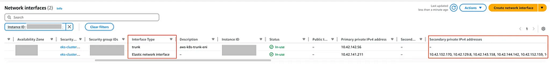

The first part of this series covered the motivation and architecture behind assigning security groups to individual pods in Amazon EKS using Trunk/Branch ENIs.

Now in Part 2, we’ll walk through a hands-on lab to validate how this works in practice — by deploying test pods, inspecting the resulting ENIs, and analyzing the pod-to-ENI mappings.

### 🧰 Step 1: Prerequisites and Parameter Adjustments

### 🔑 1. Attach IAM Policy to the EKS Cluster Role

Ensure your EKS cluster IAM role has the required AmazonEKSVPCResourceController policy attached:

```
$ aws eks describe-cluster --name eks-workshop --query cluster.roleArn --output text
# Output: arn:aws:iam::123456789012:role/eks-cluster-xxxxxxxxxxxxxxxxxxxx
```
```
$ aws iam attach-role-policy \\
  --policy-arn "arn:aws:iam::aws:policy/AmazonEKSVPCResourceController" \\
  --role-name eks-cluster-xxxxxxxxxxxxxxxxxxxx
```
### ⚙️ 2. Enable Pod ENI on the CNI DaemonSet

```
$ kubectl set env daemonset aws-node -n kube-system ENABLE_POD_ENI=true
```

Once applied, a new **Trunk ENI** should appear on the node.

### 🖧 Step 2: Inspect ENI Changes from Node

Use the following command to inspect network interfaces on the node:

```
$ ip addr
```
```
1: lo: <LOOPBACK,UP,LOWER_UP> mtu 65536 qdisc noqueue state UNKNOWN group default qlen 1000
    link/loopback 00:00:00:00:00:00 brd 00:00:00:00:00:00
    inet 127.0.0.1/8 scope host lo
       valid_lft forever preferred_lft forever
    inet6 ::1/128 scope host noprefixroute
       valid_lft forever preferred_lft forever
2: ens5: <BROADCAST,MULTICAST,UP,LOWER_UP> mtu 9001 qdisc mq state UP group default qlen 1000
    link/ether 02:90:0d:c7:46:65 brd ff:ff:ff:ff:ff:ff
    altname enp0s5
    inet 10.42.141.211/19 metric 1024 brd 10.42.159.255 scope global dynamic ens5
       valid_lft 2839sec preferred_lft 2839sec
    inet6 fe80::90:dff:fec7:4665/64 scope link proto kernel_ll
       valid_lft forever preferred_lft forever
3: ens7: <BROADCAST,MULTICAST,UP,LOWER_UP> mtu 9001 qdisc mq state UP group default qlen 1000
    link/ether 02:32:84:9b:4d:89 brd ff:ff:ff:ff:ff:ff
    altname enp0s7
    inet 10.42.142.56/19 brd 10.42.159.255 scope global ens7
       valid_lft forever preferred_lft forever
    inet6 fe80::32:84ff:fe9b:4d89/64 scope link proto kernel_ll
       valid_lft forever preferred_lft forever
```

You should see a new interface (e.g., ens7) representing the Trunk ENI, and eventually a virtual interface (e.g., vlan.eth.1) once a Branch ENI is assigned to a pod.

You can also validate with:

```
$ ip route
```
```
default via 10.42.128.1 dev ens5 proto dhcp src 10.42.141.211 metric 1024
10.42.0.2 via 10.42.128.1 dev ens5 proto dhcp src 10.42.141.211 metric 1024
10.42.128.0/19 dev ens5 proto kernel scope link src 10.42.141.211 metric 1024
10.42.128.1 dev ens5 proto dhcp scope link src 10.42.141.211 metric 1024
```

Look for a route pointing a pod IP (e.g., 10.42.x.x) to a specific vlan interface.

### 🔎 Step 3: Confirm ENIs via AWS Console or CLI



```
$ aws ec2 describe-network-interfaces \\
  --filters Name=attachment.instance-id,Values=i-xxxxxxxxxxxxxxxxx \\
  --output table
------------------------------------------------------------------------------------
|                             DescribeNetworkInterfaces                            |
+----------------------------------------------------------------------------------+
||                                NetworkInterfaces                               ||
|+------------------------+-------------------------------------------------------+|
||  AvailabilityZone      |  us-west-2b                                           ||
||  Description           |                                                       ||
||  InterfaceType         |  interface                                            ||
||  MacAddress            |  02:xx:xx:xx:xx:xx                                    ||
||  NetworkInterfaceId    |  eni-xxxxxxxxxxxxxxxxx                                ||
||  OwnerId               |  123456789012                                         ||
||  PrivateDnsName        |  ip-10-42-xxx-xxx.us-west-2.compute.internal          ||
||  PrivateIpAddress      |  10.42.xxx.xxx                                        ||
||  RequesterId           |                                                       ||
||  RequesterManaged      |  False                                                ||
||  SourceDestCheck       |  True                                                 ||
||  Status                |  in-use                                               ||
||  SubnetId              |  subnet-xxxxxxxxxxxxxxxxx                             ||
||  VpcId                 |  vpc-xxxxxxxxxxxxxxxxx                                ||
|+------------------------+-------------------------------------------------------+|
|||                                  Attachment                                  |||
||+-------------------------------+----------------------------------------------+||
|||  AttachTime                   |  2020-00-00T00:00:00+00:00                   |||
|||  AttachmentId                 |  eni-attach-xxxxxxxxxxxxxxxxx                |||
|||  DeleteOnTermination          |  True                                        |||
|||  DeviceIndex                  |  0                                           |||
|||  InstanceId                   |  i-xxxxxxxxxxxxxxxxx                         |||
|||  InstanceOwnerId              |  123456789012                                |||
|||  NetworkCardIndex             |  0                                           |||
|||  Status                       |  attached                                    |||
||+-------------------------------+----------------------------------------------+||
|||                                    Groups                                    |||
||+-----------------+------------------------------------------------------------+||
|||  GroupId        |  sg-xxxxxxxxxxxxxxxxx                                      |||
|||  GroupName      |  eks-cluster-sg-<cluster-name>-xxxxxxxxx                   |||
||+-----------------+------------------------------------------------------------+||
|||                                   Operator                                   |||
||+------------------------------------------+-----------------------------------+||
|||  Managed                                 |  False                            |||
||+------------------------------------------+-----------------------------------+||
|||                              PrivateIpAddresses                              |||
||+---------+-----------------------------------------------+--------------------+||
||| Primary |                PrivateDnsName                 | PrivateIpAddress   |||
||+---------+-----------------------------------------------+--------------------+||
|||  True   |  ip-10-42-xxx-xxx.us-west-2.compute.internal  |  10.42.xxx.xxx     |||
|||  False  |  ip-10-42-xxx-xxx.us-west-2.compute.internal  |  10.42.xxx.xxx     |||
|||  False  |  ip-10-42-xxx-xxx.us-west-2.compute.internal  |  10.42.xxx.xxx     |||
|||  ...    |  ...                                           |  ...              |||
||+---------+-----------------------------------------------+--------------------+||
|||                                    TagSet                                    |||
||+------------------------------------------------+-----------------------------+||
|||                       Key                      |            Value            |||
||+------------------------------------------------+-----------------------------+||
|||  Name                                          |  default                    |||
|||  node.k8s.amazonaws.com/instance_id            |  i-xxxxxxxxxxxxxxxxx        |||
|||  env                                           |  eks-workshop               |||
|||  eks:nodegroup-name                            |  default                    |||
|||  eks:cluster-name                              |  eks-workshop               |||
|||  created-by                                    |  eks-workshop-v2            |||
|||  cluster.k8s.amazonaws.com/name                |  eks-workshop               |||
|||  karpenter.sh/discovery                        |  eks-workshop               |||
||+------------------------------------------------+-----------------------------+||
||                                NetworkInterfaces                               ||
|+-------------------------+------------------------------------------------------+|
||  AvailabilityZone       |  us-west-2b                                          ||
||  Description            |  aws-k8s-trunk-eni                                   ||
||  InterfaceType          |  trunk                                               ||
||  MacAddress             |  02:xx:xx:xx:xx:xx                                   ||
||  NetworkInterfaceId     |  eni-xxxxxxxxxxxxxxxxx                               ||
||  OwnerId                |  123456789012                                        ||

```

Look for an ENI with InterfaceType: trunk. This is used to attach Branch ENIs per pod.

### ✅ Up Next: Deploying Pods and Testing Network Isolation

Now that your EKS nodes are enabled for Trunk/Branch ENIs and verified through both CLI and node introspection, the next step is to deploy pods with and without security groups, and observe how EKS assigns network interfaces accordingly.

The final part of the series validates pod-level behavior by:

- Deploy test pods
- Attach custom security groups using SecurityGroupPolicy
- Validate pod IP mappings and isolation via Branch ENIs
