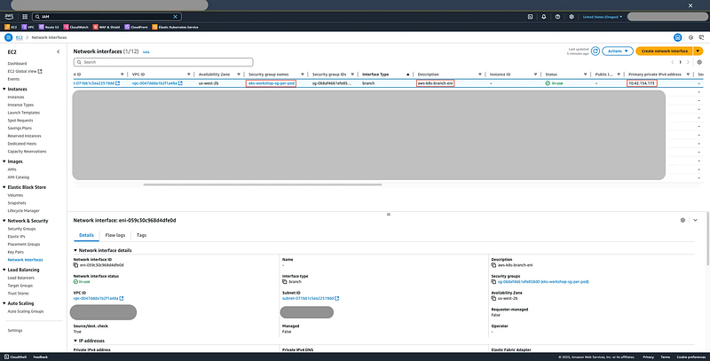
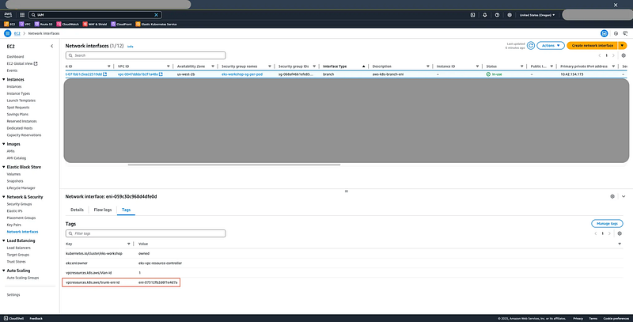
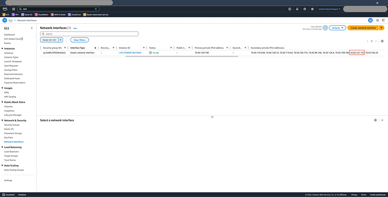

Now that the node-side infrastructure has been validated, let’s test how EKS assigns Branch ENIs with custom security groups to specific pods.

### 🚀 Step 4: Deploy Pods with and without Security Groups

**1. Create a Dedicated Security Group**

```
$ aws ec2 create-security-group \\
  --group-name eks-workshop-sg-per-pod \\
  --description "Security group for pod-level isolation" \\
  --vpc-id <your-vpc-id>

 {
  "GroupId": "sg-xxxxxxxxxxxxxxxxx",
  "SecurityGroupArn": "arn:aws:ec2:us-west-2:123456789012:security-group/sg-xxxxxxxxxxxxxxxxx"
}
```

Save the Group ID output.

**2. Create a SecurityGroupPolicy for Pod Selection**

```
$ export SG_ID=<your-sg-id>
```
```
$ cat <<EOF > sg-policy.yaml
apiVersion: vpcresources.k8s.aws/v1beta1
kind: SecurityGroupPolicy
metadata:
  name: eks-workshop-sg-per-pod-security-group-policy
  namespace: default
spec:
  podSelector:
    matchLabels:
      role: eks-sg-per-pod
  securityGroups:
    groupIds:
      - $SG_ID
EOF
```
```
$ kubectl apply -f sg-policy.yaml
```

**3. Launch Two Pods: One with and One without Policy**

**With Pod Security Group:**

```
$ cat <<EOF > sg-policy-pod.yaml
apiVersion: v1
kind: Pod
metadata:
  name: aws-cli
  labels:
    role: eks-sg-per-pod
spec:
  containers:
  - name: aws-cli
    image: amazon/aws-cli:latest
    command: ["sleep", "infinity"]
EOF
```
```
$ kubectl apply -f sg-policy-pod.yaml
```

**Without Pod Security Group:**

```
$ kubectl run test --image nginx
```

**4. Compare Pod Network Setup**

```
$ kubectl get pods -o wide
NAME      READY   STATUS    RESTARTS   AGE     IP              NODE                                          NOMINATED NODE   READINESS GATES
aws-cli   1/1     Running   0          3m30s   10.42.154.173   ip-10-42-138-2.us-west-2.compute.internal     <none>           <none>
test      1/1     Running   0          32s     10.42.121.151   ip-10-42-124-190.us-west-2.compute.internal   <none>           <none>
```

Check the IPs of each pod. You’ll typically see:

- aws-cli has an IP tied to a **Branch ENI**
- test pod’s IP comes from the node’s **Secondary IP**

---

### 🕵️ Step 5: Verify Branch ENI Assignment

We can confirm the appearance of the Branch ENI on the console page



And its Trunk ENI



To validate the pod-to-ENI mapping with CLI

```
$ aws ec2 describe-network-interfaces \\
  --filters Name=addresses.private-ip-address,Values=10.42.154.173 \\
  --output table
```
```
---------------------------------------------------------------------------
|                        DescribeNetworkInterfaces                        |
+-------------------------------------------------------------------------+
||                           NetworkInterfaces                           ||
|+---------------------+-------------------------------------------------+|
||  AvailabilityZone   |  us-west-2b                                     ||
||  Description        |  aws-k8s-branch-eni                             ||
||  InterfaceType      |  branch                                         ||
||  MacAddress         |  aa:bb:cc:dd:ee:ff                              ||
||  NetworkInterfaceId |  eni-abcd1234efgh67891                          ||
||  OwnerId            |  123456789012                                   ||
||  PrivateDnsName     |  ip-10-42-154-173.us-west-2.compute.internal    ||
||  PrivateIpAddress   |  10.42.154.173                                  ||
||  RequesterId        |  123456789012                                   ||
||  RequesterManaged   |  False                                          ||
||  SourceDestCheck    |  True                                           ||
||  Status             |  in-use                                         ||
||  SubnetId           |  subnet-xxxxxxxxxxxxxxxxx                       ||
||  VpcId              |  vpc-xxxxxxxxxxxxxxxxx                          ||
|+---------------------+-------------------------------------------------+|
|||                               Groups                                |||
||+---------------------+-----------------------------------------------+||
|||  GroupId            |  sg-xxxxxxxxxxxxxxxxx                         |||
|||  GroupName          |  xxxxxxxxxxxxxxxxxxxxxxx                      |||
||+---------------------+-----------------------------------------------+||
|||                              Operator                               |||
||+-------------------------------------+-------------------------------+||
|||  Managed                            |  False                        |||
||+-------------------------------------+-------------------------------+||
|||                         PrivateIpAddresses                          |||
||+-------------------+-------------------------------------------------+||
|||  Primary          |  True                                           |||
|||  PrivateDnsName   |  ip-10-42-154-173.us-west-2.compute.internal    |||
|||  PrivateIpAddress |  10.42.154.173                                  |||
||+-------------------+-------------------------------------------------+||
|||                               TagSet                                |||
||+-------------------------------------+-------------------------------+||
|||                 Key                 |             Value             |||
||+-------------------------------------+-------------------------------+||
|||  kubernetes.io/cluster/eks-workshop |  owned                        |||
|||  eks:eni:owner                      |  eks-vpc-resource-controller  |||
|||  vpcresources.k8s.aws/vlan-id       |  1                            |||
|||  vpcresources.k8s.aws/trunk-eni-id  |  eni-xxxxxxxxxxxxxxxxx        |||
||+-------------------------------------+-------------------------------+||
```

Look for:

- InterfaceType: branch
- Tag: vpcresources.k8s.aws/trunk-eni-id → associated Trunk ENI
- Attached Security Group

That ENI does not belong to EC2, so we can only confirm their relation with Trunk ENI

```
$ aws ec2 describe-network-interfaces \\
  --filters Name=attachment.instance-id,Values=i-xxxxxxxxxxxxxxxxx \\
 --output table
------------------------------------------------------------------------------------
|                             DescribeNetworkInterfaces                            |
+----------------------------------------------------------------------------------+
||                                NetworkInterfaces                               ||
|+-------------------------+------------------------------------------------------+|
||  AvailabilityZone       |  us-west-2b                                          ||
||  Description            |                                                      ||
||  InterfaceType          |  interface                                           ||
||  MacAddress             |  aa:bb:cc:dd:ee:ff                                   ||
||  NetworkInterfaceId     |  eni-xxxxxxxxxxxxxxxxx                               ||
||  OwnerId                |  123456789012                                        ||
||  PrivateDnsName         |  ip-10-42-138-2.us-west-2.compute.internal           ||
||  PrivateIpAddress       |  10.42.138.2                                         ||
||  RequesterId            |                                                      ||
||  RequesterManaged       |  False                                               ||
||  SourceDestCheck        |  True                                                ||
||  Status                 |  in-use                                              ||
||  SubnetId               |  subnet-xxxxxxxxxxxxxxxxx                            ||
||  VpcId                  |  vpc-xxxxxxxxxxxxxxxxx                               ||
|+-------------------------+------------------------------------------------------+|
|||                                  Attachment                                  |||
||+-------------------------------+----------------------------------------------+||
|||  AttachTime                   |  2025-04-12T15:29:50+00:00                   |||
|||  AttachmentId                 |  eni-attach-xxxxxxxxxxxxxxxxx                |||
|||  DeleteOnTermination          |  True                                        |||
|||  DeviceIndex                  |  0                                           |||
|||  InstanceId                   |  i-xxxxxxxxxxxxxxxxx                         |||
|||  InstanceOwnerId              |  123456789012                                |||
|||  NetworkCardIndex             |  0                                           |||
|||  Status                       |  attached                                    |||
||+-------------------------------+----------------------------------------------+||
|||                                    Groups                                    |||
||+-----------------+------------------------------------------------------------+||
|||  GroupId        |  sg-xxxxxxxxxxxxxxxxx                                      |||
|||  GroupName      |  xxxxxxxxxxxxxxxxxxxxxxxxxxxxxxxxxx                        |||
||+-----------------+------------------------------------------------------------+||
|||                                   Operator                                   |||
||+------------------------------------------+-----------------------------------+||
|||  Managed                                 |  False                            |||
||+------------------------------------------+-----------------------------------+||
|||                              PrivateIpAddresses                              |||
||+---------+-----------------------------------------------+--------------------+||
||| Primary |                PrivateDnsName                 | PrivateIpAddress   |||
||+---------+-----------------------------------------------+--------------------+||
|||  True   |  ip-10-42-138-2.us-west-2.compute.internal    |  10.42.138.2       |||
|||  False  |  ip-10-42-150-27.us-west-2.compute.internal   |  10.42.150.27      |||
|||  False  |  ip-10-42-148-111.us-west-2.compute.internal  |  10.42.148.111     |||
|||  False  |  ip-10-42-133-172.us-west-2.compute.internal  |  10.42.133.172     |||
|||  False  |  ip-10-42-157-50.us-west-2.compute.internal   |  10.42.157.50      |||
|||  False  |  ip-10-42-138-82.us-west-2.compute.internal   |  10.42.138.82      |||
|||  False  |  ip-10-42-145-163.us-west-2.compute.internal  |  10.42.145.163     |||
|||  False  |  ip-10-42-142-1.us-west-2.compute.internal    |  10.42.142.1       |||
|||  False  |  ip-10-42-131-84.us-west-2.compute.internal   |  10.42.131.84      |||
|||  False  |  ip-10-42-155-245.us-west-2.compute.internal  |  10.42.155.245     |||
||+---------+-----------------------------------------------+--------------------+||
|||                                    TagSet                                    |||
||+------------------------------------------------+-----------------------------+||
|||                       Key                      |            Value            |||
||+------------------------------------------------+-----------------------------+||
|||  Name                                          |  default                    |||
|||  eks:nodegroup-name                            |  default                    |||
|||  env                                           |  eks-workshop               |||
|||  node.k8s.amazonaws.com/instance_id            |  i-xxxxxxxxxxxxxxxxx        |||
|||  karpenter.sh/discovery                        |  eks-workshop               |||
|||  created-by                                    |  eks-workshop-v2            |||
|||  cluster.k8s.amazonaws.com/name                |  eks-workshop               |||
|||  eks:cluster-name                              |  eks-workshop               |||
||+------------------------------------------------+-----------------------------+||
||                                NetworkInterfaces                               ||
|+------------------------+-------------------------------------------------------+|
||  AvailabilityZone      |  us-west-2b                                           ||
||  Description           |  aws-k8s-trunk-eni                                    ||
||  InterfaceType         |  trunk                                                ||
||  MacAddress            |  aa:bb:cc:dd:ee:ff                                    ||
||  NetworkInterfaceId    |  eni-xxxxxxxxxxxxxxxxx                                ||
||  OwnerId               |  123456789012                                         ||
||  PrivateDnsName        |  ip-10-42-154-227.us-west-2.compute.internal          ||
||  PrivateIpAddress      |  10.42.154.227                                        ||
||  RequesterId           |  123456789012                                         ||
||  RequesterManaged      |  False                                                ||
||  SourceDestCheck       |  True                                                 ||
||  Status                |  in-use                                               ||
||  SubnetId              |  subnet-xxxxxxxxxxxxxxxxx                             ||
||  VpcId                 |  vpc-xxxxxxxxxxxxxxxxx                                ||
|+------------------------+-------------------------------------------------------+|
|||                                  Attachment                                  |||
||+-------------------------------+----------------------------------------------+||
|||  AttachTime                   |  2025-04-12T15:54:28+00:00                   |||
|||  AttachmentId                 |  eni-attach-xxxxxxxxxxxxxxxxx                |||
|||  DeleteOnTermination          |  True                                        |||
|||  DeviceIndex                  |  2                                           |||
|||  InstanceId                   |  i-xxxxxxxxxxxxxxxxx                         |||
|||  InstanceOwnerId              |  123456789012                                |||
|||  NetworkCardIndex             |  0                                           |||
|||  Status                       |  attached                                    |||
||+-------------------------------+----------------------------------------------+||
|||                                    Groups                                    |||
||+-----------------+------------------------------------------------------------+||
|||  GroupId        |  sg-xxxxxxxxxxxxxxxxx                                      |||
|||  GroupName      |  xxxxxxxxxxxxxxxxxxxxxxxxxxxxxxxxxx.                       |||
||+-----------------+------------------------------------------------------------+||
|||                                   Operator                                   |||
||+------------------------------------------+-----------------------------------+||
|||  Managed                                 |  False                            |||
||+------------------------------------------+-----------------------------------+||
|||                              PrivateIpAddresses                              |||
||+----------------------+-------------------------------------------------------+||
|||  Primary             |  True                                                 |||
|||  PrivateDnsName      |  ip-10-42-154-227.us-west-2.compute.internal          |||
|||  PrivateIpAddress    |  10.42.154.227                                        |||
||+----------------------+-------------------------------------------------------+||
|||                                    TagSet                                    |||
||+------------------------------------------+-----------------------------------+||
|||                    Key                   |               Value               |||
||+------------------------------------------+-----------------------------------+||
|||  eks:eni:owner                           |  eks-vpc-resource-controller      |||
|||  kubernetes.io/cluster/eks-workshop      |  owned                            |||
||+------------------------------------------+-----------------------------------+||
```

You can also inspect the node interface in the node:

A `vlan.eth.1` pointing to the `ens7` Trunk ENI and the `vlanafd4c544f81` interface

```
$ ip addr
1: lo: <LOOPBACK,UP,LOWER_UP> mtu 65536 qdisc noqueue state UNKNOWN group default qlen 1000
    link/loopback 00:00:00:00:00:00 brd 00:00:00:00:00:00
    inet 127.0.0.1/8 scope host lo
       valid_lft forever preferred_lft forever
    inet6 ::1/128 scope host noprefixroute
       valid_lft forever preferred_lft forever
2: ens5: <BROADCAST,MULTICAST,UP,LOWER_UP> mtu 9001 qdisc mq state UP group default qlen 1000
    link/ether 02:f0:68:cc:5a:d9 brd ff:ff:ff:ff:ff:ff
    altname enp0s5
    inet 10.42.138.2/19 metric 1024 brd 10.42.159.255 scope global dynamic ens5
       valid_lft 2178sec preferred_lft 2178sec
    inet6 fe80::f0:68ff:fecc:5ad9/64 scope link proto kernel_ll
       valid_lft forever preferred_lft forever
3: ens7: <BROADCAST,MULTICAST,UP,LOWER_UP> mtu 9001 qdisc mq state UP group default qlen 1000
    link/ether 02:c1:26:c0:b5:71 brd ff:ff:ff:ff:ff:ff
    altname enp0s7
    inet 10.42.154.227/19 brd 10.42.159.255 scope global ens7
       valid_lft forever preferred_lft forever
    inet6 fe80::c1:26ff:fec0:b571/64 scope link proto kernel_ll
       valid_lft forever preferred_lft forever
4: vlanafd4c544f81@if3: <BROADCAST,MULTICAST,UP,LOWER_UP> mtu 9001 qdisc noqueue state UP group default qlen 1000
    link/ether 82:b7:e8:60:ba:de brd ff:ff:ff:ff:ff:ff link-netns cni-7070a7e2-df75-7d3d-528d-1c6cee5bef35
    inet6 fe80::80b7:e8ff:fe60:bade/64 scope link proto kernel_ll
       valid_lft forever preferred_lft forever
5: vlan.eth.1@ens7: <BROADCAST,MULTICAST,UP,LOWER_UP> mtu 9001 qdisc noqueue state UP group default qlen 1000
    link/ether 02:40:a0:12:84:a5 brd ff:ff:ff:ff:ff:ff
    inet6 fe80::40:a0ff:fe12:84a5/64 scope link proto kernel_ll
       valid_lft forever preferred_lft forever
```

and the routing of `10.42.154.173` (Pod IP) → `vlanafd4c544f81`

```
$ ip route show table all
default via 10.42.128.1 dev ens7 table 3
10.42.128.1 dev ens7 table 3 scope link
default via 10.42.128.1 dev vlan.eth.1 table 101
10.42.128.1 dev vlan.eth.1 table 101 scope link
10.42.154.173 dev vlanafd4c544f81 table 101 scope link
default via 10.42.128.1 dev ens5 proto dhcp src 10.42.138.2 metric 1024
10.42.0.2 via 10.42.128.1 dev ens5 proto dhcp src 10.42.138.2 metric 1024
10.42.128.0/19 dev ens5 proto kernel scope link src 10.42.138.2 metric 1024
10.42.128.1 dev ens5 proto dhcp scope link src 10.42.138.2 metric 1024
local 10.42.138.2 dev ens5 table local proto kernel scope host src 10.42.138.2
local 10.42.154.227 dev ens7 table local proto kernel scope host src 10.42.154.227
broadcast 10.42.159.255 dev ens5 table local proto kernel scope link src 10.42.138.2
broadcast 10.42.159.255 dev ens7 table local proto kernel scope link src 10.42.154.227
local 127.0.0.0/8 dev lo table local proto kernel scope host src 127.0.0.1
local 127.0.0.1 dev lo table local proto kernel scope host src 127.0.0.1
broadcast 127.255.255.255 dev lo table local proto kernel scope link src 127.0.0.1
fe80::/64 dev ens5 proto kernel metric 256 pref medium
fe80::/64 dev ens7 proto kernel metric 256 pref medium
fe80::/64 dev vlanafd4c544f81 proto kernel metric 256 pref medium
fe80::/64 dev vlan.eth.1 proto kernel metric 256 pref medium
local ::1 dev lo table local proto kernel metric 0 pref medium
local fe80::40:a0ff:fe12:84a5 dev vlan.eth.1 table local proto kernel metric 0 pref medium
local fe80::c1:26ff:fec0:b571 dev ens7 table local proto kernel metric 0 pref medium
local fe80::f0:68ff:fecc:5ad9 dev ens5 table local proto kernel metric 0 pref medium
local fe80::80b7:e8ff:fe60:bade dev vlanafd4c544f81 table local proto kernel metric 0 pref medium
multicast ff00::/8 dev ens5 table local proto kernel metric 256 pref medium
multicast ff00::/8 dev ens7 table local proto kernel metric 256 pref medium
multicast ff00::/8 dev vlanafd4c544f81 table local proto kernel metric 256 pref medium
multicast ff00::/8 dev vlan.eth.1 table local proto kernel metric 256 pref medium
```

If you compare the Pod IP which does not have the security policy, you will find that IP to be one of the secondary IPs.



You can also confirm this in the corresponding EC2 instance.

```
$ ip addr
1: lo: <LOOPBACK,UP,LOWER_UP> mtu 65536 qdisc noqueue state UNKNOWN group default qlen 1000
    link/loopback 00:00:00:00:00:00 brd 00:00:00:00:00:00
    inet 127.0.0.1/8 scope host lo
       valid_lft forever preferred_lft forever
    inet6 ::1/128 scope host noprefixroute
       valid_lft forever preferred_lft forever
2: ens5: <BROADCAST,MULTICAST,UP,LOWER_UP> mtu 9001 qdisc mq state UP group default qlen 1000
    link/ether 06:19:65:09:33:8d brd ff:ff:ff:ff:ff:ff
    altname enp0s5
    inet 10.42.124.190/19 metric 1024 brd 10.42.127.255 scope global dynamic ens5
       valid_lft 3536sec preferred_lft 3536sec
    inet6 fe80::419:65ff:fe09:338d/64 scope link proto kernel_ll
       valid_lft forever preferred_lft forever
5: ens7: <BROADCAST,MULTICAST,UP,LOWER_UP> mtu 9001 qdisc mq state UP group default qlen 1000
    link/ether 06:17:03:e1:02:a5 brd ff:ff:ff:ff:ff:ff
    altname enp0s7
    inet 10.42.110.25/19 brd 10.42.127.255 scope global ens7
       valid_lft forever preferred_lft forever
    inet6 fe80::417:3ff:fee1:2a5/64 scope link proto kernel_ll
       valid_lft forever preferred_lft forever
6: eni1037a54e65e@if3: <BROADCAST,MULTICAST,UP,LOWER_UP> mtu 9001 qdisc noqueue state UP group default qlen 1000
    link/ether 3e:57:41:27:ae:31 brd ff:ff:ff:ff:ff:ff link-netns cni-cd91e992-b054-c3cc-d954-e484f0c57058
    inet6 fe80::3c57:41ff:fe27:ae31/64 scope link proto kernel_ll
       valid_lft forever preferred_lft forever
7: ens6: <BROADCAST,MULTICAST,UP,LOWER_UP> mtu 9001 qdisc mq state UP group default qlen 1000
    link/ether 06:76:ab:4e:71:9b brd ff:ff:ff:ff:ff:ff
    altname enp0s6
    inet 10.42.99.169/19 brd 10.42.127.255 scope global ens6
       valid_lft forever preferred_lft forever
    inet6 fe80::476:abff:fe4e:719b/64 scope link proto kernel_ll
       valid_lft forever preferred_lft forever

$ ip route
default via 10.42.96.1 dev ens5 proto dhcp src 10.42.124.190 metric 1024
10.42.0.2 via 10.42.96.1 dev ens5 proto dhcp src 10.42.124.190 metric 1024
10.42.96.0/19 dev ens5 proto kernel scope link src 10.42.124.190 metric 1024
10.42.96.1 dev ens5 proto dhcp scope link src 10.42.124.190 metric 1024
10.42.121.151 dev eni1037a54e65e scope link
```
### 🧪 Step 6: Observations

- Pods with SecurityGroupPolicy receive **Branch ENIs**, isolated by security group.
- Pods without policy remain on the node’s **secondary IP**, sharing the node SG.
- ENI-level differences are visible via both the **AWS Console** and the **Node OS**.
- vlana\*\*\* interfaces show low-level details of the virtual routing to the pod.

---

### ✅ Summary

This hands-on lab demonstrates the internal mechanics of **Security Groups for Pods** in Amazon EKS:

- **Trunk ENIs** are attached to EKS nodes to support **Branch ENIs**, which are dynamically assigned to individual pods.
- This enables **fine-grained network segmentation**, allowing each pod to have its **own security group** and **unique IP address**.
- We verified the setup through:
  **IAM and CNI configuration** for enabling ENABLE\_POD\_ENI
  **Pod deployment** with SecurityGroupPolicy
  **Network inspection** via EC2 CLI, instance-level ip addr and ip route, confirming pod-to-ENI mappings
- This approach enhances **network isolation**, making EKS more suitable for multi-tenant or sensitive workloads.

I hope this article helped you better understand how **Security Groups for Pods** work in Amazon EKS — from the underlying Trunk/Branch ENI architecture to practical validation using real pod deployments. This setup provides powerful tools for achieving fine-grained, pod-level network security in your Kubernetes workloads.
