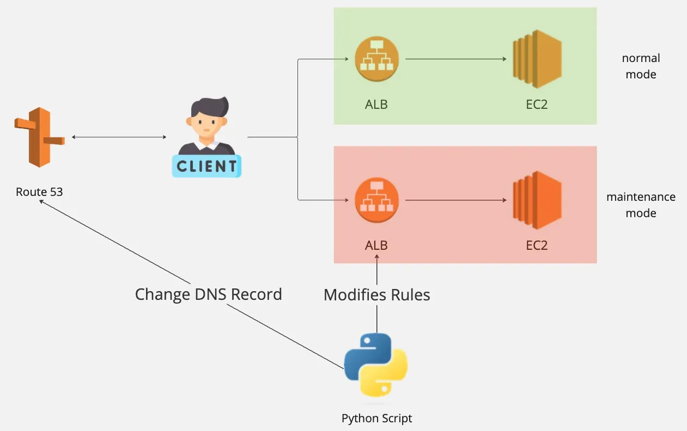

In the [previous article](../Part1/Introduction_and_Requirements.md), we introduced the concept of maintenance mode—why it is necessary, the requirements it must fulfill, and the key functions a reliable solution should provide.
With that foundation established, we can now take a closer look at how our company originally approached this problem.

When I first joined the company, there was already an existing tool in operation. Its architecture is shown in Figure 1:

Under normal circumstances, when a client (Client) wants to access a service, it goes through Amazon Route 53’s DNS routing to obtain and connect to the ALB endpoint, and then proceeds to the backend EC2 instances to access the service (the green part).

We created another ALB to serve as the entry point for maintenance mode. By switching the DNS routing rules in Route 53, client requests could be directed to the maintenance-mode ALB.

This achieved the effect of switching between normal mode and maintenance mode.

In addition, by modifying the ALB rules, we could configure which IPs should be allowed or blocked, thereby enabling or disabling a whitelist.

Both of these actions were carried out by a Python script.

## Knowledge Supplement

- Amazon Route 53: A service that helps users set up and manage DNS-related tools in AWS.
- DNS (Domain Name System): The system responsible for translating domain names into IP addresses. In this case, users enter the service’s domain name, and the DNS servers translates it to the ALB.
- DNS Record: Each mapping of a domain name to an IP is defined as a DNS record. For example, mapping a service’s domain to a specific ALB is defined in a DNS record.
- Python Script: A program written in Python. For small automation tools like this, it is usually called a “script.”
- ALB Rule: The rule configuration system within an ALB that helps direct different types of traffic. In this case, we used it to only allow specific IPs to enter the system during maintenance.

# Problems with the Legacy System

Although this architecture worked, it had at least the following issues:

- DNS TTL or DNS cache problems
- Overly complex architecture
- Unfriendly ALB rule configuration
1. DNS TTL and Cache Issues
    
    We all know that because of DNS TTL, changes do not take effect immediately when switched.
    
    As a result, we had to wait for some time before confirming that the system had actually entered maintenance mode.
    
    If the TTL time was fixed and predictable, this wouldn’t necessarily be a big problem, and we could simply agree to wait out the TTL window.
    
    However, DNS cache was trickier. It could lead to a situation where, although our tests confirmed that maintenance mode was enabled, some users in the world could still access the service.
    
    If deployments proceeded while users still had access, it could result in unexpected consequences.
    
    For example, we might perform a database backup before deployment. If some user’s actions weren’t captured due to ongoing access, and deployment later failed, requiring that backup snapshot, we could run into a series of problems.
    
2. Overly Complex Architecture
    
    As shown, apart from maintaining the architecture for normal mode, we also had to maintain a separate set of architecture for maintenance mode.
    
    This included not only the ALB and EC2, but also Route 53 DNS records.
    
    If every single service required two sets of architectures, and each environment followed this design principle, the setup would quickly become very messy and difficult to maintain.
    
3. Unfriendly ALB Rule Settings
    
    At the time of this research, each ALB rule could only allow 5 IPs.
    
    In other words, if the whitelist contained many IPs, the same rule would need to be split into multiple rules, each covering up to 5 IPs.
    
    This significantly increased the difficulty of maintaining the Python script.
    

## Knowledge Supplement

- DNS TTL (Time to Live): The lifespan of a DNS record. It defines the maximum time before a DNS record is refreshed after modification.
- DNS Cache: The caching mechanism of DNS, which also prevents immediate effect after a DNS record is changed.
- Database Snapshot: The data file created after a database backup. For example, once a backup is performed, the full backup data becomes a snapshot.

The legacy system provided a functional way to toggle between normal operation and maintenance mode, but its shortcomings soon became clear.

DNS propagation delays, duplicated architectures, and restrictive ALB rule configurations all contributed to operational complexity and user-facing risks.

These challenges motivated us to rethink how maintenance mode should be designed.
In [the next article](../Part3/The_New_Tool.md), I will examine the new system we built—how its architecture was simplified, how it resolved the limitations of the old design, and how it provided a more reliable and flexible foundation for future operations.
