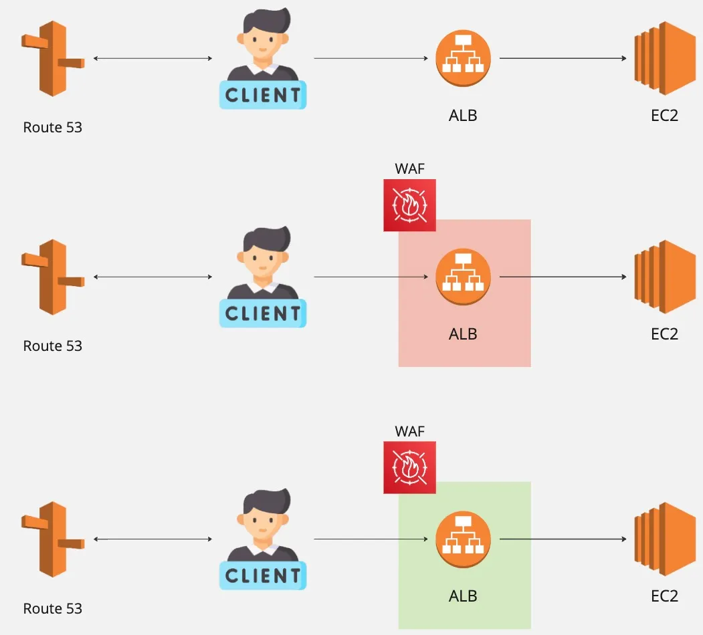

In [the previous article](../Part2/The_Legacy_System.md), we analyzed the legacy maintenance mode system—how it worked, why it became difficult to manage, and what problems it introduced over time.

Those lessons paved the way for a complete redesign.

In this article, we’ll look at the **new maintenance mode tool** we built from the ground up.

You’ll see how we simplified the architecture, reduced operational complexity, and introduced AWS WAF as a new layer of control.

Most importantly, we’ll discuss the design principles that guided this improvement: simplicity, safety, and maintainability.

Figure 1 shows how the architecture of the new tool changes across different stages: normal mode, maintenance mode, and maintenance mode with the allowlist enabled.

In **normal mode**, users still access the service through Route 53’s DNS routing, connecting to the ALB endpoint and then to the backend EC2 instances.

To enter **maintenance mode**, we added an additional layer outside the ALB using another AWS service—**AWS Web Application Firewall (WAF)**.

Access control is now managed through WAF rules.

When maintenance mode begins, all incoming traffic is blocked.

Later, when we need to enable the allowlist, we simply modify the WAF rule to allow access from specific IP addresses.

This entire switching process is still automated through a **Python script**.

# **Key Features of the New Tool**

Compared with the previous architecture, this design has at least three major advantages:

### Simpler architecture

Unlike the old system, we no longer need to maintain two separate architectures (normal and maintenance) for every service, nor manage duplicate DNS records.

Though this improvement sounds simple, it is actually the most significant advantage—-simplifying the architecture also means reducing operational cost.

### No need to modify the existing infrastructure

By placing the WAF layer in front of the ALB, we avoid modifying the ALB configuration itself.

This helps prevent potential issues that might arise from **Infrastructure as Code (IaC)** changes.

Although connecting the ALB to the WAF still requires some configuration, it is far simpler than directly editing ALB rules.

### Simpler and more convenient program logic and allowlist management

As mentioned in the previous article, the old tool’s allowlist configuration was complex and error-prone.

WAF, however, does not impose the same “five IPs per rule” limitation that ALB rules do, which makes a huge difference.

This allows us to write cleaner, more readable code and maintain the architecture much more easily.

# **Cost Considerations**

That said, WAF introduces a cost factor that cannot be ignored.

Since WAF itself is not cheap, using it under heavy traffic could result in significant expenses.

Fortunately, in our case, the tool only activates WAF during maintenance mode.

Because maintenance periods are short and traffic is minimal, the final cost is entirely acceptable.

However, it’s worth noting that this approach assumes the service originally does **not** use WAF.

If the service already uses WAF for its intended purpose—as a firewall, this design could lead to conflicts.

After all, WAF was originally built for web-application security, not as a maintenance-mode control mechanism.

# Conclusion

The new tool solved many of the challenges that plagued the old system.

By integrating WAF, we reduced architectural duplication, simplified whitelisting logic, and eliminated DNS-related delays.

While there were still trade-offs—especially around cost and WAF integration—the new design represented a major step forward in operational efficiency and reliability.

In [the next article](../Part4/Challenges_Behind_The_Tool.md), we’ll share how the new maintenance mode tool performed in production:

the lessons we learned from real-world use, how the system evolved over time, and what we would do differently if we were to build it again.

## **Knowledge Supplement**

- **Infrastructure as Code (IaC):** A method of managing infrastructure using code, enabling configuration consistency and version control.
- **AWS Web Application Firewall (WAF):** A firewall service provided by AWS that supports flexible rule configuration. In our case, we use its IP-restriction feature to allow only specific IPs to access the service.
