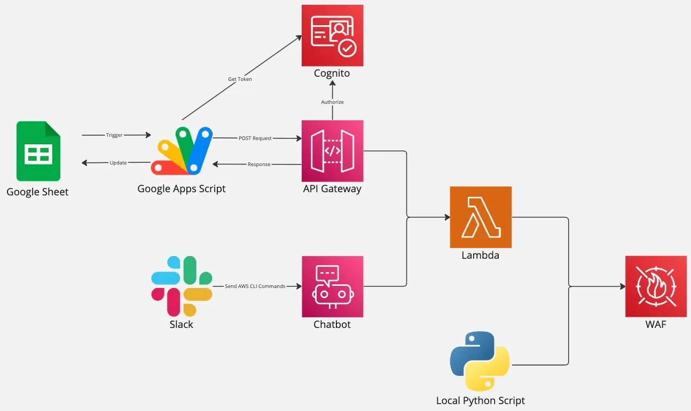

In the [previous article](../Part4/Challenges_Behind_The_Tool.md), we looked at the messy side of building the maintenance mode tool:
- getting lost in legacy DNS,
- struggling with WAF’s token-based API model, and
- migrating from CLB to ALB while tripping over HTTP version differences.

In this final part of the series, I’d like to look forward instead of backward.

We’ll explore:
- how we plan to evolve the tool beyond a local Python script,
- how to make maintenance mode truly self-service and event-driven, and
- some personal reflections on what this journey taught me as an SRE.

Even though the current maintenance mode tool is running in production and works as intended, it still has a significant weakness:

## It is a local Python script, running in the engineer’s environment.

This means:
- Environment differences can easily cause unexpected issues
- Only a small number of people are comfortable running it
- Operational reliability depends on individual machines and setups

To address this, we started thinking about how to make the tool more stable, accessible, and automated.

## Running the Tool as a Lambda Function

As shown in the future architecture plan (Figure 1), one possible improvement is to package the entire tool into an AWS Lambda function.
- The same logic is still written in Python
- But instead of running locally, it runs in a fixed, controlled environment
- This greatly improves stability and reduces “it works on my machine” problems

With Lambda, we also gain better integration with other AWS services, logging, and security controls—all without managing servers.

## Triggering Maintenance Mode from Slack

Another direction is to make triggering maintenance mode easier.

For example, if we could trigger the Lambda from a place like Slack, then:
- Any authorized person in the company who needs maintenance mode
- could simply run a predefined command in a Slack channel
- without having to clone a repo, set up Python, or touch the AWS console

This is the idea illustrated in the architecture using Slack + AWS Chatbot.

Of course, this also means we need to be very strict about access control in the relevant Slack channel—
not everyone should be allowed to put the system into maintenance mode.

## Using Google Sheets and Release Events as Triggers

Finally, every time we release a new version of the application,
we already have an existing process:
- A Google Sheet is created for that release
- A Release Manager records the detailed release rundown in that sheet

Given that this process is already in place, we also considered another idea:
- Use Google Sheets update events as a trigger
- When certain cells or fields are updated,
a Google Apps Script could call Amazon API Gateway (APIGW),
which in turn invokes the Lambda that controls maintenance mode
- Amazon Cognito would be used to verify identity and protect access to the API

In other words, changes in the release sheet could directly and safely drive infrastructure behavior—turning a manual process into an auditable, event-driven workflow.

Knowledge Supplement
- Amazon Cognito (Cognito):
An authentication service from AWS that manages user registration, login, and identity verification.
- Amazon API Gateway (APIGW):
AWS’s native API gateway service, used to build, manage, and secure APIs that connect clients to backend services.
- Google Apps Script:
A scripting language provided by Google, used to automate tasks inside Google applications such as Google Sheets and Docs.

# My Reflection

At this point in the series, you may have noticed something:

The process of building this maintenance mode tool actually resembles developing a normal product feature.

We had to:
- Clarify requirements
- Understand and work around existing systems and architectures
- Incrementally modify and refactor instead of rewriting everything from scratch
- Handle unexpected side effects and edge cases
- Plan for future improvements instead of stopping at “it works”

Of course, I don’t want to overstate the comparison.
There are still differences between this kind of internal tooling and a full business-facing feature—especially in terms of business logic and product complexity.

But I hope this story gives you a concrete example you can compare with your own feature development experience.

More importantly, there is one attitude I especially want to share:

Even when a tool “works” and is already in production, we can still look for future directions of improvement.

This mindset of continuous improvement and relentless refinement is, in my view, one of the core qualities an SRE should have.

# Conclusion

Across this series, we’ve followed the evolution of a real maintenance mode system:
1.	Why maintenance mode is needed, and what requirements it must meet
2.	How the legacy system worked, and why it became hard to operate and maintain
3.	How the new tool was designed, using WAF to simplify architecture and improve reliability
4.	What challenges we faced while implementing it in a real, messy environment
5.	How we plan to evolve it further, and the mindset that guided every decision along the way

If there is one thing I hope you take away, it is this:

Building reliable systems is not just about choosing the right services or writing correct code.
It’s about understanding history, embracing constraints, learning from failures, and continuously iterating toward a simpler, safer, and more maintainable world.

Thank you for reading this journey—from the first idea of “maintenance mode” to the real-world tool, its challenges, and its future.

I hope it gives you not only some technical inspiration, but also a bit of companionship on your own DevOps/SRE path.

For a deeper understanding of the challenges faced while building this tool, refer to [the previous article](../Part4/Challenges_Behind_The_Tool.md).
