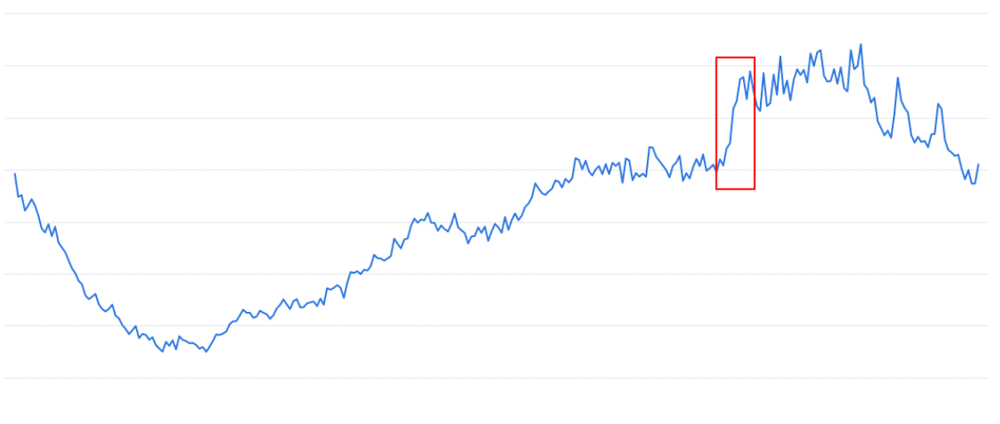
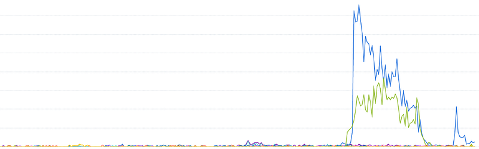
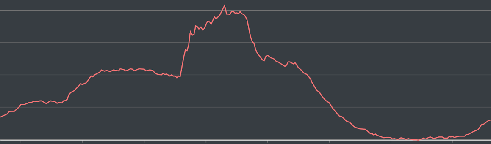
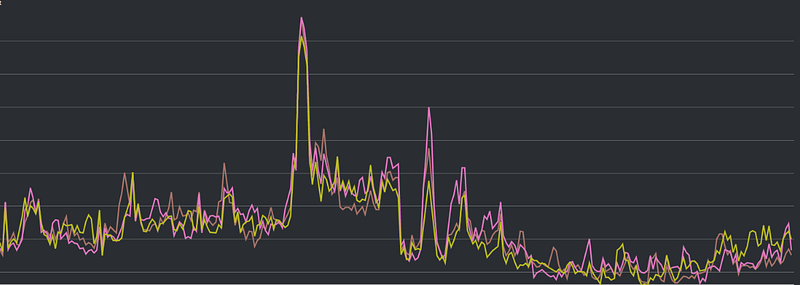

This is a two-year-long operational challenge, focusing on how to gradually renew the architecture and tune the system capacity to handle unpredictable high-traffic incidents while maintaining system stability.

### Introduction

The annually baseball games which are held from spring to autumn brings a significant pressure to our system, an online video streaming platform primarily serving Japanese customers.

With the start of the Japanese baseball season, popular games would attract a large number of users. Therefore, specific measures had to be taken for these events.

Although from my perspective, the focus is on baseball games, readers can consider other large-scale events, such as promotional events in e-commerce.

### The First Game

In fact, up until the time I wrote down this article, this issue had been ongoing for nearly two years.

We tried to deal with the first incident. Then, as the system performance improvements had shown significant results, and we were gradually forgetting about the incident, a second, seemingly more severe event occurred.

Therefore, this subject will be divided into “The First Game” and “The Second Game”.

This will allow readers to compare and contrast our handling of such a high traffic event, which is similar in nature but with different technical details about how we handled such a high traffic event.

### The Incident

The story begins with a serious P0 incident. One afternoon, towards the end of the day, we suddenly received a large number of P0 alarms[1]. We also received a Pingdom DOWN alert[2], which means the platform could not be accessed.

At the same time, our team that specializes in confirming the normalcy of the site also reported that the site was becoming unusually slow or even inaccessible.

The engineer on duty then recognized that the system was receiving a large number of requests, and because the system was unable to cope with the surge of requests in a short period of time, the site became highly delayed in response or even inaccessible.

Therefore, the immediate increase of the number of servers to twice was done. After about half an hour, the new servers were up and running, and the site returned normal.

### Data Collection

Subsequently, we consolidated information from various sources and confirmed that the situation was indeed caused by a surge in requests within a short period of time.

As shown in Figure 1, this is a graph of the number of users and time spent on our entire site.

You can see that there is a large influx of users in the box.

Figure 1 shows the entire website, while Figure 2 shows the number of users of baseball-related services. From this figure, the number of users should have a better impression of the surge in the number of users.

Then there is a graph showing the increase in the number of requests received by our back-end server over time, as seen in Figure 3. You can see a steep upward curve in the middle.

Finally, the CPU utilization of our database is shown in Figure 4, where we can also see a steep upward curve in the middle. In Figure 4, you can also see a sharp curve in the middle. In fact, the only reason it didn’t go higher in the end was because it had already reached 100%.

With this information, we can begin to investigate the causes of the event in more detail, and generate specific solutions.

### Root Cause Analysis

Looking again at Figure 1, which shows the overall number of users on the site, we can observe that the area circled in the red box indeed displays a steep upward curve.

However, when compared to the original number of users on the site, this increase is not as substantial as it might initially appear.

While it’s not appropriate to disclose exact numbers here, we can roughly estimate that the increase in users over half an hour is only about 20–30% of the original number of users online.

This leads us to our first question: why would such a relatively small increase in users directly cause our website to go down for half an hour?

One might wonder if our servers were already at full capacity. The answer is no, because our auto-scaling mechanism is set to trigger at 50% CPU usage. This means our backend and database servers were still in a very spare state until the traffic surge occurred.

Another possibility to consider is whether our website was actually targeted by a hacker attack. But how likely is it that a hacker attack would coincide precisely with a baseball game?

While we can’t completely rule out this possibility, given that there’s a significant event at this time, it’s more prudent to start by investigating from the perspective of normal usage patterns.

After some consideration, I have drawn the following conclusions:

Let’s consider what a user might do when first entering our website. They may need to log in, and because they want to watch a baseball game, they’ll likely need to select a baseball game channel. Additionally, they might browse the site a bit, looking at various content that interests them.

For a new visitor to the website, these are perfectly normal actions. However, each of these actions may generate one or more requests to the back-end server. In contrast, a user who has been online for a while might simply be passively watching content (remember, we’re an online streaming platform).

In other words, each new user who has just entered the site generates several times more requests than a user who is already online. Therefore, it’s reasonable to hypothesize that it’s the collective actions of these new users that are causing the server to become overwhelmed.

The key point here is that we can make a preliminary assessment that the server was not hacked, nor were users behaving abnormally, nor was our program poorly written.

This distinction is crucial for problem-solving because if we misidentify the problem, we might head in the wrong direction from the start when seeking a solution.

[1] P0 alarms are alarms that are triggered when the system is in a critical state. In general, we design many levels of alarms, such as P1, P2, P3, etc. The P0, which is priority 0, is the highest priority alarm.

[2] Pingdom is a service that monitors the availability of websites. Pingdom DOWN alert is an alert that is triggered when the Pingdom service detects that the site is inaccessible.
